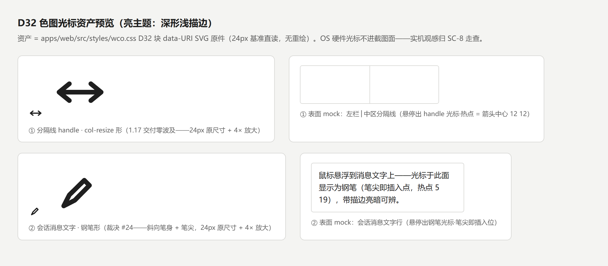
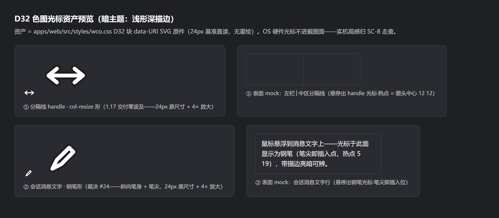

# M3.1 D32 文字面光标钢笔形替换走查记录（裁决 #24）——任务 1.21 · SC-8 终验输入

> **任务**：`dsh-forge-m3.1-ui-alignment/1.21`——[裁决 #24](../proposal.md)（2026-10-10 再裁决，调整任务 1.17 文字面）：「光标悬浮在文字上方时，变成一根有色差但跟本地风格一样的钢笔」——文字面光标形 IBeam → **钢笔形**（本地 Windows 墨迹钢笔风格造型 + 高对比色差着色/描边）。
> **消费方**：SC-8 人工终验——实机走查动线见本文「实机走查清单」（与 1.17 [D32-cursor.md](./D32-cursor.md) 同族收口，本记录零新增裁决）。
> **证据口径**：沿袭 1.17——**实现侧证据 = 代码锚点 + 机械面 pin**（资产侧亮/暗放大对照截图为对照基线）；OS 硬件光标平面不进 Chromium 截图面（技术边界非口径选择），实机观感归 SC-8 用户终验。

## 变更面（锚面与机制沿袭 1.17，仅换形）

| # | 表面 | 1.17 交付（不变项） | 1.21 更替项（裁决 #24） |
|---|---|---|---|
| ① | 分隔线 handle | 规则锚 `div[data-side]`、col-resize 形 SVG、热点 `12 12`（箭头中心）、`col-resize` 降级链——**零波及**（规则与形制逐字节不动） | —（回归对照：机械 pin 既有断言原样绿） |
| ② | 会话消息文字 | 规则锚 `html[data-windows-titlebar] [data-conversation-content]`（亮）+ `body[data-ds-dark-theme]` scope（暗）；双层描边机制（w4 对比色打底 + w2 形体色覆绘）；色对 `#1f1f1f`/`#ffffff` 互为描边；`text` 关键字降级链；随行 `dsw-raw` 记账——**全部沿袭** | 字形 IBeam → **钢笔形**：斜向笔身（45° 轴线六边形轮廓 `M5 19L9.7 16.6L16 10.2L13.8 8L7.4 14.3Z`）+ 锥形笔尖，笔尖落左下（书写向）；热点 `12 12` → **`5 19`（笔尖 = 插入位）** |

**造型口径（裁决 #24「跟本地风格一样」）**：24px 基准单轮廓剪影（笔身 + 锥尖），无花哨自绘细节——线描语言与 1.17 双表面同族（round cap/join、双层描边）；24px 下剪影与 Windows 墨迹钢笔形同构。「有色差」= 高对比色差沿袭：亮 = 深形 `#1f1f1f` + 浅描边 `#ffffff`；暗 = 浅形 + 深描边。

## 资产预览（亮/暗对照基线——wco.css D32 data-URI 原件直读）

| 主题 | 截图（24px + 4× 放大 + 表面 mock；①handle 零波及同框回归对照） |
|---|---|
| 亮（深形浅描边） |  |
| 暗（浅形深描边） |  |

生成脚本 [capture-d32-pen-cursor.cjs](./capture-d32-pen-cursor.cjs) 随档可复现（`node capture-d32-pen-cursor.cjs`）——**资产直读 wco.css 出货原件、零重绘**。两主题判读：钢笔形清晰可辨、斜向笔身 + 笔尖与本地钢笔风格一致；①handle col-resize 形与 1.17 交付逐像素同源。

## 机械面证据（本任务实跑）

- `pnpm test:contract pin-15`：**24/24 绿**——随形更替同步三条：两表面亮/暗规则体断言文字面热点改断 `5 19, text`（笔尖）、记账断言热点正则改 `(?:12 12, col-resize|5 19, text)`、断言题名 IBeam→钢笔形；handle 三断言（`12 12, col-resize` ×2 + 记账）原样未动。非 WCO 零波及断言（全部规则锚 `html[data-windows-titlebar]`）原样覆盖绿。
- `pnpm lint` 全绿（exit 0）：oxlint 0 warnings/0 errors、import-lint 0 违规、**token-lint 0 裸值**（钢笔 data-URI 色值两行沿袭随行 `dsw-raw` 注记 + `%23` 编码——lint-tokens 裸色面零触发）、selftest 14 条负样例全命中、`tsc -b` + 全仓 test-types 绿。
- `just compile`（`pnpm build` = tsc -b + 预置资产拷贝 + vite build）绿（exit 0；chunk >500kB 警告为既有 advisory 非失败）。
- vitest 全池：**225 文件 / 3075 用例全绿**（`pnpm test`，exit 0；stderr 内 vite node_modules source-map 提示为既有噪声）。

## 实机走查清单（SC-8 用户动线）

1. **切换口径**：官方主题切换（设置外观亮/暗）——每面先亮后暗各过一遍。
2. **② 会话消息文字（本任务面）**：进入任一会话，鼠标悬浮消息正文 → 光标应为**钢笔形**（斜向笔身 + 笔尖），**笔尖即插入位**（笔尖对准处即文字插入点），亮底上深形可辨 / 暗底上浅形可辨；悬浮消息卡片上的按钮/链接仍为手形/箭头（自持 cursor 不受波及）；文字选中、输入框聚焦行为零变化。
3. **① 分隔线 handle（回归抽检——零波及面）**：悬浮左栏│中区 1px 竖线±4px 命中带 → 光标仍为**双向箭头**（col-resize 形）清晰可辨；拖宽功能正常。
4. **降级面抽检**（可选）：DevTools → Rendering → 禁用 CSS 后文字面回退 OS `text` 关键字语义——降级链在场即可，无需记录。
5. **回填**：实机观感无法截图（OS 光标平面），SC-8 以「可辨/不可辨 + 造型是否本地钢笔风格」结论回填本记录即可（不做图片归档）。

## 证据口径与限制（诚实声明）

- 资产预览截图 = **data-URI 原件放大对照**（非实机光标捕摄——OS 硬件光标平面不进 Chromium/Playwright 截图面，1.17 已声明的同一技术边界）。
- 实机亮/暗观感走查 = **SC-8 用户终验面**（1.5/1.13/1.17 同径）；本记录仅锚定证据与动线，不含观感判定。
- AC「亮/暗双主题实机走查（截图归档）」按 1.17 既有验收口径收口 = **两主题资产对照截图归档 + 机械 pin**（OS 光标平面截图边界如上）；实机观感判定归 SC-8。
- 数据面/RPC 零变化（纯 CSS 字形更替）；非 WCO 官方形态零波及（规则全集仍锚定 `html[data-windows-titlebar]`）。
