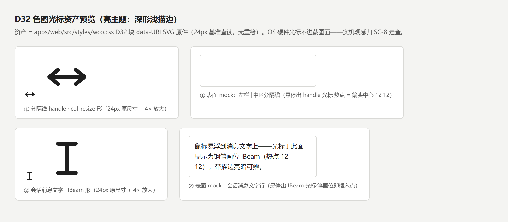
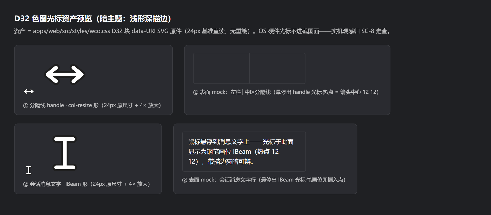

# M3.1 D32 光标可辨性缓解走查记录（分隔线 handle / 会话消息文字 两表面 × 亮/暗）——SC-8 终验输入

> **任务**：`dsh-forge-m3.1-ui-alignment/1.17`——差异清单 [D32](../proposal.md)（八区·全局组件/壳面）：单色光标纯白不可辨（2026-10-10 用户实机报障「光标变成纯白色，让人看不清楚」——分隔线 handle 与会话消息文字两表面）。
> **消费方**：SC-8 人工终验——用户实机按本记录「实机走查清单」逐面过亮/暗两遍后打勾（proposal SC-8 行「D32 两表面光标亮/暗可辨走查」）。
> **证据口径**：与 [1.5/1.13 归档](./README.md) 同径——**实现侧证据 = 代码锚点 + 机械面 pin**（资产侧亮/暗放大对照截图为对照基线）；实机观感归 SC-8 用户终验时补拍（子代理无凭据 + Electron 壳无 HTTP 面，同 1.5 已声明的限制；且 **OS 硬件光标平面不进 Chromium 截图面**——实机光标观感只能人眼走查，任何截图工具都拍不到）。

## 根因与缓解径（实现侧锚点）

**根因 = OS 级缺陷，非产品样式回归**：Windows/DWM 单色光标渲染缺陷（Chromium issue 1366924 族；Win11 24H2 / 显卡驱动族波及 Edge/Chrome/Electron 全系——Microsoft Q&A #4273316 / V2EX #1104486 实证）：col-resize 与 text（IBeam）属**单色光标**，被 DWM 渲成纯白——浅底上不可辨；箭头/手形为彩色光标不受影响。核验：产品 CSS 57 处 cursor 全为关键字、官方包零 url() 自定义光标——无样式回归面（OS 根因的用户机侧缓解径 = 注册表 OverlayTestMode / Windows 指针颜色自定义——非产品可发面，仅记账）。

**产品侧缓解（纯 CSS，数据面/RPC 零变化）**：两表面换自定义高对比**色图**光标（data-URI SVG 24px 基准双层描边——对比色描边打底 + 形体色覆绘），绕过单色渲染管线：

| # | 表面 | 实现锚（apps/web/src/styles/wco.css D32 块） | 机械面（tests/contract/pin-15-wco-shell-compensation.test.ts ⑮-6） |
|---|---|---|---|
| ① | 分隔线 handle（左栏│中区拖宽缘，官方 8px 命中区） | 规则锚 `html[data-windows-titlebar] div:has(> [data-shell-overlay]) > div[data-side]`——官方 ui-layout DragHandle 直标稳定属性 `data-side`（client.js:197 实锚）；col-resize 形 SVG，热点 = 箭头中心 `12 12` + `col-resize` 关键字降级链 | 三条 D32 pin：两表面亮/暗四规则体断言（`cursor: url("data:image/svg+xml,…") 12 12, col-resize/text`）+ 记账断言（恰四条声明、全带 dsw-raw 注记 + `%23` 编码 + 热点/降级链） |
| ② | 会话消息文字（转录流正文面） | 规则锚 `html[data-windows-titlebar] [data-conversation-content]`——官方 chat 台账锚（brand.css 既有消费先例）；IBeam 形 SVG，热点 = 笔画位 `12 12` + `text` 关键字降级链；cursor 可继承——容器级设置后按钮类自持 cursor:pointer 不受波及 | 既有「非 WCO 零波及」遍历断言自动覆盖新四规则（全部锚定 `html[data-windows-titlebar]`） |

**双主题两套**：亮 = 深形 `#1f1f1f` + 浅描边 `#ffffff`；暗 = 浅形 + 深描边（`body[data-ds-dark-theme]` scope——brand.css:53 既有切换先例）。data-URI 内色值不可令牌化——随行 `dsw-raw` 记账（lint-tokens 口径；色对对齐 label-primary/bg-base 对比意图，升级窗口令牌色再对账）。

## 资产预览（亮/暗对照基线）

| 主题 | 截图（wco.css D32 data-URI 原件直读，24px + 4× 放大 + 表面 mock） |
|---|---|
| 亮（深形浅描边） |  |
| 暗（浅形深描边） |  |

生成脚本 [capture-d32-cursor.cjs](./capture-d32-cursor.cjs) 随档可复现（`node capture-d32-cursor.cjs`）——**资产直读 wco.css 出货原件、零重绘**；截图含诚实声明（OS 硬件光标不进截图面）。

## 实机走查清单（SC-8 用户动线）

1. **切换口径**：官方主题切换（设置外观亮/暗）——每面先亮后暗各过一遍。
2. **① 分隔线 handle**：鼠标悬浮左栏│中区 1px 竖线±4px 命中带（展开态拖宽缘；收起态轨右缘同理）→ 光标应为**双向箭头**（col-resize 形、带描边）且清晰可辨——亮底上深形可辨 / 暗底上浅形可辨；拖拽功能不回归（拖宽正常）。
3. **② 会话消息文字**：进入任一会话，鼠标悬浮消息正文 → 光标应为 **IBeam**（笔画位插入点、带描边）清晰可辨；悬浮消息卡片上的按钮/链接仍为手形/箭头（自持 cursor 不受波及）；文字选中、输入框聚焦行为零变化。
4. **降级面抽检**（可选）：DevTools → Rendering → 禁用 CSS 后两表面回退 OS 关键字语义（col-resize/text）——降级链在场即可，无需记录。
5. **补拍归档**：实机观感无法截图（OS 光标平面），SC-8 以「可辨/不可辨」结论回填本记录即可（不做图片归档）。

## 证据口径与限制（诚实声明）

- 机械面 = 本任务实跑：`pnpm test:contract pin-15` 24/24 绿（含 D32 三条新 pin + 记账 D32 标记）；`pnpm lint` 全绿（token-lint 0 裸值——D32 data-URI 色值行随行 dsw-raw 注记）；`pnpm build`（tsc -b）绿；vitest 全池绿（见任务执行记录）。
- 资产预览截图 = **data-URI 原件放大对照**（非实机光标捕摄——OS 硬件光标平面不进 Chromium/Playwright 截图面，此为技术边界非口径选择）。
- 实机亮/暗观感走查 = **SC-8 用户终验面**（1.5/1.13 同径）。本记录不含观感判定，仅锚定证据与动线。
- 文字面形态 = **IBeam 为任务 1.17 AC 口径**；proposal 裁决 #24 已再裁「钢笔形」替换——**任务 1.21 紧随承接**（资产替换、锚面与机制不变）。
- 本记录零裁决：D32 行为「两表面光标亮/暗可辨走查」验收组织面，无新增裁决点。
