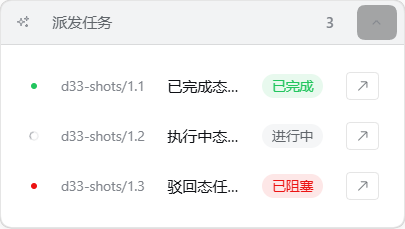
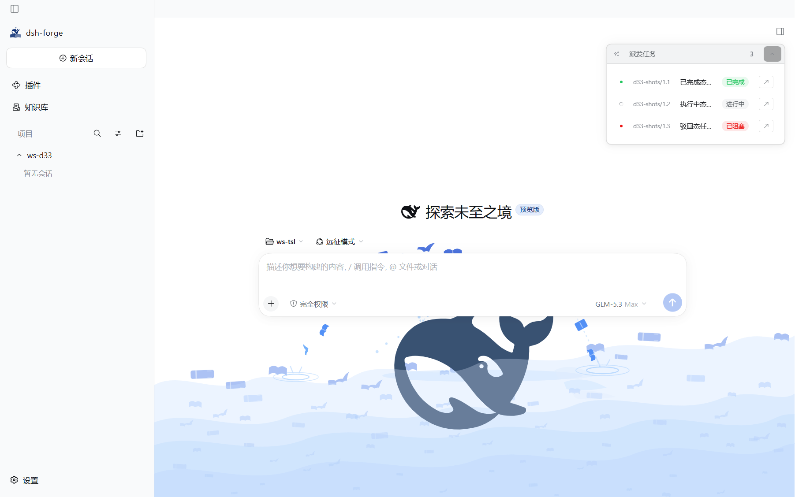
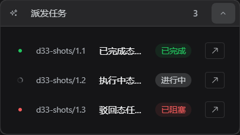
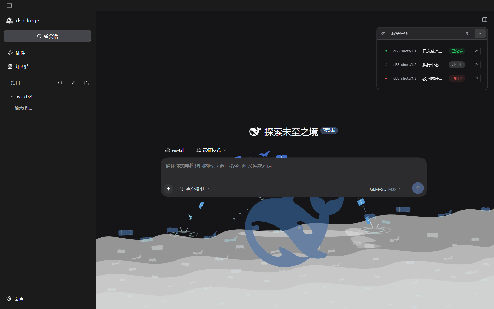

# M3.1 D33 悬浮面板两残差收口走查记录——默认锚位右上角 + 状态标签与任务子 tab 同色——任务 1.18 · SC-8 终验输入

> **任务**：`dsh-forge-m3.1-ui-alignment/1.18`——[D33 差异行](../proposal.md)（2026-10-10 用户实机报障：①「默认起始位置应在中间区域对话面板的右上角」②「任务状态标签颜色跟任务子 tab 保持一致」，源码核验属实）。
> **消费方**：SC-8 人工终验——实机走查动线见文末「实机走查清单」。
> **证据口径**：本面为产品 DOM 面（非 OS 硬件光标平面）——**实机截图当场产出归档**（e2e harness Electron 实跑捕获，非原型对照图）；双主题 = 官方主题服务同位属性（`body[data-ds-dark-theme]`，`dsh-client-ui-theme` 单点 toggle，CSS 解析等价面）。

## 残差① 默认锚位断锚——根因与修法

- **根因（源码核验属实）**：锚源 `[data-slot="main.conversation"]` 为官方 SlotOutlet 洞包裹层，`display:contents`（`dsh-client-ui-renderer/lib/client.js:1094` `ANCHOR_STYLE`，pin ⑮-4 锚定事实）→ 槽宿主零盒 → `getBoundingClientRect` 恒零 → `convRight=0` → `left = max(4, −340) = 4`——面板钉视口左缘；且 `ResizeObserver` 观察零盒元素永不触发——dock 展开自动左移同被断锚。既有单测假 rect 掩蔽真 DOM 断锚。
- **修法（锚源换真盒官方锚）**：`DP_CONV_SELECTOR = '[data-conversation-scroll]'`（官方 chat 台账滚动面——brand.css/fix-38 既有官方锚、e2e 台账 CONVERSATION_SCROLL 同值；真盒、全相位在场）。纵向 D6 裁决保持（页签行 `[data-conversation-tabs]` 下沿 + 8；blank 会话回退锚顶 + 8）；横向 = 对话面右缘内收 16（`DP_RIGHT_GAP` 沿袭）。

**实机真 rect 复核**（e2e harness 实跑，blank 会话回退分支，`tmp-d33-capture.spec.ts` 取证后即删）：

```
[d33] geometry dp=(1100,80) 324x182 convRight=1440 convTop=72
```

- `left 1100 = convRight 1440 − 16 − 面板宽 324`（AC 公式逐项吻合）
- `top 80 = convTop 72 + 8`（blank 回退分支——页签行缺席在场）
- `x=1100 ≫ 4`——**非视口左缘钉位**（报障形态退役）；面板右缘贴对话面板右上角。

## 残差② 状态标签 tone 单源一致

- 面板行 Tag 硬编码 `tone="neutral"`（七态同灰）退役 → **跨视图复用 `taskStatusTagTone`**（`overview/task-tab/task-tab-model.ts:95`——completed=success / blocked·rejected=danger / 其余 neutral，任务子 tab 列表行同源单点）。
- 零复制映射表：结构 pin `tests/structure/d33-dispatch-panel-anchor-tone.test.ts`（源级 import 断言 + `tone="neutral"` 字面量清零断言）；行为面 `DispatchPanel.test.tsx` 七态 `data-tone` 断言（官方 Tag `data-tone` 属性锚）。

## 双主题截图归档（实机 Electron 捕获——三态行：已完成/执行中/驳回）

| 主题 | 面板（三态 tone 对比） | 全页上下文（右上角落位） |
|---|---|---|
| 亮 |  |  |
| 暗 |  |  |
| ⟡N 角标（亮/暗） |  |  |

**判读**：两主题下「已完成」= 官方 success 绿、「已阻塞（驳回）」= 官方 danger 红、「进行中」= neutral 灰——与任务子 tab 列表行同件同 tone（官方 Tag `data-tone` 单源驱动，色值随官方主题层亮/暗联动，产品零自持色）；角标为 link 色胶囊（D6 既有交付，非本项改动面，截图随档供对照）。亮/暗两主题三态均可辨。

## 机械面证据（本任务实跑）

- `just compile`（tsc -b + copy-assets + vite build）exit=0。
- `just fmt` no-op exit=0（仓未配置格式化器）。
- `just lint` 六门 exit=0：oxlint 0 warnings/0 errors、import-lint 0 违规、**token-lint 0 裸值**、selftest 14 条全命中、`tsc -b` + 九 test-types tsconfig 全过。
- vitest 全池：**226 文件 / 3083 用例全绿**（基线 225/3075 → +1 文件/+8 用例：同形几何 stub 3 测 + 七态 tone 3 测 + 结构 pin 4 断言；锚迁移零弱化——e2e 几何组由 ≥/≤ 弱界升级为「右缘内收 16 / 顶 + 8 / 非左缘钉位 / dock 右缘联动」四组精界断言，断言只增）。
- e2e 交付面：`e2e/specs/m2/task-session-linkage.spec.ts` D6 几何组锚迁移（MAIN_CONVERSATION → CONVERSATION_SCROLL 真盒，头注台账记账）+ `tsc -p e2e/tsconfig.json` exit=0。**运行时受限于既有台账红**（见下节诚实声明）。

## 证据口径与限制（诚实声明）

- **实机截图**：产品 Electron 壳经 e2e harness 实跑当场捕获（非 SC-8 补拍预留面）；双主题经官方主题服务同位属性切换（CSS 解析等价）。截图中会话 = blank 相位 + 合成 sessionId 挂接（spec 台账既有「session_id 无会话存在性校验——数据面等价」口径），面板行集/锚定/tone 与真实派发会话同链路。
- **e2e 池既有红（非本任务引入、不在本任务门内）**：`task-session-linkage` 交付 spec 的运行时验证受阻于共享夹具链「工作区芯片」步——1.13 台账 `D1-D28-evidence.md` §五既有记录（specs/m2 芯片族 ×8，「芯片族时间窗证据指向 m3.1 末段 commit——fix 链承接」）。本任务两轮复跑（含 `ELECTRON_RUN_AS_NODE` 环境修复）均红于同一步（`rpc.ts:69` 芯片正则与「记忆工作区」芯片态失配 + composer 消息开户链不落会话行——新hero 面板态产品面）；**故障点先于面板挂载（零挂接零出场）**，与本任务改面（面板锚源/行 Tag tone）无执行交集。本任务以取证 spec（无障碍名芯片径 + blank 会话合成挂接径）完成真 rect 运行时复核如上；共享夹具链修复归台账既有 fix 链（`e2e/support/rpc.ts` 为共享面，本任务不越权改动）。
- 数据面/RPC 零变化（纯 UI 轮）：锚源常量 + 行 Tag tone 两点改面 + 测试池扩容，`dispatchPanelAnchor` 纯几何与既有单测零改动。

## 实机走查清单（SC-8 用户动线）

1. **切换口径**：官方主题切换（设置外观亮/暗）——每面先亮后暗各过一遍。
2. **① 默认落位**：进入有派发任务的会话 → 悬浮面板默认位 = 中区对话面板右上角（右缘距对话面板右缘约一指宽 16px、工具栏/页签行之下 8px）——**不在窗口左缘**；dock 展开右栏 → 面板随对话列收窄**实时左移**；收起 → 回位。
3. **① 变体**：新建空白会话派发任务（无页签行）→ 面板顶 = 对话区顶 + 8（回退分支）。
4. **② 状态标签**：面板行状态标签三色可辨且与任务子 tab 列表行**同色**（已完成=绿/已阻塞·被拒=红/其余=灰），亮暗两主题各过一遍（对照本记录截图基线）。
5. **零回归抽检**：头拖移（拖后停自动锚定）、▁ 折叠 ⟡N 角标往返、行点击弹窗、⟞ 开 worker 子会话（D6 既有交互原样）。
6. **回填**：实机观感以「可辨/不可辨 + 落位是否符合右上角预期」回填本记录即可（截图已归档）。
