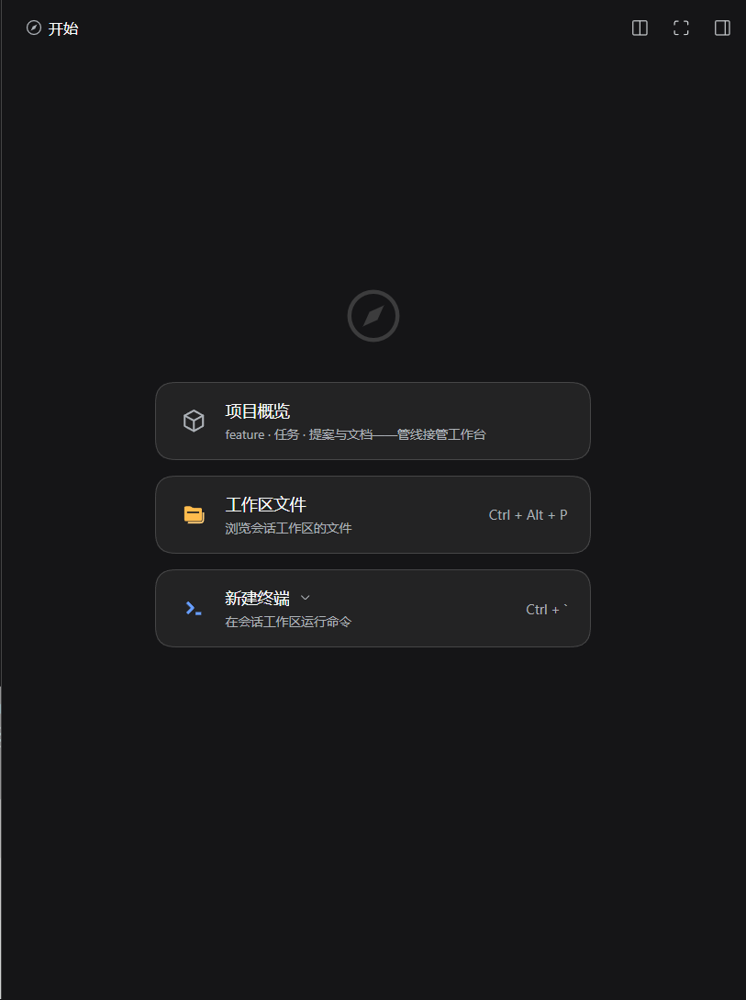
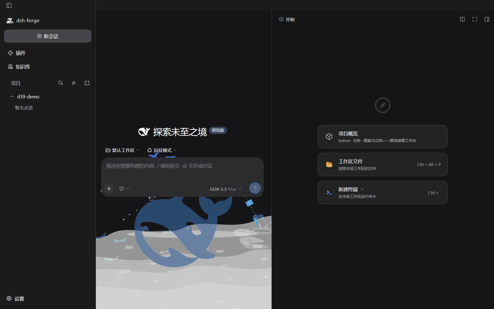

# M3.1 D39 dock 余缝同色走查记录——WCO rightbarCol bg-base 对冲——任务 1.26 · SC-8 终验输入

> **任务**：`dsh-forge-m3.1-ui-alignment/1.26`——[D39 差异行](../proposal.md)（2026-10-10 用户追加裁决：「中间区域及 dockkit 上方跟下方保持一样的颜色」）。
> **消费方**：SC-8 人工终验——实机走查动线见文末「实机走查清单」。
> **证据口径**：本面为产品 DOM 面（颜色计算面）——**实机截图当场产出归档**（e2e harness Electron 实跑捕获，非原型对照图）；双主题 = 官方主题服务同位属性（`body[data-ds-dark-theme]`，`dsh-client-ui-theme` 单点 toggle，CSS 解析等价面，D33 同口径）。

## 根因（源码核验属实——0.2.0-rc.2 上游 `@deepseek-ai/dsh-client-ui-layout/lib/client.js`）

- WCO 官方形态 frame 背景 = `var(--dsw-specific-sidebar-fill)`（`[data-windows-titlebar] .pI_x6G_frame`——padding-top 标题栏带 + 整 frame 底）；
- centerCol 显式 bg-base（`[data-windows-titlebar] .pI_x6G_centerCol`——左上 16px 圆角伴生）；
- **rightbarCol（dock 列）无独立背景规则**——官方仅 `[data-platform=darwin]` 给 rightbarCol bg-base（darwin 径，WCO 不沾）→ dock 面板上/下/右余缝透出 frame 的 sidebar-fill，与中区 bg-base 成色差（亮主题 #f9fafb ↔ #ffffff、暗主题 #232325 族 ↔ #151517——两主题皆有差）。

## 修法（CSS-only，wco.css 偏离块链尾落位）

`html[data-windows-titlebar] div:has(> [data-shell-overlay]) > div:nth-child(3) { background: var(--dsw-alias-bg-base); }`

- 锚 = frame 第三结构子（DocumentTitle 零 DOM——pin ⑮-2；handles 为绝对定位元素尾随 overlayLayer 之后——结构序执行期运行时核对，见下）；
- 官方偏离记账（与 D1 竖线同族）：WCO frame bg = sidebar-fill 为官方形态，产品 dock 列例外对冲；
- 非 WCO 零波及：规则锚定 `html[data-windows-titlebar]`（pin ⑮-6 既有断言面自动覆盖）；
- 亮/暗随 `--dsw-alias-bg-base` 令牌双主题联动——零新机械。

## 运行时机械复核（e2e harness 实跑，取证 spec 取证后即删——D33 同径）

```
[d39] colors dock=rgb(255, 255, 255) center=rgb(255, 255, 255) frame=rgb(249, 250, 251) bgBaseVar=#fff sidebarFillVar=#f9fafb
[d39] light dockBg=rgb(255, 255, 255)
[d39] dark  dockBg=rgb(21, 21, 23)
```

- `dockIsThird=true`：rightbarCol（官方直标 `data-rightbar-col`）= frame 第三结构子——DOM 序运行时核对成立；
- `dock == center`（亮/暗两主题断言均过）且 `dock ≠ frame`（sidebar-fill 对冲在效）；
- 暗 `rgb(21,21,23)` = `--dsw-static-neutral-bluish-950`（bg-base 暗令牌解析值）——令牌双主题联动在效，产品零自持色。

## 双主题截图归档（实机 Electron 捕获——dock 展开 · 会话相位）

| 主题 | dock 列特写（余缝全貌） | 全页上下文（三列对照） |
|---|---|---|
| 亮 |  |  |
| 暗 |  |  |

**判读**：两主题下 dock 面板上/下/右余缝与中区（及 dock 卡面）同色——亮 = 白 `#ffffff`、暗 = `#151517`，sidebar-fill 灰幕（亮 #f9fafb / 暗 #232325 族）不再透出；三列观感为「侧栏 = sidebar-fill 灰幕 / 中区+dock = bg-base」的官方 darwin 同构形态。亮/暗两主题余缝均同色。

## 机械面证据（本任务实跑）

- `just compile` exit=0（tsc -b + copy-assets + vite build——两轮瞬时资源失败 os error 1450/OOM 后原样重试通过，仓 global-setup 既有记账口径）。
- `just fmt` no-op exit=0（仓未配置格式化器）。
- `just lint` 六门 exit=0：oxlint 0 warnings/0 errors、import-lint 0 违规、**token-lint 0 裸值**、selftest 14 条全命中、`tsc -b` + 九 test-types tsconfig 全过。
- 定向 vitest：pin-15 **26 用例全绿**（+3：⑮-2 D39 前提面 1 + ⑮-6 D39 规则面 1 + 记账 D39 标记断言 1；TDD 先红后绿）；contract 池 15 文件/223 用例全绿。
- 数据面/RPC 零变化（纯 UI 轮）。

## 证据口径与限制（诚实声明）

- **实机截图**：产品 Electron 壳经 e2e harness 实跑当场捕获（临时取证 spec `tmp-d39-capture.spec.ts`，取证后即删——D33 同口径）；双主题经官方主题服务同位属性切换（`body[data-ds-dark-theme]` DOM 属性面，非设置页点击动线——CSS 解析等价，SC-8 用户动线仍以设置外观亮/暗为准）。
- 截图相位 = RPC 直注项目 → 会话相位 → dock 展开（`SIDEBAR_RIGHT_EXPAND` 点击径——wtb spec ② 同径）；dock 内容 = 开始页官方三卡（项目概览/工作区文件/新建终端）。
- **非 WCO 零波及为静态断言面**（pin ⑮-6「全部规则锚定 html[data-windows-titlebar]」既有断言自动覆盖新规则）——非 WCO 载体未实机走查（本面仅 win32 WCO 成立，darwin/非 WCO 无 dock 余缝色差前提面）。

## 实机走查清单（SC-8 用户动线）

1. **切换口径**：官方主题切换（设置外观亮/暗）——每面先亮后暗各过一遍。
2. **dock 余缝**：展开右侧 dock → dock 面板上/下/右余缝与中间区域**同色**（无灰幕色差；对照本记录截图基线）。
3. **三列观感**：侧栏灰幕 / 中区+dock 同底色——与 darwin 官方形态同构。
4. **收起往返**：dock 收起 → 展开往返，色面无残影/无跳变。
5. **回填**：实机观感以「同色/不同色」回填本记录即可（截图已归档）。
