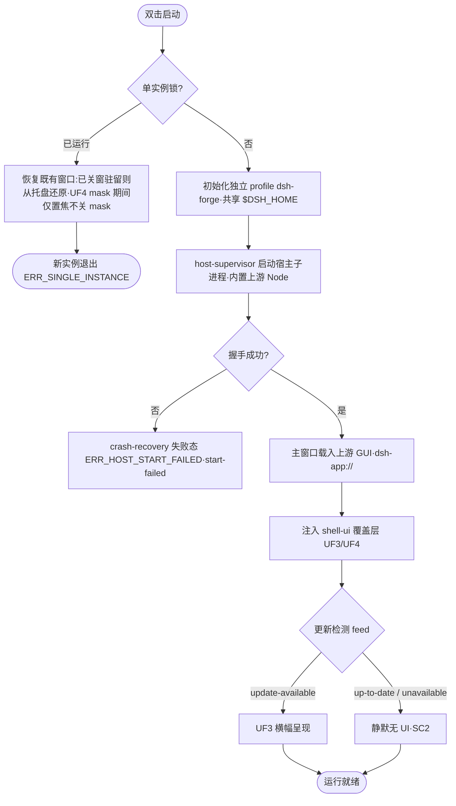
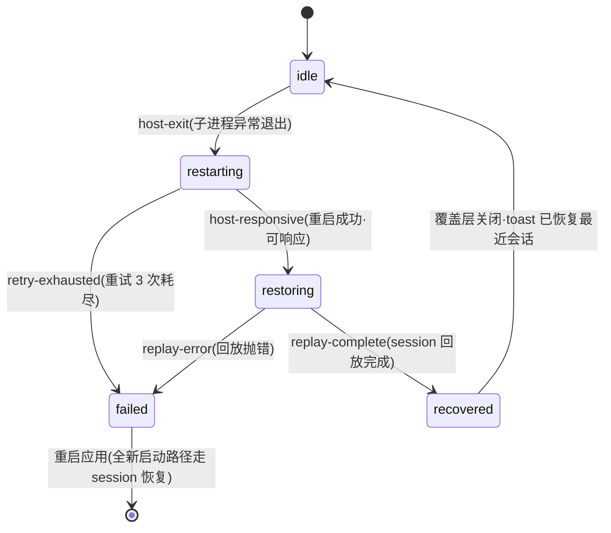
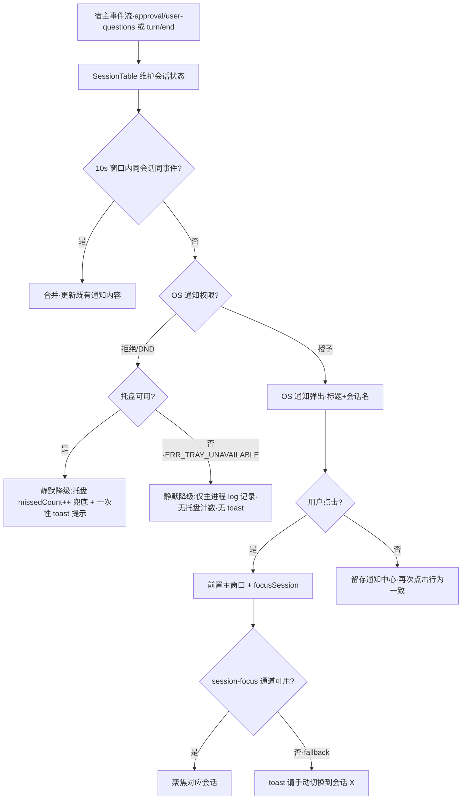
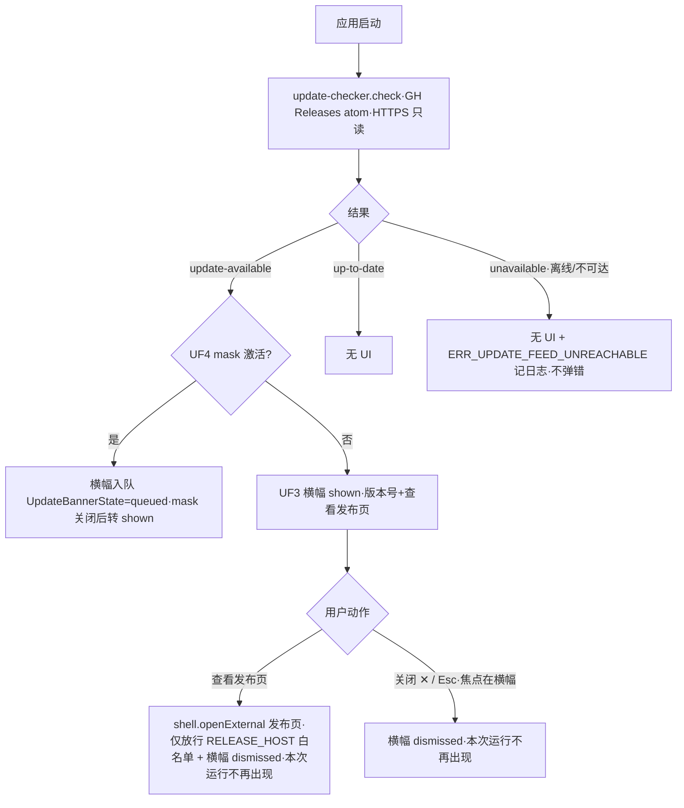

# Technical Design: dsh-forge M1 桌面纯壳

> 源:[prd/prd-spec.md](../prd/prd-spec.md) · [ui/ui-design.md](../ui/ui-design.md) · 提案 Source Code References A-H(源码导航)
> 纪律:dsh 本地源码为唯一权威(上游 HEAD `c36ba648`,2026-09-15;desktop-host 0.1.6-alpha.2;**上游无 git tag,版本锁定按 commit SHA**)。

## Overview

继承提案冻结的技术路线:**Electron 壳 + 复用/适配上游 desktop-host 宿主子进程 + `dsh-app://` 协议 + carrier 接入上游 client UI(零 UI 重写)**。自研增量收敛为壳层五件事:托盘 / 通知 / 更新检测 / 崩溃恢复 / 分发打包。

用户决策(2026-09-20):
- **desktop-host 获取 = vendor 源码投影**:上游 desktop-host 源码按锁定 commit SHA 投影进本仓,升级 = 显式 diff 对照任务;
- **工程布局 = pnpm workspace**(apps/ + packages/,为 M2+「一切皆插件」预留包边界);
- **测试栈 = vitest 单测 + Playwright `_electron` e2e + 三平台 GH Actions 矩阵**。

```
dsh-forge/
├── pnpm-workspace.yaml
├── apps/
│   └── desktop/                  # Electron 壳(全部自研增量)
│       ├── src/main/             # 主进程:window-lifecycle / tray / notifier / update-checker / host-supervisor / crash-recovery / single-instance / dsh-app 协议 / i18n(locale 资源加载)
│       ├── build/                # electron-builder 三平台打包配置(nsis / dmg / AppImage)
│       ├── src/preload/          # contextBridge 语义动词(白名单)
│       ├── src/shell-ui/         # 壳级覆盖层资产(UF3 横幅 / UF4 覆盖层,注入式)
│       └── e2e/                  # Playwright _electron 用例
├── packages/
│   └── desktop-host-vendor/      # vendored 上游 desktop-host + 适配缝
└── scripts/
    └── sync-upstream.mjs         # 上游 checkout(SHA 锁定)/ 源码投影 / 依赖闭包解析 / 完整性校验
```

## Architecture

### Layer Placement

本仓全部为应用层(apps/desktop 壳 + packages vendor);不修改上游代码、不引入 forge 依赖。宿主执行路径使用内置上游 Node 运行时(Electron 内置 Node 不得进入,上游生产决策继承)。

### Component Diagram

```
+--------------------------------------------------- apps/desktop(Electron 壳主进程)---+
|  window-lifecycle   tray(UF1)   notifier(UF2)   update-checker(UF3)   crash-recovery(UF4)  |
|  single-instance-lock                    host-supervisor(监护/重启)                          |
+-----------------------------|---------------------------------------|---------------------+
                              | host-protocol/wire(继承上游)          | dsh-app://(资源+API 流量)
                              v                                       v
              +----------------------------+            +----------------------------------+
              | desktop-host(宿主子进程)    |            | renderer:上游 client UI 插件族     |
              | vendored,pinned SHA;       |            | 经 __DSH_TRANSPORT__ carrier 接入; |
              | 内置上游 Node 运行时执行     |            | 壳注入 shell-ui 覆盖层(UF3/UF4)   |
              +------------+---------------+            +------------------+-----------------+
                           | session 事件流(通知触发源)  | preload 语义动词 IPC(sender 校验)
                           v                           v
              +--------------------------------------------------------+
              | $DSH_HOME 共享产品数据(会话/凭据/设置;profile=dsh-forge) |
              +--------------------------------------------------------+

  GH Releases feed(更新检测,HTTPS 只读)──→ update-checker(UF3,壳主进程)
  三平台 CI(GitHub Actions)──→ 构建产物 ──→ GitHub Releases 发布通道
```

### Dependencies

- **内部**:apps/desktop ↔ packages/desktop-host-vendor(workspace 协议);scripts/sync-upstream(构建期)
- **外部**:Electron(major 对齐上游 apps/desktop)、electron-builder(分发打包,三平台安装包)、上游 monorepo checkout(仅构建期,pinned SHA)、GitHub Releases(仅更新检测 HTTPS 只读)
- **运行时无网络依赖**(除更新检测);无监听端口;无 forge 依赖

## Key Flows(关键流程)

### F1 应用启动主流程



> 更新检测 × 崩溃恢复叠加:若 `update-available` 在 UF4 mask 激活期间到达,横幅**入队不渲染**;UF4 迁出(recovered 关闭 / failed 重启)后再呈现。z 序:UF4 全屏 mask 永远位于 UF3 横幅之上并拦截全部点击。

### F2 崩溃恢复状态机(SC9)



> 非法迁移(如 failed → restoring)由状态机拒绝并抛错,单测覆盖;UF4 覆盖层随迁移同步呈现(详见 ui-design.md 状态机)。

### F3 通知触发、去重与召回(UF2)



### F4 更新检测(UF3,v1 档位)



## Interfaces

### Interface 1: host-supervisor(壳↔宿主监护)

```ts
startHost(profileDir: string): Promise<HostHandle>
HostHandle = {
  pid: number
  onExit(cb: (code: number | null, signal: string | null) => void): void
  onSessionEvent(cb: (ev: HostSessionEvent) => void): void
  shutdown(): Promise<void>
}

// 宿主事件流(通知触发源 / SessionTable 维护源;继承上游 session 事件通道)
type HostSessionEvent =
  | { type: 'wait-input'; sessionId: string; title: string }    // approval / user-questions
  | { type: 'turn-end'; sessionId: string; title: string }
  | { type: 'session-list'; sessions: Array<{ id: string; title: string }> }  // 全量对账(启动/回放完成时)
// 事件丢失容忍:事件流仅驱动通知与 SessionTable,session-list 全量对账兜底增量漂移;
// 突发不设背压 —— 单进程 stdout/IPC 通道,消费侧逻辑 O(1),不做丢弃策略。
```

### Interface 2: crash-recovery(UF4 显式状态机)

```ts
type RecoveryState = 'idle' | 'restarting' | 'restoring' | 'recovered' | 'failed'
transition(event: 'host-exit' | 'host-responsive' | 'replay-complete' | 'retry-exhausted' | 'replay-error' | 'start-failed'): RecoveryState
// 迁移:idle→restarting(host-exit)→restoring(host-responsive)→recovered(replay-complete)
//      restarting|restoring→failed(retry-exhausted|replay-error);idle→failed(start-failed:首次 spawn/握手失败,F1 直接进失败态)
//      failed 不回退;非法迁移抛错(单测覆盖)
// attempts 由 supervisor 在每次 startHost() 调用后 +1 写入 RecoveryContext;
// 重试策略:最多 3 次,指数退避 2s/4s/8s(定时器驱动,放弃即 retry-exhausted)。
```

### Interface 3: update-checker(UF3;feed = GitHub Releases atom,HTTPS 只读)

```ts
check(): Promise<UpdateCheck>
UpdateCheck = {
  status: 'update-available' | 'up-to-date' | 'unavailable'   // unavailable = 检测失败(离线/不可达),静默
  latestVersion?: string    // semver(含 prerelease,如 0.2.0-rc.1)
  releaseUrl?: string       // https 发布页
  checkedAt: number         // epoch ms
}
```

### Interface 4: notifier(UF2;内部实现 10s 去重合并)

```ts
type SessionInfo = { id: string; title: string }   // title 空回退 id.slice(0, 8)
notify(event: 'wait-input' | 'turn-end', session: SessionInfo): void
getPermissionState(): Promise<'granted' | 'denied' | 'unknown'>   // F3 权限分支判定源;结果缓存 300ms(去抖高频调用);'unknown' = 平台无查询接口,首次按 granted 尝试、失败回填 denied
onNotificationClick(cb: (sessionId: string) => void): void
```

### Interface 5: session-focus 通道(★ Spike 3;ui-design 契约的 tech-design 依赖)

```ts
focusSession(sessionId: string): Promise<boolean>
// 通道候选:URL hash / postMessage / 上游 deep-link,经 carrier 注入点(上游 DESKTOP_TRANSPORT_SCRIPT 先例)派发;
// spike 确认上游可复用通道;不可用 → fallback = 前置主窗口 + toast「请手动切换到会话 X」,返回 false。
// 约束:不修改上游 GUI 文件。
```

### Interface 6: preload 语义动词(IPC 白名单 + sender frame 校验)

```ts
dshForge.update.dismiss(): void
dshForge.update.openRelease(): void        // 壳侧 shell.openExternal(releaseUrl)
dshForge.recovery.restartApp(): void  // 顺序:shutdown 宿主子进程 → 释放单实例锁 → app.relaunch → 旧进程退出(防孤儿宿主,保 SC3)
dshForge.recovery.getState(): RecoveryState
```

### Interface 7: i18n(壳层文案中英双语,接入上游 locale 机制;PRD 决定 ②)

```ts
type Locale = 'zh' | 'en'
init(): Promise<void>          // 读取上游 locale 设置存储($DSH_HOME settings 键,只读;缺省 'zh');不接受跨进程写
getLocale(): Locale
t(key: CopyKey, params?: Record<string, string | number>): string
type CopyKey =
  | 'tray.show' | 'tray.quit'
  | 'notify.waitInput.title' | 'notify.waitInput.body'
  | 'notify.turnEnd.title' | 'notify.turnEnd.body'
  | 'update.viewRelease' | 'update.aria.close'
  | 'crash.title' | 'crash.restarting' | 'crash.restoring' | 'crash.recovered' | 'crash.failed'
  | 'toast.manualSwitch'       // 「请手动切换到会话 {title}」
  | 'toast.notifyDisabled'     // 「系统通知已禁用,可在系统设置中开启」(F3 权限被拒一次性提示)
// 实现约束:壳内不维护第三语言;上游 locale 机制接口经 vendored desktop-host 闭包引用(不修改上游);
// 上游机制在 Spike 3 侦察中一并确认读取方式(直接读 settings 文件 vs 经宿主事件流快照),二选一后固化。
```

## Data Models

(db-schema: no —— 无数据库;以下为壳内结构体)

```ts
// 通知侧会话状态表(壳经宿主事件流维护)
SessionTable = Map<sessionId, { title: string; lastWaitAt: number; lastTurnAt: number }>
// 生命周期:创建/更新 = wait-input / turn-end 事件携带 title;对账 = session-list 全量覆盖;
// 驻留期上限 200 条 LRU 驱逐(防 SC5 长驻无界增长);宿主重启:host-exit 时整表清空、DedupEntry 一并清零
// (重启后由 session-list + 新事件重建,避免恢复期事件被崩溃前去重窗口误吞)。
// 通知去重(10s 窗口,同会话同事件合并)
DedupEntry = { key: `${sessionId}|${eventType}`; at: epochMs; count: number }
// 崩溃恢复(UF4 状态机数据)
RecoveryContext = { state: RecoveryState; attempts: number; failure?: { code: 'retry-exhausted' | 'replay-error' | 'host-start-failed'; detail: string /* ≤120 字符 */ } }
// 更新检查结果
UpdateCheck = { status: 'update-available' | 'up-to-date' | 'unavailable'; latestVersion?: string; releaseUrl?: string; checkedAt: number }
// UF3 横幅呈现状态(本次运行级,进程内存,不持久化)
UpdateBannerState = { phase: 'hidden' | 'queued' | 'shown' | 'dismissed'; version?: string }
// 合法迁移:hidden→shown(无 mask 直达,F4-D2)/ hidden→queued→shown(mask 期间入队)/ shown|queued→dismissed;dismissed 为终态,仅重启复位
// 托盘状态(DND 兜底计数)
TrayState = { present: boolean; missedCount: number }
// 上游锁定(vendor 完整性)
UpstreamLock = { pinnedSha: string; desktopHostVersion: string; vendoredFiles: Array<{ path: string; sha256: string }> }
```

## Error Handling

### Error Types & Codes

| Error Code | Name | Description | 用户面行为 |
|------------|------|-------------|-----------|
| ERR_UPDATE_FEED_UNREACHABLE | 更新源不可达 | feed 请求失败/离线 | **静默降级**(SC2),log 记录,不弹错 |
| ERR_HOST_START_FAILED | 宿主启动失败 | 子进程 spawn/握手失败 | 崩溃恢复覆盖层失败态(原因 + 重启应用);模型映射 `failure.code = 'host-start-failed'` |
| ERR_RECOVERY_RETRY_EXHAUSTED | 恢复重试耗尽 | 重启 3 次(退避 2s/4s/8s)仍不可响应 | UF4 失败态,不回退其他态;映射 `'retry-exhausted'` |
| ERR_TRAY_UNAVAILABLE | 托盘不可用(Linux) | Tray 创建失败 | 静默降级:无驻留,关窗即退出,log 记录 |
| ERR_NOTIFICATION_DENIED | 通知权限被拒/DND | OS 权限拒绝 | 托盘可用:静默降级 + missedCount++ + 一次性 toast;托盘不可用叠加:仅 log,无计数无 toast(F3-F2 分支) |
| ERR_SINGLE_INSTANCE | 单实例冲突 | 二次启动 | 聚焦既有窗口后退出新实例 |

(HTTP Status 列不适用 —— 桌面壳无对外服务端。)

### Propagation Strategy

壳层错误全部收敛于主进程结构化 log(本地文件,含错误码);用户面遵循「SC2 静默优先」—— 仅崩溃恢复走显式 UI(UF4),其余均为降级 + log。renderer 侧错误经 preload 语义动词边界隔离,不裸露主进程能力。

## Cross-Layer Data Map

| Field Name | Storage Layer(主进程) | API/DTO(preload IPC) | Frontend Type(shell-ui) | OS 面 | Validation Rule |
|------------|------------------------|----------------------|--------------------------|-------|-----------------|
| latestVersion / releaseUrl | UpdateCheck | `dshForge.update.*` | UF3 横幅插值 | — | semver 字符串;URL 必须 https 且匹配 RELEASE_HOST/RELEASE_PATH_PREFIX 白名单 |
| banner phase | UpdateBannerState | `dshForge.update.*` 事件推送 | UF3 显隐/入队 | — | 合法集 = hidden→shown \| hidden→queued→shown \| shown/queued→dismissed;dismissed 终态 |
| recoveryState / failure.detail | RecoveryContext | `dshForge.recovery.getState()` | UF4 覆盖层 | — | detail ≤120 字符截断 |
| sessionId | SessionTable key | `focusSession(id)` | 会话聚焦 | 通知点击 payload | 非空字符串 |
| missedCount | TrayState | — | — | 托盘 tooltip 计数 | ≥0 整数 |

## Integration Specs

### Integration: UF3 更新横幅 / UF4 崩溃恢复覆盖层 → 主窗口(继承上游 GUI 容器)

- **Target File**:不修改任何上游文件;UF3/UF4 为 `apps/desktop/src/shell-ui/` 壳层资产,经 renderer 注入管道叠加于上游 GUI 之上(先例:上游 `DESKTOP_TRANSPORT_SCRIPT` 经 `renderIndexInjections` 注入)
- **Insertion Point**:上游 index 注入序列之后追加壳层 bundle(挂载点 `document.body` 尾部;UF3 `top 40px` / UF4 全屏 mask,详见 [ui-design.md](../ui/ui-design.md))
- **Data Source**:preload `dshForge.*` 语义动词(IPC 事件推送 + 主动拉取)

UF1(托盘)/ UF2(通知)为 OS 原生面,无页面集成 —— 不适用。

## Testing Strategy

### Per-Layer Test Plan

| Layer | Test Type | Tool | What to Test | Coverage Target |
|-------|-----------|------|--------------|-----------------|
| 壳逻辑 | 单测 | vitest | semver 比较 / feed 解析 / 失败静默;通知 10s 去重合并;崩溃状态机全迁移(含非法迁移拒绝+退避序列);托盘计数;SessionTable LRU 驱逐与 host-exit 清空;UpdateBannerState 四相迁移;i18n 全 CopyKey zh/en 快照(零缺键);UpstreamLock 完整性校验;openExternal 白名单匹配;preload IPC 白名单与 sender frame 校验(白名单外调用被拒) | ≥80%(进程交互类除外) |
| 载体级 | e2e | Playwright `_electron.launch` | SC6 假 feed 60s 提示+跳转;SC3 进程数=2 断言;UF3 Esc;UF4 状态机(杀子进程驱动);UF4 mask 期间 update-available 入队断言;SC7 冒烟(清单见下) | 全绿 |
| 三平台 | 手检清单 + 录屏 | 平台清单(SC1/SC2/SC4/SC5/SC8/SC9) | 干净机器 / 离线 / 通知 / 托盘 / 共存 / 崩溃恢复 | 归档 |
| CI | 矩阵 | GitHub Actions | `windows-latest` × `macos-latest`(arm64+x64)× `ubuntu-latest`;构建 + e2e + Releases 发布 | 三平台全绿 |

### Key Test Scenarios

干净机器零终端首用;离线首启(更新失败静默);关窗驻留 → 通知召回;三方共存交替读写 `$DSH_HOME`;强杀宿主 → 恢复;二实例启动 → 聚焦退出;10s 内连发同类通知 → 合并为一条。

**SC7 冒烟清单(上游 web e2e 等价子集,枚举固定)**:SC7 的「100% 可用」由①上游 client UI 自身的 web e2e 在 vendored 闭包上原样运行(等价性来自同一代码,不重写用例;**运行器 = CI 内 `pnpm --filter` 于 vendored 闭包执行上游 web e2e 套件,Playwright 浏览器模式**)+ ②壳侧 `_electron` 冒烟清单共同证明。冒烟清单(10 条,对应上游 GUI 一级功能面):1) 应用启动载入 SPA 无白屏;2) 会话列表渲染;3) 新建会话;4) 发送消息并收到回合结束;5) 会话切换;6) 审批请求呈现与批准;7) user-questions 呈现与作答;8) 计划面渲染;9) 设置面打开并持久化 API key(SC1 路径);10) 文件树/workspace 面渲染。上游 web e2e 若有不可在 Electron 载体运行的用例(浏览器专属 API),记入豁免清单并在 CI 报告标注,不允许静默跳过。

### Overall Coverage Target

壳逻辑单测 ≥80%(vitest);SC1-9 全量由 e2e/手检清单覆盖(见 PRD Coverage Map)。

## Security Considerations

`<!-- Override: Security review enabled by signal「凭据/API key、无监听端口安全模型、共享 $DSH_HOME」(继承 PRD) -->`

### Threat Model

本地端口暴露;renderer → 主进程 IPC 越权;更新 feed 篡改;凭据泄露面扩大;遥测滥用;shell-ui 注入面与上游 SPA 同源共存。

### Mitigations(继承上游已验证栅栏 + 本工程约束)

| 威胁 | 缓解 |
|------|------|
| 本地端口暴露面 | 不开任何监听端口;`dsh-app://` 经 `registerSchemesAsPrivileged` 显式授权 |
| IPC 越权 | preload 仅暴露语义动词白名单;handler 校验 sender frame(上游模式) |
| 更新 feed 篡改 | 仅 HTTPS 只读;v1 只呈现版本号与发布页跳转,**不执行任何下载/安装动作**;`openRelease()` 对 feed 提供的 releaseUrl 施加**构建期常量白名单** `RELEASE_HOST = 'github.com'` + `RELEASE_PATH_PREFIX = /<owner>/<repo>/releases`(owner/repo 为 GH 定名后固化的字面量,非 feed 输入),不匹配即拒绝 openExternal 并 log |
| 凭据泄露面 | 沿用 `$DSH_HOME` 既有凭据存储,不新增路径/拷贝;shell-ui 不展示敏感值 |
| 遥测滥用 | 零遥测(BIZ-privacy-001);对外网络仅更新检测一处 |
| shell-ui 注入面 | webPreferences 显式声明 `contextIsolation: true`、sandbox 对齐上游 desktop 配置;壳层 bundle 仅经同一注入管道加载、不索取额外特权;注入内容不内联任何 feed/会话动态数据(防 DOM 注入) |

## PRD Coverage Map

| PRD Requirement / AC | Design Component | Interface / Model |
|----------------------|------------------|-------------------|
| SC1 干净机器零终端 | 打包(electron-builder,内嵌运行时)+ CI | UpstreamLock / sync-upstream |
| SC2 离线自足 | update-checker 静默降级 + 离线安装包 | UpdateCheck / ERR_UPDATE_FEED_UNREACHABLE |
| SC3 进程足迹=2 | host-supervisor 单子进程模型 | HostHandle |
| SC4 系统通知 | notifier + session 事件流订阅 | notify() / DedupEntry |
| SC5 托盘驻留 | tray + window-lifecycle(关窗驻留) | TrayState |
| SC6 更新检测 | update-checker + UF3 横幅 + e2e 假 feed | check() / UpdateCheck |
| SC7 UI 对等 | dsh-app:// + carrier 接入(零 UI 重写)+ 载体级 e2e | 注入管道 |
| PRD 决定 ② 壳层文案中英双语 | i18n 模块 + 上游 locale 机制接入 | t() / CopyKey / Locale |
| SC8 多装共存 | profile `dsh-forge` + `$DSH_HOME` 共享 + 单实例锁 | ERR_SINGLE_INSTANCE |
| SC9 崩溃恢复 | crash-recovery 状态机 + host-supervisor 重启 | transition() / RecoveryContext |
| Story AC(全部 5 条) | 由 SC1-9 映射覆盖(见 prd-user-stories.md ↔ SC 对照) | — |

## Open Questions

- [ ] **Spike 1(Linux)**:node-pty 等原生模块 Linux prebuild/构建可用性;desktop-host Linux 启动冒烟
- [ ] **Spike 2(vendor 闭包)** ~~:路径二选一~~ → **已定:源码投影 + 闭包解析**(与「vendor 源码投影」决策同构,升级 = 显式 diff 对照可读;弃整树产物拷贝 —— 产物不可 diff、体积不可裁剪)。Spike 2 剩余范围收窄为:验证 10 个 workspace 依赖闭包解析的完整性规则(manifest 递归 vs 静态 import 扫描),产出 vendored 文件清单草稿。
- [ ] **Spike 3(session-focus)**:上游可复用的会话聚焦通道侦察(URL hash / postMessage / deep-link);不可用则固化 fallback
- [ ] 安装包体积预算:**临时上限 ≤500MB/平台**(Electron + 内置 Node + 依赖闭包的经验量级;Spike 1/2 后按上游 runtime-file-policy 思路裁剪实测定稿并修订本值)
- [ ] GH owner/repo 定名(发布通道 URL 与更新 feed 依赖)

## Appendix

### Alternatives Considered

| Approach | Pros | Cons | Why Not Chosen |
|----------|------|------|----------------|
| desktop-host 经 git submodule 获取 | 免 vendor | 构建依赖外部仓库可达;无法本地微调适配缝 | 选 vendor 源码投影(pinned SHA) |
| 请求上游发布 desktop-host 至 npm | 最干净的依赖形态 | 时间线不可控 | 同上(可作长期演进项回馈上游) |
| 单包平面工程布局 | M1 最简 | M2+「一切皆插件」需重构 | 用户选 pnpm workspace |
| 仅 e2e + 手检(无单测) | 轻量 | 壳逻辑(状态机/去重/semver)缺快速反馈 | 选 vitest + Playwright |
| 修改上游 GUI 实现 session-focus | 直接 | 违反零侵入与 TECH-ui-reuse-001 | spike 通道 + 降级 fallback |

### References

- 提案 Source Code References A–H(`docs/proposals/dsh-forge/proposal.md`):宿主组装 / carrier / RPC / 事件 / 持久化 / 上游桌面逐文件 / UI 组装 / Electron 工程模式
- [DESIGN.md](../../../DESIGN.md)(设计 tokens)/ [ui-design.md](../ui/ui-design.md)(UF1-4 规格)
- 上游仓库 `Z:\project\github\deepseek-harness`(HEAD `c36ba648`,2026-09-15;`apps/desktop-host` 源码 5 文件,10 个 workspace 依赖)
