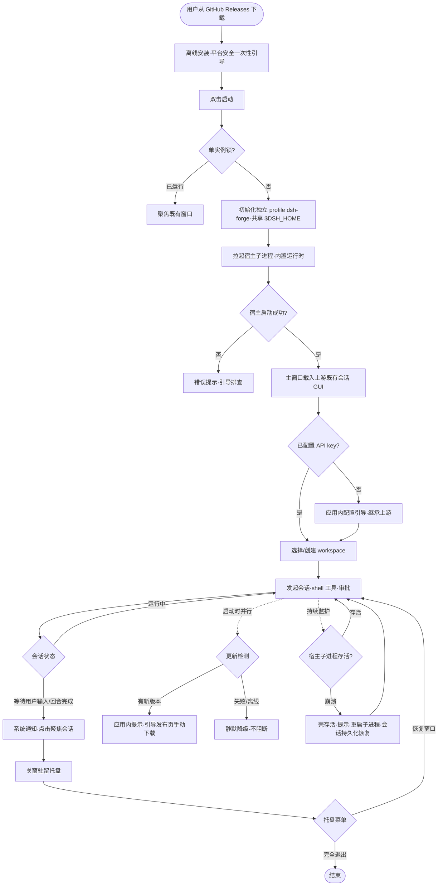

# dsh-forge M1 桌面纯壳 — PRD Spec

> PRD Spec: defines WHAT the feature is and why it exists.
> 源提案:[docs/proposals/dsh-forge/proposal.md](../../../proposals/dsh-forge/proposal.md)(intent: new-feature;M1 范围冻结)。SC1-8 与源码导航 A-H 继承自 Superseded 提案 [dsh-desktop](../../../proposals/dsh-desktop/proposal.md),原文继续有效。

## Background

### Why (Reason)

- 上游官方桌面端(apps/desktop)存在四块空白:**无 Linux 支持**、**无系统托盘与系统通知**(长会话桌面人体工学缺失)、**发布通道绑定组织基建**(签名/公证/COS,社区无法复用,也无法以免签名轻量形态分发)、**版本刚性绑定**(升级 dsh 必须发布新桌面版本)。
- 产品终态「以项目为中心的 SDD 工作台」需要自主可控的桌面载体,而该载体本身是待建工程 —— M1 纯壳是全部 M2+ 能力的地基。
- dsh 处于 0.1.x-rc 周发布快速演进期,独立壳启动越晚,与上游协议缝的适配分叉成本越高。

### What (Target)

交付 v1 = M1 桌面纯壳:三平台离线安装包 + 宿主子进程承载现有会话 UI(零 UI 重写、不开监听端口)+ 系统托盘/通知 + 免签名 GitHub Releases 分发 + 应用内更新检测 + 多装共存 + 宿主崩溃恢复。**不含任何 forge 能力**(v1 交付物不得出现任何 forge 依赖)。

### Who (Users)

| 角色 | 描述 |
|------|------|
| 社区开发者(新用户) | 干净机器、零终端配置,从 GitHub Releases 获取并使用 dsh 会话能力 |
| 现有 dsh 重度用户 | 自 web/CLI 形态迁移;长会话挂机等审批;与 CLI/官方桌面多装共存 |
| 维护者(干系人) | 单人产品线,自用旗舰 + 社区公开;依赖三平台 CI 与免签名发布通道 |

## Goals

| Goal | Metric | Notes |
|------|--------|-------|
| 零终端安装使用门槛 | 三平台各 1 台干净机器(无 Node/git/pnpm),全程终端命令 = 0,完成配置→会话→shell 工具→审批 | SC1 |
| 离线自足 | 断网下安装与首次启动成功率 100%;更新检测失败不弹错、不阻断 | SC2 |
| 资源足迹可控 | 空闲稳态自有进程数 = 2(壳主进程 + 宿主子进程;系统 webview 辅助进程不计入) | SC3 |
| 长会话桌面人体工学 | 「等待用户输入」「回合完成」2 类通知 × 3 平台各触发 ≥1 次,点击聚焦对应会话;关窗驻留 + 托盘恢复/退出 | SC4/SC5 |
| 版本可跟进 | 假 Releases feed 下启动后 60 秒内显示更新提示并可跳转发布页 | SC6 |
| UI 对等 | 现有 web GUI 功能面在桌面载体 100% 可用(现有 e2e 通过或等价载体级测试) | SC7 |
| 多装共存安全 | CLI / 官方桌面(若装)/ 本壳交替使用 `$DSH_HOME` 会话与凭据,互不损坏;独立 profile | SC8 |
| 故障韧性 | 三平台各 1 次:强杀宿主 → 壳存活 + 提示 + 重启子进程 + 会话从持久化恢复 | SC9 |

## Scope

### In Scope

- [ ] 三平台(Windows/macOS/Linux)安装包:内嵌完整运行时,离线安装,无需预装 Node/pnpm
- [ ] 壳 + 宿主子进程:`dsh-app://` 承载 Web 资源与 API 流量,carrier 接入现有 client UI 插件族,不开监听端口(UI 零重写)
- [ ] 系统托盘:关窗驻留、菜单恢复窗口/完全退出
- [ ] 系统通知:等待用户输入 / 回合完成两类触发,点击聚焦对应会话
- [ ] 应用内更新检测(v1 档位):启动检测 → 提示 → 引导发布页;失败不阻断启动
- [ ] GitHub Releases 发布通道 + 三平台 CI
- [ ] 共存:独立 profile 目录 `dsh-forge`(≠ 上游 `desktop`)+ 共享 `$DSH_HOME` 产品数据 + 单实例锁
- [ ] 宿主子进程崩溃恢复:壳存活、提示、重启子进程、依托 session 持久化恢复会话

> **PRD 阶段补充决定(2026-09-19,用户确认)**:
> ① 应用显示名与 profile 目录名 = `dsh-forge`(弃用 Superseded 提案中 `desktop-ce` 旧建议);
> ② 壳层自有文案(托盘/通知/提示)中英双语,接入上游 locale 机制;
> ③ **UI 沿用最大化**:一切 UI 面优先沿用 dsh 已有 —— 主功能面 100% 复用上游 web GUI;壳级新增面优先参照上游 apps/desktop 同类实现(更新提示、locale、对话框先例),仅上游确无对应物时自研,风格保持一致;
> ④ 项目 surface 配置按 `web` 近似(forge 无 desktop surface 类型,用户知情确认),桌面载体测试编排差异在 /test-guide 阶段处理。

### Out of Scope

- 一切 forge 能力与 forge 侧改造(M2+ 各里程碑独立提案;**v1 交付物不得出现任何 forge 依赖**)
- 代码签名、公证、完整后台自动更新(后续里程碑,绑定组织级证书投入)
- 拖拽文件/文件夹集成;非开发者上手引导;多窗口、原生菜单等深度原生 UI
- ACP/SDK sidecar 外部进程模式;修改上游 dsh 仓库;bundled Python 运行时打包
- 方向锚定项(不进 v1,各自独立提案):任务可视化看板、feature 管线、会话挂接、知识库(含跨项目层)、测试用例管理、管线原生化、文档外置与 wiki 对接

## Flow Description

### Business Flow Description

四条主线(均为 v1 验收路径):

- **A 首次使用(主路径)**:GH Releases 下载 → 离线安装(平台安全机制允许一次性引导)→ 双击启动 → 单实例检查 → 初始化独立 profile `dsh-forge`(共享 `$DSH_HOME`)→ 拉起宿主子进程 → 主窗口载入上游既有会话 GUI → 应用内完成 API key 配置(继承上游配置流)→ 选择/创建 workspace → 发起会话 → shell 工具执行 → 审批交互。全程零终端。
- **B 驻留与召回**:关闭主窗口 → 应用驻留托盘;会话「等待用户输入」或「回合完成」→ 系统通知 → 点击通知聚焦对应会话;托盘菜单可恢复窗口或完全退出。
- **C 更新检测(v1 档位)**:启动时检测 GH Releases feed → 有新版本则应用内提示 → 引导跳转发布页手动下载;检测失败(离线/不可达)静默降级,不弹错不阻断。
- **D 宿主崩溃恢复**:宿主子进程异常退出 → 壳存活并提示 → 重启子进程 → 最近会话从 session 持久化恢复;壳主进程崩溃 → 重新启动应用同样恢复。

### Business Flow Diagram

### Data Flow Description

| Data Flow ID | Source System | Target System | Data Content | Transport | Frequency | Format | Notes |
|-----------|--------|----------|----------|----------|------|------|------|
| DF001 | GitHub Releases feed | 更新检测 | 最新版本号、发布页地址 | HTTPS 只读 | 每次启动 1 次 | Releases feed | 失败静默,无重试风暴 |
| DF002 | 宿主子进程 | session 持久化 | 会话事件流(追加写) | 本地文件 | 会话期间持续 | 上游既有格式 | 崩溃恢复数据源 |
| DF003 | CLI / 官方桌面 / 本壳 | `$DSH_HOME` 共享产品数据 | 会话、设置、凭据 | 本地文件 | 各自运行时 | 上游既有格式 | profile 各自独占,交替读写互不损坏 |
| DF004 | 壳 | 宿主子进程 | 生命周期控制、Web 资源与 API 流量承载 | 进程间(继承上游协议路线) | 运行期 | 上游既有 | 不开监听端口;细节归 tech-design |

## Functional Specs

> UI 功能规格详见 [prd-ui-functions.md](./prd-ui-functions.md)。
> **UI 沿用最大化原则(用户定向,2026-09-19)**:主窗口功能面 100% 沿用上游 client UI(零重写、零改动);M1 唯一新增 UI = 壳级最小面(系统托盘、系统通知、更新提示、崩溃恢复提示),且优先参照上游 apps/desktop 已有同类实现(更新提示、locale、对话框先例),仅上游确无对应物时才自研,视觉与交互风格与上游一致。

### Related Changes

无 —— 纯新增独立工程:

| # | Project | Module | Change Point | Updated Logic |
|------|----------|----------|------------|----------------|
| 1 | 上游 dsh 仓库 | 全部 | 零修改 | 不修改上游;CLI 与 `dsh web` 行为零回归 |
| 2 | forge | 全部 | 零依赖 | v1 交付物不出现任何 forge 依赖 |

## Success Criteria(v1 验收)

> SC1-8 继承 Superseded 提案(原文继续有效),SC9 为 2026-09-19 新增;全文见提案,此处为 PRD 引用锚点。

- [ ] **SC1 干净机器验证**:三平台各 1 台无 Node/git/pnpm 机器,下载→安装→启动(允许平台安全机制一次性引导;零终端)→应用内 API key 配置→真实会话(shell 工具 ≥1 次成功 + 审批 ≥1 次完成)(手检清单 + 录屏归档)
- [ ] **SC2 离线自足**:断网可安装与首启;更新检测失败不阻断启动、不弹错
- [ ] **SC3 进程足迹**:空闲稳态自有进程 = 2(三平台进程树断言脚本)
- [ ] **SC4 系统通知**:两类状态三平台各触发 ≥1 次,点击聚焦对应会话
- [ ] **SC5 托盘驻留**:关窗驻留;托盘菜单恢复/退出
- [ ] **SC6 更新检测**:假 feed 下启动 60 秒内提示并可跳发布页(e2e 驱动)
- [ ] **SC7 UI 对等**:现有 web GUI 功能面 100% 可用(现有 e2e 通过或等价载体级测试)
- [ ] **SC8 多装共存**:CLI/官方桌面/本壳共存,`$DSH_HOME` 交替使用互不损坏;独立 profile 与上游 `desktop` 并存
- [ ] **SC9 宿主崩溃恢复**:三平台各 1 次强杀宿主→壳存活+提示+重启子进程+会话从持久化恢复(脚本或手检清单)

## Other Notes

### Performance Requirements

- 进程足迹:空闲稳态自有进程数 = 2(壳主进程 + 宿主子进程;系统 webview 辅助进程不计入),三平台进程树断言验证
- 更新提示时延:启动后 60 秒内显示(假 feed,e2e 驱动)
- 离线自足:安装与首次启动 100% 离线完成,不下载任何运行时组件
- 安装包体积:设预算上限,具体数值与裁剪策略归 tech-design
- 兼容:Windows / macOS / Linux 三平台(具体架构矩阵归 tech-design 与 CI 设计)

### Data Requirements

- 数据采集:v1 不引入任何遥测/埋点/自动上传(社区免签名工具的信任基线)
- 数据初始化:首启初始化独立 profile `dsh-forge`;共享 `$DSH_HOME` 产品数据按上游既有格式兼容读写
- 数据迁移:无(不迁移、不变更任何既有数据 schema)

### Monitoring Requirements

- 无服务端监控(桌面端 + 无遥测);质量保障依赖三平台 CI 与 SC1-9 验收(手检清单 / 录屏 / e2e / 脚本断言)

### Security Requirements

- 网络面:不开任何监听端口(消除本地端口暴露);对外仅更新检测的 HTTPS 只读访问
- 凭据:沿用上游 `$DSH_HOME` 凭据存储机制,不新增存储路径;三方交替使用不损坏(SC8)
- 展示:API key 等敏感信息沿用上游 GUI 既有掩码行为,壳层不新增敏感信息展示面
- 限流:不适用(无自建服务端)

`<!-- Override: Security review enabled by signal「凭据/API key、无监听端口安全模型、共享 $DSH_HOME」 -->`
`<!-- Override: Performance baseline enabled by signal「进程足迹 = 2、更新提示 60 秒时延」 -->`

> 信号扫描结论:无 API 变更信号(v1 不变更任何对外 API 契约,协议缝为继承消费);无数据迁移信号;「用户可见行为」信号随 new-feature 默认管线已覆盖(User Stories + UI Functions 已生成)。

---

## Quality Checklist

- [x] Is the requirement title accurate and descriptive
- [x] Does the background include all three elements: reason, target, users
- [x] Are the goals quantified
- [x] Is the flow description complete
- [x] Does the business flow diagram exist (Mermaid format)
- [x] Is prd-ui-functions.md referenced and UI specs complete
- [x] Are related changes thoroughly analyzed(纯新增工程,显式零变更声明)
- [x] Are non-functional requirements considered (performance / data / monitoring / security)
- [x] Are all tables filled completely
- [x] Is there any ambiguous or vague wording(体积/架构矩阵显式移交 tech-design,不留含糊)
- [x] Is the spec actionable and verifiable(SC1-9 锚点)
