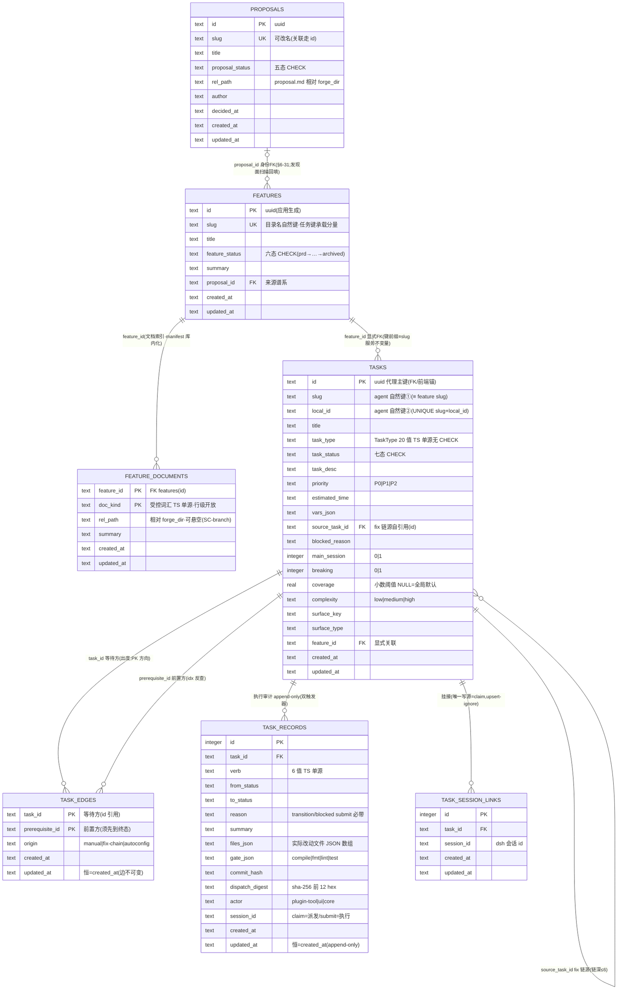

# ER Diagram: dsh-forge M2 —— 每工作区任务库(forge.db)

> 引擎 = SQLite(better-sqlite3 13.0.3,core 进程内多句柄)。库部署于 `{tasksHome}/{flatten}@{hash8}/forge.db`(tasksHome = env `DSH_FORGE_TASKS_HOME` > `{userData}/forge-workspaces`);**惰性首开**(每库每进程首次触达 open+migrate+断言)。中央 state.db(projects/knowledge 双域)**零改动**——本图全部为 [NEW],且全部位于每工作区库,与中央库无任何 FK/查询耦合。
> 输入底稿 = [db-schema.md 预设计定稿](../../../proposals/dsh-forge-m2-pipeline/db-schema.md)(八表完整形态);本图/schema.sql = **M2 落地形态**,差异见文末差异清单。

## Entity Relationships

(schema_meta 基建表:`version INTEGER PK + applied_at`,豁免 updated_at——版本行一次性写入,与 P1 state.db 同构;**app_key_logs 基建表**:level/scope(tasks|workspace)/data_json——工作区关键日志随库,中央 state.db 零改动。两基建表不占七域表计数。)

## Entity Details

七域表 + schema_meta 的列级细节(类型/约束/注释)以 [schema.sql](./schema.sql) 为唯一权威,此处不重复;语义裁决锚点:

| 表 | 关键裁决锚 |
|---|---|
| features | 六态 §6-22;manifest 库内化 §6-23;summary 保留 §6-22① |
| feature_documents | 行级开放 doc_kind §6-23;悬空容忍(SC-branch) |
| tasks | 七态 CHECK;type 无 CHECK(§5-7);coverage REAL(§6-16);**feature_id id 关联 + slug 列同步不变量(本设计修订,取代 §5-5 GENERATED 列)**;**id 代理主键 + slug/local_id 自然键(本设计修订 2026-10-06)**;task_file 砍除(本设计修订) |
| task_edges | 出度 PK 方向 §6-20;边持久不删 §6-5;复合 PK = 存储级去重;**同 feature 约束 DB CHECK → 服务不变量 + validateFeatureTasks(id 引用后边行无 slug 可比)** |
| task_records | append-only 双触发器 §6-24①;actor 三值 §6-24②;**files_json 结构化(修订 C5:文件从 summary 升格为列)**;session_id 双语义 §6-24④ |
| proposals | 五态 §6-30;身份与名称分离 §6-31;**rel_path 命名统一(本设计修订)** |
| task_session_links | 不分类型 §6-17;UNIQUE 幂等;唯一写源 = claim |

## Index Design

| Table | Index | Columns | 说明 |
|---|---|---|---|
| tasks | idx_tasks_feature_status | (feature_id, task_status) | 列表 + 七态 chips + 写时增量断言 / validateFeatureTasks 逐 feature 校验 |
| tasks | idx_tasks_source | (source_task_id) | fix 链溯源 / 链深计数 |
| task_edges | idx_edges_prerequisite | (prerequisite_id) | 恢复钩子反查 / 后继派生(物理加速 §6-19) |
| task_records | idx_records_task | (task_id, id) | 时间线按序读 |
| task_records | idx_records_session | (session_id) | 执行会话挂接反查(SC6③) |
| task_session_links | idx_tsl_session | (session_id) | 会话头 pill 反查 |

**EQP 机械断言**:claim 守卫 / 恢复钩子反查 / 就绪集三查询的 EXPLAIN QUERY PLAN 必须命中反向索引或 PK 前缀(防全表扫描回归,L3)。

## Relationships

| From | To | Cardinality | Business Meaning |
|---|---|---|---|
| proposals | features | 1:N(惯例留空间) | 来源谱系;registerFeature 单步写 proposal_id;发现面按 slug 回填 |
| features | feature_documents | 1:N | 文档索引(manifest Documents 表库内化) |
| features | tasks | 1:N | 任务归属;tasks.slug ≡ feature slug(服务不变量 + validateFeatureTasks 断言) |
| tasks | task_edges | 1:N ×2 | 等待方出边 / 前置方入边(同一边集两个读取方向) |
| tasks | task_records | 1:N | 每动词一行 append-only 审计 |
| tasks | task_session_links | 1:N | 挂接历史累积(跨会话重试自然留痕) |
| tasks | tasks | 1:N | fix 链源(自引用;`--source-task-id` 谱系) |

## Change Impact Analysis

中央 state.db:**零改动**(projects/knowledge 表、索引、迁移序列均不动;仅 project-service 增可选协作者钩子 `onRegistered?`,契约面 5 法不变)。

## 与八表定稿(db-schema.md)的差异清单(M2 落地形态)

| # | 差异 | 依据 |
|---|---|---|
| 1 | 无 `feature_records` 表 | 范围对齐后移 M3(§6-35④);M2 feature 域转移无审计 = 已记账缺口 |
| 2 | task_records 无 `branch` / `worktree` 两列 | 范围对齐后移 M3(§6-38;db-schema §2.4 显式警告:照抄八表形态即提前携带 M3 列) |
| 3 | tasks 无 `task_file` 列 | 本设计裁决(2026-10-06):M2 无写入者(输入口已裁),append-only 表加列 = M3 软迁移可随时回补 |
| 4 | 列名保留字清剿:`key→task_key`、`type→task_type`、`status→task_status/feature_status/proposal_status`、`description→task_desc` | 用户裁决(2026-10-06):不使用数据库保留关键字 |
| 5 | feature_documents / task_edges / task_records / task_session_links 补齐 `updated_at`(append-only/不可变表恒 = created_at) | 用户裁决:所有表齐备 created_at + updated_at(schema_meta 基建表豁免) |
| 6 | `tasks.feature_slug`(GENERATED)→ `tasks.feature_id` 显式 FK;feature_documents.feature_slug → feature_id | 用户裁决:id 关联;一致性守卫移交服务不变量(写时增量)+ validateFeatureTasks 逐 feature 校验(比 GENERATED 更强:连 features 表漂移亦可抓) |
| 7 | `proposals.doc_path` → `rel_path` | 用户裁决:与 feature_documents 命名统一 |
| 8 | task_records 增 `files_json` | 用户裁决(修订 C5):实际改动文件从 summary 自由文本升格为结构化列 |
| 9 | `tasks.task_key`(复合自然键 PK)拆分为 **`id`(uuid 代理主键 PK)+ `slug` + `local_id`(UNIQUE 自然键)**;task_records/task_edges/task_session_links 改 **id 引用**(列名 task_id/prerequisite_id);同 feature 边 CHECK 退役(移交服务不变量 + validateFeatureTasks) | 用户裁决(2026-10-06):slug 修改零级联——FK 与前端锚 id,降修改成本防不稳定;agent 以 slug/localId 识别 |
