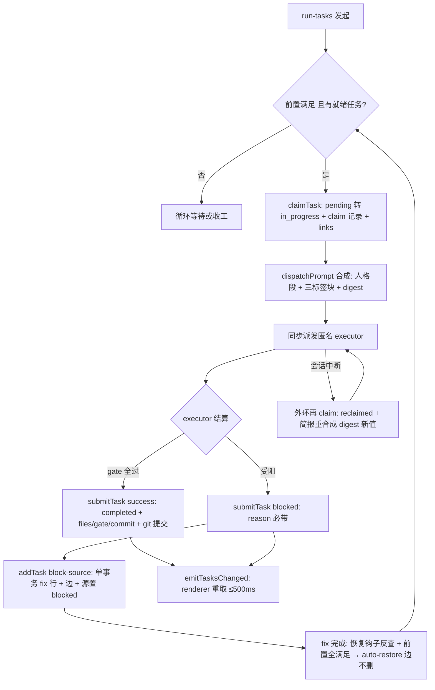
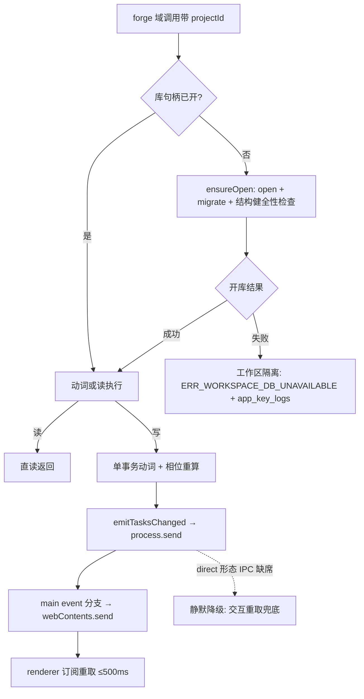
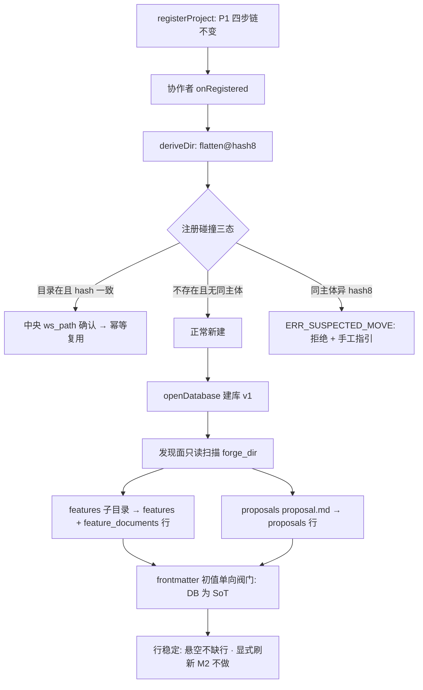
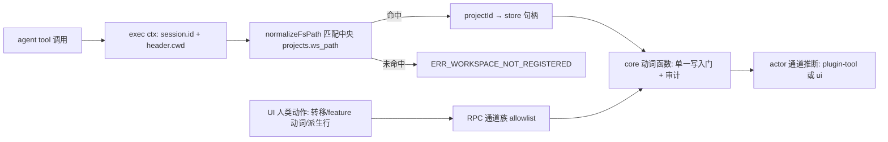

# Technical Design: dsh-forge M2 —— forge 管线接管(状态层转正 + 插件执行链 + 任务/文档视图)

> 输入:PRD Spec(8 SC)+ user-stories(7 stories)+ ui-design v17(三视图原型 135 断言)+ db-schema 预设计定稿(39 裁决,§7 开口全闭)+ S8/S9①/S10 spike 结论 + P1 tech-design 先例 + 两轮代码侦察(core/web 缝)。**本设计四项用户裁决**:①刷新 = 写推送事件;②多库 = 惰性首开 + 失败隔离;③服务面 = 按领域划分(forgeOverview 聚合服务废除);④发现面显式刷新 M2 不做。schema 评审门定稿(保留字清剿 / feature_id id 关联 / rel_path 统一 / files_json / task_file 砍除 / **任务身份双轨:id 代理主键 + slug/local_id 自然键**)。

## Overview

M2 在 P1 五工件上扩为**六工件**:core 的 forge 域新增**任务子域族**(每工作区 forge.db 多句柄 + 七表 schema + 动词 API + dispatchPrompt 合成 + 相位推导机 + 发现面扫描),对外新供**四域服务**(forgeTasks / forgeFeatures / forgeProposals / forgeDocs——按领域划分、读写一体,不随前端视图增删);新包 **`packages/plugin-forge`**(tool 半身六动词 + `forge:pipeline` 系统提示段;skills 半身 run-tasks/fix 链/submit-task/git-commit/run-tests,经 `customSkillDirs` 挂载);web 净新增右栏两 tab(概览 `dswf-overview` + 文档 `dswf-doc`,官方 `sidebarRightTabs` 两段注册)+ 任务抽屉 + 会话头挂接 pill(`conversation.session.header.actions`)+ 注册表单派生行收口(core 派生 + RPC 下发)。

**MVC 落位**(用户裁决 2026-10-06):Model = core 四域服务(域内聚,API 独立于前端保持稳定);Controller = 两个薄面(RPC 通道族 = 人类面,tool 面 = agent 面,只做参数映射与路由);View = apps/web。跨域聚合(如 ov-head)由前端组合多域读完成,不设按视图命名的聚合服务。

三条关键机制(可行性均经代码侦察验证):

1. **写推送事件链**:core 写动词闭包尾部 → `process.send`(child 形态 IPC,`stdio:'ipc'` 实证在场;缺席时静默降级)→ run.ts 消息分流新增 event 分支 → `DshHostHandle.onEvent` → main `webContents.send('forge:events/tasks-changed')` → renderer 订阅重取。桥协议(`ChildToMainMessage`)为产品自有代码,扩一个消息变体零上游改动。「即时」判据 = **写入返回后单次重取即见新值**(直读保证,e2e 断言)+ 事件延迟上限 500ms。
2. **惰性首开多句柄**(§7-12 裁决):`ForgeWorkspaceStore` 按工作区 lazily open + migrate + **开库结构健全性检查**(版本门 + `PRAGMA foreign_key_check` + 表在场——恒轻量;2026-10-06 二次修订:不再开库全库派生复检,大仓不扫);失败 → 该工作区标不可用(`ERR_WORKSPACE_DB_UNAVAILABLE` + app_key_logs scope=tasks + 概览错误态),应用与其余库照常。**三层校验职责**:写事务内增量断言(每次写动词,受影响 feature)承重漂移防护;validateFeatureTasks **一次只校验一个 feature** 的任务子图(调用方对新入库 feature 逐个送校);开库检查 = 结构健全性。
3. **cwd 路由**:tool 执行点 `exec.agent.session.header.cwd`(S8 实证子会话无盲区)→ `normalizeFsPath` 匹配中央 projects.ws_path → 命中工作区 → store 句柄。UI RPC 侧显式带 projectId。**挂接 pill 查询天然单库**:sessionId → sessions 账本 → workspaceId → workspaces 账本 → path → 单工作区(会话 cwd 稳定,链接只可能诞生于该库,无需全库扫描)。

## Architecture

### Layer Placement

| 工件(目录) | 层 | M2 增量职责 |
|---|---|---|
| `apps/host` | 宿主进程 | 桥扩四服务名 + ready 位 + 四白名单(AssertNever);`BridgeEventMessage` event 分支 → `webContents.send`;ipc 扩 `forge:tasks|features|proposals|docs/*` 注册;`resolveTasksHome()`(env `DSH_FORGE_TASKS_HOME` > `{userData}/forge-workspaces`)注入 core config;profile 模板 + customSkillDirs 行 + runtime-packages 闭包增 `@dsh-forge/plugin-forge`;`forge:docs/openExternal` 主侧执行(先经桥校验路径在册) |
| `apps/web` | 前端(View) | `views/overview/`(tab 体 + 三子 tab + 三视图 + 抽屉 + 转移对话框)+ `views/docs/`(文档 tab + **mermaid 分段渲染**——md 段经 MarkdownDoc,mermaid 段经 MermaidDiagram 懒加载;erDiagram = 验收锚,失败回退占位卡)+ `SessionTaskPills`(header.actions 槽)+ 派生行 RPC 化;rpc client 扩四族;preload 扩事件订阅面 |
| `packages/core` | 数据内核(Model) | forge 域新增子域族(见下表)——中央 state.db schema 零改动;provide ×4 |
| `packages/plugin-forge`(新) | dsh 插件 | tool 半身(agent 面 Controller)+ forge:pipeline 系统提示段 + skills 半身 |
| `packages/contracts` | 共享 | 新 DTO + 通道常量(tasks/features/proposals/docs 四族 + 事件)+ 15 错误码 + TaskType/状态标签中英常量 + 桥事件信封 + XML 标签集常量 |
| `packages/knowledge` / `packages/path-key` | — | 零改动 |

**core/src/forge 子模块扩展**(依赖铁律沿 P1,新增单向边):

| 子模块 | 定位 | 职责 |
|---|---|---|
| `forge/workspace/` | 业务(共享基建) | ForgeWorkspaceStore(惰性开库/迁移/隔离态/存量库缺席补建)、workspace schema 迁移序列(独立版本线;**openDatabase 参数化传入**——中央 MIGRATIONS 硬编码 import 勿照抄)、deriveDir(flatten@hash8,node:crypto)、注册碰撞三态、事件发射器、project-service 协作者装配;句柄生命周期 = 进程内常驻,**store.dispose 接入插件 disposer**(app 退出统一 close);**关键日志写工作区库 app_key_logs**(scope: tasks/workspace——中央 ck_akl_scope 四值不含,写中央必炸 CHECK) |
| `forge/tasks/` | 业务 | 动词(add/claim/submit/transition/query)+ 状态机(**transitionTargets 计算**)+ 相位推导机 + validateFeatureTasks + prompt/ + 读面(list/stats/graph/detail/sessionLinks) |
| `forge/features/` | 业务 | registerFeature/transitionFeature/upsertFeatureDoc(登记即推进)+ listFeatures |
| `forge/proposals/` | 业务 | createProposal/transitionProposal + listProposals |
| `forge/docs/` | 业务 | readDoc(路径守卫 + 悬空态) |

import 边:四域互禁 import 彼此;均可 → `forge/workspace/`(共享句柄与事件);`forge/tasks → forge/project-service` 单向允许(路由查中央表),反向禁止;knowledge 域互禁沿 P1。(布局自由度注记:features/proposals/docs 三小域可合并单目录承载——服务面四分是契约,文件布局非契约。)

### Component Diagram

```
+---------------------------------------------------------- Electron main (apps/host) ----+
|  boot: spawn child(stdio ipc) <— event:forge:events/tasks-changed — run.ts 新分支 —→ webContents.send |
|  ipc: forge:tasks/* · forge:features/* · forge:proposals/* · forge:docs/*(+openExternal 主侧)        |
+--------|-------------------------------------------------------------|-----------------+
         | 桥代理(六服务白名单)                                     | forge:events/tasks-changed
+--------v--------------- dsh host child (Cordis) -------------------+  |
|  [产品] core                                                          |  |
|   · forge/project-service ──onRegistered 协作者──→ forge/workspace  |  |
|     (中央 state.db schema 零改动)       · 惰性开库+迁移+开库断言              |  |
|                                         · deriveDir + 注册碰撞三态    |  |
|   · forge/tasks(动词+状态机+相位+prompt+validate)──事件→ process.send ┼──┘
|   · forge/features · forge/proposals · forge/docs(读)                 |
|  [产品] plugin-forge: inject forgeTasks+forgeProposals               |
|   · tool ×6 + systemPrompt('forge:pipeline') · skills/(customSkillDirs)|
+---------------------------------------------------------------------+
    +-------------------------- renderer (apps/web) ----------------------+
    |  右栏: dswf-overview(guide entry 最前,replaceTab) + dswf-doc(multiple)|
    |  概览: ov-head + 三子tab(提案|feature|任务) + 三视图 + 抽屉 + 转移     |
    |  文档: 路径栏 + MarkdownDoc + mermaid 图渲染(erDiagram 锚);会话头 actions 槽 pill |
    +-------------------------------------------------------------------+
```

### Dependencies

- **上游 dsh npm 零新增**;产品依赖新增 **mermaid**(精确 pin + lockfile——**懒加载**:仅文档 tab 含 mermaid 块时动态 import,零块零加载;`securityLevel='strict'` 默认 sanitize;erDiagram = 验收锚,全图型同库渲染,渲染失败/非法源回退占位卡——2026-10-06 用户裁决)。其余:better-sqlite3 13.0.3 复用(prebuilds 实证);sha-256 = `node:crypto`(core 侧;path-key 保持浏览器安全零依赖);SVG/DAG 自绘;`dsh-subagent-in-process-driver@0.2.0-rc.2` 已在 runtime-packages 闭包。
- **git = 可选环境依赖**(用户裁决):`execFile('git')` ENOENT 与失败同路静默回退记录语;submit 质量门不含 git;executor 遇 git 缺席走 `submitTask result=blocked`(fix 链承接);不影响任何 SC 判据(断言路径均有记录回退形态)。
- 新工件 `@dsh-forge/plugin-forge`(deps 仅 contracts + path-key,零 cordis 运行时依赖——knowledge 同型)。

### 提示词与技能资产(plugin-forge)

```
packages/plugin-forge/
├─ src/tools/        六 tool 定义(手写 JSON Schema + 防御收窄,knowledge 形制)
├─ src/prompt/       forge:pipeline 系统提示段渲染(老 forge hook 注入文本平移)
└─ skills/           run-tasks / submit-task / git-commit / run-tests(+fix 链协议内聚 run-tasks)
                     物理挂载 = profile customSkillDirs(dsh-skill-filesystem 行)
```

C9 落地:0.2.0-rc.2 无 per-tool-use hook 面(仅 systemPrompt.section + tools.register)→ git-commit 纪律 = skill 文本承载(降级标注);升级窗口期重估机械拦截。

## Interfaces

> 完整签名批二定稿;此处列面清单与关键形状。路由约定:一切方法显式带 `projectId`(中央 projects.id)——tool 侧由 cwd 解析后传入,UI 侧自带。**actor 由通道推断**(tool = 'plugin-tool' + exec ctx sessionId;RPC = 'ui'),输入面不收(防越权标注)。

### Interface 1: `ctx.forgeTasks`(任务域)

```ts
/** 任务身份双轨(2026-10-06 用户裁决——slug 改名零级联):
 *  taskId = tasks.id(uuid 代理主键)——FK/前端/RPC 引用锚,恒稳定
 *  TaskRef = { slug; localId } —— agent 自然键('slug/localId' 识别;UNIQUE(slug, local_id) 查捞) */
addTask(input: { projectId; featureSlug; title; type: TaskType; taskDesc?; priority?; estimatedTime?;
  vars?; dependsOn?: string[]; sourceTask?: TaskRef; blockSource?: boolean; mainSession?; breaking?;
  coverage?; complexity?; surfaceKey?; surfaceType? }): Promise<{ taskId: string; slug: string; localId: string; reused: boolean }>
claimTask(input: { projectId; taskRef?: TaskRef; featureSlug?; sessionId: string }): Promise<
  { task: TaskSnapshot; dispatchPrompt: string; digest: string; reclaimed: boolean }>
  // 无就绪任务 → { task: null; dispatchPrompt: ''; digest: ''; reclaimed: false }——Z1 出口信号(run-tasks 循环等待/收工判据)
submitTask(input: { projectId; taskRef: TaskRef; result: 'success'|'blocked'; reason?; summary?;
  files?: string[]; gate?: { compile; fmt; lint; test; coverage? }; commitHash?; sessionId: string }): Promise<
  { taskId: string; status: TaskStatus; restored: TaskRef[] }>
transitionTask(input: { projectId; taskId: string; toStatus: TaskStatus; reason: string }): Promise<TaskSnapshot>
  // 人类通道(UI/RPC 恒 taskId);提前校验:toStatus ∈ transitionTargets(current,'human') 否则 ERR_INVALID_TRANSITION
  // →completed/skipped 同挂恢复钩子(C3:与 submitTask 钩子同族)
queryTask(input: { projectId; taskRef: TaskRef; include?: {prerequisites?;waitingOnMe?;records?;sessions?} }): Promise<QueryTaskResult>
validateFeatureTasks(input: { projectId: string; featureSlug: string }): Promise<ValidateReport>
  // 一次只校验一个 feature 的任务子图(2026-10-06 用户裁决:validateStore 更名 + 单 feature 语义)
  //   该 feature 全部 tasks/edges/records/links + 相位派生不变量——五类检查限定此子图,不全库复检
  // 发现面吸收/诊断入口对新入库 feature 逐个送校(增量集与「批量」语义移交流程层,动词面恒单 feature)
  // ValidateReport = { violations: Violation[]; checked: { featureSlug: string; tasks: number } }
listTasks(q: { projectId; featureSlug?; statusFilter?; search?; sort?: 'active'|'created' }): Promise<TaskCard[]>
  // search = 服务端 core 过滤(中英双语,标签常量匹配);IME 安全 = 前端仅更新内容区不重建搜索行
  // TaskCard 副行承重:实际耗时[completed,core 水化]/前置摘要/挂接计数/fix 源标
taskStats(q: { projectId; featureSlug? }): Promise<{ total: number; byStatus: Record<TaskStatus, number> }>
taskGraph(q: { projectId; featureSlug: string }): Promise<{ tasks: TaskCard[]; edges: { taskId; prerequisiteId; origin }[] }>
taskDetail(q: { projectId; taskId: string }): Promise<TaskDetail>
  // 含 allowedTransitions: TaskStatus[](人类面计算——所见即所得)
  // 实际改动范围 = files_json → commit 只读 git 查询(execFile 恒数组参;白名单子命令 = ['show','diff-tree'];timeout 2s;ENOENT/失败回退记录语)
  // 实际耗时 = core 水化(首 claim → 末 submit 时差;仅 completed)——列表副行/⏱/chip 同源
  // 参考文档 refs 水化:vars/description 声明锚点 → feature_documents ∪ proposals 行 docRel 匹配(命中 = 链接态,未命中 = 置灰)
sessionLinks(q: { projectId; sessionId }): Promise<SessionTaskLinkCard[]>  // links ∪ records.session_id 双源分型(卡片含 taskId)
```

**身份解析约定**:agent 面(tool)输入 = `slug` + `local_id` 两参(对应 TaskRef,显式免拼接歧义);服务内 UNIQUE 查捞 → taskId 后走 id 路径;UI/RPC 面 = taskId。dispatchPrompt 的 TASK_ID 与界面展示 = `slug/localId`(自然键呈现)。**TaskSnapshot/TaskCard 恒含 { taskId, slug, localId }**(前端以 taskId 为 key,以 slug/localId 为显示)。

**TaskCard / TaskDetail 承重字段**(读面最小契约,breakdown 锚):

| DTO | 字段 |
|---|---|
| TaskCard | taskId/slug/localId/title/taskType(+中英标签)/taskStatus/priority?/estimatedTime?/**actualDuration?**(completed,core 水化)/前置摘要(自然键+状态)/挂接计数/fix 源标 |
| TaskDetail | TaskCard 全量 + taskDesc/vars/验收与覆盖率负载/records 时间线(verb/from→to/reason/summary/gate/commit/digest)/prerequisites/waitingOnMe/sessions 双源分型/actualFiles(files_json→commit 查找)/allowedTransitions/refs 水化 |

eval 类型的评估结果:M2 无技能写入——vars/summary 自由文本承载,抽屉按类型条件区呈空态注记(M3 eval 技能接管时结构化)。

**动词内聚不变量**(单事务全成全败):addTask = tasks 行(id 生成 + localId 混合分配[数值顺延/fix-N·disc-N,§6-35⑦] + slug 归属校验[featureSlug 必须命中 feature 且与 slug 列一致])→edges 行→records 行(+block-source 同置源 blocked + `auto-block` 行 + 链深 ≤6 + 增量环校验[新节点无 dependsOn → O(1);组合 → 可达性 DFS 回报环路径] + 相位重算 + 两级去重[任务级 fix 复用 / 边级 PK 幂等]);submitTask = 转移 + record(files/gate/commit) + 恢复钩子反查(`idx_edges_prerequisite`,前置**全**满足才 auto-restore,边不删) + 相位重算;claimTask = 守卫(依赖全 ∈ {completed,skipped}) + 就绪选择(**分支延续优先 → priority → 创建序**,§6-35⑧) + links upsert-ignore + in_progress 幂等重入(reclaimed=true,简报重合成 digest 新值)。**并发与重入域**:就绪选择仅扫 pending 池;in_progress 幂等重入仅限显式 taskRef 或 links 已含本会话——无 taskRef 的盲选**不领** in_progress(双 dispatcher 并发不双派发)。**写后事件**:**四域一切写动词**(tasks 全部动词 + registerFeature/transitionFeature/upsertFeatureDoc + createProposal/transitionProposal)闭包尾部 `emitTasksChanged(projectId)`——同通道同载荷 `{projectId}`,概览三子 tab 统一刷新(proposals 为 tool 写,无事件则提案子 tab 永不刷新——覆盖面裁决)。

### Interface 2: `ctx.forgeFeatures`(feature 域)

```ts
registerFeature(input: { projectId; slug; title; summary?; proposalId? }): Promise<FeatureRow>
transitionFeature(input: { projectId; featureId; toStatus: FeatureStatus; reason: string }): Promise<FeatureRow>
upsertFeatureDoc(input: { projectId; featureSlug; docKind: DocKind; relPath; summary? }): Promise<FeatureDocumentRow>
  // 单事务内聚相位推进(单调只进);slug→id 服务内解析
listFeatures(q: { projectId; search?; sort?: 'active'|'created' }): Promise<FeatureCard[]>  // 含七态分布/文档统计/谱系
```

### Interface 3: `ctx.forgeProposals`(提案域)

```ts
createProposal(input: { projectId; slug; title; relPath?; status? }): Promise<ProposalRow>
transitionProposal(input: { projectId; proposalId; toStatus: ProposalStatus }): Promise<ProposalRow>  // 裁决写 decided_at
listProposals(q: { projectId; search?; sort?: 'active'|'created' }): Promise<ProposalCard[]>
```

### Interface 4: `ctx.forgeDocs`(工作区文档读域)

```ts
read(q: { projectId; docRel: string }): Promise<{ title?; summary?; content; canonicalPath; dangling: boolean }>
// 路径守卫:resolve 后必须 startsWith(canonical(forge_dir)) —— 越界 ERR_DOC_PATH_INVALID
```

### Interface 5: `ctx.forgeProjects` 扩展(项目域,P1 五法不动)

```ts
deriveTaskStoreDir(q: { workspaceDir: string }): Promise<{ dir: string }>   // {tasksHome}/{flatten}@{hash8} 单源
// 碰撞三态 = 本动词表单预检位(纯读,注册前)+ 注册闭包复检——ERR_SUSPECTED_MOVE 在中央行落库之前抛出(拒绝注册零副作用)
// 内部协作者:project-service deps 增 onRegistered?(project) —— 触发面 = 仅新建径(attachExisting 幂等径只做「库在场确认,缺席补建+扫描」——与存量首开同构);建库/扫描失败 = fail-soft 记账隔离态不抛(与开库失败同语义);ProjectService 契约面零改动
// 注册碰撞三态(§6-33/34):正常新建 / 幂等复用(中央 ws_path 精确确认)/ 疑似移动拒绝(ERR_SUSPECTED_MOVE + 手工指引)
```

### Interface 6: 桥扩展(产品自有协议,零上游改动)

```ts
type BridgeServiceName = 'forgeProjects'|'forgeKnowledge'|'forgeTasks'|'forgeFeatures'|'forgeProposals'|'forgeDocs'
// 六白名单常量(satisfies + AssertNever 完备性);ready.services 在场位 ×4
interface BridgeEventMessage {
  readonly type: 'event'; readonly channel: 'forge:events/tasks-changed'
  readonly payload: { readonly projectId: string }
}
// core 侧:process.send 防护发送(sendGuarded 同型;direct 形态缺席静默);
// run.ts child.on('message') 增 event 分支 → DshHostHandle.onEvent(cb) → main 广播
```

### Interface 7: Web RPC 面(三处一体:contracts → web/rpc → host ipc)

| 通道族 | 通道 | 面 |
|---|---|---|
| `forge:tasks/*` | transition · query · validateFeatureTasks · list · stats · graph · detail · sessionLinks | RPC(人类+读) |
| `forge:features/*` | register · transition · upsertDoc · list | RPC(UI 直调) |
| `forge:proposals/*` | list | RPC(写动词 = tool 专属) |
| `forge:docs/*` | read · openExternal | RPC(后者 main 侧执行) |
| `forge:projects/deriveTaskStoreDir` | derive | RPC(扩族) |
| `forge:events/tasks-changed` | 主→渲染单向 | preload 订阅面 `onForgeTasksChanged(cb): () => void`(allowlist 守卫) |

add/claim/submit/createProposal/transitionProposal **不上 RPC**(agent tool 专属——SC7 断言面)。

### Interface 8: plugin-forge tool 面 + 系统提示段

六 tool(名 = 动词透传 §6-25;params snake_case——任务定位参数 = `slug` + `local_id` 两显式参(对应 TaskRef;transitionTask 不在 tool 面);exec ctx 解析 cwd→projectId 与 sessionId;cwd 无匹配 → `ERR_WORKSPACE_NOT_REGISTERED`)。**cwd→projectId 数据缝**:复用 knowledge bindingsFile 机制(host 维护 `{wsPath,projectId}` JSON,boot overlay 注入插件行 config,注册后增量刷新)——plugin-forge 仍零 core 实现级 import。:`addTask / claimTask / submitTask / queryTask / createProposal / transitionProposal`。**transitionTask / transitionFeature 不注册**(SC7 代码审计)。`ctx.systemPrompt.section({ name:'forge:pipeline', order:510, text })`。

### Interface 9: dispatchPrompt 构成 + XML 标签总表 + §7-6 映射

**dispatchPrompt 组成序**:人格段(task-executor,**无标签**)→ `<constraints>` → `<task-context>` → `<type-policy>`。digest = sha-256(全文,含人格段与标签)前 12 hex。

| # | 标签 | 载体 | 层级 | 内容 | 初期形态 |
|---|---|---|---|---|---|
| 1 | `<forge-pipeline>` | 系统提示段 | 最外层·唯一 | forge 管线系统提示(老 forge hook 注入文本平移:状态层说明/执行协议/受限面声明) | 单层不细分,内文纯文本;**不含 tool 说明**(dsh tool 注册面自带) |
| 2 | `<constraints>` | dispatchPrompt | 块级 | 约束块(单一 TS 源:失败分诊/质量门序列/提交纪律/不越权) | 内文纯文本 |
| 3 | `<task-context>` | dispatchPrompt | 块级 | 动态信息块(TASK_ID/FILE/TYPE/CATEGORY/BLOCKERS 快照/PHASE_SUMMARY/COVERAGE/PRIORITY/标记) | 键值行(`TASK_ID: …`),不加键级标签 |
| 4 | `<type-policy>` | dispatchPrompt | 块级 | 类型策略块(20 类型模板函数族) | 内文 = 模板文本 |

标签集封闭于四枚——新增 = 契约面变更(G1 pin 锚定);每类型快照测试断言三标签在场 + 块序 + 人格段在场。

**ValidTypes ↔ TaskType 映射表(§7-6 定稿;TaskType = 20 值 = 21 模板 − fix-record-missed)**:

| 老 ValidTypes | TaskType | | 老 ValidTypes | TaskType |
|---|---|---|---|---|
| implementation(默认) | `coding-feature` | | test.run | `test-run` |
| implementation + 细分 | `coding-enhancement` / `coding-cleanup` / `coding-refactor` / `code-quality-simplify` | | test.gen-* | `test-gen-contracts` / `-journeys` / `-scripts` |
| fix | `coding-fix` | | validation-code / -ux | 直名 |
| gate | `gate` | | eval-contract / -journey | 直名(词汇+模板保留;执行技能 = M3) |
| doc-generation.doc | `doc` | | fix-record-missed | **不入词汇**(降级 run-tasks 内置静态文本) |
| doc-generation.{consolidate,drift,review,summary} | `doc-consolidate` / `doc-drift` / `doc-review` / `doc-summary` | | | |

localId 混合分配(§6-35⑦):常规数值顺延 + 动态 `fix-N` / `disc-N` 前缀。

### Interface 10: 状态机 transitionTargets(提前校验 + 所见即所得)

```ts
transitionTargets(current: TaskStatus, face: 'human' | 'agent'): TaskStatus[]
// human = 七态 − 当前态(from≠to 任意通道,菜单全列机械排除自身)
// agent = 转移矩阵推导(claim/submit 拥有的边——SC7 单测锚)
```

`taskDetail.allowedTransitions`(human 面)驱动转移对话框选项集;`transitionTask` 服务端先验 `toStatus ∈ transitionTargets(current,'human')`——UI 菜单与服务端同一纯函数,零漂移。

## Data Models

> Full database design in separate files.

**ER Diagram**: [design/er-diagram.md](./er-diagram.md)
**SQL Schema**: [design/schema.sql](./schema.sql)

### Field Quick Reference

| Model | Key Fields | Notes |
|---|---|---|
| features | id(uuid PK), slug(UK), feature_status(六态 CHECK), proposal_id(FK) | 相位 = 推导机维护快照 + 不变量断言 |
| feature_documents | (feature_id, doc_kind) PK, rel_path(可悬空) | doc_kind TS 单源行级开放 |
| tasks | id(uuid 代理主键), slug+local_id(UNIQUE 自然键), task_type(20 值), task_status(七态 CHECK), feature_id(FK), source_task_id, coverage(REAL) | agent 用 slug/localId 识别,FK/前端用 id;slug 列 ≡ feature slug(不变量 + validateFeatureTasks) |
| task_edges | (task_id, prerequisite_id) PK, origin(三值) | 边持久不删;满足 = 读时派生;同 feature 约束 = 服务不变量 |
| task_records | verb(6 值 TS 单源), files_json, gate_json, dispatch_digest, actor, session_id | append-only 双触发器;M3 预留 branch/worktree |
| proposals | id(uuid PK), slug(UK), proposal_status(五态), rel_path, decided_at | 身份与名称分离 |
| task_session_links | UNIQUE(task_id, session_id) | 唯一写源 = claim(upsert-ignore) |
| schema_meta | version, applied_at | 独立版本线 FORGE_DB_SCHEMA_VERSION=1;基建表豁免 updated_at |

**与 db-schema 八表定稿的差异清单**(8 项:M3 两列/feature_records 后移、task_file 砍除、保留字清剿、全表 updated_at、feature_id id 关联、rel_path 统一、files_json)→ 详见 er-diagram.md 文末。

## Error Handling

### Error Types & Codes(contracts `errors.ts` 扩池;桥过桥保真自动覆盖)

| Error Code | Name | Description | HTTP 等价 |
|---|---|---|---|
| ERR_TASK_NOT_FOUND | TaskNotFoundError | TaskRef(slug/local_id)未命中 | 404 |
| ERR_INVALID_TRANSITION | InvalidTransitionError | from 不匹配 / 目标 ∉ transitionTargets / agent 面矩阵非法格 | 409 |
| ERR_DEPENDENCIES_UNMET | DependenciesUnmetError | claim 守卫前置未终态(data 带未满足清单) | 409 |
| ERR_CYCLE_DETECTED | CycleDetectedError | addTask 环(data 带完整环路径) | 409 |
| ERR_CHAIN_DEPTH_EXCEEDED | ChainDepthExceededError | fix 链 >6 | 409 |
| ERR_REASON_REQUIRED | ReasonRequiredError | transition / blocked submit 空因 | 400 |
| ERR_SUMMARY_REQUIRED | SummaryRequiredError | success submit 空摘要 | 400 |
| ERR_TASK_EXISTS | TaskExistsError | UNIQUE(slug, local_id) 冲突(manual 边重复) | 409 |
| ERR_FEATURE_NOT_FOUND | FeatureNotFoundError | featureSlug 解析未命中 | 404 |
| ERR_FEATURE_EXISTS | FeatureExistsError | registerFeature slug UNIQUE 冲突 | 409 |
| ERR_PROPOSAL_NOT_FOUND | ProposalNotFoundError | proposalId 未命中 | 404 |
| ERR_WORKSPACE_NOT_REGISTERED | WorkspaceNotRegisteredError | tool 面 cwd 无匹配项目 | 400 |
| ERR_WORKSPACE_DB_UNAVAILABLE | WorkspaceDbUnavailableError | 惰性开库/迁移失败(工作区隔离态) | 503 |
| ERR_SUSPECTED_MOVE | SuspectedMoveError | 注册碰撞同主体异 hash8(data 带手工指引) | 409 |
| ERR_DOC_PATH_INVALID | DocPathInvalidError | readDoc 路径越界 | 400 |

### Propagation Strategy

动词服务内校验先于写、单事务全成全败;typed error → RPC 带内信封(`RpcOk/RpcErr`)→ UI 按 code 映射(`rpcUiState` 扩全部新码:疑似移动 → 错误条+指引留场;库不可用 → 工作区隔离态;**未映射码 → 通用错误条兜底**——永无裸 code 泄漏);feature/proposal 非法转移复用 `ERR_INVALID_TRANSITION`(from≠to 校验同源);开库/迁移失败**永不抛断用户流程** → app_key_logs(scope: tasks)+ 概览错误态;git 只读查询失败/ENOENT 静默回退记录语;dsh 面异常原样透传。

## Cross-Layer Data Map

| Field Name | Storage Layer | Backend Model | API/DTO | Frontend Type | Validation Rule |
|---|---|---|---|---|---|
| task_id | TEXT PK(uuid) | taskId | taskId | string | 代理主键——FK/前端/RPC 引用锚(slug 改名零级联) |
| slug / local_id | TEXT UNIQUE(slug, local_id) | slug/localId(TaskRef) | TaskRef | string ×2 | agent 自然键;slug 列 ≡ feature slug(服务不变量 + validateFeatureTasks) |
| task_status | TEXT CHECK(7) | taskStatus | TaskStatus | union + 中文标签 map | 七值封闭;标签 contracts 常量(搜索中英共用) |
| task_type | TEXT | taskType | TaskType(20) | TS 单源 + 中英标签 | exhaustive 路由 |
| feature_id | TEXT FK | featureId | featureId | string(uuid) | 键前缀 ≡ slug(不变量 + validateFeatureTasks) |
| session_id | TEXT | sessionId | sessionId | string | 两形态混存(S8);相异判勿前缀判型 |
| files_json / gate_json | TEXT(JSON) | files: string[] / gate | 同构 | 同构 | 正斜杠路径 / 布尔四项+coverage 小数 |
| dispatch_digest | TEXT | digest | digest | string | sha-256 前 12 hex |
| rel_path | TEXT | relPath | relPath | string | 正斜杠;悬空容忍(dangling 态) |
| allowedTransitions | 计算列(无存储) | transitionTargets(human) | TaskStatus[] | 同 | 与服务端校验同源 |
| 派生目录 | 文件系统 | deriveTaskStoreDir→dir | dir | string | `{flatten}@{hash8}` core 单源 |

## 核心交互时序

> 下列流程图为 mermaid `flowchart`——在 M2 文档 tab 直接图渲染（v16/v17 自举）；并存的文本时序保留计时与载荷语义，两者互为对照。

### 交互一:派发链(SC-M2 门,含 fix 链与中断恢复)

```
dispatcher(run-tasks 会话)          core(forgeTasks)              executor(匿名 subagent)
──claimTask(cwd→projectId)──────────►│
  │ 守卫+就绪选择 → in_progress       │
  │ record(claim, digest) + links     │◄─(S8: exec.agent.session.id 可得)
  │ dispatchPrompt 合成(人格+三标签块) │
 ◄──task + dispatchPrompt + digest───│
──subagent(prompt=dispatchPrompt,阻塞)──────────────────────────►│
                                     │◄─submitTask(result/gate/files/commit, sessionId=子会话)
                                     │   落账 completed + git 提交;或 blocked(reason)→fix 链
                                     │   恢复钩子:前置全满足 → auto-restore(边不删)
                                     │──emitTasksChanged(projectId)──► process.send → main → renderer
                                     │   概览单次重取即见新值 + 事件 ≤500ms
(中断恢复:record 缺失 → 外环再 claim → reclaimed=true,简报重合成 digest 新值)
```

**流程图**：



### 交互二:惰性首开 + 事件推送(§7-11/12 裁决落地)

```
任意 forge:* 调用(projectId) ──► ForgeWorkspaceStore.ensureOpen
  未开 → openDatabase(deriveDir) → 版本门 → 迁移(单事务/版本) → 结构健全性检查(版本 + foreign_key_check + 表在场)
  库文件不存在 → 新建 v1 + 发现面扫描协作者(P1 存量工作区升级 M2 的首次触达补建——与交互三同构,「注册/首次打开」双触发的惰性面)
  失败 → ERR_WORKSPACE_DB_UNAVAILABLE + app_key_logs + 隔离态(其余库照常)
写动词事务提交后 → emitTasksChanged → process.send(缺席静默)
  → run.ts event 分支 → webContents.send('forge:events/tasks-changed')
  → renderer 订阅(概览/文档 tab/会话头 pill)→ 重取活跃查询(**web/rpc 共享订阅层 50ms 合并**——重取合并与表单防抖均归 web/rpc 模块)
校验三层:写时增量断言(受影响 feature)· validateFeatureTasks 逐 feature 五类 · 开库结构健全性
```

**流程图**：



### 交互三:注册 + 发现面(§6-36 / S9①)

```
registerProject(P1 四步链不变)
  → 协作者 onRegistered(仅新建径;幂等径 = 库在场确认,缺席补建):deriveDir + 碰撞复检(疑似移动 → ERR_SUSPECTED_MOVE 于中央行落库前拒绝)
  → openDatabase 建库(v1) → 发现面只读扫描:
     docs/features/<slug>/ → features 行(manifest frontmatter title/status 初值·单向阀门)
                            + feature_documents 行(目录约定全类文档索引)
     docs/proposals/<slug>/proposal.md → proposals 行(frontmatter 初值)
  → 行此后稳定(悬空 ≠ 缺行);显式刷新 = M2 不做(用户裁决)
  容错:逐目录隔离——非 UTF-8/frontmatter 畸形/非法目录名 → 跳过该文件记工作区 app_key_logs(warn),不阻断注册整体
```

**流程图**：



### 交互四:tool 面 cwd 路由与单一写入门(面分治)

两个 Controller（agent tool 面 / 人类 RPC 面）汇于同一 core 动词门——单一写入路径的准确表述（§6-27 面分治）：transitionTask 仅 RPC 可达、add/claim/submit 仅 tool 可达，actor 由通道推断（plugin-tool / ui）。



## Integration Specs(existing-page 五处)

| # | Target File | Insertion Point | Data Source |
|---|---|---|---|
| 1 | `apps/web/src/flows/add-project/RegisterForm.tsx` | 现派生行(L219-223)整行替换:值改 RPC 下发(form-model 自算废除);`ERR_SUSPECTED_MOVE` → 错误条 + 手工指引留场 | `forge:projects/deriveTaskStoreDir` |
| 2 | `apps/web/src/client-plugin/plugin.ts` + 新 `views/session/SessionTaskPills.tsx` | `conversation.session.header.actions` 槽新增注册(产品零登记现状;list 槽升序) | `forge:tasks/sessionLinks`(sessionId/workspace 解析自 sessions+workspaces 账本)+ 事件订阅 |
| 3 | 同 plugin.ts | `FORGE_CLIENT_INJECT += 'sidebarRightTabs'`;product-views 发布面(封闭接口)扩两成员 | — |
| 4 | 同 plugin.ts | `sidebarRightTabs.register`:`dswf-overview`(guide entry order 最前) + `dswf-doc`(multiple;address 去重)+ `sidebar.right.pane.tab` 两 keyed body(useTabInfo 注入) | 各自 RPC |
| 5 | `apps/web/src/workbench/ShellHost.tsx` 锚定 | 概览项目上下文复用 knowledge-anchor 裁决(主视图会话优先 retainedBy.mainView,唯一项目兜底) | sessions/workspaces 快照 |

## Testing Strategy

### Per-Layer Test Plan

| Layer | Test Type | Tool | What to Test | Coverage Target |
|---|---|---|---|---|
| core forge 子域族 | 单元 | vitest + 临时 SQLite(db.test.ts 形制) | 动词全路径(SC7 六类:from 匹配/依赖守卫/record·reason 必带/append-only 触发器 ABORT/环拒绝+路径回报/transition from≠to+transitionTargets);两级去重·链深·auto-restore·边持久;相位推导不变量(写事务内增量 + validateFeatureTasks 单 feature 子图);prompt 快照 ×20(人格段+标签+块序);发现面夹具(S9① 口径,吸收后逐 feature 送校);注册碰撞三态;EQP 三查询命中索引 | core 总 ≥80% |
| contracts / 桥 | 契约 pin(G1) | vitest contract | 四新服务白名单 AssertNever 完备 + ready 位;桥事件信封;通道 allowlist;**tool 面:六在场 / transitionTask·transitionFeature 缺席**(SC7 审计);schema.sql ↔ MIGRATIONS 逐条 pin;XML 标签集 pin | — |
| web | 组件 | vitest(renderToStaticMarkup,共置) | 概览三视图纯渲染;抽屉折叠/拖宽/块序纯函数;DAG 布局纯函数;mermaid 渲染与回退占位解析;派生行 RPC 相位;转移对话框(allowedTransitions 选项集 + 空因拒绝留场) | — |
| e2e | G2 | Playwright `_electron` + anchors 单源 | SC7(tool 写 → **单次重取见新值** + 事件 ≤500ms);SC4 仓内/仓外各一 + **erDiagram 渲染**(文档 tab → SVG 在场;非法源回退占位卡);SC6③ 双源相异;SC2 @500 任务 ≤2s + 任务域无 watch/回流/快照同步模块代码审计;SC-branch 悬空;疑似移动拒绝;db-schema **B.5 六断言锚**;**代码审计四锚**:SC8 零迁移(无迁移工具+旧仓文件未动)/SC3 文件系统级零写入监控/ web 无编排逻辑/旧技能悬空引用零残留 | — |
| dogfood | 门 | 真实模型(S8 环境备忘:绕 node shim) | SC-M2:派发链一条不间断(含 fix 链 + 中断恢复重入) | — |

### 录制-回放(UI 功能测试主径,用户裁决 2026-10-06)

- **录制**:dogfood 真实模型跑通的动词调用序列(claimTask 返回的 dispatchPrompt 全文、submitTask 载载、fix 链事件流)录成 JSONL 夹具(e2e/support 新 replay 层)。
- **回放执行器形态**(写动词不上 RPC——传输面必须另设):**main 侧测试钩子**(env `DSH_FORGE_TEST_BRIDGE=1` 门控,经 `host.services` 桥代理直调动词,最贴近真实 tool 路径)或 **forge.db 直插**(core testutil 形制,e2e/support/sqlite.ts 先例)。与 G1 pin 相容口径:pin 校验**产品面**(allowlist/工具注册),env 门控测试钩子不在产品面、发布构建缺席。
- **回放**:e2e UI 测试不依赖在场模型——按录制序列重放写入 → 断言概览/抽屉/泳道/DAG/会话头 pill 全程呈现(三视图刷新、事件推送、fix 链恢复、SC6③ 双源);SC7「tool 写→单次重取见新值」同经此路径断言。
- **P1 口径升级**:Open Question ②「录制回放不预建」→ M2 预建;真实模型仅 dogfood 门与录制源;flake 复现走同一夹具。

### Key Test Scenarios

B.5 六锚(环构造双 flag / 满足集 rejected 不满足 / 两级去重 / 同 feature CHECK ABORT / append-only ABORT / 边持久)+ 派发链全流程 + 幂等重入 digest 新值 + 悬空文档容错 + 派生行逐字一致(SC2 单源)。

## Security Considerations

### Threat Model

① docRel 路径穿越(诱导读仓外文件);② shell.openPath 滥用;③ git 子命令注入;④ SQL 注入;⑤ 会话 id / actor 越权标注;⑥ 远程暴露(不成立——本机回环)。

### Mitigations

① readDoc `resolve + startsWith(canonical(forge_dir))` 否则 `ERR_DOC_PATH_INVALID`;② openExternal 仅 main 侧执行、先经桥校验路径在册——「**projectHead 路径集**」= 该工作区 feature_documents ∪ proposals 的 rel_path canonical 解析全集(越界即拒);③ `execFile('git', [白名单子命令…])` 恒数组参、禁 shell 字符串、2s 超时、ENOENT 同回退;④ 一律 prepared statements(Hard Rule 沿袭);⑤ actor 由通道语境服务端推断,输入面不收;⑥ 宿主服务仅本机回环,库为本地数据,无遥测。模型 API 凭证归 dsh profile 域(产品不经手)。**⑦ mermaid 渲染面**:securityLevel='strict'(库默认 sanitize,禁 click 回调交互) + 懒加载(无 mermaid 块零加载,攻击面收敛) + 渲染失败回退纯文本占位(异常不外溢)。

## PRD Coverage Map

| PRD Requirement / AC | Design Component | Interface / Model |
|---|---|---|
| SC7 真闭环(tool 写入→列表单次重取即见;无 transitionTask tool;动词单测全路径) | plugin-forge tool 面 + 事件推送链 + core 动词 | Interface 1/6/8;forge:events |
| SC-M2 门(派发链端到端含 fix 链+中断恢复) | dispatchPrompt 合成 + 幂等重入 + 恢复钩子 | Interface 1/9;交互一时序 |
| SC4 文档浏览(仓内/仓外 e2e 各一) | forgeDocs.read + 发现面扫描 + 文档 tab | Interface 2(features)/4;Integration #4 |
| SC6③ 挂接双侧(双数据源断言) | sessionLinks + SessionTaskPills(cwd 单库) | Interface 1;Integration #2 |
| SC2 扩展任务域(直读/≤2s@500/无 watch/位置单源) | 惰性多句柄直读 + EQP 锚 + deriveTaskStoreDir | Interface 5;Testing |
| SC-branch 悬空容错 | rel_path 悬空态 + 文档 tab 占位面 | Interface 4;schema rel_path |
| SC-NFR 回归(零写入/单一写入路径/令牌 lint) | 路径守卫 + 单写路径(core 唯一句柄)+ G0 门 | Security;Testing |
| SC8 零迁移(无迁移工具;单向吸收白名单) | 发现面初值单向阀门;无迁移代码路径 | 交互三;Integration #1 |
| Story 1 浏览+人工决策(转移 reason 必带) | 转移对话框 + transitionTargets | Interface 1/10 |
| Story 2/3/4 派发/fix 链/重入 | claim/submit/auto-restore/reclaimed | Interface 1;交互一 |
| Story 5 文档浏览+悬空+零写入 | forgeDocs + SC3 回归 | Interface 4 |
| Story 6 挂接双侧 | sessionLinks 双源 | Interface 1 |
| Story 7 派生行+移动保护 | deriveTaskStoreDir + ERR_SUSPECTED_MOVE | Interface 5;Integration #1 |
| UF-1/2/3/4(ui-design v17) | 概览 tab/文档 tab/pill/派生行 全部落 Integration Specs | Integration #1-5;page-map.md |

## Open Questions

- [ ] eval-contract / eval-journey 执行技能裁剪细则(M3 随 eval-* 技能;词汇与模板 M2 已保留)。
- [x] ~~mermaid Diagram 占位卡的产品级渲染方案~~ **已闭合(2026-10-06 用户裁决)**:M2 集成 mermaid 包——懒加载 + securityLevel='strict';erDiagram = 验收锚,全图型同库渲染;占位卡降级为失败回退态。
- [ ] 升级窗口期评估(架构基线 §5.1):tool-use hook 面(机械拦截 git 纪律)与事件通道上游化候选。
- [ ] 录制夹具的版本策略(动词面演化后旧夹具的回放兼容口径)——执行期首录后定。

## Appendix

### 关键技术决策(本设计新增裁决)

| 决策 | 选择 | 理由 | 备选与否决因 |
|---|---|---|---|
| 服务面划分 | **按领域四服务**(tasks/features/proposals/docs,读写一体) | MVC:Model 按域内聚,API 独立于前端保持稳定;P1 forgeProjects 先例 | forgeOverview 视图聚合(否——对照前端划分,视图变更波及服务面;用户裁决废除);扩展 forgeProjects(否——中央单句柄与多句柄语义混一) |
| 视图刷新通道(§7-11) | **写推送事件**(动词闭包 → process.send → main → renderer) | 用户裁决;桥协议产品自有,零上游改动;即时性最好 | 可见轮询(否——常驻查询);纯按需(否——派发中列表不动) |
| 多库编排(§7-12) | **惰性首开 + 失败隔离** | 用户裁决;启动零成本;§6-29 断言惰性化(开库时)保留判据 | 启动全量(否——用户裁决);整仓拒绝(否——单库腐化瘫痪全局) |
| feature 关联 | **feature_id 显式 FK**(取代 GENERATED feature_slug) | 用户裁决;一致性守卫更强(服务不变量+validateFeatureTasks 抓 features 表漂移) | GENERATED 列(db-schema §5-5 原案——无法引用 id) |
| 任务身份双轨 | **tasks.id 代理主键**(uuid;records/edges/links FK + 前端引用锚)+ **slug/local_id 自然键**(UNIQUE;agent 识别) | 用户裁决 2026-10-06:slug 修改零级联(FK/前端不随动),降修改成本防不稳定 | task_key 复合主键(否——slug 改名即 PK/FK 全链重写);纯自然键无代理主键(否——前端/外键暴露于改名) |
| 列名纪律 | **保留字清剿**(task_key/task_type/task_status/task_desc/feature_status/proposal_status) | 用户裁决;跨方言可移植 | 裸保留字列名(SQLite 容忍但高风险) |
| 实际改动文件记录 | **files_json 结构化列**(修订 C5) | 用户裁决;audit 可查 | 并入 summary 自由文本(C5 原案——不可结构化查询) |
| task_file 列 | **M2 砍除** | 无写入者不设列;M3 软迁移可回 | 按 db-schema §2.2 保留(否——死列) |
| 提示词格式 | **XML 标签四枚 + 无标签人格段**;系统提示段单层对齐老 forge | 用户裁决;机器可解析;tool 说明不重复注入 | 多级嵌套标签(否——初期不细分) |
| 状态机目标态 | **transitionTargets 纯函数**(human=七态−当前;agent=矩阵) | 用户裁决;UI 所见即所得与服务端校验同源零漂移 | 仅服务端拒绝(否——用户可点非法项) |
| UI 功能测试 | **录制-回放预建**(dogfood 录 JSONL → e2e 回放) | 用户裁决;UI 测试零模型依赖 | 仅真实模型(否——flake/成本) |
| git 依赖 | **可选环境依赖**(ENOENT 同回退) | 用户裁决;状态层不感知 git 存在性 | 硬前置检查(否——未装 git 即残废) |
| mermaid 渲染 | **产品依赖 mermaid 包**(懒加载 + securityLevel='strict') | 用户裁决 2026-10-06;erDiagram = 验收锚,全图型同库;渲染为正文需求非扩展点 | 占位卡为主形态(否——erDiagram 等图是文档正文语义);自绘 er 渲染器(否——图型覆盖与维护成本) |
| dispatchPrompt 落库 | 不入库,record 存 digest(§6-11 沿袭) | 全文本体 = dsh 子会话日志 | 全文入库(否——大文本冗余) |
| C9 tool-use hook | skill 文本承载(降级) | 0.2.0-rc.2 无 hook 面(侦察核实) | 机械拦截(升级窗口再估) |

### 契约面 pin 扩池(G1,P1 八项之上)

9. 桥事件信封(`BridgeEventMessage` 形状 + channel 常量);10. 四新服务白名单与 ready 位(AssertNever 完备);11. plugin-forge tool 注册面(六在场/两缺席);12. 每工作区 DB 布局(`{flatten}@{hash8}` + schema.sql ↔ MIGRATIONS 逐条);13. RPC 新通道族 allowlist(tasks/features/proposals/docs/events 五族);14. XML 标签集(四枚封闭);15. TaskType 20 值词汇 + 中英状态标签常量;16. sidebarRightTabs 两段注册 + conversation.session.header.actions 槽面。

### 与 db-schema 预设计的差异记账

8 项差异(er-diagram.md 文末总表):M3 后移三项(既定)+ 本设计五项修订(保留字清剿 / 全表 updated_at / feature_id id 关联 / rel_path 统一 / files_json + task_file 砍除)——均为 2026-10-06 用户裁决,回写锚见 er-diagram.md。

### References

- PRD [prd-spec.md](../prd/prd-spec.md) · [prd-user-stories.md](../prd/prd-user-stories.md) · [prd-ui-functions.md](../prd/prd-ui-functions.md) · [ui-design.md](../ui/ui-design.md)(v17 原型 = 布局结构基准)
- 预设计 [db-schema.md](../../../proposals/dsh-forge-m2-pipeline/db-schema.md)(§6 裁决 39 项/§7 开口全闭)· [proposal.md](../../../proposals/dsh-forge-m2-pipeline/proposal.md) · spikes S8/S9①/S10
- P1 先例 [tech-design.md](../../dsh-forge-p1-mvp/design/tech-design.md) · [er-diagram.md](../../dsh-forge-p1-mvp/design/er-diagram.md) · [schema.sql](../../dsh-forge-p1-mvp/design/schema.sql)
- 约定 docs/conventions/{monorepo-structure,rpc-and-contracts,error-handling,quality-gates,styling}.md · 决策 docs/decisions/{architecture,interface}.md
