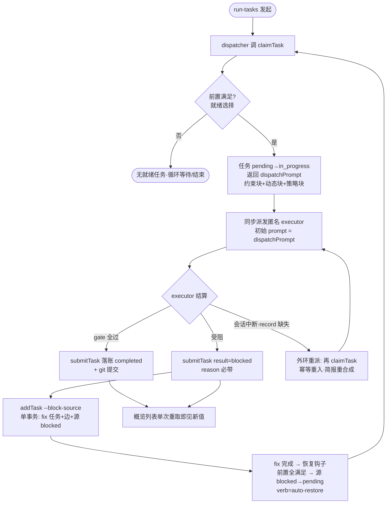

# dsh-forge M2：forge 管线接管（状态层转正 + 插件执行链 + 任务/文档视图） — PRD Spec

> PRD Spec：定义该特性**是什么、为什么**。业务上下文与阶段裁决继承自已批准的里程碑提案 [`docs/proposals/dsh-forge-m2-pipeline/proposal.md`](../../../proposals/dsh-forge-m2-pipeline/proposal.md)（宪法级约束见总纲 `dsh-forge-redesign/proposal.md` 与架构基线 `architecture.md`；数据面预设计定稿 = `db-schema.md`；PRD 前 spike S8/S9①/S10 已全数通过，结论见 `docs/proposals/dsh-forge-m2-pipeline/spikes/`）。本文件不重复提案全文，只落实 PRD 层要求；已裁决项不重开。

## Background

### Why (Reason)

P1（MVP）已收官（MVP 门两步达成：飞轮 dogfood 四连绿 + 安装包冒烟两连绿），但产品的任务管线仍住在旧世界：日常开发任务依赖冻结的旧线（bug-fix only）与旧仓任务文件，总纲核心断言「任务状态层 = 唯一 SoT、forge 插件接管执行链」在产品侧尚不存在。自举链路以 M2 为地基——M3 达成自举后（M4 起产品用自身开发），任务/提案/执行记录必须已在自身状态层运行。

### What (Target)

把任务域从「无」带到「转正」，四个交付面：

- **① core · forge 域转正（每工作区库）**：每注册工作区一个独立任务库，部署于 `{dsh-forge-home}/{canonical-path 扁平化}@{hash8}/`（hash8 = 原路径 sha-256 前 8 hex 消歧后缀——spike S10 实证全路径形态收敛，裂库风险仅剩真实移动，注册时拒绝兜底）；七域表（features / feature_documents / tasks 七态 / task_edges 无环 / task_records append-only / proposals 五态 / task_session_links）+ 状态机动词 API（addTask / claimTask / submitTask / transitionTask / queryTask…）+ dispatchPrompt 合成内聚 claimTask（约束块 + 动态信息块含 BLOCKERS 快照 + 类型策略块）；中央库 projects / knowledge 双域**零改动**。
- **② plugin-forge 插件入仓（过渡单包）**：tool 半身（动词 tool，消费宿主能力服务——与 knowledge 插件同缝，P1 已验证）+ skills 半身执行链（run-tasks 同步 subagent 派发循环 / fix 链 / submit-task 内置质量门 / git 提交纪律 / run-tests）；transitionTask 不进 tool 面（人类逃生通道，UI 直调）。
- **③ web · 三区扩展**：「项目概览」dock tab（官方 ui-dockkit；子 tab 提案|feature|任务；任务子 tab 三视图[列表+DAG+泳道]；共用搜索[中英双语]+排序切换[活跃优先/最新创建]）；文档行点击 → dock 开出独立文档 tab（mermaid 占位卡——产品扩展点）；任务行/DAG 节点/泳道卡片点击 → 模块化任务详情抽屉（按类型条件区——老 forge 20 种类型对齐）；SC6③ 挂接双侧 + 注册表单派生行升级。
- **④ 验收与质量**：SC7 真闭环 + SC-M2 门（派发链端到端真实模型走查）+ SC4 + SC6③ + SC2 扩展任务域 + SC-branch + SC-NFR/SC8 回归。

### Who (Users)

- **单人开发者**（产品唯一人类用户与干系人）：在概览 dock tab 浏览任务与文档、发起 run-tasks 派发、做人工状态决策（跳过/否决/重开经 transitionTask）。
- **dsh agent 会话**（系统协作者，非人类角色）：**dispatcher**（run-tasks 会话内经 claimTask 领任务、subagent 同步派发、外环重派）与 **executor**（匿名子会话，按 dispatchPrompt 执行、submitTask 落账）——其行为经 Story 的系统侧断言覆盖。

## Goals

| Goal | Metric | Notes |
|------|--------|-------|
| SC7 真闭环 | 动词 tool 写入 → 每工作区状态层 → 概览列表「写入返回后单次重取即见新值」（e2e 1 条）；插件无 transitionTask tool（代码审计 0 注册）；动词 API 单测全路径（from 匹配 / 依赖终态守卫 / record·reason 必带 / append-only 触发器 ABORT / blockers 无环拒绝含环路径回报 / transitionTask from≠to + reason 必带）全绿 | 总纲 SC7 + db-schema §4 单测锚点 |
| SC-M2 门（M2 验收门） | 派发链端到端真实模型 dogfood 一条链不间断：claimTask 返回 dispatchPrompt（断言约束块 + 动态信息块含 BLOCKERS 快照 + 类型策略块三段构成）→ subagent 同步派发（初始 prompt = dispatchPrompt）→ executor submitTask（质量门 编译→格式→lint→测试 通过后落账）+ git 提交 → 列表即时刷新；**含 fix 链一次**（block 边写入 + `verb='auto-restore'` 恢复断言）与**模拟子会话中断后恢复一次**（claimTask 幂等重入，简报重合成、digest 新值） | 对齐 P1 SC-MVP 门纪律 |
| SC4 文档浏览 | 概览提案/feature 子 tab → dock 文档 tab 两模式 e2e 各一条：仓内项目浏览 proposal/PRD/design 并「在编辑器中打开」；仓外项目同构（夹具预置约定目录结构 → 真实发现链建行 → 只读渲染 + canonical 路径栏 + mermaid 占位卡）——S9① 实证发现链可依赖 | 总纲 SC4 完整 |
| SC6③ 挂接双侧可见 | 任务行双数据源断言（`task_session_links` = 派发会话、`task_records.session_id` = 执行会话，两侧分别一致；S8 实证子会话 id 可得且与主会话相异可判）；会话头部展示挂接任务，与库一致（e2e） | P1 顺延清账 |
| SC2 扩展任务域 | 任务/feature/proposal 状态全部从每工作区库直读（数据来源断言）；概览首屏 ≤2s @500 任务（机械判据）；任务域 watch / 回流 / 快照同步模块 = 0（代码审计）；库位于 `{dsh-forge-home}/{扁平化}@{hash8}/` 且与注册表单展示逐字一致（单源断言） | SC2 直读纪律扩展 |
| SC-branch 单机单活跃分支 | 构造文档引用悬空（模拟分支切换）→ dock 文档 tab 缺省渲染并标注，不崩溃、不写入（e2e） | 架构基线 §6 锚定 |
| SC-NFR 回归 | 应用对代码仓与文档位置零写入（文件系统级监控验证一次全流程，SC3 回归）；单一写入路径扩展（每工作区库写只经 core 服务，UI 与 tool 同门，审计断言）；令牌 lint 零裸值；G0–G2 门全绿 | 继承 P1 SC-NFR 口径 |
| SC8 零迁移 | 无批量/命令式旧仓任务迁移工具与旧→新同步路径（代码审计；发现面单向吸收白名单 = 旧线 manifest 的 title/status + 文档索引三字段，显式清单豁免）；旧仓任务文件原地未被改动（断言） | 宪法裁决 |

## Scope

### In Scope

- [ ] ① 每工作区任务库：七域表 + 版本表随库幂等迁移 + 前向单向版本门（旧应用打开新库明确拒绝）；部署位置 `{dsh-forge-home}/{扁平化}@{hash8}/`（派生函数落位 core 单源，注册表单展示串经 RPC 下发取代 web 侧自算）；启动打开/建库；中央库零改动。
- [ ] ① 状态机与动词 API：七态转移矩阵（agent 机器校验面）+ 人类通道（transitionTask from≠to 任意 + reason 必带，UI 直调不封装 tool）；转移校验、依赖终态守卫（满足集 = {completed, skipped}）、record/reason 必带、每次写自动审计；fix 链语义（--block-source 单事务同置源 blocked、链深 ≤6、完成自动恢复）。
- [ ] ① dispatchPrompt 合成内聚 claimTask：约束块单一来源 + 动态信息块（TASK_ID/FILE/TYPE/CATEGORY、BLOCKERS 快照、PHASE_SUMMARY、覆盖阈值等实时取数）+ 类型策略模板族（任务类型唯一词汇）；每类型快照测试（fixture 任务 → prompt 断言）。
- [ ] ① 相位推导机：upsertFeatureDoc / addTask / claimTask / submit 钩子 / transitionTask / auto-restore 触发器闭包内聚重算 feature 相位；快照 + 派生不变量断言（写事务内增量 + 启动全库）。
- [ ] ① 发现面：注册/首次打开只读扫描按目录约定建行（features + feature_documents 全类文档索引 + proposals 扫描建行——SC4 数据来源）；manifest frontmatter 初值单向阀门（S9① 实证旧线仓 100% 有源）；validateStore 只读校验动词（派生不变量 / 无环 / liveness / 记录链完整性 / 拓扑可分层）。
- [ ] ② plugin-forge 入仓（过渡单包）：tool 半身（addTask / claimTask / submitTask / queryTask + createProposal / transitionProposal；**transitionTask / transitionFeature 不注册**——代码审计断言）；skills 执行链迁移（run-tasks 同步 subagent 循环 / fix 链 / submit-task 质量门 / git 纪律 / run-tests）+ 旧技能悬空引用裁剪（机械断言零残留）；恢复出口 = dispatcher 外环（record 缺失 → 按当前状态重派）。
- [ ] ③ 「项目概览」dock tab（ui-dockkit 按需开出；入口 = 开始页入口卡[排最前] + 挂接 pill）：子 tab **提案|feature|任务**（用户定向顺序）；任务子 tab 三视图（列表两行布局 + DAG SVG 贝塞尔 + 泳道七态横向列）；共用搜索（中英双语）+ 排序切换（活跃优先/最新创建）；ov-head 默认折叠（状态摘要一行）。
- [ ] ③ SC4 文档浏览：概览子 tab 点文档行 → **dock 开出独立文档 tab**（按 docRel 去重；Markdown 渲染 + canonical 路径栏 + mermaid Diagram 占位卡——产品扩展点）；悬空容错；仓内/仓外同构。
- [ ] ③ 任务详情抽屉（模块化——按类型条件区）：通用区（类别彩色 chip + 优先级 + 复杂度）+ 状态条件区（blocked → 阻塞原因）+ 按类型条件区（fix 链/覆盖率/测试面/质量门/评估结果）+ 执行时间线 + 挂接 + 转移。
- [ ] ③ SC6③ 挂接双侧：会话头部展示挂接任务（挂接部分；执行上下文展示 = M3）；任务行展示挂接会话（双数据源）。
- [ ] ③ 注册表单任务清单派生行：展示 `{dsh-forge-home}/{扁平化}@{hash8}`，经 RPC 下发 core 派生值（单源）；疑似移动（同扁平化主体异 hash8 目录）= 拒绝注册 + 手工指引（认领对话框 = M3）。
- [ ] ④ 契约面 pin 扩池（forge 域动词 API 面 / 每工作区库布局 / plugin-forge tool 面）+ G0–G2 全绿 + SC2/SC3 回归 + 零迁移断言。

### Out of Scope

- **对账卡 UI（2026-10-05 用户裁决移出）**：漂移 / 找回类概念不进用户视野（防心智负担）；启动对账机制保留静默自愈 + 记账日志（P1 已交付），未来可视化再显式立项。
- **M2 范围对齐顺延项（→ M3）**：worktree 项目域全族（.git 判定 / repo_root 分组 / 中央列 / 兄弟提示 / 项目树两级）、会话头部执行上下文展示（SC6④）、task_records 执行上下文两列（branch/worktree）、feature_records 第八表、注册疑似移动认领对话框。
- **M3（预设与自举）**：出厂双预设、plugin-forge 拆包、brainstorm 三模式共享、任务三视图补全 DAG/泳道、quick-tasks / 规格技能、proposals 管线完整消费（提案 UI 与流程）。
- **M4+ 知识内核深化**；**旧仓任务文件迁移工具**（宪法裁决零迁移）；AGENTS.md tab；多窗口 / 拆分面板；三平台分发（维持 Windows 冒烟回归）。

## Flow Description

### Business Flow Description

**流程一：任务派发链（核心场景，SC-M2 门）**

1. 单人开发者在项目会话中发起 run-tasks（技能指令）→ dispatcher 进入派发循环。
2. dispatcher 调 `claimTask` tool → core 前置满足守卫（依赖全到终态 {completed, skipped}）+ 就绪选择（分支延续优先 + priority → 创建序）→ 任务 pending→in_progress（record verb='claim'，记派发会话 id + 挂接行）→ 返回 **dispatchPrompt**（约束块 + 动态信息块含 BLOCKERS 快照 + 类型策略块）。
3. dispatcher 以 dispatchPrompt 为初始提示词**同步派发匿名 executor subagent**（阻塞等待）。
4. executor 按简报执行：改代码 → 跑质量门（编译→格式→lint→测试）→ `submitTask`（gate 结果 + 执行摘要 + 提交哈希；记执行会话 id）→ 落账 completed + git 提交。
5. 受阻路径：executor `submitTask result=blocked`（reason 必带）→ 任务 in_progress→blocked；executor 同事务 `addTask --block-source`（fix 任务 + 边 + 源任务 auto-block）→ fix 任务入池。
6. fix 完成时恢复钩子反查后继：前置全满足 → 源任务 blocked→pending（record verb='auto-restore'，边不删）→ dispatcher 下一轮重派（简报按当前状态重合成）。
7. 中断恢复：executor 会话中断 → record 缺失 → dispatcher 外环再 claim → claimTask 对 in_progress 幂等重入（无状态转移，返回重合成简报、digest 新值）。
8. 每次写动词后，概览任务列表在写入返回后单次重取即见新值（无 watch、无同步延迟）。

**流程二：任务浏览（概览 dock tab）——三视图 + 搜索 + 排序 + 模块化详情抽屉**

1. 右栏概览 dock tab → 子 tab **提案|feature|任务**（用户定向顺序；sticky 区子 tab + 搜索栏 + 排序 pill 不随内容滚走）。
2. 搜索：中英双语匹配（任务标题/key/类型/状态中英；提案 slug/标题/状态中英/摘要；feature slug/文档类型/路径/摘要）；输入时仅更新内容区（IME 安全——中文组合态不被打断）。
3. 排序：`⇅ 活跃优先`（默认：in_progress→blocked→pending→…→completed）↔ `⇅ 最新创建`（created_at 降序）；三子 tab 共用。
4. 任务三视图切换（列表|DAG|泳道）：七态 chips 过滤三视图统一生效（0 计数 chip disabled）。
   - **列表**：两行布局——主行（ID + 标题 + 中文状态 tag + ⋯）+ 副行 11px（类型/优先级/前置/挂接/fix）；行点击 → 模块化抽屉。
   - **DAG**：SVG 贝塞尔连线 + 箭头 marker（完成边绿）；节点点击 → 抽屉。
   - **泳道**：七态横向列（0 计数列折叠为窄头）；卡片点击 → 抽屉。
5. **模块化任务详情抽屉**（右侧滑入 420px）：通用区（类别彩色 chip[编码蓝/文档紫/测试青/评估红/验证琥珀/质量门绿] + 优先级 + 预估 + 复杂度 + breaking）→ 状态条件区（blocked → 阻塞原因 ⚠）→ 按类型条件区（fix 链[来源+根因+源文件+测试脚本] / 覆盖率进度条 / 测试面[Surface] / 质量门检查 / 评估结果[🔑主会话+得分+严重度]——老 forge 20 种类型对齐）→ 前置依赖 → 执行时间线 → 挂接会话 →「转移状态…」。
6. 人工决策：抽屉或 ⋯ 菜单 → 转移对话框（from≠to + reason 必带填因——空因拒绝留场）→ 与 agent 写入同门（core 动词），即时反映。
7. 子 tab 切换时清空搜索 + chips + 展开态；提案/feature 父行点击展开元数据（多开，可同时展开多个）。

**流程三：文档浏览与发现（SC4）——dock 新 tab + mermaid 占位**

1. 注册 / 首次打开：core 只读扫描工作区按目录约定建行——features + 全类文档索引 + proposals（S9①）。
2. 概览子 tab 文档行点击（**整行可点**）→ dock 开出**独立文档 tab**（按 docRel 去重；多文档并存）→ Markdown 渲染 + canonical 路径栏 + mermaid Diagram 占位卡（产品扩展点）+「在编辑器中打开」。
3. 同文档重开 = 激活已有 tab（不新开）；关闭后回概览或开始页。
4. 分支切换后文档引用悬空 → dock 文档 tab 只读占位面（路径栏保留，不崩溃、不写入、不删行）。

**流程四：任务 ↔ 会话挂接（SC6③）**

1. claim 时写挂接行（派发会话）+ record（执行会话在 submit 时记）。
2. 会话头部展示该会话挂接的任务；任务行展示两类挂接会话——两侧展示与库记录一致（双数据源分别断言）。

**流程五：注册派生行（升级）**

1. 注册表单任务清单只读行展示 `{dsh-forge-home}/{扁平化}@{hash8}`（core 派生 + RPC 下发，与实际建库位置单源一致）。
2. 疑似移动（目标目录不存在但发现同扁平化主体异 hash8 目录）→ 拒绝注册 + 手工指引文案（删孤儿目录或改回原名）。

### Business Flow Diagram

**派发链（含 fix 链与中断恢复分支）**：

### Data Flow Description

| Data Flow ID | Source System | Target System | Data Content | Transport | Frequency | Format | Notes |
|-----------|--------|----------|----------|----------|------|------|------|
| DF001 | plugin-forge tool | core 动词 API（宿主能力面） | 任务/feature/proposal 动词调用与结果（含 dispatchPrompt） | 宿主能力服务注入（P1 已验证缝，knowledge 同缝） | agent 派发与执行期 | 结构化结果 | agent 面 = tool 封装；面分治见 SC7 断言 |
| DF002 | web UI（概览 dock tab/文档 dock tab/任务抽屉/表单） | core 查询与人类通道动词 | 任务列表 / 文档索引 / transitionTask / 派生路径串 | RPC 通道（allowlist） | 交互时 | 直读零副本 | 写与 tool 同门 |
| DF003 | 发现面（工作区目录） | 每工作区库 | features / feature_documents / proposals 建行（单向吸收） | 本地只读扫描 | 注册 / 首次打开 | 行数据 | manifest frontmatter 初值单向阀门；零迁移白名单豁免（SC8） |
| DF004 | dispatcher 会话 | executor 子会话 | dispatchPrompt（约束 + 动态信息 + 类型策略） | subagent 同步派发 | 每次 claim 后 | 提示词文本 | executor 唯一差异化通道（无 per-spawn 系统提示注入——预研定稿） |
| DF005 | 每工作区库 | 会话头部 / 任务行 | 挂接任务（会话侧）/ 挂接会话（任务侧，双数据源） | 库查询 | 渲染时 | 挂接行 | SC6③；S8 实证子会话 id 可得且相异可判 |
| DF006 | core | 注册表单 | 任务清单派生串（`{扁平化}@{hash8}`） | RPC 下发 | 表单渲染时 | 路径串 | 单源（core 派生），SC2 一致断言锚 |

## Functional Specs

> UI 功能规格详见 [prd-ui-functions.md](./prd-ui-functions.md)。

### Related Changes

| # | Project | Module | Change Point | Updated Logic |
|------|----------|----------|------------|----------------|
| 1 | dsh-forge | core · forge 域 | 新增每工作区库 + 动词 API + dispatchPrompt + 发现面 | 中央库零改动（projects / knowledge 双域不动）；多句柄管理（生命周期与迁移编排 = tech-design 必答） |
| 2 | dsh-forge | plugin-forge（新工件，过渡单包入仓） | tool 半身 + skills 执行链 | 消费宿主能力服务（同 knowledge 缝）；不注册人类通道 tool |
| 3 | dsh-forge | web 概览 dock tab、文档 dock tab、任务抽屉、会话头、注册表单 | 「项目概览」dock tab（ui-dockkit；三子 tab + 三视图 + 排序 + 搜索）+ 文档 dock tab（mermaid 占位）+ 模块化任务详情抽屉 + session.header 挂接 pill + 派生行 | 现态机制（fix-10 dockkit / GuideBody / fix-14·16 OS 选择器；左栏与中区零新增） |
| 4 | dsh-forge | host 桥 / RPC 面 | 任务域服务面与通道扩展（三处一体既定路径） | 服务名与形状 = tech-design 必答（forgeProjects 扩展 vs 新服务 + 多句柄路由） |

## Other Notes

### Performance Requirements

<!-- Override: Performance Baseline enabled by signal「首屏 ≤2s @500 任务 / 查询画像」 -->
- 概览任务列表首屏 ≤2s @500 任务（压力上界；单 feature 30–60 任务为日常形态）；数据全部直读每工作区库，无文件扫描型加载（SC2 运行断言）。
- 热查询（就绪集 / 前置守卫 / 恢复钩子反查）走索引命中，查询计划由断言锁死（防全表扫描回归）。
- tool 写入与 UI 读取无锁竞争（派发循环与页签浏览互不阻塞）。

### Data Requirements

- 数据追踪：每动词一行审计记录（append-only 双触发器机械防线）；claim 记派发会话 id、submit 记执行会话 id；无遥测（单机产品）。
- 数据初始化：发现面单向吸收建行（无种子数据）；每工作区库随注册创建。
- 数据迁移：**无**（零迁移宪法）——旧仓任务文件原地保留，新旧并行直至旧线自然废弃；schema 前向单向（旧应用打开新库明确拒绝）。

### Monitoring Requirements

- 单机产品无服务端监控；质量监控面 = G0–G2 门（lint / 类型 / 契约面 pin / e2e 池）。
- 运行期一致性监控：validateStore 启动全库断言（派生不变量 / 无环 / liveness / 记录链完整性）+ 相位推导机写事务内增量断言——腐化即红灯。

### Security Requirements

- 本机运行：宿主服务仅本机回环可达，无远程暴露面；任务库为本地数据，v1 无加密需求。
- 只读纪律（SC3 回归）：应用对代码仓与文档位置零写入（文档 dock tab 只读渲染 + 路径跳转；任务抽屉只读展示）；单一写入路径（每工作区库写只经 core 服务）。
- 模型 API 凭证归 dsh profile 域，产品不经手、不存储、不展示。

---

## Quality Checklist

- [x] 需求标题准确描述特性
- [x] 背景含三要素（原因 / 目标 / 用户——单人开发者 + dispatcher/executor 系统协作者）
- [x] 目标量化（8 项 SC 各带机械判据：e2e 条数 / 断言口径 / 代码审计零值 / ≤2s@500）
- [x] 流程描述完整（五流程 + fix 链 / 中断恢复 / 悬空 / 疑似移动异常分支）
- [x] 业务流程图为 Mermaid 且含决策菱形与异常分支
- [x] 引用 prd-ui-functions.md 且 UI 规格完整
- [x] 相关变更已分析（四模块改动点 + 两项 tech-design 必答注记）
- [x] 非功能需求已考虑（性能 / 数据 / 监控 / 安全）
- [x] 表格填写完整
- [x] 无模糊措辞（量化或可断言表述）
- [x] 可执行可验证（每项可映射 SC / e2e / 代码审计）

> 自检注记：无 `docs/sitemap/sitemap.json`（沿 P1 注记——本仓未生成 sitemap；M2 全部 UI Function 为既有工作台上的新增页签/行级扩展，不依赖既有路由校验）。PRD 前 spike（S8/S9①/S10）全数通过并内化：SC6③ 双数据源断言（S8 子会话 id 实证）、SC4 仓外 e2e 夹具口径（S9①）、派生行单源（S10 hash8 稳定）。对账卡 UI 按用户裁决移出（2026-10-05，提案同步记账）。
