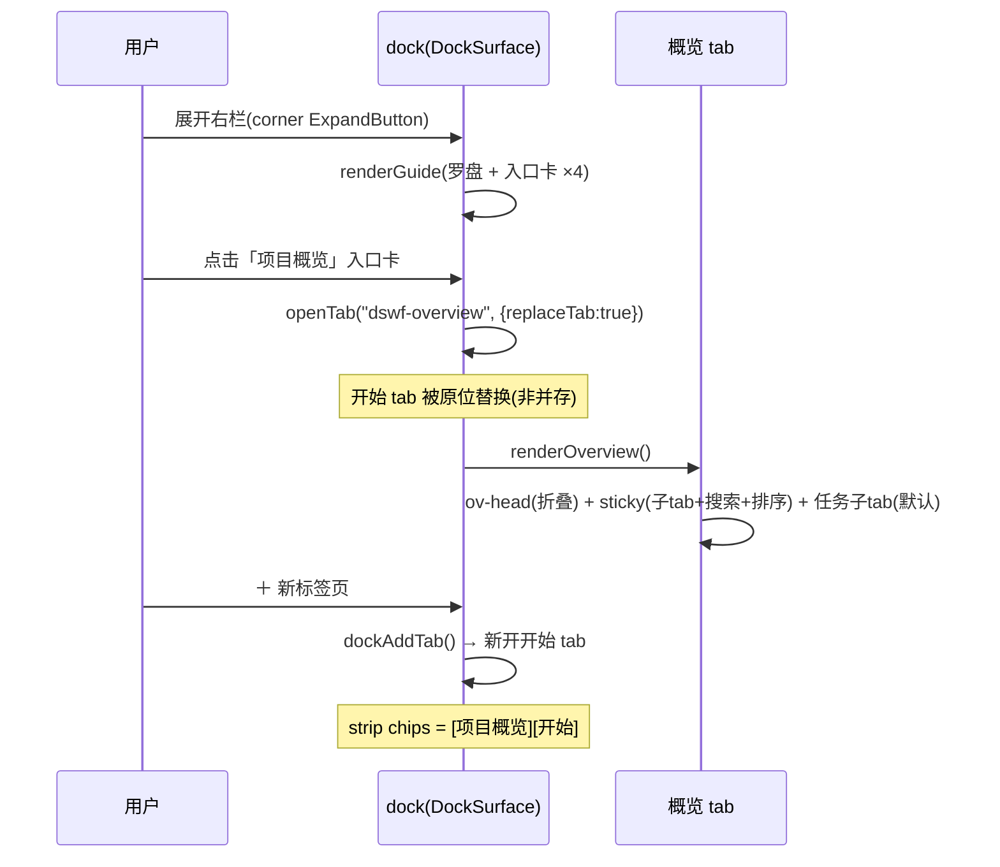
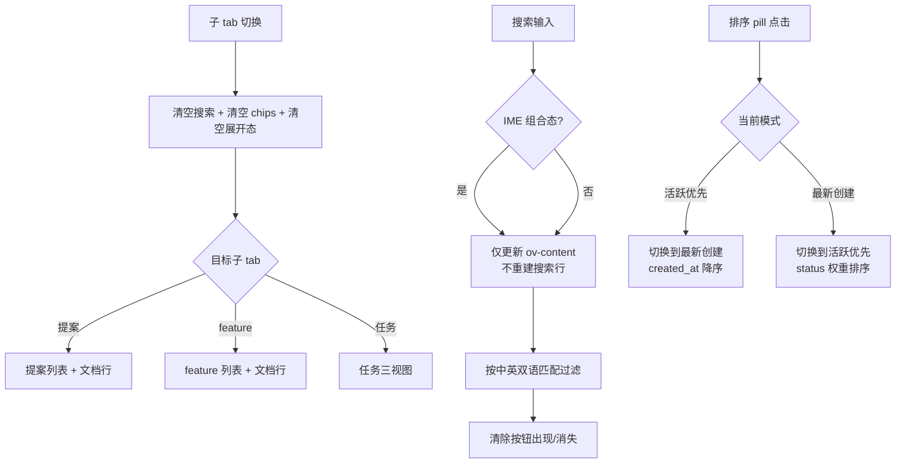
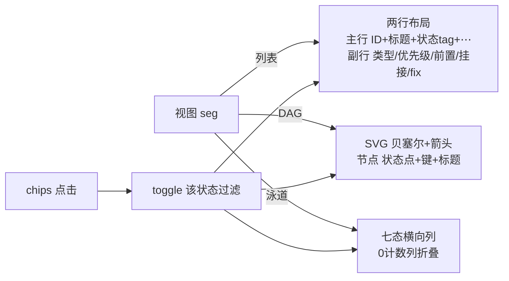
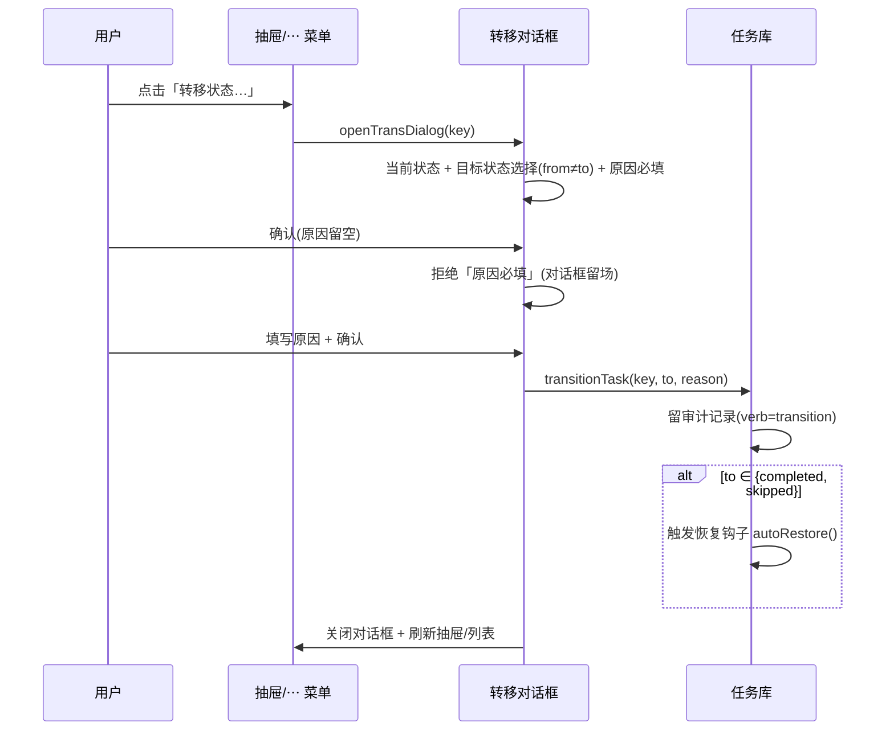
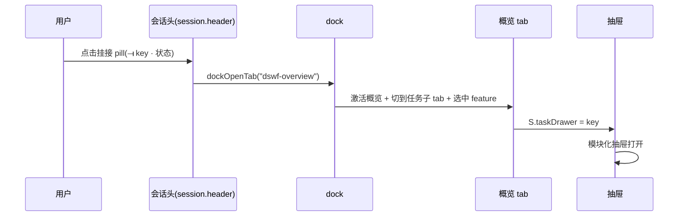
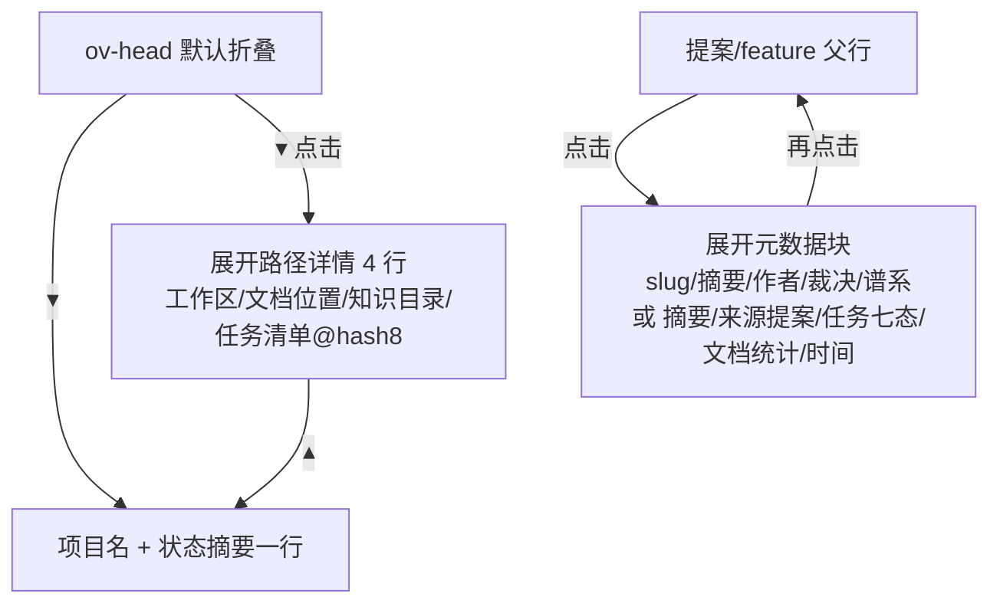
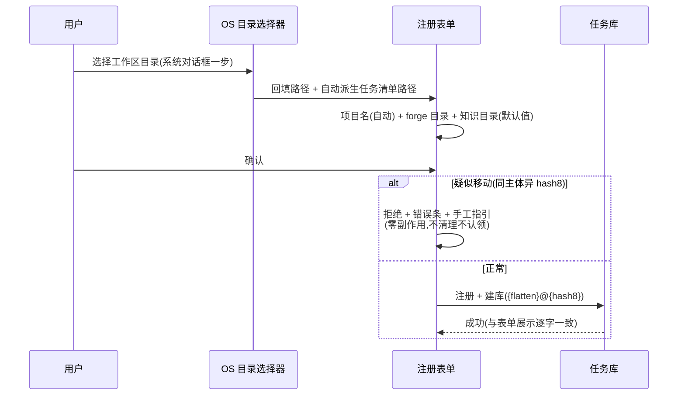

# dsh-forge M2 — UI Design（Web）

> **设计基线（v13）**：产品形态以现有代码现态为准（fix-25/29/38/40/42 后），概览 = 官方 ui-dockkit 右栏 tab。经两轮 UI/UX 专家评审（P1-P5 + R1-R7 全部落地）+ 老 forge 21 种任务模板源码调研。v7-v12 演进见各版记注。**v13：「预估」→「预估耗时」；参考文档 chip 点击 → dock 开新 tab（refDocs 锚点→路径映射,按 docRel 去重,无映射置灰）；目标/结果改上下展示（标签在上、内容在下,非左右两列）；内容子标题与键标签全加粗（tc-k/tl-verb 600）；「注记」更名「备注」（= 内容负载中的补充警示,如 2.4 的 fix-1 记账提醒）**。冒烟 123 断言全绿。

## Design System

> 令牌纪律：只引用 `--dsw-*` 语义令牌（上游 ui-theme 实值），禁裸色值/裸字号；亮/暗双主题。类型类别色彩：编码=蓝 / 文档=紫 / 测试=青 / 评估=红 / 验证=琥珀 / 质量门=绿。

## Navigation

- **左栏（官方 ui-sidebar 壳）**：品牌行（鲸 mark）→ PanelRow 仅「知识库」（M2 不加行）→ 工作区浏览区（fix-42 treeitem）。
- **中区（官方 main 面板互换）**：会话（官方 ConversationRoot + conversation.view 三签——M2 不加签）⇄ 知识 ⇄ hero；概览不占中区。
- **右栏 = 官方 ui-dockkit（DockSurface）**：
  - **开始 tab = dsh 官方 GuideBody 逐形态**：罗盘 CompassGlyph 56px hero + 380px 入口卡 ×4（**项目概览[M2 排最前]** + 工作区文件[Ctrl+P] + 新建终端 + 浏览器[Ctrl+T]）；entry → `openTab(kind, {replaceTab:true})`。
  - **「项目概览」tab = M2**：开始页入口卡开出或会话头挂接 pill 跳转。
  - **文档 tab**：文档行点击开出（按 docRel 去重）；关闭后回概览或开始页。
  - ＋（`dock.addTab`）→ 新开开始 tab；**dock chrome**：⛶ 全屏 + ▯ 收展（dsh 原生）。

---

## UF-1 「项目概览」dock tab

### 结构

```
ov-panel(dock tab body ~460px)
├── ov-head(默认折叠):项目名 + 一行状态摘要(feature · N 会话 · N 完成) + ▾ 展开路径详情
├── ov-sticky:子 tab(提案|feature|任务) + 搜索行(搜索框限宽 240px + 排序 pill 右固定;中英双语)
├── [提案子tab] 提案父行(▸展开元数据:slug/摘要/作者/创建/裁决/谱系) + 文档行(📄 proposal.md [已接受] ›)
├── [feature子tab] feature 父行(▸展开:摘要/来源提案/任务七态/文档统计/时间) + 文档行(不含提案)
└── [任务子tab]
   ├── ov-taskbar:feature pill + 计数 + 视图 seg(列表|DAG|泳道) + 排序 pill
   ├── 七态过滤 chips(0 计数禁用+淡化)——三视图统一过滤
   ├── [列表] task-item 两行布局:主行(ID+标题+中文状态tag+⋯) + 副行 11px(类型/优先级/实际耗时[completed]/前置/挂接/fix)
   ├── [DAG] SVG 贝塞尔 + 箭头 marker(前置绿/普通边框色) + 节点(状态点+键+标题+⏱实际耗时[completed]) → 点击开抽屉
   └── [泳道] 七态横向列(0 计数列折叠) + 卡片(foot 含 ⏱ 实际耗时[completed]) → 点击开抽屉
```

### 排序

三子 tab 共用排序切换（`⇅ 活跃优先` / `⇅ 最新创建`），**pill 固定在搜索行右端**（v8——与搜索框同行，spacer 推至右缘）：
- **活跃优先**（默认）：in_progress → blocked → pending → … → completed
- **最新创建**：created_at 降序

### 搜索

三子 tab 共用搜索行，**搜索框限宽**（`flex: 0 1 240px; max-width: 240px`——不占满 dock 宽度，v8）；同时匹配中英双语（任务标题/key/类型/状态中英；提案 slug/title/状态中英/摘要；feature slug/文档类型/路径/摘要）。搜索时仅更新内容区（IME 安全——中文组合态不被打断）。

---

## UF-2 文档浏览（SC4）· 概览提案/feature 子 tab + dock 新 tab

### Placement

概览 tab 的 feature/提案子 tab 点文档行 → **在 dock 开出独立 tab**（非抽屉；按 docRel 去重；多文档并存）。

### 文档 tab 内容

头部（文件名 + 只读徽标 + 悬空徽标）→ 路径栏（canonical 全路径 + 📁 在编辑器中打开 + ↻ 重读）→ 摘要块 → **Markdown 渲染**（标题/列表/引用/代码块）。**mermaid 代码块 → 图渲染**（v16 erDiagram + v17 流程图[graph/flowchart]——产品形态 = mermaid 库懒加载,全图型同库渲染;**erDiagram = 验收锚**;渲染失败/非法源 → **回退占位卡**：源码 + 回退注记）。

悬空文档 tab = 只读占位面（路径栏保留，不崩溃不写入不删行）。

---

## UF-3 会话头部挂接任务展示（SC6③ 挂接部分）

官方 session.header actions 位；双数据源分型（派发 ⟞=挂接表 / 执行 ⟞=records.session_id）；≤2 并排 + +N 溢出；pill 点击 → dock 开概览 tab + **任务详情抽屉打开**。

---

## UF-4 注册表单任务清单派生行（升级）

OS 目录选择器一步 → 表单；派生行含 hash8（@ 连接符）；疑似移动拒绝留场。

---

## 任务详情抽屉（v11 两分块——任务内容 / 时间线，顺滑折叠）

**右侧滑入（默认 420px，左缘手柄拖拽调宽 320–760px；双击复位；←→ 键盘微调 ±32；宽度跨任务保持——会话级状态）**，从任务行/DAG 节点/泳道卡片/挂接 pill/⋯ 菜单打开。

### 整体结构

```
├── 通用区:头部(状态点 + 任务键 + 中文状态标签,✕ 关闭右端) → 标题 → kv 标签行(类别/优先级/预估耗时/实际耗时[completed]/复杂度/影响)
├── 块一 任务内容:目标/结果对行 → 类型模板 → 单元测试覆盖率
├── 块二 时间线:现状条(当前关联) + 事件流(垂直时间线,关联信息织入事件)
└── 底部:「转移状态…」按钮
```

### 交互与呈现细则（v11/v12——UI 逻辑锚点,界面不再展示说明文字）

- **折叠动画**：块头部点击**就地更新 DOM**（不重建抽屉）——块体常驻 DOM,经 `grid-template-rows: 1fr ↔ 0fr` + opacity 过渡高度（.22s）;caret 旋转 -90° 同步;`aria-expanded` 同步;Enter/Space 键盘可用;折叠状态会话级（跨任务保持,重置种子还原）。块体垂直间距用**子元素 margin**（padding 会成为 0fr 轨道的最小高度地板）。
- **滑入动画重放抑制**：抽屉滑入动画仅在**切换任务**时播放;同任务重渲染（菜单开合、状态转移回写等）加 `no-anim` 类。
- **标签行（v12/v13/v15）**：**chip 组件**包裹,内部格式 `{key} : {value}`（键 10.5px tertiary / 值 11.5px 500）——`类别 : coding.feature`（**只显类型,不中英混搭**;chip 描边/文字着类别色,值用代码体）/ `优先级 : P0` / `预估耗时 : 4h`（v13 更名） / `实际耗时 : 2h31m`（**v15:仅 completed,紧随预估耗时成对对照**） / `复杂度 : 高|中|低`（中文映射）/ `影响 : ⚠ breaking`（红）。
- **实际耗时（v15）**：仅 **completed** 任务展示,由**任务记录推导**（首 claim → 末 submit 的时差;格式 `XhYm` / `Xm` / `XdXh`;记录缺时间或时差 ≤0 则不显示;非 completed 一律不显示）。四处呈现:①任务列表副行 `实际耗时 2h31m`;②DAG 节点底行 `⏱ 2h31m`;③泳道卡片 foot `⏱ 2h31m`;④抽屉标签行 chip（如上）。
- **参考文档可点击（v13）**：参考文档 chips 经 **refDocs 映射**（锚点前缀 → 文档 rel 路径）解析——有映射 = 链接态（着 link 色,hover 提示「点击在 dock 打开」）,点击 → `dockOpenTab("doc")` 开新 tab（按 docRel 去重,只读 Markdown 渲染,同 UF-2 文档 tab）;**抽屉保持打开**。无映射 = 普通 chip 置灰不可点。
- **目标/结果（v13）**：上下展示——标签（tc-k 加粗）在上、内容（gr-v 12px）在下,同列对齐;非左右两列。
- **块标题视觉区分（v12）**：块头 = **底色条**（interactive-bg-hover,hover 加深）+ 13px/600 主色标题 + caret——与正文明显区隔。
- **层次阶梯（v12/v13）**：块头（13px/600 主色·底色条）→ 子标题 tc-k（**12px/600 次色**,如 目标/结果/参考文档/改动范围/验收标准/单元测试覆盖率/备注）→ 组标签 tc-scope-k（10.5px/600 三级色,如 预期(N)/实际(N)）→ 内容行（11.5–12px regular）;**键标签 tl-verb 一并加粗（600）**（症状/验证/命令/交付物/评分键等）;块体左缩进 24px。
- **命名（v12/v13）**：内容对行 = 「目标」「结果」;「参考」更名「**参考文档**」（refs = 任务的参考锚点:提案/spike/架构基线/db-schema 章节）;「注记」更名「**备注**」（content.note = 内容负载中的补充警示,如 2.4「工具名形违规已由 fix-1 记账(阻塞 2.5)」——⚠ 琥珀色）。
- **文件路径完整展示（v12）**：改动范围文件行 `white-space: normal + word-break: break-all`——长路径换行完整显示,不省略不截断（抽屉可拖宽配合）;徽标顶对齐。
- **界面说明最小化（v11 沿袭）**：无数据源注记、无概览脚注;数据源语义、实际范围「commit 优先 / 记录回退」策略、类型模板分发表锚定本文档。
- **coding 模板顺序（v14）**：参考文档 → 改动范围（预期↔实际）→ 验收标准 → 单元测试覆盖率 → **备注（内容块最末,警示置底）**。

### 块一 · 任务内容（预期 ↔ 实际——内容与记录综合）

块首**对行**：「目标」（content.goal / scenario / 标题）↔「结果」（**综合任务记录**推导——已提交+gate 摘要+commit hash / 执行中+最近记录 / 评估 N/100+严重度 / ⚠ 阻塞原因 / 未开始;v12 简化命名,对位即预期/实际语义）。用户一眼对照预期目标与实际结果。

任务存储于每工作区 forge.db 后**没有任务文档**——内容 = tasks 行结构化负载（vars_json 具体化），按 **TaskType 模板**渲染；未注册类型走通用键值回退。

| 模板族 | 类型 | 区块内容 |
|---|---|---|
| coding | `coding.*` | 参考文档（chips，v12 更名/前置——refs = 提案/spike/基线章节锚点） / 改动范围（预期 ↔ 实际双列，见下;文件路径完整展示） / 验收标准（checkbox——终态全勾+划线） / 单元测试覆盖率（见下） / 备注（⚠,v14 移至覆盖率之下——内容块最末） |
| fix | `coding.fix` / `doc.fix` | 症状 / 修复步骤（编号） / 验证命令（链元数据织入时间线「创建」事件） |
| doc | `doc` | 大纲（编号） / 交付物 / 读者 |
| gate | `gate` | 走查步骤（编号） / 检查项（checklist，随 gate_checks 全过勾选）——场景由「目标 · 预期」承载 |
| test | `test.*` | 命令 / 采集指标 / 基线 |
| eval | `eval.*` / `validation.*` | 评估对象 / 评分表（rubric 键+分值着色） / 结论——得分由「结果 · 实际」承载 |
| generic（回退） | 未注册类型 | 键值行 + 列表（数组） |

**改动范围 · 预期 ↔ 实际（v10 核心增补，coding.*）**：

- **预期（N · 计划）**：addTask 时声明的 scope 文件行，行尾徽标按实际对照——`✓ 已提交`（绿）/`未涉及`（中性）
- **实际（M · commit）**：**优先**按 submit 记录的 **commit hash 查找提交**（git 只读查询 → 变更文件并集；commit 徽标标注来源 hash）；**其次**（无提交时）**回退任务记录**——按状态 + 最近记录给语
- **差异摘要**：`预期 3 · 实际 3 · 预期内 2 · 计划外 +1 · 未涉及 1`；实际中不在预期者标 `+ 计划外`（琥珀）

**单元测试覆盖率（coding.*，v9 修订沿袭）**：`实际 61% / 预期 ≥80%` + 进度条（填充=实际值）+ 阈值刻度线（位置=预期值）+ 判定徽标（✓ 达标 / 未达标 / 未执行）。位置 = 验收标准之后、备注之前（v14 备注置底）；fix 类型不展示。

### 块二 · 时间线（现状条 + 事件流，v10 合并/v11 更名）

**现状条**（块首，当前关联一览）：⚠ 阻塞原因（blocked）· 前置（键+当前状态）· 挂接会话 pill（派发/执行分型，点击跳会话）· Surface（test.*）· 质量门 M/N（gate）· 得分/严重度（eval.*）。

**事件流**（垂直时间线；节点分色：提交绿 / 领取蓝 / 阻塞琥珀 / 恢复绿 / 人工转移蓝环）——关联信息**织入事件**而非独立分区：

| 事件 | 织入的关联信息 |
|---|---|
| 创建（add） | 前置声明 ←…；fix 链（来源+状态 / 根因 / 源文件 / 测试脚本） |
| 领取（claim） | digest 简报 + 派发⟞ 会话 pill |
| 提交（submit） | gate 结果 + **commit 徽标/摘要/文件数（→ 实际范围来源）** + 执行⟞ 会话 pill |
| 自动阻塞（auto-block） | block-source 语义（fix 创建/源置 blocked） |
| 自动恢复（auto-restore） | 前置全满足 → blocked→pending（边保留） |
| 人工转移（transition） | from → to + reason（人类通道审计） |
| 评估（eval） | 🔑 主会话 + 得分/严重度 |

---

## 动态交互流程

### 流程 1：开始页 → 概览 tab



**关键行为**：`replaceTab:true` = 入口卡点击后**原位替换**开始 tab（非并存）；＋ 可再开开始页。概览 tab 关闭后 dock 底板回开始页。

### 流程 2：概览子 tab 切换 + 搜索 + 排序



**搜索匹配域**：任务 = 标题/key/类型/状态（中英）；提案 = slug/标题/状态（中英）/摘要；feature = slug/标签/文档类型/路径/摘要。

### 流程 3：任务三视图切换 + chips 过滤



**三视图统一过滤**：chips 过滤在 `vis` 层面生效——切到 DAG/泳道同样只显示过滤后任务集。0 计数 chip `disabled`（不可点出空态）。

### 流程 4：任务行点击 → 模块化抽屉

```mermaid
sequenceDiagram
    participant U as 用户
    participant L as 任务列表
    participant DR as 抽屉(默认 420px,可拖 320–760)
    participant D as 任务库(forge.db)

    U->>L: 点击任务行(主行/副行整卡)
    L->>DR: S.taskDrawer = taskKey
    D->>DR: taskDrawerHtml(key)
    DR->>DR: 通用区(头部 ✕ 右端 + 标题 + 彩色chip 徽标行)
    DR->>DR: 块一 任务内容——目标·预期 ↔ 结果·实际(综合记录)<br>+ 类型模板 + 改动范围双列(commit 优先)<br>+ 单元测试覆盖率(任务无文档)
    DR->>DR: 块二 关联与过程 · 时间线——现状条(当前关联)<br>+ 事件流(创建/领取/提交/恢复/转移;commit⟶实际范围)
    U->>DR: 点击块头部(▾/▸)
    DR->>DR: 该块收起/展开(会话级,跨任务保持)
    U->>DR: 拖拽左缘手柄(双击复位/←→ 微调)
    DR->>DR: 宽度实时跟随(320–760 钳制,跨任务保持)
    U->>DR: Esc / ✕ / 点击另一任务
    DR->>DR: 关闭(或切换到新任务内容)
```

**打开途径**：任务行点击 / DAG 节点点击 / 泳道卡片点击 / 会话头挂接 pill / ⋯ 菜单「查看详情」。**调宽**：左缘 9px 手柄（hover 高亮 64px 拖示条）pointer 拖动；双击复位 420；聚焦后 ←→ ±32（可达性）；宽度存会话状态（重开抽屉/切换任务保持，重置种子还原默认）。

### 流程 5：文档浏览（dock 新 tab）

```mermaid
sequenceDiagram
    participant U as 用户
    participant O as 概览子 tab
    participant D as dock
    participant T as 文档 tab

    U->>O: 点击文档行(整行可点)
    O->>D: dockOpenTab("doc", {docRel})
    alt 同文档已开
        D->>T: 激活已有 tab(去重)
    else 新文档
        D->>T: 开出新 tab
    end
    T->>T: 头部+路径栏+摘要+Markdown渲染
    alt 含 mermaid 块
        T->>T: 图渲染(SVG;mermaid 库懒加载;erDiagram/流程图/其余图型同库)
    else 渲染失败 / 非法源
        T->>T: 占位卡(源码+回退注记)
    end
    alt 悬空
        T->>T: 只读占位面(路径栏保留)
    end
    U->>T: 📁 在编辑器中打开 / ↻ 重读
    U->>D: chip × 关闭
    D->>D: 回概览或开始页
```

### 流程 6：人工转移状态



**目标态允许集（2026-10-06 tech-design Interface 10 记注）**：`taskDetail` 返回 `allowedTransitions`（状态机纯函数，人类面 = 七态 − 当前态）——对话框仅渲染可选项（所见即所得，用户点不到非法目标），服务端转移前同源校验（同一纯函数，零漂移）。

### 流程 7：会话头挂接 pill → 概览 + 抽屉



### 流程 8：ov-head 折叠 + 提案/feature 行展开



**展开语义统一**：多开（可同时展开多个父行）；子 tab 切换时全部收起。

### 流程 9：注册流程（OS 选择器一步 → 表单）



### 流程 10：dock tab 生命周期

```mermaid
stateDiagram-v2
    [*] --> 开始_tab: dock 默认
    开始_tab --> 概览_tab: 入口卡点击(replaceTab)
    开始_tab --> 文件_tab: 原生入口(replaceTab)
    开始_tab --> 终端_tab: 原生入口(replaceTab)
    开始_tab --> 浏览器_tab: 原生入口(replaceTab)
    概览_tab --> 文档_tab: 文档行点击(新开)
    文档_tab --> 文档_tab2: 另一文档(新开;同 docRel 去重)
    [*] --> ＋: dock.addTab → 新开开始 tab
    概览_tab --> 开始_tab: chip ×(唯一 tab 时回 guide)
    文档_tab --> 概览_tab: chip ×(概览 tab 仍在)
    知识面板 --> dock_收起: 联动(rightbarViewPlan)
    dock_收起 --> dock_恢复: 回会话面板(记忆恢复)
```



---

## 原型（prototype/）

静态原型（index.html / styles.css / app.js / data.js / smoke.cjs）。**冒烟 135 断言全绿**（浏览器候选链:playwright chromium[须 icudtl.dat 在场] → 系统 Chrome → Edge）。种子数据含 7 种类型 + 各类型专属字段 + **commits 存储** + **refDocs 映射与参考文档内容**（db-schema/架构基线/S8 spike/预研——锚点跳转演示）+ 全部 14 任务带结构化 content 负载与执行记录。

## 评审注记

- 两轮 UI/UX 专家评审（P1-P5 + R1-R7 全部落地）；老 forge 21 种任务模板源码调研（forge-cli/pkg/task/types.go Task struct + TaskTypeRegistry + prompt 模板差异）。
- **任务无文档（v7 立场）**：任务 SoT = 每工作区 forge.db 的 tasks 行——内容负载随类型而异（≈ vars_json 具体化，21 类型模板语义）；详情抽屉**只渲染结构化数据，不读任何任务 markdown**（与 P1 旧线任务文件的根本区别）。类型模板注册表在 UI 侧=渲染分发（dispatch by type family），未注册类型走通用键值回退。
- dsh 原生**不支持 mermaid**（全安装树零命中）——**M2 裁决（2026-10-06 用户裁决）：产品侧集成 mermaid 包渲染**（懒加载 + securityLevel='strict';erDiagram = 验收锚,全图型同库;占位卡降级为失败回退态——tech-design 决策表锚）。
- 与 PRD 的差异（Step 10 对账回写）：文档 = dock tab（非抽屉）；任务详情 = 抽屉（非内联展开）；排序可切换；DAG/泳道 M2 交付（非 M3）；搜索中英双语三子 tab 共用；开始页入口排序（项目概览最前）。
