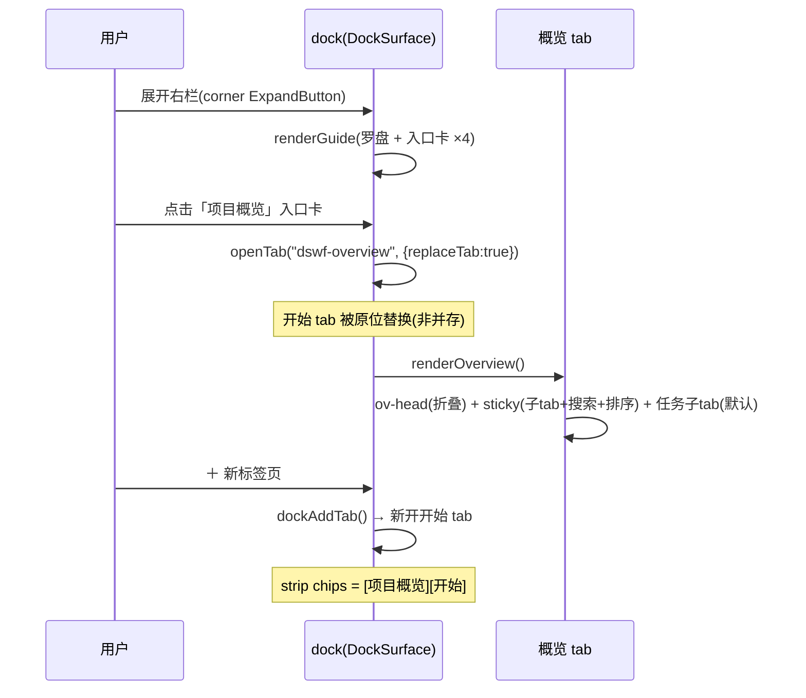
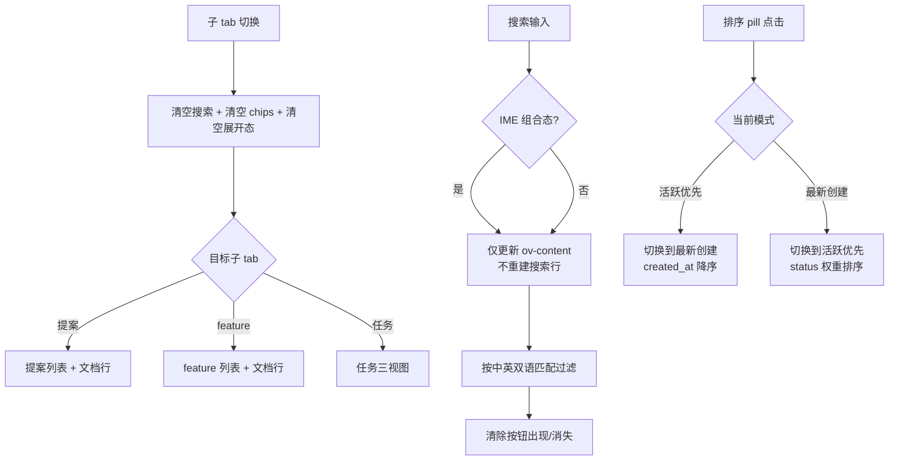
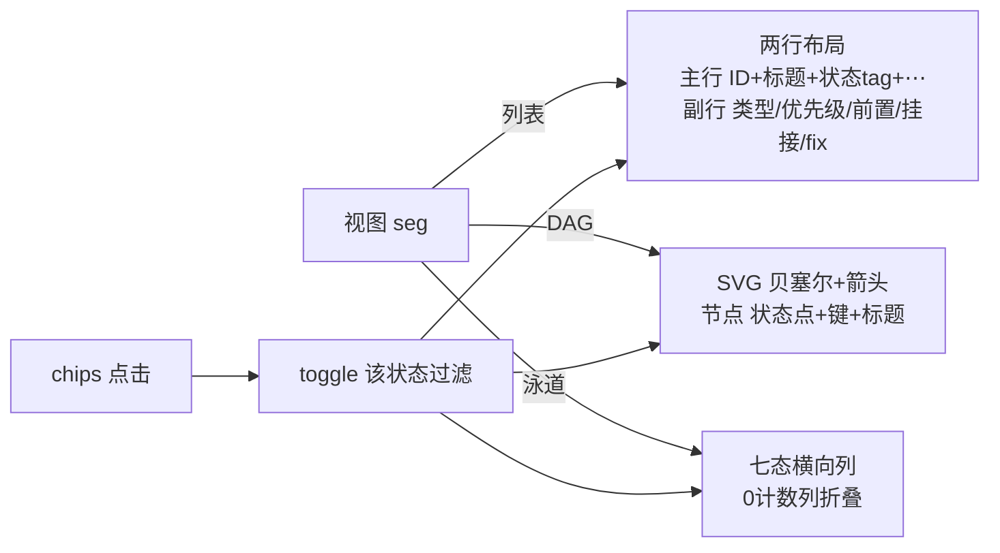
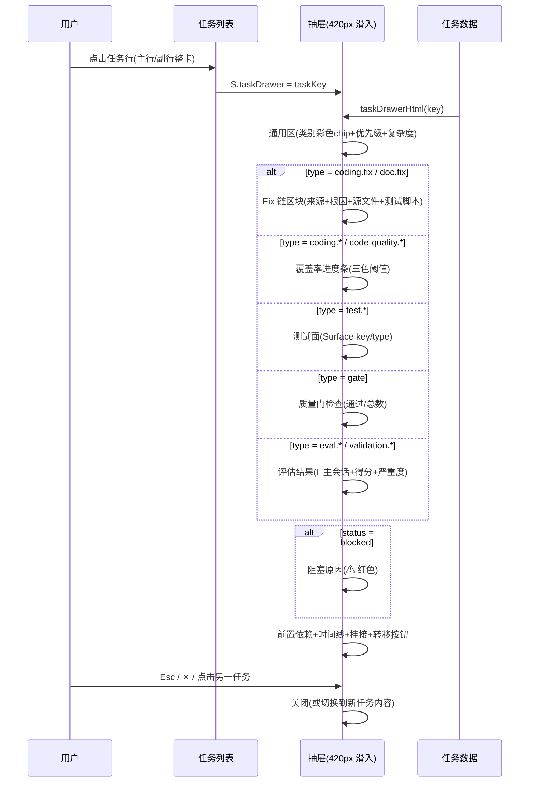
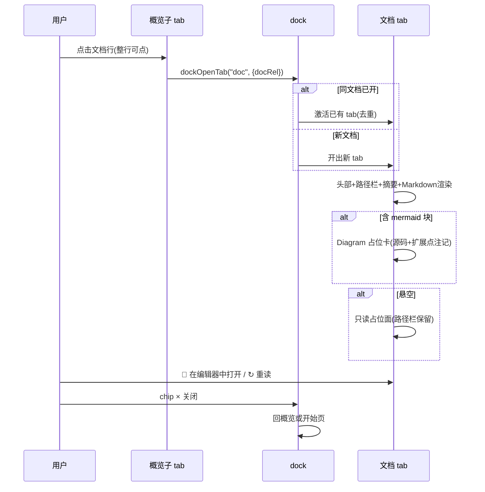
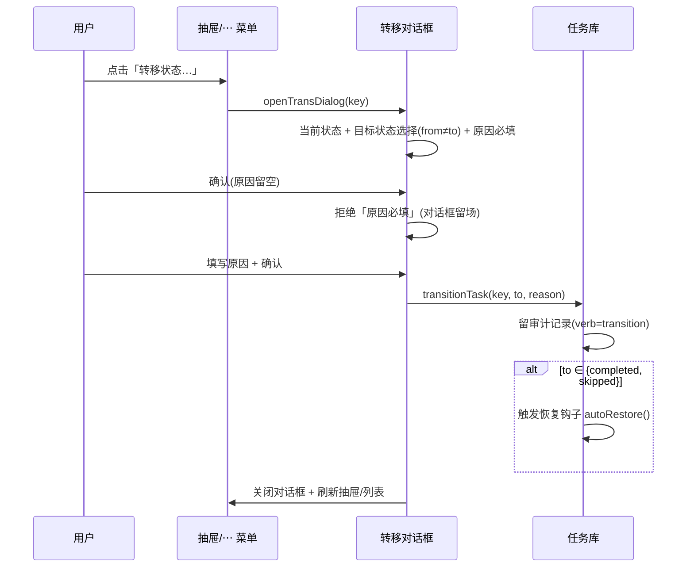
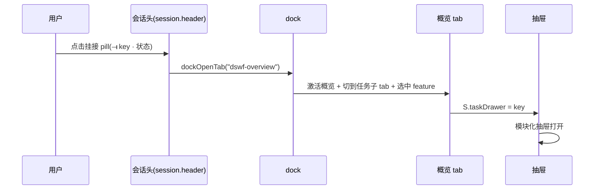
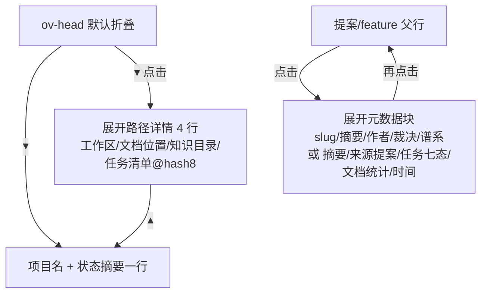
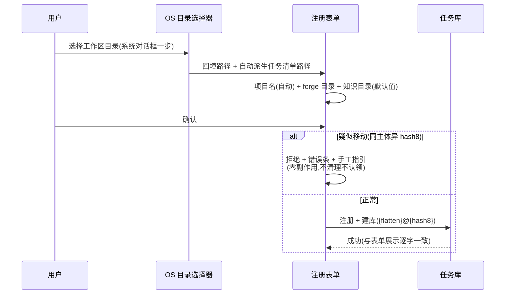

# dsh-forge M2 — UI Design（Web）

> **设计基线（v6）**：产品形态以现有代码现态为准（fix-25/29/38/40/42 后），概览 = 官方 ui-dockkit 右栏 tab。经两轮 UI/UX 专家评审（P1-P5 + R1-R7 全部落地）+ 老 forge 20 种任务类型源码调研（模块化详情抽屉）。冒烟 44 断言全绿。

## Design System

> 令牌纪律：只引用 `--dsw-*` 语义令牌（上游 ui-theme 实值），禁裸色值/裸字号；亮/暗双主题。类型类别色彩：编码=蓝 / 文档=紫 / 测试=青 / 评估=红 / 验证=琥珀 / 质量门=绿。

## Navigation

- **左栏（官方 ui-sidebar 壳）**：品牌行（鲸 mark）→ PanelRow 仅「知识库」（M2 不加行）→ 工作区浏览区（fix-42 treeitem）。
- **中区（官方 main 面板互换）**：会话（官方 ConversationRoot + conversation.view 三签——M2 不加签）⇄ 知识 ⇄ hero；概览不占中区。
- **右栏 = 官方 ui-dockkit（DockSurface）**：
  - **开始 tab = dsh 官方 GuideBody 逐形态**：罗盘 CompassGlyph 56px hero + 380px 入口卡 ×4（**项目概览[M2 排最前]** + 工作区文件[Ctrl+P] + 新建终端 + 浏览器[Ctrl+T]）；entry → `openTab(kind, {replaceTab:true})`。
  - **「项目概览」tab = M2**：开始页入口卡开出或会话头挂接 pill 跳转。
  - **文档 tab**：文档行点击开出（按 docRel 去重）；关闭后回概览或开始页。
  - ＋（`dock.addTab`）→ 新开开始 tab；**dock chrome**：⛶ 全屏 + ▯ 收展（dsh 原生）。

---

## UF-1 「项目概览」dock tab

### 结构

```
ov-panel(dock tab body ~460px)
├── ov-head(默认折叠):项目名 + 一行状态摘要(feature · N 会话 · N 完成) + ▾ 展开路径详情
├── ov-sticky:子 tab(提案|feature|任务) + 搜索栏(中英双语) + 排序 pill(⇅ 活跃优先/最新创建)
├── [提案子tab] 提案父行(▸展开元数据:slug/摘要/作者/创建/裁决/谱系) + 文档行(📄 proposal.md [已接受] ›)
├── [feature子tab] feature 父行(▸展开:摘要/来源提案/任务七态/文档统计/时间) + 文档行(不含提案)
└── [任务子tab]
   ├── ov-taskbar:feature pill + 计数 + 视图 seg(列表|DAG|泳道) + 排序 pill
   ├── 七态过滤 chips(0 计数禁用+淡化)——三视图统一过滤
   ├── [列表] task-item 两行布局:主行(ID+标题+中文状态tag+⋯) + 副行 11px(类型/优先级/前置/挂接/fix)
   ├── [DAG] SVG 贝塞尔 + 箭头 marker(前置绿/普通边框色) + 节点(状态点+键+标题) → 点击开抽屉
   └── [泳道] 七态横向列(0 计数列折叠) + 卡片 → 点击开抽屉
```

### 排序

三子 tab 共用排序切换（`⇅ 活跃优先` / `⇅ 最新创建`）：
- **活跃优先**（默认）：in_progress → blocked → pending → … → completed
- **最新创建**：created_at 降序

### 搜索

三子 tab 共用搜索栏，同时匹配中英双语（任务标题/key/类型/状态中英；提案 slug/title/状态中英/摘要；feature slug/文档类型/路径/摘要）。搜索时仅更新内容区（IME 安全——中文组合态不被打断）。

---

## UF-2 文档浏览（SC4）· 概览提案/feature 子 tab + dock 新 tab

### Placement

概览 tab 的 feature/提案子 tab 点文档行 → **在 dock 开出独立 tab**（非抽屉；按 docRel 去重；多文档并存）。

### 文档 tab 内容

头部（文件名 + 只读徽标 + 悬空徽标）→ 路径栏（canonical 全路径 + 📁 在编辑器中打开 + ↻ 重读）→ 摘要块 → **Markdown 渲染**（标题/列表/引用/代码块）。**mermaid 代码块 → Diagram 占位卡**（⚡Diagram 头标 + mermaid 源码 + 「dsh 原生不支持——产品扩展点」注记）。

悬空文档 tab = 只读占位面（路径栏保留，不崩溃不写入不删行）。

---

## UF-3 会话头部挂接任务展示（SC6③ 挂接部分）

官方 session.header actions 位；双数据源分型（派发 ⟞=挂接表 / 执行 ⟞=records.session_id）；≤2 并排 + +N 溢出；pill 点击 → dock 开概览 tab + **任务详情抽屉打开**。

---

## UF-4 注册表单任务清单派生行（升级）

OS 目录选择器一步 → 表单；派生行含 hash8（@ 连接符）；疑似移动拒绝留场。

---

## 任务详情抽屉（模块化——按类型条件区）

**右侧滑入（420px）**，从任务行/DAG 节点/泳道卡片/挂接 pill/⋯ 菜单打开。

### 通用区（全部类型）

头部（状态点 + 任务键 + 中文状态标签）→ 标题 → 徽标行（**类别彩色 chip** + 优先级 + 预估 + 复杂度 + breaking）。

### 状态条件区

- `blocked` → **阻塞原因**（⚠ 红色文字）

### 按类型条件区（老 forge 源码对齐——20 种类型）

| 类型条件 | 区块 | 内容 |
|---|---|---|
| `coding.fix` / `doc.fix` | **Fix 链** | 来源任务（含状态）+ 根因 + 源文件路径 + 测试脚本 |
| `coding.*` / `code-quality.*` | **覆盖率** | 进度条（≥80% 绿 / ≥50% 琥珀 / <50% 红）+ 百分比 |
| `test.*` | **测试面** | Surface key/type + 测试类型名称（Journey 生成 / 脚本生成 / 测试运行） |
| `gate` | **质量门检查** | 通过数/总数进度条 + breaking 徽标 |
| `eval.*` / `validation.*` | **评估结果** | 🔑 主会话徽标（不分发 executor）+ 得分/100（色彩阈值）+ 严重度 |

### 共用底部

执行时间线（verb/时间/备注；auto-restore/auto-block 专用色）→ 挂接会话（派发/执行分型，点击可跳）→「转移状态…」按钮。

---

## 动态交互流程

### 流程 1：开始页 → 概览 tab



**关键行为**：`replaceTab:true` = 入口卡点击后**原位替换**开始 tab（非并存）；＋ 可再开开始页。概览 tab 关闭后 dock 底板回开始页。

### 流程 2：概览子 tab 切换 + 搜索 + 排序



**搜索匹配域**：任务 = 标题/key/类型/状态（中英）；提案 = slug/标题/状态（中英）/摘要；feature = slug/标签/文档类型/路径/摘要。

### 流程 3：任务三视图切换 + chips 过滤



**三视图统一过滤**：chips 过滤在 `vis` 层面生效——切到 DAG/泳道同样只显示过滤后任务集。0 计数 chip `disabled`（不可点出空态）。

### 流程 4：任务行点击 → 模块化抽屉



**打开途径**：任务行点击 / DAG 节点点击 / 泳道卡片点击 / 会话头挂接 pill / ⋯ 菜单「查看详情」。

### 流程 5：文档浏览（dock 新 tab）



### 流程 6：人工转移状态



### 流程 7：会话头挂接 pill → 概览 + 抽屉



### 流程 8：ov-head 折叠 + 提案/feature 行展开



**展开语义统一**：多开（可同时展开多个父行）；子 tab 切换时全部收起。

### 流程 9：注册流程（OS 选择器一步 → 表单）



### 流程 10：dock tab 生命周期

```mermaid
stateDiagram-v2
    [*] --> 开始_tab: dock 默认
    开始_tab --> 概览_tab: 入口卡点击(replaceTab)
    开始_tab --> 文件_tab: 原生入口(replaceTab)
    开始_tab --> 终端_tab: 原生入口(replaceTab)
    开始_tab --> 浏览器_tab: 原生入口(replaceTab)
    概览_tab --> 文档_tab: 文档行点击(新开)
    文档_tab --> 文档_tab2: 另一文档(新开;同 docRel 去重)
    [*] --> ＋: dock.addTab → 新开开始 tab
    概览_tab --> 开始_tab: chip ×(唯一 tab 时回 guide)
    文档_tab --> 概览_tab: chip ×(概览 tab 仍在)
    知识面板 --> dock_收起: 联动(rightbarViewPlan)
    dock_收起 --> dock_恢复: 回会话面板(记忆恢复)
```



---

## 原型（prototype/）

静态原型（index.html / styles.css / app.js / data.js / smoke.cjs）。**冒烟 44 断言全绿**。种子数据含 7 种类型（coding.feature/coding.fix/coding.refactor/doc/gate/test.run/eval.contract）+ 各类型专属字段（coverage/root_cause/source_files/surface_key/main_session/score/gate_checks/blocked_reason）+ 两个 mermaid 图表示例。

## 评审注记

- 两轮 UI/UX 专家评审（P1-P5 + R1-R7 全部落地）；老 forge 20 种任务类型源码调研（forge-cli/pkg/task/types.go Task struct + TaskTypeRegistry + prompt 模板差异）。
- dsh 原生**不支持 mermaid**（全安装树零命中）——Diagram 占位卡 = 产品扩展点，tech-design 裁决渲染方案。
- 与 PRD 的差异（Step 10 对账回写）：文档 = dock tab（非抽屉）；任务详情 = 抽屉（非内联展开）；排序可切换；DAG/泳道 M2 交付（非 M3）；搜索中英双语三子 tab 共用；开始页入口排序（项目概览最前）。
