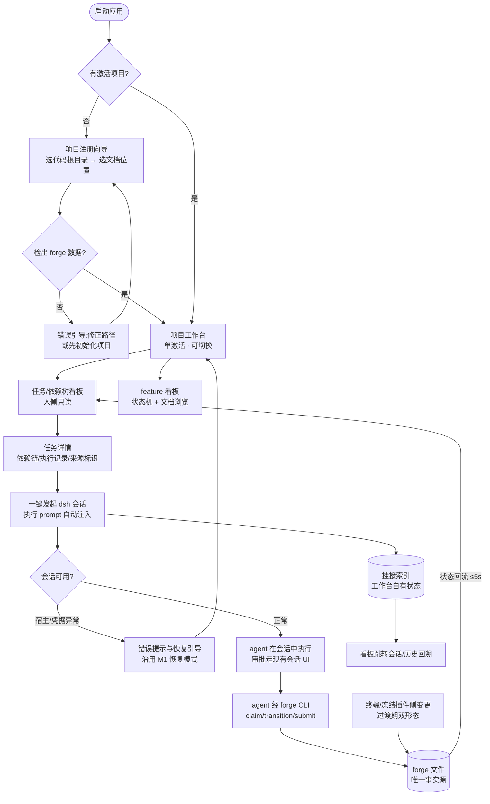

# dsh-forge M2 — 需求与会话工作台 · PRD Spec

> PRD Spec: defines WHAT the feature is and why it exists.

> **修订记录(2026-09-22)**:按 ui-plugin-foundation 基座提案(2026-09-21)Next Steps 记账修订——①硬前置依赖声明(What/Related Changes/manifest);②两级插件模型(G6/SC6/UF6/异常流:forge 核心 = 必备插件不可禁用,原「禁用回归纯壳」语义收缩至第三方插件);③SQLite 产品数据内核方向声明与事实源开放问题(DF001/DF005/存储约束)。

## Background

### Why (Reason)

M1(纯壳)已完成:三平台安装包、宿主子进程、托盘/通知、更新检测、崩溃恢复,主窗口 100% 继承上游会话 GUI,零 forge 能力。但 forge 的 SDD 方法论仍锁在"终端 + 插件"形态(提案线二):

- ① 工程资产散落:任务/依赖树只有终端表格(`forge task list`),feature 状态与过程文档只能翻文件,无项目维度统一视图;
- ② 管线推进依赖终端 slash command 与人肉盯守,任务执行进度无图形化载体;
- ④ agent 会话与工程资产割裂:会话不感知任务上下文,任务不关联产生它的会话——发起一个任务会话需要手工复制任务 prompt。

M2 是应用化路线的第一个能力里程碑,也是插件退役过渡的启动条件(会话挂接落地后,日常管线开始从冻结插件向应用迁移)。

### What (Target)

以项目为中心的需求与会话工作台:

- 项目注册与管理(项目三分模型:代码根目录 + 工作台自有状态 + 过程文档位置[仓内默认/仓外本地路径可选]);
- 任务/依赖树可视化看板(**人侧只读**:浏览、详情、worktree 标识、变更来源标识);
- feature 看板(状态机可视化 + 五类过程文档应用内只读渲染);
- 会话挂接(从任务一键发起 dsh 会话 + 任务执行 prompt 自动注入 + 挂接关系持久化 + 状态回流 + 历史回溯);
- 全部 forge 能力以插件交付,**两级插件模型**(2026-09-21 定向):forge 核心 = **必备插件**(内置 bundle 分发、不可禁用、仅作者维护,消费基座槽位 + 贡献自有槽位供第三方扩展);第三方插件可启停;装配走 ui-plugin-foundation 基座(产品级配置 = 插件树唯一事实源,零壳代码焊死);
- **硬前置**:ui-plugin-foundation 工程基座(至少其 spike + bundle 配置化完成)就绪后,M2 的 UI 插件任务方可开工(2026-09-21 独立提案);
- 前置 spike:dsh 插件机制 vs forge skill/hook/subagent 语义等价性(= SC8,首个任务,结论门控后续设计;与基座的装配路线 spike 验证面不同,互不替代)。

**操作主体模型**:任务状态变更(add/claim/transition/submit/reopen 等)全部由 **agent 在会话中**经 forge CLI 执行,或由人在**终端**(过渡期)执行;应用看板对人为只读,不提供写操作入口。两者(会话/终端)可执行的操作集合允许重合,看板对每笔变更统一标记来源。

### Who (Users)

- ① 产品线作者本人(forge + dsh 作者):双形态(终端插件/应用)日常使用者,M2 的第一用户与日常管线迁移的执行者;
- ② 社区 SDD 实践者:使用 forge 方法论 + agent 会话做开发、拥有多个项目的开发者。

利益相关:forge 仓(自研可控,可配合最小改造)、dsh 上游(零侵入,仅消费其插件机制与宿主底座)。

## Goals

| Goal | Metric | Notes |
|------|--------|-------|
| G1 任务可视化 | 看板信息覆盖 `forge task list` 全部维度(状态/依赖树/worktree/记录);真实项目注册后看板首屏 ≤2 秒(500 任务规模) | 人侧只读;写操作归 agent/终端 |
| G2 会话挂接 | 从任务卡片 **1 次点击**发起 dsh 会话;任务执行 prompt(`forge prompt get-by-task-id` 输出)100% 自动注入、零手工粘贴;挂接关系 100% 持久化可回溯 | 挂接索引为工作台自有状态 |
| G3 状态时效 | 会话/终端侧的任务变更,看板**免手动刷新**可见,≤5 秒 | 写入性能基线 |
| G4 feature 看板 | feature 状态机可视化;manifest/prd/design/ui/tasks 五类文档应用内可读 | 只读渲染 |
| G5 项目管理 | 项目注册 ≤3 步;多项目注册 + 单激活切换;过程文档位置仓内默认/仓外本地路径可选 | 三分模型落地 |
| G6 插件化(两级模型) | forge 能力 100% 以插件交付——核心 = 必备插件(不可禁用);第三方插件可启停,禁用后仅该插件能力退出、数据零损坏 | 壳内核不因能力增减改动;装配经基座产品级配置,零壳代码焊死;「不可禁用」执行点 = tech-design 待决(其清单输入必须派生自产品级配置) |

## Scope

### In Scope

- [ ] 项目注册与管理:多项目注册、单激活切换、移除;注册向导 ≤3 步(选代码根目录 → 选文档位置[仓内默认/仓外本地路径] → 完成);项目三分模型落地(工作台自有状态独立存放,不与 forge 数据混放)
- [ ] 任务/依赖树看板(人侧只读):图形化依赖树、状态分组/列表视图、worktree 标识、筛选排序;任务详情面板(描述/依赖链/执行记录);规模假设 ≤500 任务
- [ ] 变更来源标识:每笔任务状态变更在看板标记来源[会话/终端],操作主体模型如 Background 所述
- [ ] feature 看板:feature 列表、状态机可视化、manifest/prd/design/ui/tasks 五类文档只读渲染
- [ ] 会话挂接:从任务一键发起 dsh 会话(任务执行 prompt 自动注入);任务↔会话挂接关系持久化;会话引起的任务状态变化回流看板(≤5 秒);跳转主窗口现有会话 UI(执行与审批在现有会话 UI 完成);历史挂接回溯
- [ ] 文档外置:过程文档仓外本地路径支持(默认关闭,需显式选择;外置文档与仓内格式一致)
- [ ] 能力插件装配(消费基座):forge 能力插件经产品级配置装配(ui-plugin-foundation 交付件),增删能力零壳代码改动
- [ ] 插件启停(两级模型):第三方插件(测试 fixture,如基座 hello-world)启用/禁用,读写产品级配置(基座预留的唯一事实源,产品清单条目对运行时启停只读);forge 核心插件呈现为必备、不可禁用(执行点 tech-design 定)
- [ ] 前置 spike:dsh 插件机制 vs forge skill/hook/subagent 语义等价性(首个任务,产出结论与兜底路线建议,归档 design/;= SC8,与基座装配 spike 互不替代)

### Out of Scope

- 看板**人侧写操作**(手动 add/claim/transition/submit/reopen):人基本只看不修改,写操作由 agent 会话或终端执行;出现明确需求时再纳入后续里程碑
- wiki 对接、知识库(项目级/跨项目)、测试用例管理(M3)
- 管线原生化(brainstorm→PRD→设计→任务→执行应用原生工作流)、对抗式评估器、Quality Gate UI、插件退役完成(M4)
- 看板内嵌会话面板(split view)、多窗口并行项目视图(M3+)
- forge CLI 机制重构:退役方向已定(终点 = 应用 API + dsh tool,CLI 不保留,2026-09-21);M2 以插件宿主半身 spawn CLI 为过渡形态,形态与节奏属 SC8 spike / M4 设计域
- SDD 流程轻量化:forge 侧独立演进,另行提案
- 修改 dsh 上游仓库(零侵入约束)
- 任务数据的索引/缓存存储与 SQLite 数据内核实现:数据内核方向已声明(SQLite 入 Electron 壳,2026-09-21,M2/M3 落地);落地形态、事实源关系(forge 文件 vs SQLite)与数据 API 面留 /tech-design 与 M3 设计,落地前 forge 文件为唯一事实源
- forge 核心插件「不可禁用」的执行点(配置保护分区 vs 壳侧守卫):tech-design 待决项(决策约束见 G6),本文只验收行为结果(SC6)

## Flow Description

### Business Flow Description

主流程:启动应用 →(无激活项目 → 注册向导:选代码根目录 → 选文档位置[仓内默认/仓外路径] → 完成;路径未检出 forge 数据时引导修正)→ 项目工作台(单激活,可切换)。

工作台内两条使用线:

1. **人浏览线(只读)**:任务/依赖树看板 → 筛选/排序 → 任务详情(描述/依赖链/执行记录/变更来源标识);并行入口 feature 看板 → feature 状态机 → 文档浏览(五类文档只读渲染)。
2. **会话线(状态变更的唯一应用内通道)**:任务卡片一键发起 dsh 会话 → 任务执行 prompt 自动注入 → agent 在会话中执行(审批走主窗口现有会话 UI)→ agent 经 forge CLI 变更任务状态 → forge 文件(唯一事实源)→ 状态回流看板(≤5 秒,标记来源[会话])→ 挂接关系持久化 → 看板可跳转会话、回溯历史挂接。

异常流:注册路径无 forge 数据 → 错误引导(修正路径或先初始化项目);会话发起失败(宿主/凭据异常)→ 错误提示与恢复引导(沿用 M1 崩溃恢复/配置引导模式);第三方插件禁用 → 仅该插件注入内容退出,必备能力与工作台不受影响(必备插件不可禁用)。

### Business Flow Diagram

### Data Flow Description

| Data Flow ID | Source System | Target System | Data Content | Transport | Frequency | Format | Notes |
|-----------|--------|----------|----------|----------|------|------|------|
| DF001 | 应用(看板) | forge CLI | 任务/feature/文档查询与发起会话所需 prompt | 子进程调用(机制由设计定) | 按需 | 文本输出 | 只读为主;应用不绕过 CLI 改写数据;spawn CLI 为过渡形态(CLI 退役方向已定,终点 = 应用 API + dsh tool);SQLite 数据内核落地后查询面可切数据 API——事实源关系为 M2/M3 开放问题,落地前 forge 文件为唯一事实源 |
| DF002 | agent 会话 / 终端 | forge CLI | 任务状态变更(add/claim/transition/submit/reopen) | CLI 调用 | 按需 | forge 数据格式 | 唯一事实源;状态机由 CLI 维护 |
| DF003 | forge 文件 | 应用(看板) | 任务/feature/文档数据 | 准实时感知(机制由设计定) | 变更后 ≤5s | markdown / json | 来源标识随变更可辨(会话/终端) |
| DF004 | 应用(挂接) | dsh 宿主 | 发起会话 + 任务执行 prompt 注入 | 宿主接口(spike 后定) | 按需 | 会话消息 | 等价性 spike 前禁止假设结论 |
| DF005 | 应用 | 工作台自有状态(产品数据内核) | 项目注册表/挂接索引/视图状态(+任务索引,派生) | 本地读写(数据 API) | 按需 | SQLite(方向声明 2026-09-21;落地形态留 /tech-design) | Electron 侧产品数据内核,独立存放、不与 forge 数据混放;任务 CRUD 等 API 面与事实源关系 M2/M3 设计定;落地前 forge 文件仍为唯一事实源 |

## Functional Specs

> UI 功能规格详见 [prd-ui-functions.md](./prd-ui-functions.md)。

### 操作主体模型(业务规则)

| 操作 | 人在应用看板 | agent 在会话 | 人在终端(过渡期) |
|------|------------|--------------|------------------|
| add / claim / transition / submit / reopen | ✗(无入口) | ✓ | ✓ |
| 发起会话 + 上下文注入 | ✓ | — | — |
| 浏览(看板/详情/文档/回溯) | ✓ | — | ✓(forge CLI) |

- 应用内任务状态变更的唯一通道 = 从任务发起的 agent 会话;人需手动变更时走终端(过渡期双形态)。
- 可重合操作(agent/终端均可执行同一操作)由 forge 状态机保证一致性;看板对每笔变更标记来源[会话/终端]。

### Related Changes

| # | Project | Module | Change Point | Updated Logic |
|------|----------|----------|------------|----------------|
| 1 | dsh-forge(本仓) | 桌面壳 | 新增工作台 UI 与 forge 能力插件 | 壳内核不因能力增减改动;两级插件模型——forge 核心 = 必备插件(不可禁用),第三方可启停 |
| 2 | forge(Z:\project\ai\forge,自研) | CLI | 评估最小配合改造:变更来源标识可辨(调用方透传)、只读查询输出稳定性 | spike/tech-design 评估;原则 = forge 数据格式不变,不产生第二事实源 |
| 3 | dsh 上游 | 插件机制 | 消费其插件机制承载 forge 能力 | 零侵入,禁止修改上游仓;等价性结论未出前禁止假设 |
| 4 | dsh-forge(本仓) | 插件工程基座(ui-plugin-foundation) | 消费其交付:产品级配置装配、版本一致性断言、工程模板 | **硬前置依赖**:至少其 spike + bundle 配置化(基座任务 2/5)完成后 M2 UI 插件任务开工;基座交付件不重复实现 |

## Other Notes

### Performance Requirements

- Response time:状态回流 ≤5 秒(会话/终端变更 → 看板免刷新可见);看板首屏 ≤2 秒(500 任务规模);一键发起会话到会话界面可交互 ≤3 秒
- Concurrency:单用户桌面应用;并发约束 = 双形态(应用/终端/插件)交替操作同一项目时感知不丢失、互不破坏
- Data storage:forge 文件为唯一事实源(应用只读消费);工作台自有状态独立存放——SQLite 产品数据内核方向声明(Electron 侧,2026-09-21,M2/M3 落地;形态与事实源关系留 /tech-design);规模假设:≤500 任务/feature、≤50 feature/项目、≤20 注册项目
- Compatibility:三平台(Windows/macOS/Linux)继承 M1;工作台 UI 文案中英双语(继承 M1 壳级决定)

<!-- Override: Performance Baseline enabled by signal "延迟/实时/性能" -->

### Data Requirements

- Data tracking:任务变更来源标识[会话/终端];任务↔会话挂接关系;任务执行记录(经 forge records)
- Data initialization:首次注册项目时扫描既有 forge 数据(任务/feature/文档)建立视图
- Data migration:无迁移——forge 数据格式不变、只读消费;工作台自有状态为新增

### Monitoring Requirements

- 本地应用日志与任务操作历史可查(变更来源/挂接事件),用于双形态交替问题排查;无服务端监控

### Security Requirements

- Transport encryption:不引入网络监听(继承 M1 无端口安全模型);凭据沿用 $DSH_HOME 体系不变
- Storage encryption:不新增凭据存储;工作台自有状态不含敏感凭据
- Display masking:不适用(无敏感数据展示面)
- Rate limiting:不适用(桌面单用户)
- 边界约束:仅对**已注册项目路径**执行 forge CLI;仓外文档路径需注册时显式授权;过程文档(含 markdown 渲染)防护内容注入

<!-- Override: Security Review enabled by signal "权限/子进程与路径授权边界" -->

### 继承约束(Non-Functional,来自 M1 与提案)

- 离线自足(无网络依赖功能);常驻进程足迹 = 2 不变(forge CLI 按需拉起、执行完退出);无监听端口;零侵入 dsh 上游
- 插件化(两级模型,2026-09-21 修订):forge 核心 = 必备插件(内置分发、不可禁用、仅作者维护),第三方插件可启停;壳内核不因能力增减而改动;装配走产品级配置(基座交付),零壳代码焊死
- 双形态一致性:过渡期内应用与冻结插件(3.x)共享 forge 数据格式,互不破坏

---

## Success Criteria(M2 里程碑验收)

- [ ] SC1 真实项目数据一致性:注册本仓 dsh-forge,看板任务数/状态/依赖与 `forge task list` 输出一致(含 M1 48 个已完成任务),首屏 ≤2 秒
- [ ] SC2 零终端只读闭环:人在应用内完成"查看任务详情 → 一键发起会话 → agent 执行任务操作 → 看板 ≤5 秒回流确认",全程零终端;看板对人无任何写操作入口
- [ ] SC3 会话注入链路:从任务一键发起真实 dsh 会话,会话首条用户消息包含 `forge prompt get-by-task-id` 完整输出;会话内 agent 执行一次 claim,被看板 ≤5 秒捕获并标记来源[会话]
- [ ] SC4 feature 看板:dsh-forge-m1 显示 completed 状态;manifest/prd/design/ui/tasks 五类文档应用内可读
- [ ] SC5 仓外文档:以仓外路径注册的 forge 项目,看板/feature/文档全部正常,格式与仓内一致
- [ ] SC6 两级插件模型:forge 核心能力插件以必备身份经产品级配置装配(基座路径,壳代码零硬编码),启停面呈现为必备且不可禁用(执行点由 tech-design 裁决,本文只验行为结果:必备插件无可用禁用通道);第三方插件(测试 fixture)禁用 → 仅该插件注入内容退出,工作台与会话能力不受影响;重新启用 → 恢复;全程 forge 数据零损坏
- [ ] SC7 双形态交替:冻结插件(终端)与应用交替操作同一项目(各 ≥1 次读写向操作),状态无损坏(验收脚本往返断言)
- [ ] SC8 spike 落档:dsh 插件机制 vs forge skill/hook/subagent 语义等价性 spike 报告归档 design/,含结论与兜底路线建议

---

## Quality Checklist

- [x] Is the requirement title accurate and descriptive
- [x] Does the background include all three elements: reason, target, users
- [x] Are the goals quantified
- [x] Is the flow description complete
- [x] Does the business flow diagram exist (Mermaid format)
- [x] Is prd-ui-functions.md referenced and UI specs complete
- [x] Are related changes thoroughly analyzed
- [x] Are non-functional requirements considered (performance / data / monitoring / security)
- [x] Are all tables filled completely
- [x] Is there any ambiguous or vague wording
- [x] Is the spec actionable and verifiable
