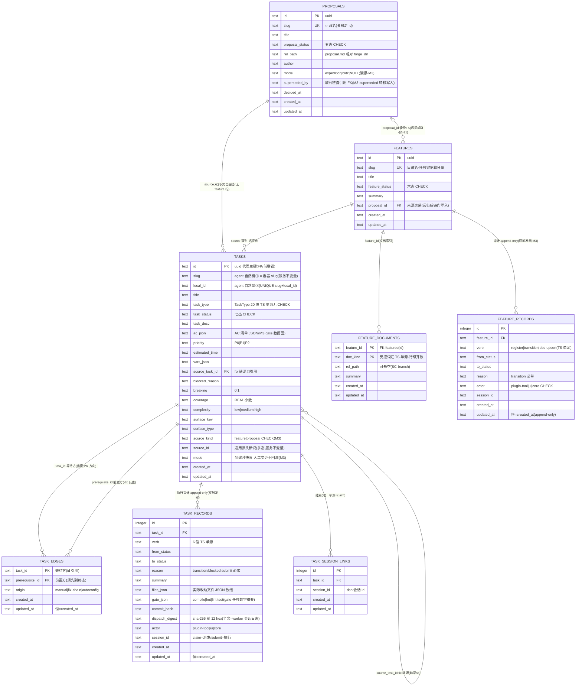

# ER Diagram: dsh-forge M3 —— 每工作区任务库（forge.db·M3 终态）

> 引擎 = SQLite（better-sqlite3 13.0.3，core 进程内多句柄）。库部署于 `{tasksHome}/{flatten}@{hash8}/forge.db`（惰性首开）；同目录 `logs/{slug}.jsonl` = 容器维度业务日志（plugin 写·非 schema 对象）。
> **落地方式 = v1 直改**（用户裁决 2026-10-08：产品未上线零兼容义务）——`workspace/migrations.ts` v1 DDL 直接改为本终态；`FORGE_DB_SCHEMA_VERSION = 1` 不变；无迁移路径；开发期存量 dogfood 库废弃（手工删除，发现面重扫）。
> 输入底稿 = [db-schema.md](../../../proposals/dsh-forge-m2-pipeline/db-schema.md)（§6 裁决 39 项）+ M2 落地形态（[M2 schema.sql](../../dsh-forge-m2-pipeline/design/schema.sql)）+ M3 提案/UI 裁决 + 本设计用户裁决（source 双列 / features 恒远征 / main_session 砍除）。

## Entity Relationships

（schema_meta / app_key_logs 两基建表不占域表计数，形态沿 M2。）

## Entity Details

八域表列级细节以 [schema.sql](./schema.sql) 为唯一权威；M3 语义裁决锚：

| 表 | M3 裁决锚 |
|---|---|
| proposals | +mode（创建时写入·UI mode chip；NULL = 扫描吸收旧提案缺省占位）；成链门 = accepted ∧ mode='expedition'；**+superseded_by**（谱系取代链·superseded 转移必带目标写入） |
| features | **零改动·恒远征语义**（无 mode 列——存在即远征，成链门保证；UF-4「固定远征」硬编码恒真） |
| feature_records | 新增第八域表（§6-35④ 兑付）；verb 三值（mode-sync 不存在——features 无 mode 列）；append-only 双触发器 |
| tasks | **source_kind + source_id 通用源头双列**（多态引用无 DB FK——引用完整性 = 服务不变量 + 校验动词，M2 差异 #9 同款处理）；+mode 快照 + ac_json；**main_session 砍除**（老 forge 形态约束残留·新形态零消费者） |
| task_edges / task_records / task_session_links | M2 形态不动；同容器边约束 = 两端 source_id 相等（服务不变量） |

## Index Design

| Table | Index | Columns | 说明 |
|---|---|---|---|
| tasks | idx_tasks_source_status | (source_id, task_status) | 容器列表 + chips + 写时增量断言（取代 M2 idx_tasks_feature_status） |
| tasks | idx_tasks_source | (source_task_id) | fix 链溯源 / 链深计数 |
| task_edges | idx_edges_prerequisite | (prerequisite_id) | 恢复钩子反查（§6-19 物理加速） |
| task_records | idx_records_task / idx_records_session | (task_id, id) / (session_id) | 时间线按序读 / 执行会话挂接反查 |
| feature_records | idx_fr_feature | (feature_id, id) | 审计按序读 |
| task_session_links | idx_tsl_session | (session_id) | 会话头 pill 反查 |

**EQP 断言沿 M2**：就绪集 / 前置守卫 / 恢复钩子反查三查询命中索引或 PK 前缀。

## Relationships（M3 语义）

| From | To | Cardinality | Business Meaning |
|---|---|---|---|
| proposals | features | 1:N（惯例留空间） | 远征成链谱系（transitionProposal accepted 内聚单步原子） |
| proposals | tasks | 1:N | **突击直挂**（无 feature 行——任务容器 = 创建时事实） |
| proposals | proposals | 1:N | 取代链（superseded_by 自引用·superseded 转移写入） |
| features | tasks | 1:N | 远征链任务（tasks.slug ≡ 容器 slug 服务不变量） |
| features | feature_records | 1:N | feature 域审计（每动词一行） |

## 不变量与守卫（六条）

1. `tasks.slug ≡ source 解析出的容器 slug` + `source_id` 必命中 `source_kind` 对应表（写入时校验；validateFeatureTasks 扩展）。
2. 同容器边约束：task_edges 两端 source_id 相等。
3. mode 快照不回溯：setProposalMode 只写 proposals.mode，tasks.mode 永不触碰。
4. 相位推导机仅 feature 容器参与（proposal 容器无相位域，derive 闭包按 source_kind 过滤）。
5. 成链原子性：transitionProposal(accepted·expedition) 单事务 = proposals + features + feature_records 三行全成全败。
6. 审计伴随：feature 域全部动词每次写入伴随 feature_records 行。

## Change Impact Analysis

- 中央 state.db：**零改动**（settings 走 `{userData}/forge-settings.json` 文件，非中央库）。
- 与 M2 落地形态差异 5 项（见 schema.sql 头注与 tech-design §Data Models 差异总表）：feature_records 新表 / proposals.{mode, superseded_by} / tasks 源头双列化+mode+ac_json+main_session 砍除 / 索引更名 / v1 直改无迁移。
- 与 db-schema 八表底稿的差异继承 M2 差异清单 #1–#9 全部条款（本设计未回退任何 M2 修订）。
