# Technical Design: dsh-forge M3 —— 自举·模式预设（双预设 + 拆包 + 技能迁移 + 提案管线消费）

> 输入：PRD 四件套（spec 9 SC + stories 9[含 4A] + ui-functions 4 UF/数据约束/流程图/消息体示例）+ ui-design v24（170 断言）+ 里程碑提案（全部裁决出处）+ db-schema 底稿（M2 预设计·M3 标注）+ S5/S6 spike 结论（dev 全绿）+ M2 tech-design 先例 + 全仓代码侦察报告（2026-10-08）。
>
> **本设计十一项用户裁决（2026-10-07/08 tech-design 评审期）**：①派发面 = A+B 整合架构·M3 只落地单发——`dispatchTask` 复合动词（claimTask+spawnWorker 合并，简报零进模型上下文）；②transitionFeature **收窄不进 tool 面**（PRD In Scope ② 枚举偏离记账——db-schema §6-27/§6-28 面分治与相位推导机不被旁路）；③tasks 表 **v1 直改**（产品未上线零兼容义务，无迁移路径，存量开发库废弃注记）；④`source_kind` + `source_id` **通用源头双列**（多态引用·引用完整性 = 服务不变量）；⑤远征成链 = **transitionProposal 服务内聚**（accepted·expedition → 同事务自动 registerFeature）；⑥**features 恒远征不加 mode 列**（成链门保证一致性）；⑦**main_session 砍除**（老 forge 形态约束残留·新形态零消费者）；⑧业务日志 = **事件驱动** `logs/{slug}.jsonl`（容器维度·两层事件抽象·**产品自建总线**——形制参考 dsh/Cordis 事件机制但零上游复用）；⑨tool 返回面 = **双友好格式化文本**（agent 友好 + 人类可读·老 forge 先例）；⑩dispatchPrompt 全文 = **worker 会话日志**（三层存放：全文/指纹/对账锚）；⑪spawn 失败 = **插件内机械防线**（会话作用域计数器·易失·3 连败粘住 halted）+ 池快照现状感知（每次返回附载）。

## Overview

M3 在 M2 七工件上扩为**八工件**（+`packages/plugin-forge-spec`；七工件口径 = conventions TECH-monorepo-001——M2 tech-design「六工件」为 path-key 并计遗漏的旧口径，本设计沿 conventions 口径），四个交付面一次装齐：

1. **预设基座**：`apps/host` profile 新增双预设声明行 + registry default 覆写（`presets/{cordis,expedition,blitz}.patch.yml`，底稿 = tech-research §5.6 + spike overlay.mjs 实证形态）——**物化分叉**（PRD Data Requirements 既定）：预设行 = boot overlay 每启注行（行所有权 = 产品工件，customSkillDirs 注行时物化**绝对路径**——`!!js` 全形态死刑裁决）；`ui-settings` 开关行 = **首启预置**（PROFILE_TEMPLATE 一次性 + materialize 增量补行——老用户升级补写、id 键控已存在不覆盖，此后归用户运行时）。
2. **拆包 + 技能迁移**：`plugin-forge`（管线核心：quick-tasks / run-tasks / submit-task / run-tests / brainstorm 技能 + **六 tool** = addTask / submitTask / queryTask / createProposal / transitionProposal / **dispatchTask**）/ `plugin-forge-spec`（规格深化：write-prd / ui-design / tech-design / gen-journeys / gen-contracts / gen-test-scripts / breakdown-tasks / eval 幸存者 + registerFeature / upsertFeatureDoc / validateFeatureTasks 三 tool）；迁移源 = `Z:\project\ai\forge\plugins\forge\skills\`（22 目录，8 目标全在）；全部经 tool 读写落状态层。
3. **提案管线消费**：容器双轨（feature / 提案直挂）+ mode 溯源（proposals 列）+ 任务 mode 快照（tasks 列）+ 成链分叉内聚 + 提案/feature 子 tab 完整形态 + 诊断两路 + 「打开新会话」预填。
4. **gate 与自举**：submitTask AC 证据门（`ac_json` + gate.test 判定）+ gate 任务摘要门；M3.5 走查 = SC-M3 门。

**三条关键机制**（均可机械断言）：

1. **dispatchTask 派发面**：dispatcher 每轮单调用——插件代码内 claim → 收窄组装 → in-process driver spawn（阻塞）→ 返回结算。dispatchPrompt **零进模型上下文**（完整性与 token 双赢：模型不可转述改写、type-policy 重模板不双倍占上下文）；收窄矩阵按当次 `taskType` 查表（toolFilter）+ forgeSettings 读默认 LLM（agentOptions 显式携带优先于父会话继承）。
2. **容器双轨**：`source_kind`/`source_id` 二列——突击任务直挂提案（无 feature 行），任务键 slug ≡ 容器 slug（服务不变量）；`tasks.mode` 创建时快照（人工变更溯源不回溯的机械锚）；**features 恒远征**（存在即远征，成链门保证）。
3. **设置单门 + 事件日志**：forgeSettings 服务存储 = `{userData}/forge-settings.json`（路径经 boot overlay 注 core 行 config·bindingsFile 同型先例），core 新供 `forgeSettings` 服务单点读写——UI 设置分区（RPC）与 dispatchTask（服务注入）同门消费，派发时实时读（改完即生效无重启）；业务日志 = 工具发事件 → 监听器落盘 `logs/{slug}.jsonl`（容器维度全程可串联）。

## Architecture

### Layer Placement

| 工件 | M3 增量职责 |
|---|---|
| `apps/host` | profile 模板 + **presets/ 三 patch 底稿**（boot overlay 渲染物化绝对路径 + registry default 覆写）；**ui-settings 开关行首启预置**（template + 增量补行）；core 行 config 增 settingsFile 注入；ipc 增 `forge:settings/*`、`forge:proposals/{transition,setMode}` 注册；packaging 三处同步（PRODUCT_PACKAGES/REQUIRED_KEY_FILES/assertPreconditions + 闭包守护测试）+ plugin-forge-spec |
| `apps/web` | 提案子 tab 完整形态（UF-1）/ feature 子 tab 升级（UF-4）/ 任务子 tab 诊断 + 容器 pill 双轨 + 派发按钮与视图下拉（UF-3）/ Forge设置 分区（UF-2·client-plugin `settings.section` slot）/ `openSessionWithPreset` 组合子（+ 跳转既有派发会话缝）/ rpc client 扩三通道 + 容器参数 / 消息体纯函数 |
| `packages/core` | workspace schema **v1 直改**（feature_records 第八表 + proposals.{mode,superseded_by} + tasks 终态形态）；proposals 域（成链分叉内聚 + setProposalMode + mode 透传 + supersededBy 谱系 + listProposalDocs 扫描读面）；features 域（三动词审计行闭包）；tasks 域（容器双轨 + mode 快照 + ac_json + AC/gate 双校验 + taskStats 池扩展）；**forgeSettings 服务**（provide ×1）；validateFeatureTasks 容器校验域扩展 |
| `packages/plugin-forge` | **dispatchTask tool**（复合动词 + 收窄矩阵 + agentOptions + 池快照 + halted 防线）；createProposal 增 mode 透传；**事件总线 + 日志监听器**（产品自建）；tools 返回面 formatOk/formatErr 模板；skills 增 quick-tasks / brainstorm；run-tasks / submit-task / run-tests 改写（LLM 判断面聚焦 + dispatchTask 步骤 + 双模式指引 + **错配守卫提示行**——Story 1 AC4/Flow 1.5「派发入口提示」落点）；**deps 增 in-process driver**（boundaries pin 修订） |
| `packages/plugin-forge-spec`（新） | 三 tool（registerFeature / upsertFeatureDoc / validateFeatureTasks）+ `forge:spec` 系统提示段 + skills = 8 规格技能迁入适配（经 tool 读写）；deps = contracts + path-key；inject = `['forgeFeatures', 'tools', 'systemPrompt']`（faces 同型最小面） |
| `packages/contracts` | mode 词汇常量 + 收窄矩阵常量 + 事件两层联合类型 + ContainerRef DTO + settings DTO + 新通道常量 + 新错误码 ×3 + forgeSettings 服务签名 |
| `packages/knowledge` / `packages/path-key` | 零改动 |

### 组件图（关键增量）

```
+---------------- apps/host (main) ----------------+
| profile: presets/{cordis,expedition,blitz}.patch.yml
|   boot overlay 每启注行(物化绝对路径) → registry default=expedition
|   ui-settings 行首启预置(一次性+增量补行·让位用户) → hero 开关
| ipc +forge:settings/* +forge:proposals/{transition,setMode}
+------| bridge(白名单不变·方法扩) |------+
       v
+------ dsh host child (Cordis 容器) ------+
| [产品] core: 六服务 → 七(+forgeSettings)
|   · workspace schema v1 直改(八域表)
|   · proposals: transitionProposal→accepted 成链分叉内聚
|   · tasks: source 双轨 + mode 快照 + AC gate
| [产品] plugin-forge: dispatchTask ── in-process driver
|        ├→ toolFilter(矩阵×taskType) + agentOptions(forgeSettings)
|        ├→ 事件总线(自建) ─→ 日志监听器 ─→ logs/{slug}.jsonl
|        └→ 池快照(taskStats) + halted 计数防线
| [产品] plugin-forge-spec: 3 tool + 8 skills(仅远征组合)
+------| renderer (apps/web) ---------------------+
| 概览三子 tab 升级(UF-1/3/4) · Forge设置(UF-2)
| openSessionWithPreset: 平台会话编排 + agentPreset.select + composer 预填
+--------------------------------------------+
```

**child 进程来历**（架构评审答疑存档）：dsh 是外部上游平台（npm 精确 pin·零 fork），dsh 宿主官方形态 = 独立进程（`ELECTRON_RUN_AS_NODE=1 --expose-internals` 子进程——官方 Desktop 同款；direct-in-main 形态 P1 dogfood 实证「agent 工具派发恒挂起」禁回退）。dispatchTask 依赖的 spawn 通道 / `childCtx.tools.restrict()` / 组合继承只在 child 进程内可达——「派发面 = plugin-forge」由可达性决定。

### 边界与依赖变化（三条）

1. **plugin-forge deps 增 driver**：`@deepseek-ai/dsh-subagent-in-process-driver`（上游运行时包，profile RUNTIME_PACKAGES 已物化——零安装面变化）；`boundaries.test.ts` pin 修订 = 「contracts + path-key + **dsh 上游运行时包白名单**」——插件对 core 仍零实现级 import（纪律不破；driver 非 core）。
2. **plugin-forge-spec 新包**：packaging 三处同步 + 闭包守护（TECH-packaging-001——漏列 = 打包形态 boot ESM 解析断裂）。
3. **预设行所有权分叉**：boot overlay 注行 = 预设声明行（每启覆盖·产品工件）；首启预置 = ui-settings 开关行（一次性·用户可改）；两径不混。

## Interfaces

> 完整签名批二定稿；路由约定沿 M2（一切方法显式带 projectId；actor 由通道推断）。**tool 返回面规范**：所有 forge tool 返回 `formatOk/formatErr` 双友好格式化文本（成功首行 `✓ <动词结果>` + 键值行；失败首行 `✗ <code>` + 人话 + 违规清单逐行）；RPC/桥 typed error 信封照旧——双面分治不破。

### Interface 1: core 动词扩展（contracts `dto/forge.ts` 单源）

```ts
// forgeTasks
addTask(input: { projectId; source: ContainerRef;             // { kind: 'feature'|'proposal'; slug }
  title; type: TaskType; taskDesc?; acceptanceCriteria?: string[];   // → ac_json
  priority?; estimatedTime?; vars?; dependsOn?: string[]; sourceTask?: TaskRef;
  blockSource?; breaking?; coverage?; complexity?; surfaceKey?; surfaceType? })
  // 容器必须在场(服务不变量·多态引用无 DB FK);tasks.mode = 容器 mode 创建快照
  // (feature 容器恒 'expedition';proposal 容器取 proposals.mode·可 NULL)
claimTask(...)                        // 输入 featureSlug? → source?: ContainerRef(容器限定盲选·三处一体同步改含本动词);
                                      // dispatchPrompt 增容器语境行(SOURCE: feature|proposal slug)
submitTask(...)                       // 增两道 gate:ac_json 非空 && gate.test !== true → ERR_TEST_EVIDENCE_REQUIRED
                                      // (data 含 AC 清单);type='gate' && gate 缺席 → ERR_GATE_SUMMARY_REQUIRED
queryTask / taskDetail                // 增 container 水化 {kind;slug;title;summary?;mode;phase?}(诊断消息数据源)
listTasks / taskStats / taskGraph     // featureSlug? → source?: ContainerRef(三处一体同步改·含 claimTask);
                                      // taskStats 输出增 unmetPending(pending ∧ 前置未全满足计数——dispatchTask 池快照数据源)
validateFeatureTasks                  // 签名不变(feature 域校验;突击容器无入口)

// forgeProposals
createProposal(input: { projectId; slug; title; relPath?; status?; mode?: Mode })   // mode 由创建技能透传
transitionProposal(input: { projectId; proposalId; toStatus; supersededBy?: string }): Promise<ProposalRow & { chained?: FeatureRow }>
  // toStatus='superseded' 必带 supersededBy(目标提案 id 在场校验→写 proposals.superseded_by——UF-1 谱系「取代链」数据面)
  // ★成链分叉内聚(单事务):toStatus=accepted && mode='expedition' && 无同 proposal_id feature
  //   → registerFeature(同名 slug/title/summary 继承/proposalId) + feature_records(register) → 返回 chained
  //   mode='blitz'|NULL → 不成链(NULL 边界:先 setProposalMode,补链走显式 registerFeature)
setProposalMode(input: { projectId; proposalId; mode: Mode; reason: string })        // 新·律三唯一正门·UI 专属
  // 单事务只写 proposals.mode(tasks.mode 永不触碰=快照不回溯;features 无 mode 列无需同步)
listProposals(...)                    // 行增 mode(NULL = 缺省占位) + taskCount(JOIN tasks 按 source_id 分组——
                                      //   容器 pill「有任务的提案」判据 + 提案谱系联读)
listProposalDocs(q: { projectId; slug }): Promise<ProposalDocRow[]>
  // 提案文档区数据源(评审缺口#1 处置):只读扫描 docs/proposals/<slug>/ 全部 .md——发现面同族
  //   (零状态零写径·文件系统为事实源);行 = { fileName; relPath; title?; status? }(frontmatter 可选初值);
  //   UF-1 文档区「文档(N 篇)」与提案渠道 prefill「已生成文档」清单同源

// forgeFeatures
registerFeature(...)                  // 成链内聚调用 + 显式补链两用;闭包加 feature_records(register)
transitionFeature / upsertFeatureDoc  // 闭包加 feature_records(transition / doc-upsert)
listFeatureDocs(q)                    // 服务法 M2 已有(ForgeFeaturesService 五法)——M3 开 RPC 通道(UF-4 分层文档读面)

// forgeSettings(新服务·provide ×1)
get(): Promise<{ worker?: { provider: string; model: string; reasoning: 'low'|'medium'|'high' } }>
// (reasoning → agentOptions.effort 直映射——设置三段与上游请求字段一对一)
set(input: { worker: { provider; model; reasoning } }): Promise<void>
// 存储 = {userData}/forge-settings.json(路径经 boot overlay 注 core 行 config);单写者 = core
```

### Interface 2: dispatchTask（复合派发动词·plugin-forge）

```ts
// src/tools/dispatch-task.ts(dispatcher 专用;worker 面不含)
dispatchTask(input: { contextSlug?: string }): Promise<
  | { kind: 'spawned'; outcome: 'success'|'blocked'; taskRef; title; type; mode; digest;
      summary?; commitHash?; followUp?: TaskRef; pool: PoolSnapshot }
  | { kind: 'no-task'; pool: PoolSnapshot }                       // Z1 收工信号(池态区分收工/等待/疑似死锁)
  | { kind: 'halted'; reason: string }>                            // 连续 spawn 失败 ×3 粘住(本会话)
// PoolSnapshot = { pending; inProgress; blocked; unmetPending }(taskStats 现读·无状态)
// 内部执行序(纯代码·API/事件面交互):
//   1. core.forgeTasks.claimTask(API) → 任务+dispatchPrompt(守卫+就绪选择+幂等重入)
//   2. taskType→收窄矩阵(contracts 常量)→toolFilter;forgeSettings.get()→agentOptions(未配置=不携带)
//   3. in-process driver spawn(阻塞):childCtx.tools.restrict(toolFilter)+agentOptions 覆盖+组合继承
//   4. worker 执行 → core.forgeTasks.submitTask(API·AC gate)
//   5. 事件总线发事件 → 监听器落盘 logs/{slug}.jsonl;池快照附载每次返回
// 场景渲染(formatOk/formatErr):
//   spawned·success → "✓ feat-x/2.5 完成 — coding-fix · summary 行 · commit abc1234"
//   spawned·blocked → "⚑ feat-x/2.4 受阻 — 原因行 · 已建修复任务 fix-1(可继续派发)"
//   no-task         → "· 无就绪任务(池: 3 pending · 1 blocked)——可收工或稍后再试"
//   halted          → "✗ 连续 spawn 失败 ×3 —— 请检查环境(新会话复位)"
//   spawn 失败      → "✗ ERR_SPAWN_FAILED — 人话原因 + 指引(带 taskRef 重入重试/人工转移)"
// spawn 失败处置:任务留 in_progress 走幂等重入径(不走 submit-blocked——那是执行受阻语义);
//   计数器 = 插件内会话作用域·易失(冷启动重置;dispatch 会话可更换·新会话天然新计数)
```

**收窄矩阵常量**（contracts `worker-matrix.ts`；族→语义锁定，具体工具名映射表 = 实施期按当期上游工具面枚举核对 + G1 pin）：

| 工具族 | coding 族¹ | doc 族² | gate | 验证族³ |
|---|---|---|---|---|
| fs 读写 / fs 搜索 | ✓ | ✓ | ✓ | ✓ |
| shell（含 git） | ✓ | ✓（doc 亦仓库变更） | ✓ | ✓ |
| jobs（长跑测试） | ✓ | — | ✓ | ✓ |
| read_image | ✓（UI 断言截图） | — | — | ✓ |
| web | — | — | — | ✓ |
| forge 工具（submitTask + addTask） | ✓ | ✓ | ✓ | ✓ |

¹ coding-feature/enhancement/cleanup/refactor/code-quality-simplify/coding-fix/test-gen-*/test-run ² doc/doc-consolidate/drift/review/summary ³ validation-code/validation-ux/eval-contract/eval-journey
**全局拒绝**（一切 worker）：ask-user / delegation / todo / present；`skill` 不拒；claimTask / queryTask / dispatchTask 不入 worker 面。

### Interface 3: 事件两层抽象 + 业务日志（产品自建总线）

```ts
// 信封(一切事件共有):{ ts; sessionId; slug; type; payload }——事件必从某会话发出,信封恒有 sessionId
type ForgePluginEvent =
  | { type: 'task-claimed';     payload: { taskKey; taskType; mode; dispatchDigest } }
  | { type: 'task-spawned';     payload: { taskKey; workerSessionId; toolFilter; model } }
  | { type: 'task-submitted';   payload: { taskKey; outcome; reason?; commitHash? } }
  | { type: 'task-worker-done'; payload: { taskKey; workerSessionId; outcome; durationMs } }
  | { type: 'no-ready-task';    payload: { contextSlug } }        // 无任务字段——只记会话与语境
  | { type: 'tool-error';       payload: { verb; code; message } }
  | { type: 'proposal-created'; payload: { proposalId; mode } }   // …verb 级按需扩
```

- **总线**：产品自建进程内 emit/subscribe（形制参考 dsh/Cordis 事件机制——两层抽象/信封/订阅面；**零上游复用**，不受上游升级耦合）。工具执行只发事件（零日志代码）；监听器 = 唯一写者（标准化 → 落盘）。
- **日志组织**：`{tasksHome}/{flatten}@{hash8}/logs/{slug}.jsonl`——**容器维度**（proposal 或 feature 全程 agent 面业务日志同文件，事件自带 verb 区分）；归属规则：事件带任务 → 任务容器 slug；无任务 → `contextSlug`（dispatchTask 入参·run-tasks 技能约定传容器语境）；皆无 → `logs/_pool.jsonl`（纯兜底）。
- **串联读法**：按 taskKey 过滤 → claim（dispatcher 会话 id）→ spawn（dispatcher id + workerSessionId）→ submit（worker 自身会话 id）→ worker-done（dispatcher 视角）——任务级完整会话链；按 slug 过滤 = 容器全程。
- **dispatchPrompt 三层存放**（§6-11 沿袭）：全文 = worker 会话的 dsh 会话日志（首条消息·运行期内存 closeApp 后落盘）；指纹 = `dispatch_digest`（task_records.claim 行 + task-claimed 事件双记）；对账锚 = workerSessionId（task-spawned/worker-done 事件）。追溯三键闭环：taskKey → digest → workerSessionId → 会话日志全文。
- **分工边界**：logs/{slug}.jsonl = agent 面执行运营日志；UI 面状态变更审计 = feature_records / task_records / proposals.decided_at（DB）——两纪律不混不重复。

### Interface 4: RPC 通道族扩池（三处一体：contracts → web/rpc → host ipc）

| 通道 | 面 | 备注 |
|---|---|---|
| `forge:settings/get · set` | 人类 | Forge设置 读写 |
| `forge:proposals/transition` | 人类 | **M2 纪律 drift 修订**：transitionProposal 从 tool 专属 → 双面（UF-1 人工裁决；agent 面保留——评审发生在 agent 会话时技能代笔；transitionTask「决策人类、落笔机器」面分治同构） |
| `forge:proposals/setMode` | 人类 | 律三唯一正门；**agent tool 面无模式改写动词**（SC6 契约断言） |
| `forge:features/listDocs` | 人类 | UF-4 分层文档读（服务法 listFeatureDocs·M2 已有·M3 开通道） |
| `forge:proposals/listDocs` | 人类 | UF-1 提案文档区读（目录扫描·零状态——评审缺口#1 处置） |
| `forge:tasks/* · forge:features/*` | 既有 | 参数容器化改造；taskStats 输出增 unmetPending |

不新增 RPC 面：createProposal / addTask / submitTask 仍 tool 专属（claimTask 已退役并入 dispatchTask——仅存 core 服务 API，由 dispatchTask/桥/回放消费）。

### Interface 5: 预设装配 + 打开新会话

```
apps/host/src/profile/presets/
├─ cordis.patch.yml       # registry 覆写行: agent-preset-registry default: expedition
├─ expedition.patch.yml   # 预设行 = 上游 standard 全量镜像(config 全集!) + plugin-forge 行
│                         #   + plugin-forge-spec 行 + customSkillDirs[core,spec](物化绝对路径)
│                         #   + 远征 persona(只谈作风) + name 远征模式 + order 1
└─ blitz.patch.yml        # 同上 − spec 行 − spec 目录 + 突击 persona + name 突击模式 + order 2
```

- **物化**：renderBootOverlay 渲染时 customSkillDirs 解析为当形态绝对路径（dev = repo；packaged = resources 物化路径）；预设行每启注行。
- **开关预置**：ui-settings 行（hero 预设座位的显示开关·上游默认关）入 PROFILE_TEMPLATE——首启替用户写成开，**只写一次**（此后归用户：设置界面改的值不被覆盖）+ materialize 增量补行（id 键控——老用户升级补写、已存在不覆盖）。
- **契约 pin**：两预设 standard 基础行 ↔ 上游 standard.patch.yml 机械 diff 一致 + 镜像行 config 全集断言（spike 教训：缺 `sampleOverCapResults` → schema 拒 → 整预设 broken 不上菜单）。
- **打开新会话**（web client-plugin 组合子 `openSessionWithPreset({ mode?, prefill, autosend? })`）：平台会话编排 API 创建 blank 会话 → mode 在场则 `agentPreset.select`（`__DSH_TRANSPORT__` 载体；提案渠道 = 提案 mode·无溯源不切换；feature 渠道 = 固定远征）→ composer 预填（draft 缝·实施期核实上游 API——开放问题）→ **autosend = 诊断两路 + 派发指令**（直达例外成员——v22 用户裁决扩容：任务子 tab「派发」按钮与诊断失败消息同机制，新开派发会话[容器对应模式]并自动发送派发指令——**「/run-tasks <容器标识>」单行最小消息**[v23：只给 dispatchTask 必要信息 = contextSlug；所属/摘要/阶段/任务池快照/请求行废止——池快照由 dispatchTask 每次返回自附·裁决⑪，DAG 序 = run-tasks 技能内置纪律]）。**派发跳转分支（v22）**：当前容器存在执行中任务 → 不新建——平台「按会话 id 打开既有会话」缝（实施期核实，同 OQ#1 伴随核实）打开其最新派发挂接会话（task_session_links/claim 记录·taskDetail 水化）；不重发、不切模式。**无单任务直接执行入口**：派发指令只携带容器标识（按 DAG 依赖顺序领取 = dispatchTask 就绪选择机械序——UI 与 tool 面同语义）。

### Interface 6: 错误码扩池（contracts/errors.ts +3）

`ERR_TEST_EVIDENCE_REQUIRED`（AC 证据缺席·data 含清单）/ `ERR_GATE_SUMMARY_REQUIRED`（gate 任务缺数字摘要）/ `ERR_SPAWN_FAILED`（driver spawn 异常）。

## Data Models

> Full database design in separate files. **ER Diagram**: [design/er-diagram.md](./er-diagram.md) · **SQL Schema**: [design/schema.sql](./schema.sql)

**落地方式 = v1 直改**（用户裁决 2026-10-08：产品未正式上线零兼容义务）：`workspace/migrations.ts` v1 DDL 直接改为终态；`FORGE_DB_SCHEMA_VERSION = 1` 不变；无迁移路径；开发期存量 dogfood 库直接废弃（手工删除，发现面重扫）。schema.sql ↔ migrations.test.ts pin 同步。

### Field Quick Reference（增量）

| Model | Key Fields | Notes |
|---|---|---|
| tasks | source_kind(CHECK feature\|proposal) + source_id(通用源头标识·多态无 DB FK) + mode(快照·NULL 容许) + ac_json | main_session 砍除；slug ≡ 容器 slug 服务不变量 |
| proposals | mode(CHECK expedition\|blitz\|NULL) + superseded_by(自引用 FK) | 扫描吸收旧行 = NULL 缺省占位；取代链 = superseded 转移写入 |
| features | **零改动（恒远征语义·无 mode 列）** | 成链门保证 feature ⟹ 成链时 proposal.mode=expedition |
| feature_records | verb(register/transition/doc-upsert·TS 单源) + actor 三值 CHECK + 双触发器 | 第八域表·append-only |

### 差异总表（M2 schema → M3 终态）

| # | 变更 | 依据 |
|---|---|---|
| 1 | +feature_records（域表 8·双触发器） | §6-35④ M3 兑付；SC6 表断言对象 |
| 2 | proposals CREATE TABLE 内联 `mode` + `superseded_by` 列 | 溯源落位（DB SoT）+ 谱系取代链（UF-1 数据面） |
| 3 | tasks：feature_id → source_kind + source_id；+mode +ac_json；main_session 不再定义 | 用户裁决（通用源头双列 + 快照 + AC gate + 老形态残留砍除） |
| 4 | idx_tasks_feature_status → idx_tasks_source_status | 容器化查询面 |
| 5 | 迁移机制 = v1 直改（无迁移·存量开发库废弃注记） | 用户裁决（未上线零兼容义务） |

### 不变量与守卫（M3 增量六条）

1. `tasks.slug ≡ source 解析出的容器 slug`（feature/proposal 同规）+ `source_id` 必命中 `source_kind` 对应表——写入时校验；validateFeatureTasks 检查项扩展（漂移连容器表可抓）。
2. **同容器边约束**：task_edges 两端 task 的 source_id 相等。
3. **mode 快照不回溯**：setProposalMode 只写 proposals.mode，tasks.mode 永不触碰（服务层唯一写径 + e2e 断言）。
4. **相位推导机**仅 feature 容器参与（proposal 容器无相位域）——derive 闭包按 source_kind 过滤。
5. **成链原子性**：transitionProposal(accepted·expedition) 单事务 = proposals 行 + features 行 + feature_records(register) 行（全成全败断言锚）。
6. **审计伴随**：feature 域全部动词（register/transition/doc-upsert/成链内聚）每次写入伴随 feature_records 行。

**边界注记**（mode 人工变更语义）：远征提案（已成链）降级突击——feature 行与其任务保留（历史事实·任务 mode 快照照旧），提案溯源显示新值；突击提案升级远征——已 accepted 不重走成链门，补链 = 显式 registerFeature，已建直挂任务不迁移（任务容器 = 创建时事实）。

## Error Handling

- 新码三枚（Interface 6）；传播沿 M2：动词服务内校验先于写、单事务全成全败；tool 面 formatErr 双友好渲染；RPC typed 信封 → UI rpcUiState + 未映射码兜底条。
- **spawn 失败处置**：任务已 claim（in_progress）而 worker 未产出 → 不走 submit-blocked（执行受阻语义），留 in_progress 走幂等重入径；dispatchTask 返回 `✗ ERR_SPAWN_FAILED` + 指引（带 taskRef 重入重试/人工转移）；**计数器** = 插件内会话作用域·易失（冷启动重置），第 3 次连续失败起 dispatchTask 进 halted 态（本会话粘住·无重置参数·模型不可自行解锁；复位 = 新会话）；技能文本仅说明不承重。
- 成链失败 = 单事务回滚（无半成品链）；UI 裁决对话框错误按 code 映射留场可重试。

## Cross-Layer Data Map（增量行）

| Field | Storage | Model / DTO | Frontend | 规则 |
|---|---|---|---|---|
| source_kind / source_id | tasks 双列 | ContainerRef{kind,slug}（agent 面）/ sourceId（RPC 面） | 容器 pill / 过滤参数 | 服务不变量命中对应表；slug ≡ 容器 slug |
| mode | proposals.mode / tasks.mode | proposalCard.mode / taskCard.mode | mode chip（远征蓝/突击琥珀/未标记） | feature 恒远征（无列）；tasks = 快照不回溯 |
| ac_json | tasks | acceptanceCriteria: string[] | 任务详情 AC 区 | submit gate 判据 |
| workerSessionId / 事件信封 | logs/{slug}.jsonl | ForgePluginEvent 联合 | （分析面·非 UI） | 信封恒 ts/sessionId/slug/type/payload |
| contextSlug | dispatchTask 入参 | — | — | 无任务事件归属 |
| dispatchPrompt | worker 会话日志（全文）/ digest 双记 | digest | — | 三层存放·追溯三键闭环 |

## 关键逻辑流程图

> 十二图覆盖全部关键机制；图 2 为泳道时序（交互全景），其余为决策/数据流。mermaid 节点标签含中文括号者一律引号包裹（渲染纪律沿 doc-surface TECH-doc-001）。

### 图 1 · 预设装配与开关首启预置（boot 序）

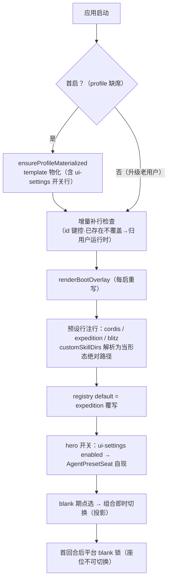

要点：预设行 = 产品工件每启覆盖（用户不可经 UI 改组合）；ui-settings 开关行 = 一次性预置后让位用户；`!!js` 全形态死刑——物化只出绝对路径。

### 图 2 · dispatchTask 派发链（泳道时序·交互全景）

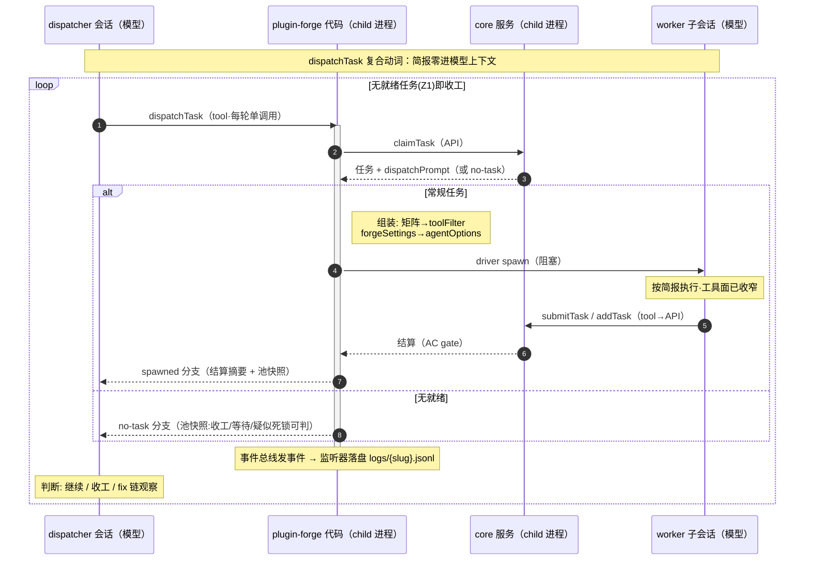

### 图 3 · dispatchTask 决策分支（spawn 失败防线与池判断）

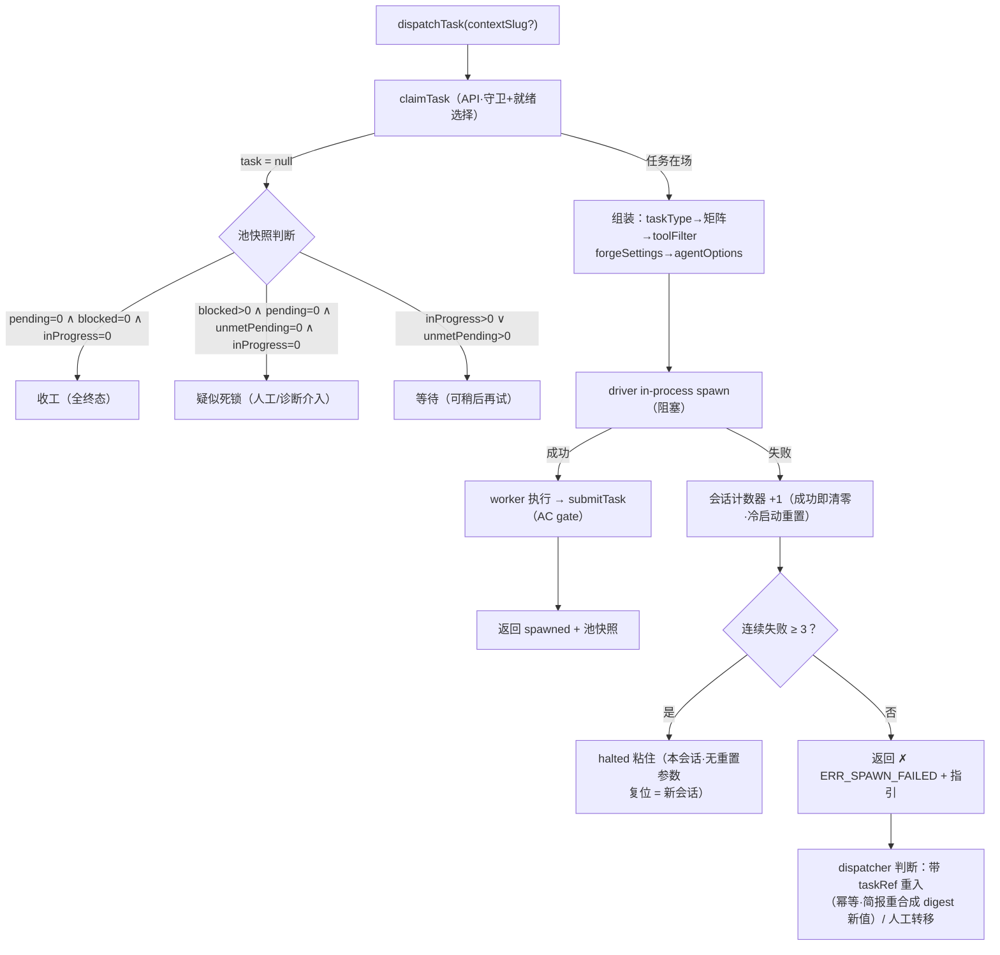

### 图 4 · worker 供给组装（收窄 + 默认 LLM + 继承）

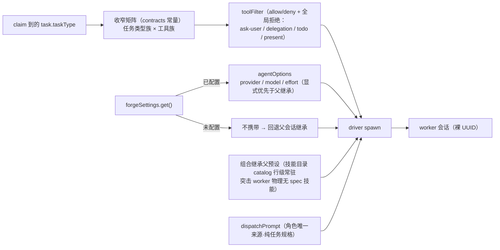

### 图 5 · 事件日志链路与归属

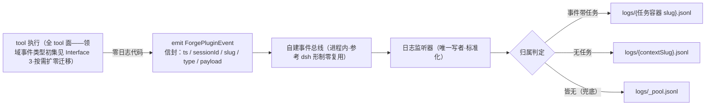

追溯三键：taskKey →（task_records.dispatch_digest）→ task-spawned 事件（workerSessionId）→ dsh 会话日志首条 = dispatchPrompt 全文。

### 图 6 · 成链分叉（transitionProposal 服务内聚）

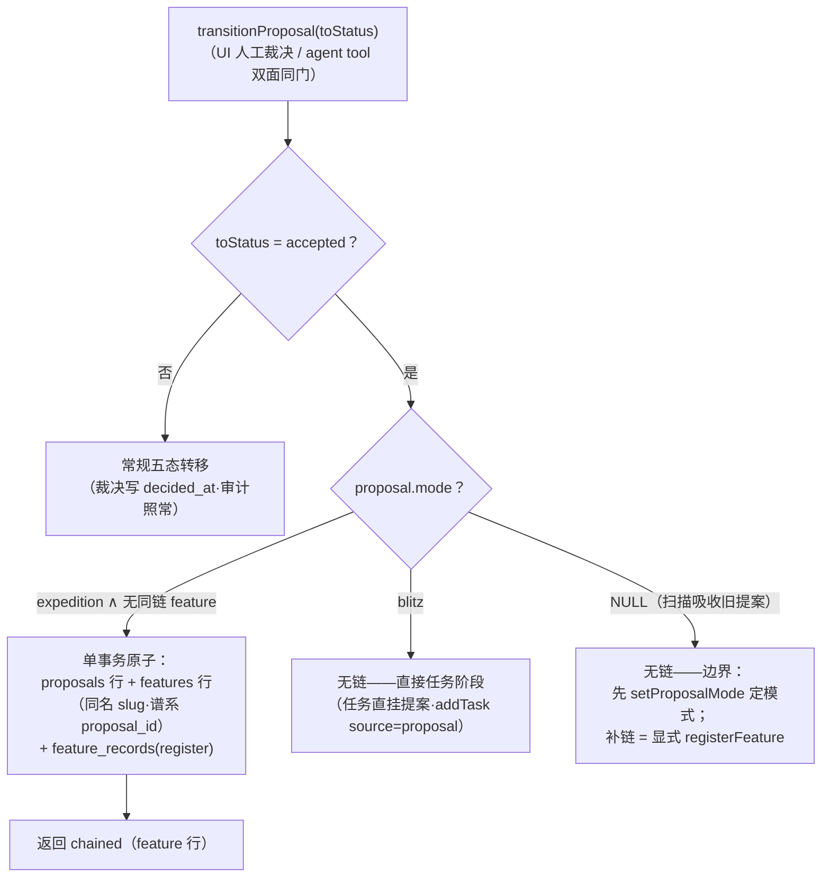

### 图 7 · mode 人工升降级与快照不回溯（律三）

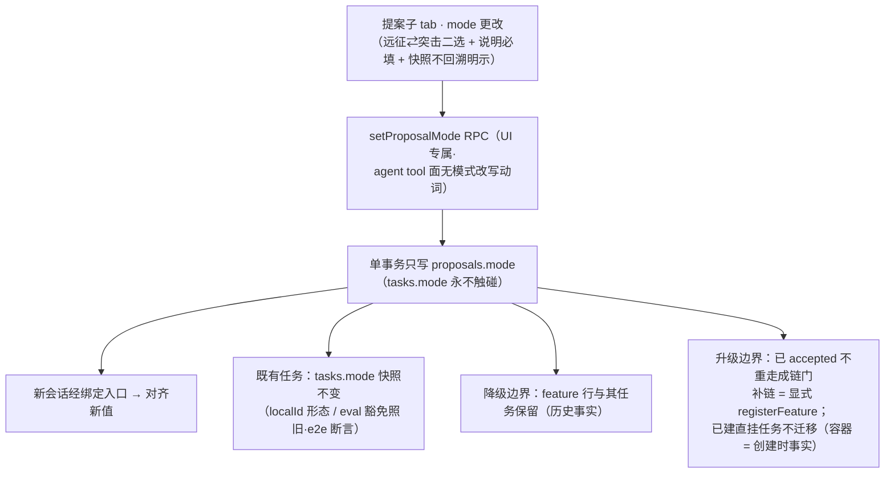

### 图 8 · submitTask 校验链（AC/gate 双门）

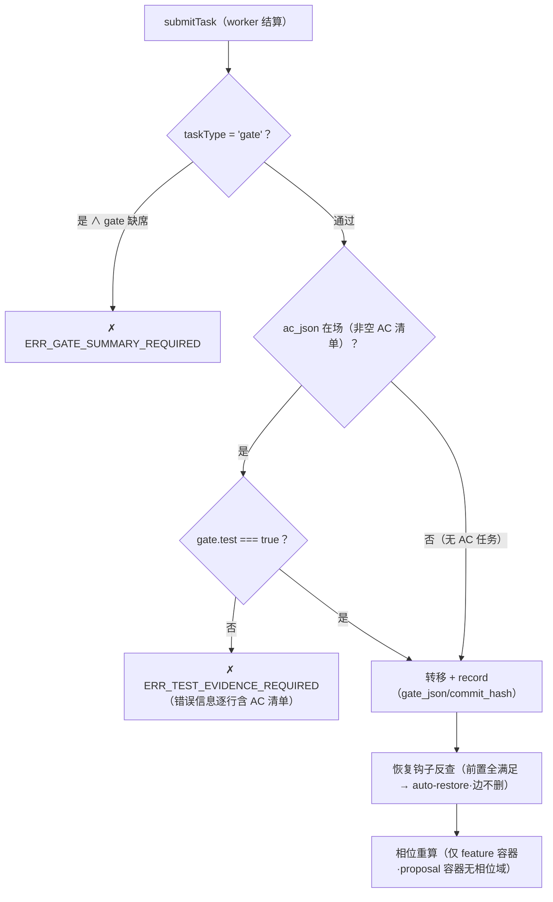

### 图 9 · 打开新会话（自动对齐 + 预填不发送）

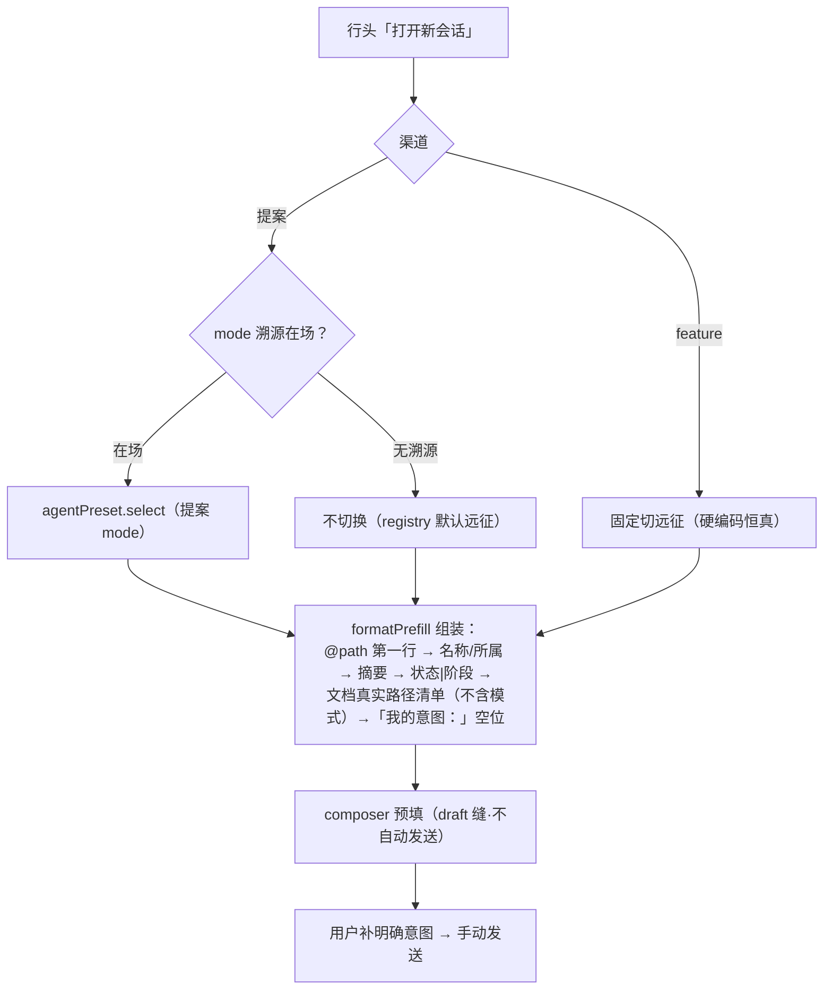

### 图 10 · 诊断两路（toast + 发送给 agent·模式路由）

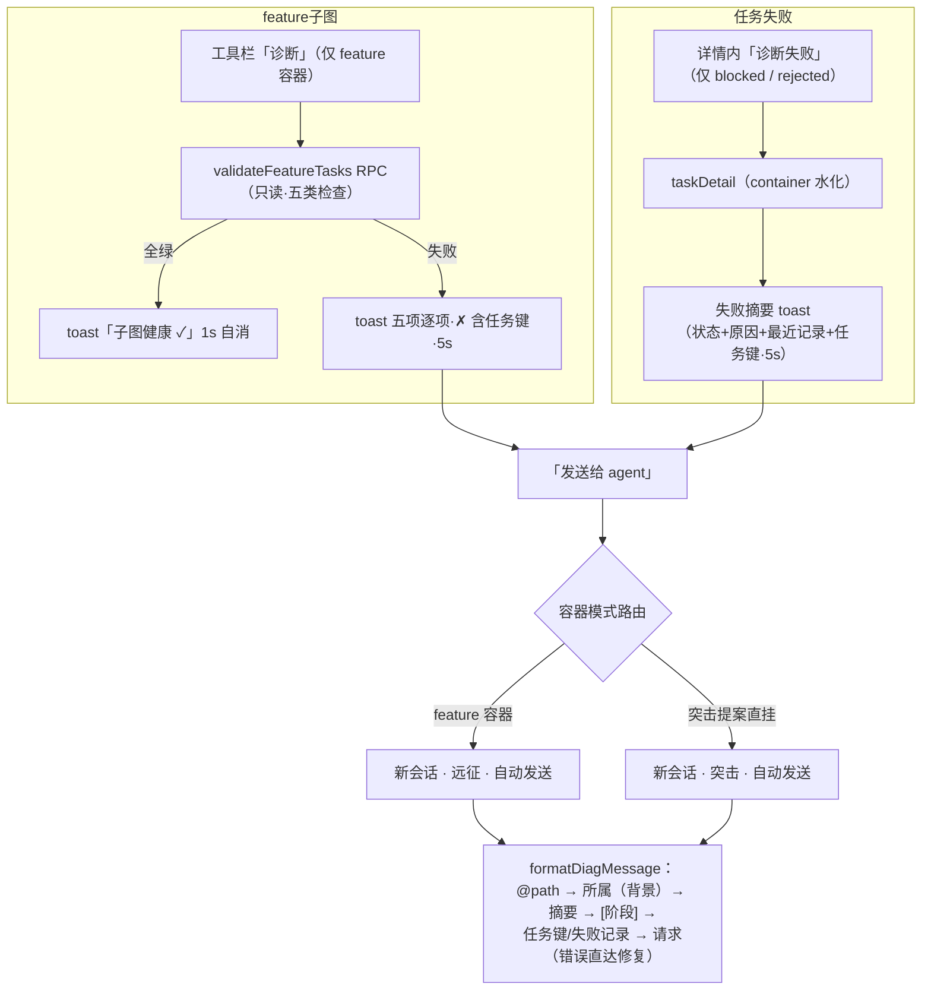

### 图 11 · Forge设置 单门（读写同源·实时生效）

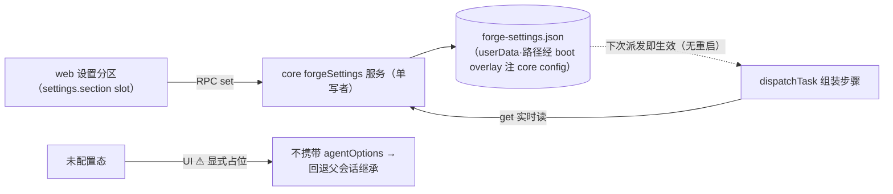

### 图 12 · 双模式管线全景（SC4 突击 / SC5 远征）

```mermaid
flowchart TD
    subgraph 突击直达链SC4
        A1["突击会话 · quick-tasks"] --> B1["提案（mode=blitz·createProposal）<br/>+ 任务清单（addTask·source=proposal·整数 ID）"]
        B1 --> C1["提案 accepted → 直接任务阶段<br/>（无 feature 行——断言）"]
        C1 --> D1["dispatchTask 派发 → submit 全绿"]
        D1 --> E1["概览三视图即时刷新<br/>（写推送事件·M2 机制）"]
    end
    subgraph 远征全链SC5
        A2["远征会话 · brainstorm"] --> B2["proposal.md（经 tool 读写）→ 扫描/建行"]
        B2 --> C2["提案 accepted → 成链分叉内聚<br/>（feature 行 + 谱系 + 审计行·原子）"]
        C2 --> D2["write-prd / ui-design / tech-design<br/>（upsertFeatureDoc → feature_documents·登记即推进）"]
        D2 --> E2["breakdown-tasks（addTask·source=feature·mode=expedition 快照）"]
        E2 --> F2["dispatchTask 派发 → submit（AC gate）"]
        F2 --> G2["提案/文档/任务/记录四域全景一致"]
    end
```

（旁路·人类面不进派发循环：Forge设置 = 图 11；诊断 = 图 10；两链共享 dispatchTask 与状态层动词。派发入口 = 图 13——人类面一键发起，进入派发循环后同两链。）

### 图 13 · 任务子 tab 派发入口（跳转/新开双路由·v22）

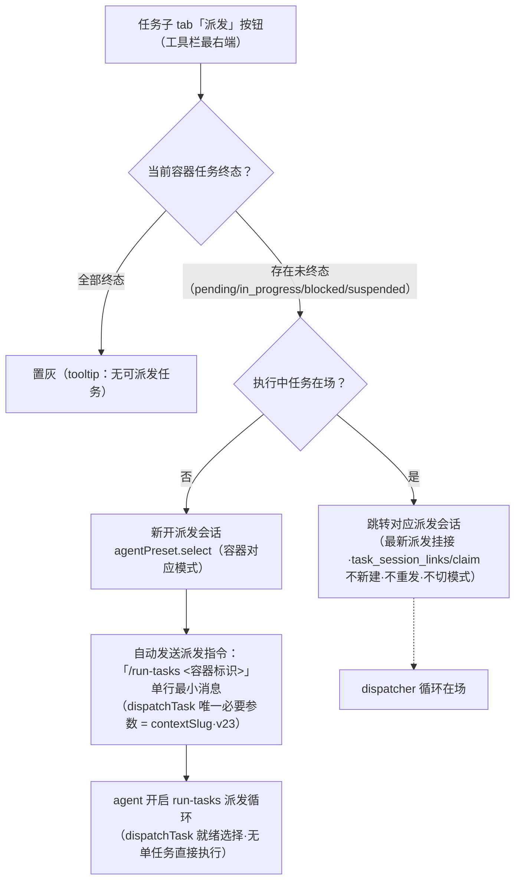

## Integration Specs（web 落位六处）

| # | Target | 改动 | 数据源 |
|---|---|---|---|
| 1 | `views/overview/proposal-tab.tsx` | UF-1 完整形态：五态 chips + mode chip + 行头「打开新会话」+ ⋯ 菜单（评审流转对话框 = 五态允许集 + reason 必填 + accepted 成链/直挂分叉文案；模式更改对话框 = 远征⇄突击 + 说明必填 + 快照不回溯一行明示） | forge:proposals/{transition,setMode}（新）+ listProposals(mode·taskCount) + listProposalDocs（文档区） |
| 2 | `views/overview/feature-tab.tsx` | UF-4：阶段 chips + 两列元数据（标识/阶段/模式恒远征/谱系 proposal_id）+ 分层文档（doc_kind→中文组名映射常量 + 真实 rel_path 行）+ 行头打开新会话→固定远征 | listFeatures / listFeatureDocs（谱系联读） |
| 3 | `views/overview/task-tab/` | UF-3：容器 pill = **features ∪ 有任务提案**（前端组合两域读——MVC 跨域聚合归前端先例）；**工具栏 v22 布局**（视图下拉[pill 右侧·类模式下拉] + 诊断/派发固定右端）；「诊断」按钮（仅 feature 容器）→ validateFeatureTasks RPC → toast 1s/5s + 发送给 agent；任务失败诊断（blocked/rejected 行内按钮）→ 消息组装 → 发送；**「派发」按钮——可用态 = 当前容器终态判定（前端纯派生·终态集与相位推导机同源）；执行中在场 → 跳转其最新派发挂接会话（平台按 id 打开缝）；否则新开（容器对应模式）+ 自动发送派发指令（/run-tasks + 标识单行·v23 最小消息）；无单任务执行动作** | validateFeatureTasks（既有 RPC）/ taskDetail(container 水化) / sessionLinks（跳转目标）/ listTasks（终态判定） |
| 4 | client-plugin `settings.section` slot | UF-2 Forge设置 分区：worker 三项（Provider/Model 联动/Reasoning 三段）+ 未配置态 ⚠ 占位 + 保存脏态 | forge:settings/get · set（新） |
| 5 | client-plugin `openSessionWithPreset()` | 组合子：平台会话编排创建 blank → agentPreset.select → composer 预填（draft 缝·实施期核实）→ autosend = 诊断两路 + 派发指令（v22）；**跳转既有派发会话缝（按 id 打开——实施期核实）** | 各域读（消息体数据源 = PRD 数据约束 5） |
| 6 | OverviewTab 容器 | 概览 tab 默认 560px + 左缘拖拽 400–920（工具栏控件恒一行——pill/视图下拉/诊断/派发） | — |

**消息体组装**（纯函数·组件测试锚）：`formatPrefill(container, docs)` / `formatDiagMessage(task/container, records)`——@path 第一行 → 名称/所属 → 摘要 → [状态|阶段] → 主体（诊断项/失败记录）→ 请求；**不含模式**；文档清单 = 相对容器目录真实路径 + 状态（对齐 PRD 消息体示例 ×5）。**派发指令例外（v23）= `/run-tasks <容器标识>` 单行模板串接**（dispatchTask 唯一必要参数 contextSlug——不参与格式族、无纯函数必要）。

## Testing Strategy

| Layer | 工具 | 断言内容 |
|---|---|---|
| core 单元 | vitest + 临时 SQLite | 成链分叉（accepted·expedition 三行原子；blitz/NULL 无链；幂等）；source 双轨（proposal 容器 addTask/容器不在场拒/创建快照/setProposalMode 后 tasks.mode 不变）；AC gate（缺 test 拒·错误含清单；gate 任务缺摘要拒）；feature_records 伴随 + 触发器 ABORT；schema pin 同步；**superseded_by 谱系**（superseded 必带目标/链查询）；**taskStats.unmetPending**（pending∧前置未满足计数）；**forgeSettings get/set/持久化**；**listProposalDocs 扫描**（目录夹具·frontmatter 可选初值·越界容错） |
| 契约 pin（G1 扩池） | vitest contract | tool 面：**dispatchTask 在场**；claimTask(spawnWorker)/transitionTask/transitionFeature/setProposalMode **缺席**（代码审计）；两包 tool 面分置；预设镜像行机械 diff + config 全集；收窄矩阵常量；事件联合类型；RPC 新通道 allowlist |
| plugin 两包 | 单元/集成 | dispatchTask 全场景表（spawned·success/blocked、halted、no-task、spawn error）+ 池快照附载 + 计数器行为（3 连败粘住/成功清零/冷启动重置）；formatOk/formatErr 快照；日志监听器（事件→标准行→**归属三分支 + _pool 兜底三例**）；**agentOptions 携带/未配置回退两态**；boundaries 修订（driver 白名单） |
| web | 组件 | 消息体纯函数快照（对齐 PRD 消息体示例 ×5——派发指令 = /run-tasks 单行模板断言）；UF-1/3/4 组件；**UF-3 派发按钮（可用态终态判定纯函数 + 跳转/新开分支 + 置灰态 + 指令单行模板）与视图下拉**；Forge设置（未配置态/脏态/保存失败留场） |
| e2e（G2） | Playwright `_electron` | SC1 hero 投影四断言；SC2 技能枚举+toolFilter+LLM 一致（**按需加载断言通道 = worker 目录/加载行为探针——OQ#4**）；**SC3 溯源（mode chip↔库一致/无溯源缺省占位/人工变更后既有任务快照不变/成链门=恒远征）**；SC4 突击链（accepted 后无 feature 行断言）；SC5 远征全链 tool 读写；SC6 mode chip/五态/成链原子/审计伴随/无模式改写动词；SC7 AC 拒+gate_json+两态 commit；SC8 走查（零 manifest.md 文件系统断言+总纲回归）；SC9 文档断言；**UF-3 派发入口（新开自动发送·容器对应模式/执行中在场跳转不重发/全终态置灰/无单任务执行入口——v22）**；logs/{slug}.jsonl 在场+串联字段 |
| dogfood | 门 | SC-M3 = M3.5 真实走查 + 录制回放夹具 drift（dispatchTask 形态）+ M2 e2e 涉 claimTask 的 spec 显式 drift 台账 |

## Security Considerations

① **dispatchTask 滥用面**——worker 面不含它（矩阵只给 submitTask+addTask）；用户主会话可调 = 合法派发入口（非威胁）。② **forge-settings.json**——core 单写、路径守卫 userData 域。③ **事件日志**——含 sessionId/model/任务内容摘要，本机文件与 dsh 会话日志同级敏感度；**不含凭据、不含 dispatchPrompt 全文**（只记 digest）。④ **预设物化**——本地 profile patch，无网络取数。⑤ **只读纪律回归**——logs/ 写在 tasksHome（userData 域）非代码仓，SC3 断言对象扩展但结论不变。

## PRD Coverage Map

| PRD | Design 落位 |
|---|---|
| SC1 双预设 | 预设装配（presets/ 三 YAML + boot overlay 物化 + ui-settings 首启预置/增量补行）+ agentPreset.select 接线 |
| SC2 L1 双层 | 拆包（spec 行/目录物理隔离）+ **契约 pin（镜像行机械 diff + config 全集·G1-19）** + dispatchTask 收窄矩阵 + agentOptions + catalog 常驻按需 |
| SC3 溯源 | proposals.mode + tasks.mode 快照 + setProposalMode 唯一正门（无 tool 面）；**feature 恒远征（成链门保证）——PRD SC3 口径已随裁决⑥回写（drift #6）** |
| SC4 突击链 | source 双列直挂 + 成链分叉（NULL/blitz 无链）+ quick-tasks 技能 |
| SC5 远征链 | spec 三 tool + 技能迁移（经 tool 读写） |
| SC6 五态/成链 | transitionProposal 内聚 + feature_records + UF-1 + RPC 双面 drift |
| SC7 gate | ac_json + submitTask 双校验 + gate_json |
| SC8 走查 | SC-M3 dogfood 门 + 零 manifest 断言 |
| SC9 记账 | 执行期文档任务（tasks 域，非设计面） |
| Story 4A / UF-1–4 | Integration #1–6 + openSessionWithPreset + 消息体纯函数 |
| dispatchTask 裁决链 | 合并复合动词 + 池快照 + halted 机械防线 + logs/{slug}.jsonl |

## Open Questions

1. **composer draft API**（打开新会话预填缝）+ **按会话 id 打开既有会话 API**（派发跳转缝——v22）——实施期核实上游；兜底方案届时裁决（预填为平台能力缺口时：聚焦 + 引导粘贴为降级形态；跳转为缺口时：toast 提示手动切换会话，需用户再裁决）。
2. 收窄矩阵**工具名映射表**——实施期按当期上游工具面枚举核对入 pin。
3. eval 幸存者裁剪清单——迁移任务内定（PRD 既定）。
4. packaged 双形态 + dev-abs/dev-tf + **worker relay 文本（AGENTS.md 到达 worker 的叙述性确认——S6-6 残余）** 补验——实施期首任务（spike 残余，工件已备 `spikes/m3-s5-s6-presets/`）；**SC2「按需加载 run-tests」断言通道 = worker 目录/加载行为探针（S6 同法转录）——随 dev-tf 补验落地**。

## Appendix

### 关键技术决策（本设计新增裁决）

| 决策 | 选择 | 理由 | 备选与否决因 |
|---|---|---|---|
| worker 派发面路由（S6 三候选） | **A+B 整合·M3 单发 dispatchTask** | 简报零进模型上下文（完整性+token）；main_session 砍除后无分支；连发 batch 未来注记（接口加法扩展） | 派发循环整体下沉（丢 dispatcher 判断力）；预设级行配置（静态无法按任务类型分档） |
| claimTask+spawnWorker | **合并复合动词** | 消灭转述篡改面 + 双倍 token；循环单调用；Z1/幂等重入内聚 | 两工具分离（可观测性靠全文进上下文——代价高） |
| transitionFeature 面 | **收窄不进 tool**（PRD 枚举偏离记账） | db-schema §6-27/§6-28 明文：人类纠偏面 + 相位推导机不可旁路 | 照 PRD 全量（推翻 M2 面分治） |
| 突击直挂 schema | **source_kind + source_id 通用双列**（v1 直改） | 单列对无 OR 分叉、容器类型扩展只加 CHECK 值；未上线零迁移义务 | 双 nullable FK（OR 查询分叉）；影子 feature 行（违反 UI 裁决） |
| 远征成链触发 | **transitionProposal 服务内聚** | 「单步成链」原子；双面同门天然成立（§6-28 登记即推进同构） | 显式两步（漏链窗口） |
| features.mode | **不设列（恒远征）** | 成链门保证一致性；UF-4「固定远征」硬编码恒真 | 加列（冗余 + 同步义务） |
| main_session | **砍除** | 老 forge 形态约束残留；worker 全能力 + blocked 上报径覆盖；新线零消费者 | 保留（死列） |
| 业务日志 | **事件驱动·容器维度 logs/{slug}.jsonl·产品自建总线** | 工具零日志代码；容器全程串联（taskKey→会话链）；参考 dsh 形制零上游耦合 | 复用 Cordis 事件面（升级耦合）；per-session 文件（容器分析视角断裂） |
| spawn 失败防线 | **会话作用域计数器·3 连败粘住 halted·易失** | 纪律不压模型自觉；日志派生属过度设计（会话可更换） | 技能文本计数（不可靠） |
| 现状感知 | **池快照附载每次返回** | 判断有据（收工/等待/死锁三态可判）；无状态任意会话可接管 | 模型记忆（丢账） |
| tool 返回面 | **formatOk/formatErr 双友好文本** | 老 forge 先例；agent 消费 + 人类审计同面 | 裸 JSON（人类不友好） |
| Forge设置存储 | **forge-settings.json + core forgeSettings 单门** | UI 与派发同门；实时生效无重启 | ui-settings 行（插件读取缝复杂）；中央库表（零迁移宪法倾向） |
| 提案文档数据面（评审缺口#1 处置） | **只读目录扫描 `listProposalDocs`（零状态零写径）** | 文件系统为事实源（发现面同族）；UF-1 文档区与 prefill 清单同源 | proposal_documents 新表（无写径支撑——提案文档由人/git 摆放，非动词产物） |
| 谱系取代链（评审缺口#5 处置） | **proposals.superseded_by 列 + transitionProposal(superseded) 必带 supersededBy** | UF-1 谱系右列数据面；v1 直改加列零成本；目标在场校验 | UI 裁剪（谱系三成分缺一） |
| 池快照数据源（评审缺口#3 处置） | **taskStats 输出增 unmetPending**（pending ∧ 前置未全满足·单查询派生） | dispatchTask 池快照直读，无新通道 | 新立池读面（通道冗余） |

### 契约面 pin 扩池（G1，M2 十六项之上）

17. dispatchTask 在场 + claimTask/spawnWorker/transitionTask/transitionFeature/setProposalMode 缺席（tool 面代码审计）；18. 两包 tool 面分置（核心六 + spec 三）；19. 预设镜像行 ↔ 上游 standard.patch.yml 机械 diff + config 全集；20. 收窄矩阵常量 + 工具名映射表；21. 事件两层联合类型（ForgePluginEvent 判别联合完备性）；22. RPC 新通道 allowlist（settings / proposals.{transition,setMode,listDocs} / features.listDocs）。

### drift 记账（对 M2 工件与 PRD，共八项）

1. claimTask tool 退役 → dispatchTask（M2 e2e 涉及 spec 显式 drift + 台账；**M2 G1-11「六在场/两缺席」集合随之改写**——新面由 #17/#18 定义）；2. transitionProposal 上 RPC 双面（M2「tool 专属」纪律修订）；3. tasks schema v1 直改（migrations/schema pin 同步 + 存量开发库废弃）；4. plugin-forge boundaries pin 增 driver 白名单；5. PRD In Scope ② transitionFeature 枚举收窄（本设计偏离记账）；6. **PRD SC3/数据约束/流程五/UF-1.6「proposal↔feature 溯源同步」断言 → proposals 单侧 + feature 恒远征**（裁决⑥——PRD 四处已随本设计回写）；7. **PRD「feature_records = 软迁移新表」措辞 → v1 直改**（裁决③扩展覆盖——PRD In Scope ③/Data Requirements 已回写）；8. **M2 工件退役两处**：M2 3.3 `Skill(forge:run-tests)` 前缀引用缝消灭（PRD In Scope ①）+ M2 已落 git-commit 技能条目移除（Out of Scope #12——plugin-forge/skills/git-commit 删除）。

### 老 forge `.forge/state.json`（当前 slug）的形态对应（2026-10-08 裁决：零方案）

老 forge 在每个 checkout 维护 `.forge/state.json` 记录「当前 slug」——CLI 形态的代偿物（无会话：每条命令一个进程，「我在做哪个容器」必须落文件；多 worktree 并行 = 各 checkout 各自文件）。新形态逐项对应：

| 老 forge 需求 | 新形态承载 | 成本 |
|---|---|---|
| 命令的「当前 feature」语境 | 长会话上下文 + 工具显式参数（`source: ContainerRef` / `contextSlug`）+ 打开会话 prefill 的 @path 锚 | 0 |
| 任务归属容器 | dispatchPrompt 自带 SOURCE 行（任务带容器出厂）+ 写库必带容器锚 | 0 |
| 多 worktree 并行（同项目多 checkout） | **逻辑归属同一项目**（§6-37 既定：项目 = repo、工作区 = checkout）——当前形态 = 各 checkout 各注册一库（**过渡形态**：同 repo 的状态分散、全景不聚合，非隔离的「解决」）；**统一归属与呈现 = worktree 族落地时兑现**（Out of Scope #1–#4：判定器 / repo_root 分组 / 未注册兄弟提示 / 执行上下文；库归属形态——各持 vs 共享——届时随其提案裁决） | 顺延（既定去向） |
| 「当前」跨会话/重启恢复 | `logs/{slug}.jsonl` 文件集合 + 尾段派生（每库目录日志文件名集合 = 该 checkout 活跃容器清单）——纯分析读面 | 0 |

**裁决：M3 不实现 state.json 等价物**——显式「当前容器」文件 = 第二事实源（文件 vs 库必然漂移；manifest.md 消亡论证同族：无会话时代的补偿物）。worktree 族完整引入时（Out of Scope #1–#4 既定去向）一并兑现**同项目多 checkout 的统一归属与呈现**（repo_root 分组 + 全景聚合），并裁决库归属形态（各持 vs 共享）；届时若出现跨会话记住容器选中的真实需求 → localStorage per-session（M2 右栏布局持久化先例）或库目录轻量文件，随 worktree 族伴生裁决。

### References

- PRD [prd-spec.md](../prd/prd-spec.md) · [prd-user-stories.md](../prd/prd-user-stories.md) · [prd-ui-functions.md](../prd/prd-ui-functions.md) · [ui-design.md](../ui/ui-design.md)（v24）
- 提案 [proposal.md](../../../proposals/dsh-forge-m3-bootstrap-presets/proposal.md) + spikes [s5](../../../proposals/dsh-forge-m3-bootstrap-presets/spikes/s5-preset-base.md) / [s6](../../../proposals/dsh-forge-m3-bootstrap-presets/spikes/s6-skill-provisioning.md)
- 底稿 [db-schema.md](../../../proposals/dsh-forge-m2-pipeline/db-schema.md)（§6 裁决 39 项）· [tech-research.md §5](../../../proposals/dsh-forge-redesign/tech-research.md)
- M2 先例 [tech-design.md](../../dsh-forge-m2-pipeline/design/tech-design.md) · [er-diagram.md](../../dsh-forge-m2-pipeline/design/er-diagram.md) · [schema.sql](../../dsh-forge-m2-pipeline/design/schema.sql)
- 约定 docs/conventions/{monorepo-structure,rpc-and-contracts,task-domain,doc-surface,error-handling,quality-gates,packaging}.md · 决策 docs/decisions/{architecture,interface}.md
