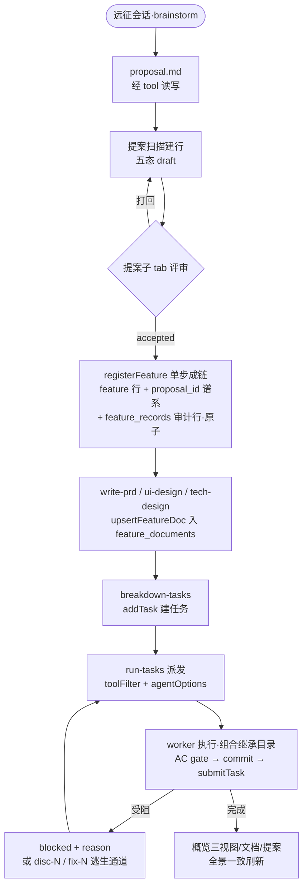

# dsh-forge M3：自举·模式预设（双预设 + 拆包 + 技能迁移 + 提案管线消费） — PRD Spec

> PRD Spec：定义该特性**是什么、为什么**。业务上下文与全部阶段裁决继承自已批准的里程碑提案 [`docs/proposals/dsh-forge-m3-bootstrap-presets/proposal.md`](../../../proposals/dsh-forge-m3-bootstrap-presets/proposal.md)（宪法级约束见总纲 `dsh-forge-redesign/proposal.md`；数据面预设计定稿 = `db-schema.md` M3 标注；机制底稿 = `tech-research.md` §5）。**PRD 前 spike S5/S6 已执行（2026-10-07，dev 形态全绿，结论已回填提案）**——装配裁决（宿主物化绝对路径）、hero 开关形态（ui-settings 行）、worker toolFilter 落位（run-tasks 派发面携带）、镜像行配置重述义务四项已实证定形；packaged 双形态等确认性残余转 M3 实施期首任务补验（用户裁决 2026-10-07）。本文件不重复提案全文，只落实 PRD 层要求；已裁决项不重开。

## Background

### Why (Reason)

M2 收官后任务域已转正（每工作区库 + 动词 API + 派发链 + 概览视图），但产品仍不能用自己的管线开发自己：新会话只有 dsh 出厂 standard 预设（远征/突击双模式不存在）；规格技能（write-prd / breakdown-tasks 等）仍住冻结旧线；提案/feature/文档域无 agent tool 面（提案五态 M2 仅承载 + 最小动词）；总纲自举纪律（M4 起剩余功能一律用自身开发）无从起动。M3.5（知识沉淀）已 Draft 在库并硬依赖本里程碑的预设机制——M3 不动则 M3.5 吃自己记账的降级路径。

### What (Target)

把「用 dsh-forge 开发 dsh-forge」所需的最小完备面装上，四个交付面：

- **① 预设基座 + 拆包 + 技能迁移**：出厂双预设（远征 `expedition` 默认 = 完整 SDD 管线；突击 `blitz` = proposal 直达任务执行）——profile 装配 = **宿主物化绝对路径**（spike 裁决：`!!js` 表达式全形态死刑）；hero 开关 = `ui-settings` 行首启预置开启（形态 (a)，用户裁决 2026-10-07）；plugin-forge 拆双包（管线核心 / 规格深化）+ **L1 物理边界双层**（预设层 = 突击组合物理不含 spec 技能；worker 层 = tool 最小面收窄 + 技能组合继承目录）；规格技能从冻结旧线迁入并适配状态层（**经 tool 读写**——文档产出 → upsertFeatureDoc、任务建立 → addTask + registerFeature）；执行面知识分层（run-tests / submit-task = worker 消费技能改写聚焦 LLM 判断面；git-commit 暂不迁入）。
- **② 提案管线消费 + 模式溯源**：feature/文档域 tool 封装（registerFeature / transitionFeature / upsertFeatureDoc）；**远征提案 accepted → registerFeature 单步成链**（feature 行 + proposal_id 谱系 + feature_records 审计行原子写入）；**突击提案 accepted → 直接进入任务阶段（突击无 feature 阶段——只有提案与任务；任务直挂提案，不建 feature 行/文档域——用户裁决 2026-10-07 UI 评审）**；概览提案子 tab 完整形态（五态 chips + mode chip + 行头「打开新会话」+ 人工裁决 + mode 人工更改入口）+ feature 子 tab 升级（阶段过滤 + 分层文档 + 行头「打开新会话→远征」）；提案 mode 溯源元数据 + **模式绑定三律**；validateFeatureTasks tool 封装 + 任务子 tab 诊断入口（toast 结果 + 发送给 agent）**+ 派发入口（工具栏「派发」按钮——存在未终态任务亮起/全部终态置灰；执行中在场跳转既有派发会话、否则新开 + 派发指令[/run-tasks + 容器标识单行·最小消息]自动发送·容器对应模式；视图切换改下拉、派发/诊断固定右端——用户裁决 2026-10-08；无单任务直接执行入口——必须按 DAG 顺序领取）**。
- **③ 规格域 gate**：submitTask 增 AC/测试证据校验（带 AC 任务缺测试证据拒，错误信息含 AC 清单）；gate 任务类型落地（gate_json 承载数字摘要）。
- **④ 自举达成与走查（SC-M3 门）**：自举纪律生效（M4 起自身开发）；**M3.5 作为首个自举 feature** 端到端走查（评审接受 → 成链 → 远征会话派发开发 → 任务/记录入自身 forge.db → 全景可见 → 零 manifest.md 生成）；路书与总纲回写记账。

### Who (Users)

- **单人开发者**（产品唯一人类用户与干系人）：新会话 hero 选模式（或经提案绑定入口自动对齐）、提案子 tab 评审流转与 mode 人工升降级、Forge设置区块配置 worker 默认 LLM、诊断 feature 任务子图。
- **dsh agent 会话**（系统协作者，非人类角色）：**远征/突击用户主会话**（模式预设的组合容器）、**dispatcher**（run-tasks 派发循环，携带 per-spawn toolFilter 与 agentOptions）、**worker**（执行子代理——dispatchPrompt 为角色唯一来源，预设继承仅携带作风；工具/技能装载走 dsh 既有能力体系，零新装载机制）——其行为经 Story 的系统侧断言覆盖。

## Goals

| Goal | Metric | Notes |
|------|--------|-------|
| SC1 双预设可用与平台语义 | hero chips 出现「远征模式/突击模式」（order 1/2 中文直出；registry 默认 = 远征，e2e）；blank 锁生效（首轮后座位不可切换——**断言基 UI 投影面**：座位卸载/点选超时）；恢复会话按 agentPreset 投影重建同款组合（e2e）；自动对齐：经提案/feature 绑定入口创建的新会话自动对齐提案 mode（blank 期 `select`；断言基 UI 投影面——座位标签 + 首回合工具面/技能目录与预设组合一致；`agent-preset/selected` 事件降为证据级[spike：会话日志运行期不落盘]） | 前置 = hero 开关开启（见 Other Notes · Data） |
| SC2 L1 物理边界（双层） | 预设层：突击会话技能清单不含规格技能全集（write-prd / ui-design / tech-design / gen-journeys / gen-contracts / gen-test-scripts / breakdown-tasks——技能枚举断言，spike S6-3 已实证同构边界）；远征全量可见且 brainstorm 可用；核心包技能目录无 git-commit / git-checkout 条目（移除/未迁断言）。契约面：两预设 standard 基础行与上游 standard.patch.yml 机械 diff 一致（**镜像行含 config 全集**——spike 教训：缺必填 config → 整预设 broken）。worker 层：派发产出 worker 的 tool 面按任务类型收窄生效（toolFilter 断言）；技能目录 = 组合继承目录（突击 worker 不见 spec 技能；远征 worker 含 spec 技能行、内容不加载）；测试任务 worker 按需加载 run-tests、非测试任务不加载；worker 会话 model 与 Forge设置 默认 LLM 一致（agentOptions 显式携带、优先于父会话继承） | spike S6-1/2/3/5 已实证多根 rank / 物理边界 / 继承机械面 |
| SC3 mode 溯源解耦 | 提案 mode 溯源字段（proposals.mode）由创建时写入；**feature 恒远征（无溯源列——成链门保证：accepted ∧ mode=expedition 才成链；tech-design 裁决⑥回写 2026-10-08）**；远征会话领取突击提案的直挂任务，突击语义（整数 ID / eval 门豁免）照旧生效（功能断言）；mode 人工变更后：proposals.mode 即时更新（features 无列无需同步）、既有任务语义按创建时快照不回溯（断言） | tech-research §5.4① + tech-design 裁决⑥ |
| SC4 突击直达链 | 突击会话 quick-tasks 一次产出提案 + 任务清单（mode 溯源 = blitz）→ **提案 accepted → 直接进入任务阶段（无 feature 行/文档域——断言任务直挂提案）**→ run-tasks 派发 → submit 全绿 → 概览三视图即时刷新（e2e；写推送通道复用 M2 机制） | 关键场景 1；突击无 feature 阶段（用户裁决 2026-10-07） |
| SC5 远征全链 | 远征会话 brainstorm → proposal → write-prd → ui-design / tech-design → breakdown-tasks → run-tasks → submit 全程经 tool 读写（文档入 feature_documents、任务/记录入 forge.db），提案/文档/任务/记录四域 UI 全景可见（e2e） | 关键场景 2 |
| SC6 提案五态流转与单步成链 | 提案子 tab 五态 chips 过滤 + 文档跳转可用（e2e）；mode chip 展示溯源模式与库一致、无溯源显示缺省占位（断言）；模式不可变：唯一变更通道 = 提案子 tab 人工操作（变更后新会话对齐新值、既有任务快照不变——联动断言），agent tool 面无模式改写动词（契约断言）；双面流转（UI 人工裁决与 transitionProposal tool）均写库一致；单步成链（**仅远征提案**）：accepted → registerFeature 原子写入 feature 行 + proposal_id 谱系 + feature_records 审计行（断言）；**突击提案 accepted → 直接任务阶段（无 feature 行——断言）**；feature 域全部动词每次写入伴随审计行（表断言） | 五态 = draft/under-review/accepted/rejected/superseded |
| SC7 规格域 gate 与提交定式 | 带 AC 任务 submit 缺测试证据被拒且错误信息含 AC 清单（功能断言）；gate 任务类型可派发执行并写 gate_json；失败走 fix 链自动恢复（M2 机制回归）；worker 提交定式 = submit 记录含 commit_hash 且提交信息符合 Conventional Commits（配置 AGENTS.md 时从其约定、缺省回退模型常识——两态分别断言） | db-schema §6-24/§6-31 兑付 |
| SC8 自举走查（SC-M3 门） | M3.5 作为首个自举 feature 端到端走查：评审接受 → 成链 → 远征会话派发开发；任务/执行记录 100% 入自身 forge.db；概览三视图 / 文档 / 提案子 tab 全景一致；**全程零 manifest.md 生成**（文件系统断言）；总纲 SC2 / SC3 / SC7 回归断言绿 | 走查即 M3.5 立项启动 |
| SC9 记账合入 | Out of Scope 顺延表（#1–#13 全量）与总纲回写四条款（M3 行收窄 + 全量顺延表 / brainstorm 条目修订 / M3.5 时序注记 / tech-research 偏离注记）合入总纲（文档断言） | 宪法修订记账义务 |

## Scope

### In Scope

- [ ] ① 预设基座：出厂双预设 profile 装配（**宿主物化绝对路径**——boot overlay 注行时物化或首启模板预置，spike 裁决）+ registry default 覆写（远征）+ persona 铁律（只谈作风不谈角色与工具禁令）+ blank 锁 / 恢复投影语义 + 两处解耦（会话节奏 ≠ 功能溯源、确认门 ≠ 模式）；hero 开关前置（`ui-settings` 行首启预置 `enabled: true`——形态 (a) 用户裁决；行所有权规则见 Other Notes）；镜像 standard 基础行含 **config 全集**（契约面清单义务）；M2 3.3 装配缝（`Skill(forge:run-tests)` 前缀引用）消灭。
- [ ] ① plugin-forge 拆包：`plugin-forge`（管线核心，双模式共用——quick-tasks / run-tasks / fix 链 / submit-task / run-tests / brainstorm）+ `plugin-forge-spec`（规格深化，仅远征组合——write-prd / ui-design / tech-design / gen-journeys / gen-contracts / gen-test-scripts / breakdown-tasks / eval 幸存者）；两包 tool 面 pin 契约测试（contracts 单源）。
- [ ] ① 技能迁移与状态层适配：全部经 tool 读写（文档产出 → upsertFeatureDoc；任务建立 → addTask + registerFeature）；run-tests / submit-task **改写聚焦 LLM 判断面**（机械重复部分去弃——gate 序列/必带校验已在工具行为内）；eval 幸存者按 M3 形态裁剪（清单任务内定）；知识沉淀类技能除外（Out of Scope #7）；git-commit 暂不迁入（Out of Scope #12）、git-checkout 不迁移（#11）。
- [ ] ① worker 供给（零新装载机制）：tool 面 = 按任务类型收窄（**toolFilter 携带者 = run-tasks 派发面 in-process spawn**——模型面调用参数不可达，spike 落位裁决；收窄矩阵底稿见提案方案⑥，终稿随 db-schema §7-6）；全局拒绝（ask-user / delegation / todo / present；skill 不拒——组合继承目录内容按需）；forge 工具面 = submitTask + addTask（addTask = 重大问题逃生通道：disc-N / fix-N 二分前缀）；skill 面 = 组合继承目录（catalog 行级常驻、内容按需加载）；worker 默认 LLM 统一设置（Forge设置 worker 小节三项 [Provider/Model/Reasoning] + agentOptions 携带，显式指定优先于父会话继承）。
- [ ] ② 提案管线消费：feature/文档域 tool 封装（registerFeature / transitionFeature / upsertFeatureDoc）；**远征 accepted → registerFeature 单步成链；突击 accepted → 直接任务阶段（无 feature 行）**；提案子 tab 完整形态（UF-1）+ feature 子 tab 升级（UF-4）+ 任务子 tab 诊断（UF-3）；mode 溯源元数据（写入时机 = 创建时；落位设计期定——proposals 行加列或 frontmatter 派生；扫描吸收旧提案 → 缺省占位）；模式绑定三律（律一 新会话自动对齐 = 提案/feature 行头「打开新会话」创建 blank 会话 + `agentPreset.select` RPC[提案渠道切提案模式 / feature 渠道固定远征] + 现状上下文预填消息输入框不自动发送；律二 确立后不可切换 = agent tool 面无模式改写动词；律三 唯一变更通道 = 提案子 tab 人工更改 + 快照不回溯）；validateFeatureTasks tool 封装 + 任务子 tab 诊断入口（toast + 发送给 agent）。
- [ ] ③ feature_records 第八表：**v1 直改新表**（产品未上线零迁移义务——tech-design 裁决③回写 2026-10-08）+ append-only 双触发器审计（register/transition/doc-upsert 每次写入伴随审计行；UPDATE/DELETE 直接 ABORT）——与 task_records 同构（verb = 事件名、actor = plugin-tool/ui/core）。
- [ ] ③ 规格域 gate：submitTask AC/测试证据校验 + gate 任务类型（gate_json 数字摘要）。
- [ ] ④ 自举达成与走查：SC-M3 门（SC8 全断言）；自举纪律生效记账。
- [ ] ④ 路书与总纲回写：M3 行收窄 + 顺延表 #1–#13 + 工件版图 brainstorm 修订 + M3.5 时序注记 + tech-research 偏离注记。
- [x] 实施期首任务：packaged 双形态 + dev-abs / dev-tf 补验（spike 残余——用户裁决转 M3 实施期；工件已备 `spikes/m3-s5-s6-presets/`）。**已执行（3.9，2026-10-08）：P/N/D/W 四用例全绿——W 期双缺陷 drift #9/#10 记账转 fix-1（94f0f36）修复，复跑收绿（fix-1 验收轮 + 3.9 复职收口轮连续两绿）——结论见自检注记与 `spikes/m3-s5-s6-presets/VERIFICATION-3.9.md`。**

### Out of Scope

> 全量顺延表（13 项含去向与兜底）= 提案 Out of Scope 节为准（#1–#12 一次/二次顺延 + #13 追溯矩阵 → M3.75——用户裁决 2026-10-07，M3 只保数据面就绪：feature_records + proposal_id 谱系 + mode 溯源字段落库）。摘要：

- **worktree 项目域全族**（#1–#4：判定器 / 分组实现面 / 会话头执行上下文 / task_records 两列）——二次顺延，随独立小里程碑或 M4。
- **移动找回认领对话框**（#5）；**拆包域归属轴**（#6，留触发器）。
- **知识沉淀类技能**（#7：consolidate-specs / learn——M3.5 或 M4）；**知识域全部**（#8）；**完整 eval 体系**（#9，仅迁幸存者）；**旧线冻结插件退役时点**（#10）。
- **git-checkout 不迁移**（#11）；**git-commit 暂不迁入**（#12，M2 条目 M3 移除；复活触发 = 真实消费者出现）。
- **追溯矩阵立表**（#13 → M3.75：谱系视图；M3 数据面就绪零迁移）。
- **按任务类型指派特定 LLM**（未来注记——机制同通道零新增，待自举运行期质量信号；worker 默认 LLM 统一档位已在本范围）。**标准模式引入 brainstorm**（标准模式零动作；未来引用外部技能 grill-me 为未来注记）。

## Flow Description

### Business Flow Description

**流程一：模式选择与自动对齐（SC1）**

1. 首启预置：应用首启将 `ui-settings` 行 `enabled: true` 物化进用户 profile（一次性；此后行为归用户运行时修改——设置 UI 切换可正常保存）。
2. 新会话 hero 出现预设座位（平台 `AgentPresetSeat`）：折叠标签 = 当前模式显示名（默认远征模式），菜单列远征/突击。
3. blank 期点选「突击模式」→ 组合即时切换（座位标签 + 会话工具面/技能目录投影）。首回合后 blank 锁生效（座位不再可切换）。
4. 自动对齐（律一）：用户在提案子 tab / feature 视图经绑定入口创建新会话 → 应用创建 blank 会话 + `agentPreset.select`（目标 = 提案 mode）→ 会话以提案模式起步（防逐会话手选错档）。
5. hero 自由创建的会话无提案上下文、不自动对齐——错配守卫 = mode chip 对照 + 派发入口提示（可见性而非阻断；平台 blank 锁边界如实记账）。

**流程二：突击直达链（SC4）**

1. 突击会话内发起 quick-tasks → 结构化产出提案（五态 draft 起步）+ 任务清单（整数 ID / 无 stage-gate / eval 豁免——mode 溯源 = blitz，创建技能写入）→ 经 createProposal / addTask 落库。
2. 用户在提案子 tab 评审（或 agent 经 transitionProposal 流转）→ accepted → **直接进入任务阶段**（突击无 feature 阶段——任务直挂提案、addTask 建任务即可派发）。
3. run-tasks 派发 → worker 执行（toolFilter 按任务类型收窄 + agentOptions 携带 Forge设置 默认 LLM）→ submit（gate 纪律不折扣）→ 概览三视图即时刷新。
4. 全程突击会话技能清单不含任何规格技能（物理边界）。

**流程三：远征全链（SC5，自举走查即此流程作用于 M3.5）**

1. 远征会话 brainstorm 结构化探索 → proposal.md（经 tool 读写入提案域）→ 提案发现扫描建行。
2. 提案子 tab 评审流转（draft → under-review → accepted；打回修订 / superseded 演进链可用）。
3. accepted → registerFeature 单步成链（feature 行 + proposal_id 谱系 + feature_records 审计行原子写入——**远征提案专属**）。
4. write-prd / ui-design / tech-design 产出文档（经 upsertFeatureDoc 入 feature_documents）→ breakdown-tasks 建任务（addTask）→ run-tasks 派发 → submit（AC gate）→ 三视图 / 文档 / 提案全景一致。

**流程四：worker 派发与供给（SC2 worker 层）**

1. **派发入口两途（v22 用户裁决 2026-10-08）**：任务子 tab 工具栏「派发」按钮（存在未终态任务亮起、全部终态置灰；当前容器有执行中任务 → 跳转对应派发会话；否则新开派发会话[容器对应模式] + 自动发送派发指令——**「/run-tasks <容器标识>」单行最小消息**[v23：只给 dispatchTask 必要信息 = contextSlug，背景/池快照/请求行废止]）或在会话内直接发起 run-tasks——两途汇入同一 dispatcher 循环。
2. dispatcher（run-tasks 会话）dispatchTask 复合动词领取任务（claim + spawn 合一·简报零进模型上下文——tech-design 裁决①）→ 以 dispatchPrompt 为初始提示词同步派发 worker（人格段 + 任务规格一次性合成；不内嵌工具段 / skill 段；按 DAG 依赖顺序领取就绪任务——不支持指定单个任务直接执行）。
3. run-tasks 派发面按任务类型携带 per-spawn toolFilter（收窄矩阵）+ agentOptions（= Forge设置 默认档——配置面 Provider/Model/Reasoning 三项[用户裁决 2026-10-07 UI 评审：去 Output 上限]；机制通道能力不变，含 output-token——优先于父会话继承）。
4. worker 经组合继承获得技能目录（核心包技能行常驻；远征 worker 含 spec 技能行、突击 worker 不含——预设级 L1 不破）；实际需要时加载全文（测试任务加载 run-tests）。
5. worker 结算：完成 → 自检（任务 AC / run-tests 配方）→ commit（AGENTS.md 约定或模型常识级 Conventional Commits）→ submitTask（gate_json + commit_hash + summary）；受阻 → submit blocked + reason，或 addTask 逃生通道（disc-N 独立问题 / fix-N 走 fix 链协议——M2 机制）。
6. 带 AC 任务 submit 缺测试证据 → 拒（错误信息含 AC 清单）；gate 任务 → gate_json 数字摘要落账。

**流程五：mode 人工升降级（律三，SC3/SC6）**

1. blitz 提案目标膨胀 → 用户在提案子 tab 手动改为远征。
2. 溯源字段（proposals.mode）即时更新 → 下一个经绑定入口创建的会话自动对齐远征。
3. 既有任务按创建时 mode 快照照旧执行（localId 形态 / eval 门豁免 / 派发模板不回溯）；既有会话按平台 blank 锁保持原预设。

### Business Flow Diagram

**远征全链（含单步成链与 mode 溯源——自举走查对象）**：

### Data Flow Description

| Data Flow ID | Source System | Target System | Data Content | Transport | Frequency | Format | Notes |
|-----------|--------|----------|----------|----------|------|------|------|
| DF001 | host 装配面（boot overlay / 首启预置） | 用户 profile | 双预设声明行（standard 镜像 + 增量行 + customSkillDirs 绝对路径）+ registry default 覆写 + `ui-settings` 行 | profile patch 物化（**绝对路径**——spike 裁决） | 每启动 / 首启一次 | patch YAML | 镜像行含 config 全集；`!!js` 形态禁用 |
| DF002 | plugin-forge / plugin-forge-spec tool | core 动词 API | feature/文档/提案域动词（registerFeature / transitionFeature / upsertFeatureDoc / transitionProposal）与结果 | 宿主能力服务注入（M2 已验证缝） | agent 执行期 | 结构化结果 | 宪法 SC7 缝延伸（tool 读写） |
| DF003 | run-tasks 派发面 | worker 子会话 | dispatchPrompt + per-spawn toolFilter + agentOptions（Forge设置 默认 LLM） | in-process spawn（child-agent 通道） | 每次 claim 后 | 提示词 + 组合配置 | toolFilter 携带者 = 派发面（spike 落位）；模型面调用参数不可达 |
| DF004 | 每工作区库 | 概览提案子 tab / 提案视图 | 提案五态行 + mode 溯源 + 文档索引 + 人工裁决动词 | RPC 通道（M2 四服务面扩展） | 交互时 | 直读零副本 | 写与 tool 同门 |
| DF005 | core 动词层 | feature_records | feature 域每次写入的审计行（verb / actor / 前后态） | append-only 双触发器 | 每次写入 | 审计行 | UPDATE/DELETE → ABORT；SC6 表断言 |
| DF006 | 创建技能（quick-tasks / brainstorm 等） | proposals / features 行 | mode 溯源字段（expedition / blitz） | 动词 API | 提案/feature 创建时 | 字段值 | 写入时机 = 创建时；扫描吸收旧提案 → 缺省占位 |

## Functional Specs

> UI 功能规格详见 [prd-ui-functions.md](./prd-ui-functions.md)。

### Related Changes

| # | Project | Module | Change Point | Updated Logic |
|------|----------|----------|------------|----------------|
| 1 | dsh-forge | host · profile 装配 | 双预设物化（绝对路径）+ registry 覆写 + `ui-settings` 首启预置 + 镜像行 config 全集 | 装配 = boot overlay 注行物化或首启模板预置（设计期二选一）；行所有权规则（预置后归用户 profile，UI 保存不再被拒——spike 实证依据） |
| 2 | dsh-forge | plugin-forge（拆包） | 拆出 plugin-forge-spec；核心包收 quick-tasks / run-tasks / fix 链 / submit-task / run-tests / brainstorm | 两包 contracts 单源 + tool 面 pin 契约测试；旧技能悬空引用裁剪（零残留断言） |
| 3 | dsh-forge | plugin-forge(-spec) · skills | 规格技能迁入 + 状态层适配（tool 读写）+ run-tests / submit-task 改写 | 迁移源 = 冻结旧线；执行面知识分层（自洽层 / 机械层 / 可选用户层 / 任务规格层）；M2 3.3 前缀引用缝消灭 |
| 4 | dsh-forge | core · forge 域 | feature_records 第八表（软迁移）+ mode 溯源字段 + submitTask AC gate + gate 任务类型 + feature/文档域 tool 封装面 | db-schema §6-31/§6-24/§6-23④ 兑付；单步成链原子性 |
| 5 | dsh-forge | web · 概览三子 tab / 设置对话框 | 提案子 tab 完整形态（UF-1）+ Forge设置 分区（UF-2）+ 任务子 tab 诊断（UF-3）+ feature 子 tab 升级（UF-4） | 概览三子 tab 结构不动（M2 既定）；概览 tab 默认加宽 + 拖拽调宽；设置分区经 slot 注入非 fork |

## Other Notes

### Performance Requirements

- token 纪律：突击组合省下规格技能清单 token（拆包副产收益）；worker catalog 行级常驻、内容按需加载（run-tests 等仅实际需要时加载）；技能描述行保持一句级。
- 概览与提案子 tab 沿 M2 直读口径（无 watch / 回流 / 快照同步；首屏 ≤2s @500 任务回归）。
- 派发链吞吐不受 toolFilter / agentOptions 携带影响（派发面组装为纯本地配置合成）。

### Data Requirements

- **归属模型约束（2026-10-07 模型澄清）**：**feature ⊂ 提案、任务 ⊂ 提案**——远征提案 accepted → registerFeature 同名成链（同标识 feature；任务挂 feature=提案链）；突击提案 accepted → 任务直挂提案（无 feature 行/文档域）。部分提案只有任务、其余有 feature 也有任务。概览三子 tab 同属一个项目（单工作区，三视图同源直读）。UI 消费面约束（容器/标识/@path/消息体/模式路由）与**消息体示例**详见 prd-ui-functions.md「数据约束」「消息体示例」节。
- **hero 开关行所有权（PRD 定形态）**：`ui-settings` 行 `enabled: true` 经**首启预置**一次性物化进用户 profile（非每次 boot overlay 注行）——此后该行归用户运行时修改（设置 UI 切换正常保存与持久化）；spike 实证依据 = overlay 占有行期间 UI 保存被拒。预设声明行（远征/突击镜像行）= 产品工件，持续经 boot 物化（用户不可经 UI 修改组合——预设定义非用户配置）。
- 数据追踪：feature_records append-only 双触发器（verb = 事件名、记真实动词不记推导机重算、actor = plugin-tool/ui/core）；mode 溯源 = proposals 行字段 + tasks 行创建时快照（**features 恒远征无列——tech-design 裁决⑥回写**；人工变更只更新 proposals，既有任务快照不回溯）。
- 数据初始化：无种子数据；扫描吸收的无溯源旧提案 → mode chip 缺省占位。
- 数据迁移：feature_records = **v1 直改内联新表**（产品未上线零兼容义务·存量开发库废弃重扫——tech-design 裁决③回写 2026-10-08）；其余零迁移（宪法）。

### Monitoring Requirements

- 单机产品无服务端监控；质量监控面 = G0–G2 门（lint / 类型 / 契约面 pin 扩池——预设镜像行 + 两包 tool 面 / e2e 池）。
- 运行期一致性：feature_records 表断言（动词 ↔ 审计行伴随）入 e2e 池；validateFeatureTasks 一次校验一个 feature（M2 既定口径，新增 tool 封装与 UI 入口）。

### Security Requirements

- 本机运行：宿主服务仅本机回环可达；无新远程暴露面。
- 只读纪律（SC3 回归）：应用对代码仓与文档位置零写入；单一写入路径延伸（feature/文档/提案域写只经 core 服务，UI 与 tool 同门）。
- profile 装配面 = 本地 patch 物化，无网络取数；模型 API 凭证归 dsh profile 域，产品不经手。

---

## Quality Checklist

- [x] 需求标题准确描述特性
- [x] 背景含三要素（原因 / 目标 / 用户——单人开发者 + 远征/突击会话、dispatcher、worker 系统协作者）
- [x] 目标量化（9 项 SC 各带机械判据：e2e 条数 / 断言口径 / 代码审计零值 / 原子性断言）
- [x] 流程描述完整（五流程 + blank 锁 / 打回 / 受阻逃生 / 升降级快照 / AC 拒绝异常分支）
- [x] 业务流程图为 Mermaid 且含决策菱形与异常分支
- [x] 引用 prd-ui-functions.md 且 UI 规格完整
- [x] 相关变更已分析（五模块改动点 + 装配二选一注记）
- [x] 非功能需求已考虑（性能 / 数据 / 监控 / 安全——含 hero 开关行所有权定形态）
- [x] 表格填写完整
- [x] 无模糊措辞（量化或可断言表述）
- [x] 可执行可验证（每项可映射 SC / e2e / 代码审计）

> 自检注记：无 `docs/sitemap/sitemap.json`（沿 M2 注记——本仓未生成 sitemap；M3 全部 UI Function 为既有面升级[概览三子 tab / 设置对话框]，不依赖既有路由校验）。PRD 前 spike S5/S6 dev 形态全绿并内化：装配裁决（`!!js` 全形态死刑 → 宿主物化绝对路径）、hero 开关（ui-settings 行 + 行所有权规则）、镜像行 config 全集义务、worker toolFilter 落位（派发面携带）、标准会话可见 plugin-forge 技能（M2 残余反转）、worker 继承机械面。确认性残余（packaged 双形态 / dev-abs / dev-tf / worker relay 文本）已裁决转 M3 实施期首任务补验（用户 2026-10-07）。**补验结论（任务 3.9，2026-10-08——证据 `spikes/m3-s5-s6-presets/VERIFICATION-3.9.md`）：packaged boot 双预设装配全绿（resources 绝对路径物化/registry default=远征/ui-settings 首启预置/座位自现/真实模型目录转录 spec+core 技能可达）；packaged-js 负对照成立（!!js 行 broken——全形态死刑确认）；dev-abs 全绿（repo 绝对路径物化 + 真实突击预设 L1 物理边界）；dev-tf/relay/按需加载三项经真实 dispatchTask 面执行时发现两处产品缺陷阻断（drift #9 预设行内 plugin-forge 行遮蔽全局配置实例→预设会话 ERR_WORKSPACE_NOT_REGISTERED；drift #10 WORKER_GLOBAL_DENY_TOOLS 三名与上游实面错位→spawn 恒拆 halted——tech-design Appendix 记账），claim/事件/容器日志 digest 双记闭环已实证，SC2 按需加载断言通道已落地（W 用例=5.2 消费面）；两缺陷已由 fix-1（94f0f36，2026-10-08）修复处置，W 用例复跑全绿收口（fix-1 验收轮 01:35 + 3.9 复职收口轮 01:49 连续两绿——默认远征会话直派/deny 零泄漏 scoped 探针/dispatchPrompt digest 对账 equal×2/AGENTS.md 上下文注入到达/run-tests 按需加载正反例）。** **UI 评审裁决（2026-10-07，v2–v18 十八轮、原型 132 断言全绿、用户批准）已全量回写本 PRD 与 ui-design.md**——核心产品语义：突击无 feature 阶段（只有提案与任务）、Forge设置三项、诊断 toast 化 + 发送给 agent、「打开新会话」预填上下文不自动发送、标识更名与 @path 目录引用、真实文档路径。已裁决项（拆包轴 / git-commit / consolidate-specs / 追溯矩阵→M3.75 / Forge设置保留 / worker 定名与供给 / dispatchPrompt 纯任务规格）不重开。
