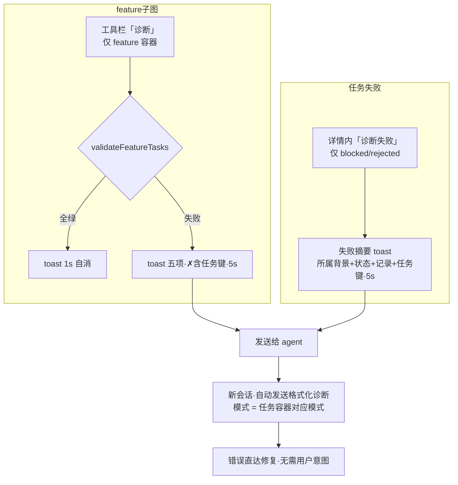
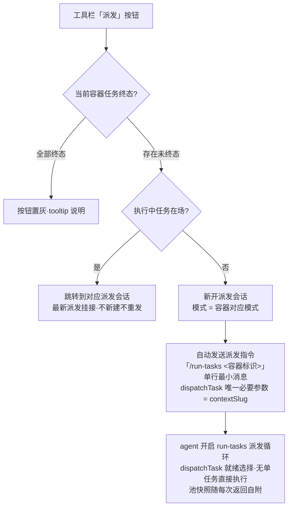

# dsh-forge M3 — UI Functions

> Requirements 层：定义 UI **要做什么**。基线 = M2 交付现态（概览 dock tab 三子 tab[提案|feature|任务] + 搜索/排序/chips 机制 + 任务详情抽屉 + 挂接 pill）+ 平台官方基座（设置对话框 / hero 预设座位 `AgentPresetSeat`——平台 UI，M3 仅经 `ui-settings` 行开关开启与双预设装配，**非本里程碑自建 UF**）。左栏不加行、中区不加签、conversation 三签不动（沿 M2 纪律）；概览 tab **默认加宽 560px + 左缘拖拽调宽**（工具栏控件一行——容器 pill / 视图下拉 / 诊断 / 派发）。设计定稿 = [ui/ui-design.md](../ui/ui-design.md)（v24，170 冒烟断言全绿——2026-10-08 用户裁决落地）。

## UI Scope

概览 dock tab 提案子 tab 完整形态（五态 chips + mode chip + 行头「打开新会话」+ 人工裁决 + mode 更改）；feature 子 tab 升级（阶段过滤 + 两列元数据 + 分层文档 + 行头「打开新会话→远征」）；任务子 tab = M2 全量复刻 + 诊断 + 派发（容器 pill 语境 + toast 结果 + 工具栏派发按钮）；设置对话框「Forge设置」多小节分区（worker 默认 LLM）。共 4 个 UI Function。

## Navigation Architecture

- **Platform**: web

### Primary Navigation

左栏（官方 ui-sidebar 壳，M3 不加行）；中区（官方 main 面板互换：会话 / 知识 / hero——M3 不加签，hero 预设座位经开关开启后平台自现）；右栏（官方 ui-dockkit：开始 tab + 概览 tab + 文档 tab——M3 无新 tab；**概览 tab 宽度默认 560px、左缘拖拽调宽 400–920px**）。

### Secondary Pages

| Page | Entry | Return |
|------|-------|--------|
| 概览 · 提案/feature/任务 子 tab | 概览 tab 子 tab 切换 | 子 tab 切换 / chip × |
| 模式更改 / 裁决 对话框 | 行动作（⋯ / mode chip） | Esc / 取消 |
| 设置对话框 · Forge设置 分区 | 设置入口 | 设置关闭 |
| 新会话（提案/feature/诊断/派发渠道打开） | 行头「打开新会话」/ 诊断「发送给 agent」/ 任务子 tab「派发」 | 中区会话面常驻 |

---

## UI Function 1: 提案子 tab 完整形态（评审工作流之家）

### Placement

右栏概览 dock tab 既有「提案」子 tab（M2 结构不动——搜索/排序共用机制沿袭）；五态 chips 行 + 行头动作 + 展开元数据升级。

### Interaction Flow

1. **五态 chips 过滤**：draft / under-review / accepted / rejected / superseded（0 计数 disabled；多选并集；子 tab 切换清空）。
2. **提案行**：标题 + **名称右侧 mode chip**（远征蓝 / 突击琥珀 / 无溯源「未标记」中性不可点）+ 中文状态 tag + **「打开新会话」按钮（状态 chip 右侧）** + ⋯ 菜单。
3. **展开元数据**：摘要独占一行；**两列网格** = `标识|作者`（「标识」原 slug 更名——见名知义，紧接摘要下行左侧）→ `模式|谱系`（同行，谱系右列对齐；谱系 = 沿革与关联链：溯源方向 / superseded 取代链 / feature 成链关联）→ `创建|裁决`；**文档区标题「文档（N 篇）」**——提案文档**不固定**（proposal.md 之外可挂任意文档行）。
4. **「打开新会话」**（行头按钮，提案渠道）：创建新会话 + **自动切换至提案 mode**（无溯源 → 不切换）+ **现状上下文预填消息输入框（不自动发送）**——格式：`@docs/proposals/<标识>/`（第一行）→ `名称：` → `摘要：` → `状态：` → `已生成文档：` + `· 路径（状态）` 逐行清单（**不含模式**——由会话预设承载）；末尾留「我的意图：」空位，**等待用户输入明确意图后手动发送**。
5. **人工裁决**（⋯ → 评审流转…）：对话框（目标态仅列五态机允许集 + reason 必填——空因拒绝留场）；**远征提案 accepted → registerFeature 单步成链**；**突击提案 accepted → 直接进入任务阶段（突击无 feature 阶段——只有提案与任务）**。
6. **mode 人工更改**（律三唯一正门；⋯ 或 mode chip 快捷入口）：远征⇄突击二选 + 说明必填 + 快照不回溯一行明示；溯源字段即时更新（proposals.mode——features 恒远征无需同步，tech-design 裁决⑥）。
7. **错配守卫**（可见性不阻断）：hero 自由会话打开异模式内容时 mode chip 对照呈现；平台 blank 锁边界如实记账。

---

## UI Function 2: Forge设置 分区（worker 默认 LLM 统一档位）

### Placement

设置对话框「通用设置」分区下方——`settings.section` slot 注入（产品 client 插件形态，非 fork）；**分区内多小节结构**（可承载多个配置小节，小节间明显视觉分隔，行式控件对齐 dsh 通用设置形态）。

### Interaction Flow

1. **worker 小节**（当前唯一小节，小节标题「worker」）：**默认 LLM 三项**——Provider / Model（联动）/ Reasoning（低|中|高 三段）——行式布局（标签左/控件右）。
2. **未配置态**：⚠ 占位说明「worker 派发将回退父会话继承」（显式不静默）+ 保存禁用；填齐激活（脏态实时）。
3. **保存**：成功 → 持久化（用户数据域 `forge-settings.json`——tech-design 裁决：core forgeSettings 单门读写）、下次派发生效；失败 → 错误行留场可重试。
4. 「按任务类型指派特定 LLM」= 未来注记文案锚点（不实现）。

---

## UI Function 3: 任务子 tab（M2 全量复刻 + 诊断 + 派发入口）

### Placement

右栏概览 dock tab「任务」子 tab——M2 全量结构复刻（容器 pill 弹出菜单 + 计数 + 三视图 + 七态 chips + 两行列表 + 行内详情时间线）；**诊断与派发融入工具栏**。

### Interaction Flow

1. **工具栏（控件一行·v22 布局）**：容器 pill（弹出菜单切换；任务集即切）+ **视图下拉（容器 pill 右侧——类切换模式下拉，当前视图直出 + ▾，选项 列表|DAG|泳道）** + 右簇 **[诊断]（仅 feature 容器）+ [派发]——固定最右端、同行不换行**（派发居最右；**可点击态 = 与其它按钮同款式、置灰态 = 深灰实底——v24 视觉裁决**）。
2. **「派发」按钮（v22）**：**存在未处于终态的任务（pending/in_progress/blocked/suspended——终态 = completed/skipped/rejected）时亮起可点；全部终态置灰**（tooltip 说明）。点击行为双路由：**当前容器存在正在执行的任务 → 跳转到对应的派发会话**（该任务最新派发挂接·task_session_links/claim 记录；不新建会话、不重复发送、不切模式——派发循环已在场）；**否则新开一个派发会话**——切至容器对应模式（feature → 远征 / 突击提案 → 突击）并**自动发送**派发指令——**「`/run-tasks <容器标识>`」单行最小消息**（v23 用户裁决：只给 dispatchTask 必要信息——唯一必要参数 = contextSlug；所属/摘要/阶段/任务池快照/请求行废止：池快照由 dispatchTask 每次返回自附、DAG 序 = run-tasks 技能内置纪律）。
3. **三视图**（M2 复刻，控件形态改下拉·语义不变）：列表（两行布局 + 执行中/其余分组 + 行点击展开详情[时间线 verb/at/note + 挂接 + 转移状态…]）；DAG（分层贝塞尔 + 箭头 marker + 节点点击回列表定位）；泳道（七态横向列 0 计数折叠）。七态 chips 统一过滤（0 计数禁用）。**无单任务直接执行入口**（v22）：任务行/详情不提供「执行」动作——不支持指定单个任务直接执行，必须按 DAG 依赖顺序领取执行。
4. **「诊断」**（validateFeatureTasks——只读校验动词，对象 = 容器 pill 当前选中的 feature 容器）：**结果 toast 锚定诊断按钮左侧贴近出现**——成功「子图健康 ✓」**1s 自动消失**；失败 = 标题 + 五类检查逐项（✗ 项含任务键与违规描述）+ **「发送给 agent」按钮，5s 自动消失**——点击 = 打开新会话并**自动发送**格式化失败诊断（`@path` → `所属：`（feature）→ `摘要：`→ [`阶段：`] → `诊断：validateFeatureTasks 失败` + 五项逐行 → `请求：请排查修复`——错误直达修复，无需用户意图）。
5. **任务失败诊断**：**blocked / rejected 任务**的行内详情动作区含**「诊断失败」按钮**（非失败任务不出现）——失败摘要 toast（锚定按钮左侧·5s：状态 + 原因 + 最近记录 + 任务键）；**「发送给 agent」** → 新会话**自动发送**（**发往任务容器的对应模式**：feature 容器 → 远征 / 突击提案容器[直挂任务] → 突击）格式化失败诊断（**附所属容器背景**：`@docs/features|proposals/<标识>/` 第一行 → `所属：<标题>（feature|突击提案）` → `摘要：` → [`阶段：`] → `任务：<键> <标题>` → `状态与原因` → `失败记录：` 逐行 → `请求：请排查修复`）。
6. **容器 pill = features + 突击提案**：feature 容器（远征点）+ 突击提案容器（琥珀点 + 「突击提案」标记 + 「无 feature 阶段」计数注——任务直挂提案）；突击容器**无 feature 子图「诊断」按钮**（validateFeatureTasks 为 feature 域校验），「派发」按钮与任务级「诊断失败」仍可用。
7. 概览 tab 左缘拖拽调宽（工具栏控件恒一行）。

---

## UI Function 4: feature 子 tab 升级（阶段过滤 + 分层文档）

### Placement

右栏概览 dock tab「feature」子 tab——阶段 chips 行 + 行头动作 + 展开元数据升级。**feature 列表 = 远征内容**（突击无 feature 阶段——只有提案与任务）。

### Interaction Flow

1. **阶段 chips 过滤**：进行中 / 需求 / 设计 / 任务 / 已完成 / 已归档（0 计数 disabled；「阶段」原「相位」更名——M2 相位推导机为代码域术语保留）。
2. **feature 行**：标题 + 远征 mode chip（只读——**feature 固定远征模式**）+ 阶段 tag + **「打开新会话」按钮（状态 chip 右侧）**。
3. **展开元数据**：摘要独占一行；两列网格 = `标识|阶段` → `模式|谱系`（谱系 = 来源提案 `proposal_id` 关联链，右列对齐）。
4. **分层文档**：文档区标题「文档（N 篇）」→ **中文分组标题**（需求文档(N) / 设计文档(N) / UI 文档(N)…）→ 文档行 **`📄 dir/name`（相对 feature 目录真实路径，如 `prd/prd-spec.md`）[状态] ›** 整行可点 → dock 文档 tab。
5. **「打开新会话」**（feature 渠道）：创建新会话 + **固定切换至远征模式** + 现状上下文预填（同 UF-1 格式：`@docs/features/<标识>/` 第一行 → 名称 → 摘要 → 阶段 → 已生成文档真实路径清单；不含模式；不自动发送）。

---

## 数据约束（UI 消费面——2026-10-07 模型澄清）

1. **归属模型**：**feature ⊂ 提案、任务 ⊂ 提案**。远征提案 accepted → registerFeature **同名成链**（同标识 feature；任务挂 feature = 提案链）；突击提案 accepted → **任务直挂提案**（无 feature 行/文档域）。部分提案只有任务，其余提案有 feature 也有任务。
2. **同项目**：概览三子 tab（提案 \| feature \| 任务）同属一个项目（单工作区）——三视图数据同源直读每工作区库（M2 直读口径）。
3. **任务子 tab 容器 = 有任务的提案**：远征提案经其 feature 持有任务（容器显示 feature 语境）；突击提案直挂（容器注记「无 feature 阶段」）；突击容器**无 feature 子图「诊断」按钮**（validateFeatureTasks 为 feature 域校验），任务级「诊断失败」仍可用。
4. **标识（原 slug）** = 构造目录 path 的锚：元数据第二行第一列展示；消息中以 **@path 引用**（`@docs/proposals/<标识>/` · `@docs/features/<标识>/`）而非「标识：」行。
5. **消息体数据源**：@path（容器目录锚）→ 所属（标题 + 种类：feature/突击提案）→ 摘要 →（阶段·feature）→ 主体（任务键/诊断项/失败记录）→ 请求；文档清单 = 相对容器目录的**真实路径** + 状态；**不含模式**（由会话预设承载）。**派发指令例外（v23）= `/run-tasks <容器标识>` 单行**——不参与本格式族。
6. **模式路由**：打开新会话 = 容器对应模式（提案渠道 → 提案 mode；feature 渠道 → 固定远征）；诊断发送给 agent = 任务容器对应模式（远征容器 → 远征；突击提案容器 → 突击）；**派发新会话 = 容器对应模式（同诊断路由，v22）**。
7. **派发入口语义（v22/v23）**：未终态任务在场亮起、全部终态置灰；执行中任务在场 → 跳转对应派发会话（不新建、不重复发送）；**无单任务直接执行入口**——必须按 DAG 依赖顺序领取执行（dispatchTask 就绪选择）。**自动发送例外成员 = 诊断两路 + 派发指令**（「打开新会话」预填不发送的例外清单收口于此）；**派发指令 = 最小消息**（`/run-tasks` 开头 + 容器标识——只给 dispatchTask 必要信息）。

## 核心交互流程图

**A. 打开新会话（提案 / feature 渠道——预填不发送）**：

```mermaid
flowchart TD
    A[行头「打开新会话」] --> B{渠道}
    B -->|提案| C[切至提案 mode<br/>无溯源 → 不切换]
    B -->|feature| D[固定切远征]
    C --> E[组装现状上下文]
    D --> E
    E --> F[预填消息输入框·不自动发送<br/>@path 第一行 → 名称 → 摘要 → 状态/阶段 → 文档清单<br/>末尾「我的意图：」空位]
    F --> G[用户补明确意图 → 手动发送]
```

**B. 诊断两路（feature 子图 / 任务失败——toast + 发送给 agent 自动发送）**：



**C. 派发入口（任务子 tab 工具栏——跳转/新开双路由，v22）**：



## 消息体示例

**① 打开新会话 · 预填（提案渠道，输入框草稿——不发送）**：

```
@docs/proposals/ui-polish-round/
名称：UI 打磨轮
摘要：空态/加载态/错误态统一打磨
状态：评审中
已生成文档：
· proposal.md（评审中）
· review-notes.md（草稿）

我的意图：
```

**② 任务失败诊断 · 自动发送（远征容器——发往远征模式）**：

```
@docs/features/dsh-forge-m2-pipeline/
所属：M2 管线接管（feature）
摘要：状态层转正 + 插件执行链 + 任务/文档视图
阶段：任务
任务：dsh-forge-m2-pipeline/2.5 概览 tab 三视图接线
状态：阻塞 — fix-1 创建（block-source 单事务）
失败记录：
· auto-block 10-02 12:00 fix-1 创建（block-source 单事务）
请求：请排查修复（任务时间线见概览 → 任务子 tab → 该任务详情）
```

**③ 任务失败诊断 · 自动发送（突击提案容器——发往突击模式，@path 指向提案目录、无阶段行）**：

```
@docs/proposals/legacy-eval-retire/
所属：旧线 eval 退役（突击提案）
摘要：完整 eval 体系不迁移
任务：legacy-eval-retire/1.2 旧线 eval 退役走查（用例集冲突）
状态：阻塞 — result=blocked：eval 用例集与幸存者裁剪清单冲突——待排查
失败记录：
· submit 09-23 10:05 result=blocked：eval 用例集与幸存者裁剪清单冲突——待排查
请求：请排查修复（任务时间线见概览 → 任务子 tab → 该任务详情）
```

**④ feature 子图诊断 · 自动发送（发往远征模式）**：

```
@docs/features/dsh-forge-p1-mvp/
所属：P1 MVP（feature）
摘要：壳与桥接面 + 工作区注册 + dogfood 走查门
阶段：已完成
诊断：validateFeatureTasks 失败
✓ 派生不变量
✓ 依赖无环
✗ Liveness — dsh-forge-p1-mvp/1.3 卡死子图（1.3 → 1.4 → 1.3），涉及 2 任务
✓ 记录链完整性
✓ 拓扑可分层
请求：请排查修复（五类检查 = 派生不变量 / 依赖无环 / Liveness / 记录链完整性 / 拓扑可分层）
```

**⑤ 派发指令 · 自动发送（单行最小消息——v23 用户裁决：消息以 /run-tasks 开头，只给 dispatchTask 必要信息）**：

```
/run-tasks dsh-forge-m3-bootstrap-presets
```

（`/run-tasks` 技能调用 + 容器标识 = dispatchTask 的 `contextSlug` 参数——唯一必要信息。容器背景/摘要/阶段非派发义务（dispatchPrompt 自带 SOURCE 行）；任务池快照由 dispatchTask 每次返回自附（tech-design 裁决⑪）；按 DAG 顺序领取 = run-tasks 技能内置纪律。突击提案容器同构——仅标识不同。）

---

## hero 预设座位（平台 UI——非自建 UF）

开关开启（`ui-settings` 行首启预置）后 hero 自现 `AgentPresetSeat`：折叠标签 = 当前模式显示名（registry default = 远征模式）；菜单列双预设（中文 name 直出、order 1/2）；blank 期点选即时切换；**首回合后座位锁定**（平台 blank 锁）。M3 产品面职责 = 装配双预设 + 开关首启预置，不改平台座位组件。

## Page Composition

| Page | Type | UF | Notes |
|------|------|----|----|
| 概览 dock tab · 提案子 tab | existing（M3 升级） | UF-1 | 五态 chips + mode chip + 行头打开新会话（预填上下文）+ 裁决/模式更改对话框；突击 accepted → 直接任务阶段 |
| 概览 dock tab · feature 子 tab | existing（M3 升级） | UF-4 | 阶段 chips + 两列元数据（标识/模式/谱系/阶段）+ 分层文档（中文分组 + 真实路径）+ 打开新会话→远征（预填） |
| 概览 dock tab · 任务子 tab | existing（M2 复刻 + M3 诊断 + 派发） | UF-3 | 三视图/七态 chips/行内详情全量 + 「诊断」toast（1s/5s + 发送给 agent）+ 「派发」按钮（未终态亮起/全终态置灰；跳转既有派发会话或新开 + 结构化指令自动发送）+ 视图下拉；工具栏控件一行 |
| 设置对话框 · Forge设置 分区 | existing（M3 新增分区） | UF-2 | 多小节结构；worker 小节三项（Provider/Model/Reasoning） |
| hero 预设座位 | 平台 UI（非自建） | — | `AgentPresetSeat` 经开关开启；M3 装配 + 首启预置 |
| 新会话（提案/feature/诊断/派发渠道） | existing（M3 新增入口行为） | UF-1/UF-4/UF-3 | 上下文预填输入框不自动发送（等待明确意图）；诊断两路与派发指令 = 自动发送例外 |
