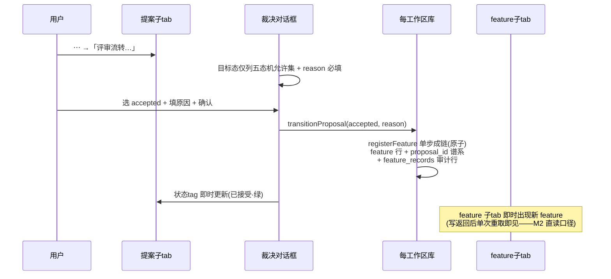
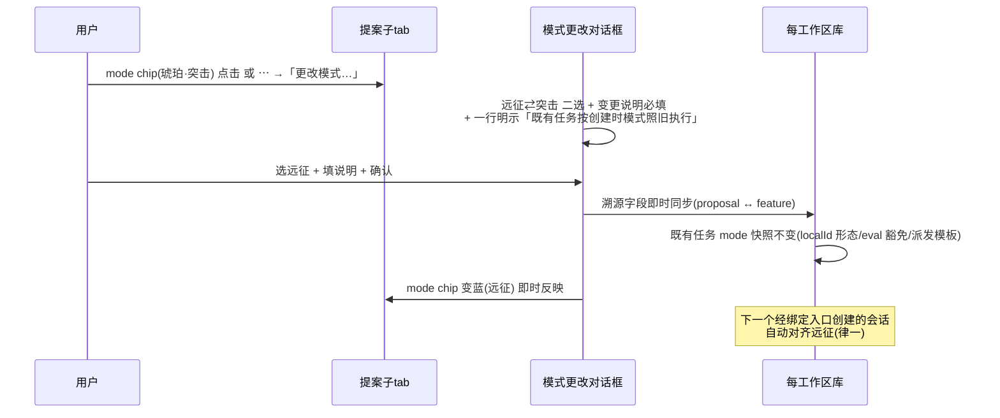
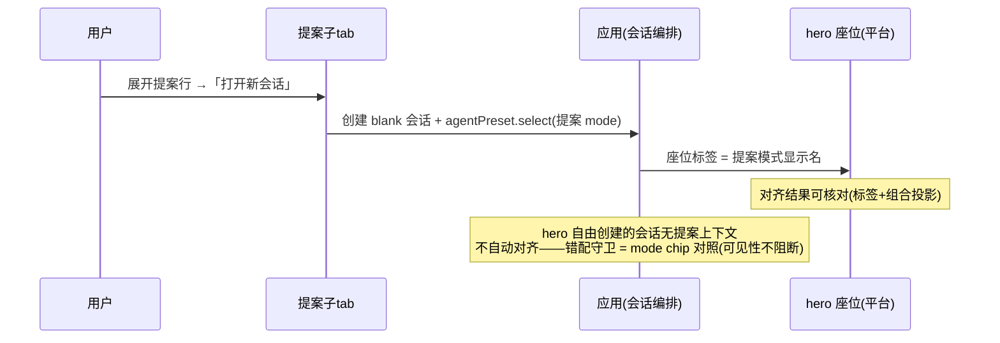
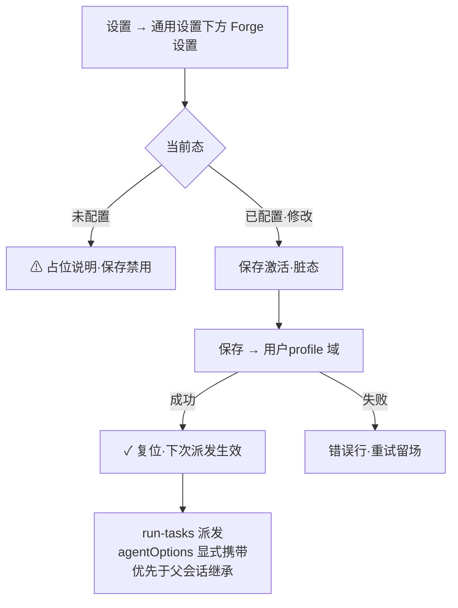
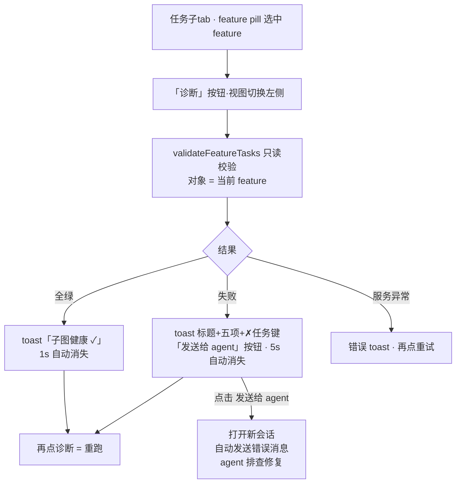
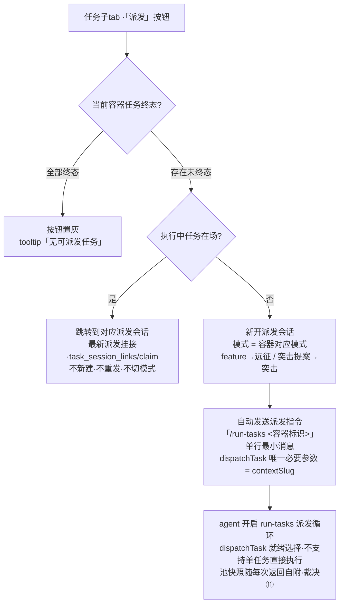

# dsh-forge M3 — UI Design（Web）

> **设计基线**：M3 全部 UI = M2 已交付面的升级（概览提案子 tab / 设置对话框 / feature 子 tab 增动作），无新 dock tab、无新面板、左栏不加行、中区不加签（M2 纪律沿袭）。设计系统继承 M2 定稿体系（两轮 UI/UX 专家评审先例），零视觉断裂。PRD = `prd/prd-ui-functions.md`（4 UF + hero 座位 = 平台 UI 仅开关开启）。

## Design System

> 继承 M2（`docs/features/dsh-forge-m2-pipeline/ui/ui-design.md` · Design System）：只引用 `--dsw-*` 语义令牌（上游 ui-theme 实值），禁裸色值/裸字号；亮/暗双主题；chip kv 组件（`{key} : {value}`，键 10.5px tertiary / 值 11.5px 500）；对话框 = 目标态允许集 + reason 必带 + 空因拒绝留场；块标题底色条 + 13px/600；层次阶梯（块头 13px/600 → 子标题 12px/600 次色 → 组标签 10.5px 三级色 → 内容 11.5–12px）；界面说明最小化（无解释性文字，语义锚定本文档）。类型类别色彩沿用（编码=蓝 / 文档=紫 / 测试=青 / 评估=红 / 验证=琥珀 / 质量门=绿）。

**M3 新增语义令牌映射**（沿 `--dsw-*` 语义域，不造新令牌名）：

| 语义 | 用途 | 色彩域 |
|---|---|---|
| 模式 · 远征（expedition） | mode chip / 座位标签 | 蓝（primary 语义——默认模式） |
| 模式 · 突击（blitz） | mode chip / 座位标签 | 琥珀（warning 语义——快速直达） |
| 模式 · 未标记 | 扫描吸收旧提案缺省占位 | 中性 tertiary（disabled 态） |
| 提案五态 | chips / 状态 tag | draft=中性 · under-review=蓝 · accepted=绿 · rejected=红 · superseded=紫 |

## Navigation

沿 M2 全量不变（左栏 ui-sidebar 壳 / 中区 main 面板互换 / 右栏 ui-dockkit：开始 + 概览 + 文档 tab）。M3 增量：

- **设置对话框**：新增「Forge设置」分区（通用设置下方，`settings.section` slot 注入——UF-2）。
- **hero 预设座位（平台 UI，非自建 UF）**：`ui-settings` 行首启预置开启后，hero 的 `AgentPresetSeat` 自现——折叠标签 = 当前模式显示名（远征模式 / 突击模式），菜单列双预设；blank 期可切换、首回合后锁定（座位卸载语义 = 平台行为，M3 仅装配与开关预置）。
- 概览提案子 tab / feature 子 tab = 既有面升级（UF-1 / UF-3）。

---

## UF-1 提案子 tab 完整形态（评审工作流之家）

### Placement

- **Mode**: existing-page
- **Target**: 右栏概览 dock tab（`dswf-overview`）·「提案」子 tab
- **Position**: ov-sticky（子 tab + 搜索 + 排序）之下、提案列表之上插入**五态 chips 行**；提案父行结构与文档行沿 M2 不动，行内增 mode chip 与动作集。

### Layout Structure

```
[提案子tab]
├── 五态chips行: 草稿(N) · 评审中(N) · 已接受(N) · 已否决(N) · 已取代(N)   ← 0 计数 disabled 淡化(机制沿 M2 七态 chips)
├── 提案父行: 标题 + [mode chip 名称右侧] + 中文状态tag + [打开新会话] + ⋯
│   └── ▸ 展开元数据块: 摘要(独占一行) + 两列网格[标识|作者 / 模式|谱系 / 创建|裁决]
│        + 文档区(标题含篇数·v18): 文档行(不固定——📄 proposal.md / tech-research.md / … [状态] ›)
└── (搜索/排序: M2 共用机制不动——子tab切换清空chips语义不变)
```

**mode chip 形态**：紧凑 chip（12px）——远征 = 蓝点 + 「远征」/ 突击 = 琥珀点 + 「突击」/ 未标记 = 中性「未标记」（扫描吸收旧提案，不可点击）。有溯源时 chip **可点击 = 打开模式更改对话框**（同 ⋯ 菜单入口，唯一正门不因快捷方式分叉）。

**⋯ 菜单**（提案行）：`评审流转…`（裁决对话框）/ `更改模式…`（模式更改对话框）/ `打开新会话`（切提案模式）/ 文档行跳转沿 M2。

**元数据布局（v6–v11）**：摘要独占一行（full）；**两列网格**——**第一行 = 标识 \| 作者（feature：标识 \| 阶段）**（「标识」原 slug 更名，**紧接摘要下一行左侧**，v11）；第二行 = 模式 \| 谱系（**谱系在右列、与其它列对齐**，v9；谱系 = 沿革与关联链：提案 = 溯源方向 / superseded 取代链 / 与 feature 的成链关联；feature = 来源提案 `proposal_id`）；其余字段续列（提案：创建 \| 裁决）。feature 的文档统计并入文档区标题「文档（N 篇）」。**提案文档不固定**（proposal.md 之外可挂 spike 笔记等任意文档行）。**「打开新会话」按钮在行头状态 chip 右侧**（v7）——点击 = 创建新会话 + 自动切模式（无溯源 → 不切换；feature 固定远征）+ **现状上下文预填消息输入框（不自动发送，v13）**——格式化分层（v16：**`@<docsRoot>/proposals/<标识>/` 或 `@<docsRoot>/features/<标识>/` 居第一行**（标识 = 构造目录路径的锚，@path 引用替代「标识：」行；docsRoot = docsRootOf(工作区, forge_dir) 数据推导——标准布局 `.forge/docs`，2026-10-09 锚点修正）→ `名称：<标题>`（替代【现状】标题行）→ `摘要：…` → `状态：`/`阶段：`（**在摘要下方**）→ `已生成文档：` + `· 相对路径（状态）` 逐行清单；**不含模式**——模式由会话预设承载），末尾留「我的意图：」空位——**等待用户输入明确意图后发送**。诊断「发送给 agent」保留自动发送（v4 裁决——错误直达修复）。

**突击提案 accepted 语义（v6 产品裁决）**：突击模式**没有 feature 阶段——只有提案与任务**；突击提案 accepted → 直接进入任务阶段（addTask + mode 溯源 = blitz），不走 registerFeature 成链；远征提案 accepted → 单步成链（feature 出现）。

### States

| State | Visual | Behavior |
|-------|--------|----------|
| 默认 | chips 计数 + 提案列表 | 五态聚合计数；chips toggle 过滤（多选并集） |
| 空态（零提案） | 一等空态文案 | 沿 M2 空态语义（非错误）；chips 全 0 disabled |
| 过滤零命中 | 列表区空提示 | chips 至少一个激活时呈现「清除过滤」快捷动作 |
| mode 缺省 | 「未标记」中性 chip | 不可点击；悬停提示「扫描吸收的旧提案无溯源」 |
| 裁决/更改对话框·空因 | 拒绝提交 | 「原因必填」错误行留场（沿 M2 转移对话框） |

### Interactions

| Trigger | Action | Feedback |
|---------|--------|----------|
| 五态 chip 点击 | toggle 该态过滤 | 计数不变、列表即时过滤（直读库，无延迟语义） |
| 提案父行点击 | 展开/收起元数据 | 多开语义沿 M2；子 tab 切换全收起 |
| ⋯ → 评审流转… | 裁决对话框（目标态仅列五态机允许集 + reason 必填） | 确认 → transitionProposal 同门写库 → 行状态 tag 即时更新；与 agent tool 双面一致 |
| ⋯ / mode chip → 更改模式… | 模式更改对话框（远征 ⇄ 突击二选 + 变更说明必填 + 快照不回溯一行明示） | 确认 → 溯源字段即时同步（proposal↔feature）→ mode chip 变色即时反映 |
| 「打开新会话」（提案渠道·行头） | 创建 blank 会话 + `agentPreset.select`（目标 = 提案 mode；无溯源 → 不切换）+ **现状上下文预填输入框**（标识/状态/摘要/文档清单——**不含模式**；留「我的意图：」空位**不自动发送**，v13） | 中区切至新会话；座位 = 提案模式；输入框预填待意图 |
| 文档行点击 | dock 开文档 tab（docRel 去重） | 沿 M2 UF-2 全量 |

### Data Binding

| UI Element | Data Field | Source |
|------------|-----------|--------|
| 五态 chips 计数 | proposals 按 status 聚合 | 每工作区库（直读） |
| 提案行 | slug / title / status（中文映射）/ created | proposals 行 |
| mode chip | mode 溯源字段（expedition / blitz / null） | proposals 行（创建技能写入；人工更改即时同步） |
| 展开元数据 | 摘要 / 作者 / 裁决 / 谱系（proposal_id 链） | proposals 行 + 谱系查询 |
| 裁决对话框允许集 | 五态机纯函数 `allowedTransitions` | 状态机（服务端同源校验，零漂移——沿 M2 Interface 10 语义） |
| 更改对话框落库 | transitionProposal 模式通道 + feature 同步 | core 动词（律三唯一正门） |

---

## UF-2 Forge设置区块（worker 默认 LLM 统一档位）

### Placement

- **Mode**: existing-page
- **Target**: 设置对话框 ·「通用设置」分区下方
- **Position**: `settings.section` slot 注入新分区「Forge设置」（产品 client 插件形态，非 fork）；**分区内多小节结构**（用户评审修订：Forge设置可承载多个配置小节，当前仅 worker 一节——小节间明显视觉分隔，行式控件对齐 dsh 通用设置形态）。

### Layout Structure

```
┌─ Forge设置 ──────────────────────────────┐   ← 分区标题(底色条 + 13px/600)
│ ┌─ worker ────────────────────────────┐ │   ← 小节标题(12px/600 次色 + 分隔线;多小节可并列)
│ │ 默认 LLM(全部执行子代理统一档位)        │ │   ← 说明一行(11px tertiary)
│ │ Provider              [ ▾ dsh-… ]   │ │   ← 行式控件(标签左/控件右——对齐通用设置行)
│ │ Model                 [ ▾ glm-… ]   │ │
│ │ Reasoning          [ 低 | 中 | 高 ]  │ │   ← 三段 seg
│ │ [ 保存 ] [ 模拟保存失败(原型演示) ]     │ │
│ │ ⚠ 未配置——派发回退父会话继承(显式提示)  │ │   ← 缺省态占位说明
│ └──────────────────────────────────────┘ │
│ 注: 按任务类型指派特定 LLM = 未来注记(不实现) │
└──────────────────────────────────────────┘
```

> **Output 上限已去掉（用户评审修订 2026-10-07）**——配置面 = Provider / Model / Reasoning 三项。

### States

| State | Visual | Behavior |
|-------|--------|----------|
| 未配置（缺省） | 三项空值 + ⚠ 占位说明行 | 「未配置——worker 派发将回退父会话继承」；保存按钮 disabled |
| 已配置 | 值直出 | 修改后保存按钮激活（脏态，input+change 双监听实时） |
| 保存中 | 按钮 loading | 输入冻结 |
| 保存成功 | 按钮 ✓ 复位 | 值持久化（用户 profile 域）；下次派发生效（无需重启会话） |
| 保存失败 | 错误行 + 重试 | 沿对话框错误语义（留场不吞错） |

### Interactions

| Trigger | Action | Feedback |
|---------|--------|----------|
| Provider 选择 | 联动 Model 候选 | Model 下拉刷新（供应商 × 模型二维） |
| 保存 | 写配置 | 成功/失败两态反馈；生效时点 = 下次 run-tasks 派发（agentOptions 显式携带，优先于父会话继承） |

### Data Binding

| UI Element | Data Field | Source |
|------------|-----------|--------|
| Provider / Model / Reasoning | worker 默认 LLM 三项（统一档位） | 用户 profile 域（Forge 配置）；消费方 = run-tasks 派发面 agentOptions 组装 |

> 「按任务类型指派特定 LLM」= 未来注记文案锚点（非交互元素；分区底注一行，不实现）。

---

## UF-3 任务子 tab（M2 复刻 + 诊断 + 派发入口）

### Placement

- **Mode**: existing-page
- **Target**: 右栏概览 dock tab ·「**任务**」子 tab
- **Position**: ov-taskbar 工具栏（v22 重构：容器 pill + 视图下拉 + 诊断/派发右簇）——**诊断对象 = 容器 pill 当前选中 feature**（一次一 feature，M2 既定口径）；**派发 = 当前容器的任务池入口**（用户评审修订：从会话内手打 run-tasks 扩为工具栏一键直达）。

### Layout Structure

```
[任务子tab = M2 全量复刻 + 诊断 + 派发 · 概览 tab 默认 560px·左缘拖拽调宽 400–920]
├── ov-taskbar(控件一行·v22 布局): 容器 pill(弹出菜单切换·运行中 done/total chip + 计数注)
│               + **视图下拉**(pill 右侧·类模式切换下拉:当前视图直出+▾·选项 列表|DAG|泳道·当前项✓)
│               + spacer + 右簇: **[诊断]按钮 + [派发]按钮——固定最右端**(诊断在左·派发居最右·同行不换行;
│                 派发可点击态 = 与其它按钮同款式·置灰态 = 深灰实底[v24 视觉裁决])
├── 七态 chips(tchip:状态点+标签+计数·0 计数禁用·多选并集·✕清过滤)——三视图统一过滤
├── [列表] 两行布局(主行 ID+标题+状态tag+⋯ / 副行 类型·优先级·前置·挂接·fix)
│         + 执行中/其余分组 + 行点击展开详情(时间线 verb/at/note + 挂接双源
│         + 转移状态… + [诊断失败]——仅 blocked/rejected 任务,v19)
├── [DAG] 分层布局 + SVG 贝塞尔连线 + 箭头 marker(完成边绿) + 节点(状态点+键+标题)
│        + 图例；节点点击 → 列表视图 + 该任务展开(M2 行为)
├── [泳道] 七态横向列(0 计数列折叠窄头) + 卡片(键+标题+类型/挂接 foot)
├── 诊断结果 = toast（锚定诊断按钮左侧·贴近出现）:
│   · 成功 → 「子图健康 ✓」1s 自动消失
│   · 失败 → 标题 + 五项(✗ 项含任务键与违规描述) + 「发送给 agent」按钮 · 5s 自动消失
│     → 点击 = 打开新会话并自动发送错误消息（错误面直达 agent 排查修复）
│   · 任务失败诊断(v19–v21·详情内「诊断失败」按钮): 失败摘要 toast(状态+原因+最近记录≤3+任务键·锚定按钮左侧·5s)
│     + 「发送给 agent」→ 新会话自动发送(**发往容器对应模式**: feature→远征 / 突击提案容器→突击)·格式化分层+所属背景(v21)
├── **派发按钮(v22)**: 未终态任务在场(pending/in_progress/blocked/suspended——终态 = completed/skipped/rejected·
│   与相位推导机口径同源) → 亮起可点(与其它按钮同款式·无主操作蓝·v24); 全部终态 → 置灰(深灰实底·
│   非透明淡出 + tooltip「全部任务已处于终态——无可派发任务」)
│   · 点击(无执行中任务) = 与诊断失败消息同机制: 新开派发会话(**切至容器对应模式**: feature→远征/突击提案→突击)
│     + **自动发送**派发指令——**「/run-tasks <容器标识>」单行最小消息**(v23: dispatchTask 唯一必要参数 = contextSlug;
│       背景冗余——dispatchPrompt 自带 SOURCE 行·池快照冗余——dispatchTask 每次返回自附·裁决⑪·DAG 序 = 技能内置纪律)
│   · 当前容器存在执行中任务 → **跳转到对应派发会话**(该任务最新派发挂接·task_session_links/claim 记录;
│     不新建·不重发·不切模式——派发循环已在场)
├── 容器 pill(v20) = features(远征点) + 突击提案容器(琥珀点·「突击提案」标记·计数注[无 feature 阶段]·无子图诊断按钮)
└── **无单任务直接执行入口(v22)**: 任务行/详情不提供「执行」动作——不支持指定单个任务直接执行,
    必须按 DAG 依赖顺序领取执行(dispatchTask 就绪选择·机械序)
```

**概览 tab 宽度**：默认 **560px**（工具栏控件一行展示：容器 pill + 视图下拉 + 诊断 + 派发——下拉形态较三段 seg 收窄占位），**左缘拖拽手柄左右调宽**（钳制 400–920px 且中区保底 ≥580px；hover 主色提示）。**诊断按钮名 = 「诊断」**（tooltip = validateFeatureTasks 语义）；重跑 = 再点诊断（toast 重现，无陈旧滞留）。**派发按钮名 = 「派发」**（tooltip = 构造 /run-tasks 指令发给 agent·按 DAG 顺序领取执行；置灰态 tooltip 说明「全部任务已处于终态」）。

### States

| State | Visual | Behavior |
|-------|--------|----------|
| 未运行 | 仅工具栏「诊断」按钮 | 点击触发校验（对当前 feature pill） |
| 校验成功 | toast「子图健康 ✓」 | **1s 自动消失**；重跑 = 再点诊断 |
| 校验失败 | toast：标题 + 五项（✗ 项含任务键与违规描述）+「发送给 agent」按钮 | **5s 自动消失**；诊断信息可读（非错误码堆） |
| 服务异常 | 错误 toast + 重试语义 | 再点诊断重试（留场不吞错） |
| 切换 feature | toast 不受影响（瞬时结果） | 再点诊断对新 feature 重算（无陈旧滞留） |
| 派发 · 未终态在场（v22） | 「派发」亮起（**与其它按钮同款式**——v24） | 点击 = 跳转派发会话（执行中在场）/ 新开 + 自动发送派发指令（容器对应模式） |
| 派发 · 全终态（v22/v24） | 「派发」置灰（**深灰实底·非透明淡出**） | tooltip「全部任务已处于终态——无可派发任务」；不可点 |

### Interactions

| Trigger | Action | Feedback |
|---------|--------|----------|
| 「诊断」按钮 | validateFeatureTasks（只读校验动词，tool 封装与 UI 同门；对象 = 当前 feature pill） | 结果 toast（成功 1s / 失败 5s 两档） |
| 详情内「诊断失败」（blocked/rejected 任务，v19） | 失败摘要组装（状态 + fix 链/最近失败记录 + 记录 ≤3 + 任务键） | 失败 toast（锚定按钮左侧·5s） |
| 任务失败 toast「发送给 agent」 | 打开新会话（**发往任务容器对应模式**：feature→远征 / 突击提案容器→突击，v20）并**自动发送**格式化失败诊断（@path[features/ 或 proposals/] + 任务键 + 失败记录 + 修复请求） | 消息入会话；toast 收起 |
| 失败 toast「发送给 agent」 | 打开新会话并自动发送错误消息（检查项 + 任务键 + 修复指引） | 中区切至新会话、消息入会话；toast 收起 |
| 「派发」按钮 · 执行中任务在场（v22） | **跳转到对应派发会话**（该任务最新派发挂接会话·task_session_links/claim 记录；不新建·不重发·不切模式） | 中区切至该会话；toast 指明执行中任务与跳转语义 |
| 「派发」按钮 · 无执行中任务（v22） | **新开派发会话**（切至容器对应模式）+ **自动发送**派发指令——`/run-tasks <容器标识>` 单行最小消息（v23：dispatchTask 唯一必要参数 = contextSlug；背景/池快照/请求行废止——池快照由 dispatchTask 返回自附·裁决⑪） | 消息入会话；toast 说明模式路由与 DAG 语义 |
| 容器 pill 点击 | 弹出菜单列容器 → 切换 | 任务集切换（M2 语义；派发可用态随容器重算） |
| 视图下拉（列表\|DAG\|泳道，v22） | 三视图切换（M2 语义不变·控件形态 = 下拉列表） | 当前视图直出 + ▾；选项含当前 ✓ |
| 任务行 / DAG 节点 / 泳道卡片点击 | 行内详情展开（DAG/泳道 → 列表视图 + 定位该任务） | 时间线 + 挂接 + 转移入口（M2 复刻；**无单任务执行动作**） |
| 七态 chip / 清过滤 | toggle 状态过滤 | 0 计数禁用；三视图统一 |

### Data Binding

| UI Element | Data Field | Source |
|------------|-----------|--------|
| 容器 pill | 容器列表 + 当前选中 | 每工作区库（M2 任务子 tab 既有数据面） |
| 五类检查项 | 派生不变量 / 无环 / liveness / 记录链完整性 / 拓扑可分层 | validateFeatureTasks 结果（只读校验动词） |
| ✗ 诊断信息 | 违规任务键 + 描述 | 校验结果负载 |
| 派发可用态（v22） | 当前容器终态判定（未终态 = pending/in_progress/blocked/suspended） | 任务列表前端派生（终态集与相位推导机口径同源） |
| 派发指令消息（v22/v23） | 容器标识（contextSlug 参数）——消息 = `/run-tasks <标识>` 单行 | 当前容器（无额外数据依赖——池快照由 dispatchTask 返回自附） |
| 跳转派发会话（v22） | 执行中任务的最新派发挂接会话 | taskDetail/sessionLinks（task_session_links ∪ records 双源·M2 口径） |

---

## UF-4 feature 子 tab 升级（阶段过滤 + 分层文档 + 打开新会话）

### Placement

- **Mode**: existing-page
- **Target**: 右栏概览 dock tab ·「feature」子 tab（M2 面升级）
- **Position**: 列表上方插入**阶段 chips 行**；feature 父行展开元数据块升级（两列 + 摘要独行 + 分层文档 + 行头打开新会话）。

### Layout Structure

```
[feature子tab]
├── 阶段chips行(ph-chip·0 计数禁用·toggle 过滤): 进行中 · 需求 · 设计 · 任务 · 已完成 · 已归档
├── feature父行: 标题 + [远征 mode chip 只读] + 阶段tag + [打开新会话→远征] + (点击展开)
│   └── ▸ 展开元数据块: 摘要(独占一行) + 两列网格[标识|阶段 / 模式|谱系]
│        + 文档区(分层·标题含篇数): 中文分组标题(需求文档(N)/设计文档(N)/UI 文档(N)…) → 文档行(📄 dir/name 相对 feature 目录真实路径 [状态] › 整行可点→dock 文档 tab)
└── 空态/过滤零命中: 一等空态 + 清除过滤
```

> **feature 列表 = 远征内容**（v6 产品裁决：突击模式没有 feature 阶段——只有提案与任务；突击提案 accepted → 直接任务阶段）。文档分层 = **类型分组**（需求/设计/UI/…——分组标题 + 文档行两级层次；feature 不含提案文档沿 M2 纪律）。

### States

| State | Visual | Behavior |
|-------|--------|----------|
| 默认 | 阶段 chips 计数 + feature 列表 | toggle 过滤（多选并集）；0 计数 disabled |
| 过滤零命中 | 空态 + 「清除过滤」 | 一等展示非错误 |
| 展开 | 元数据（摘要独行 + 两列）+ 分层文档 + 打开新会话 | 多开语义沿 M2 |

### Interactions

| Trigger | Action | Feedback |
|---------|--------|----------|
| 阶段 chip 点击 | toggle 过滤 | 列表即时过滤 |
| 文档行点击 | dock 开文档 tab（docRel 去重·只读渲染） | 沿 M2 UF-2 全量 |
| 「打开新会话」（feature 渠道·行头） | 创建 blank 会话 + select（**固定远征**——feature 固定远征模式）+ **现状上下文预填输入框**（标识/阶段/摘要/分层文档清单；同不自动发送，v13） | 座位 = 远征模式；输入框预填待意图 |

### Data Binding

| UI Element | Data Field | Source |
|------------|-----------|--------|
| 阶段 chips 计数 | features 按 phase 聚合 | 每工作区库（M2 相位推导机） |
| 分层文档 | feature_documents 按 docType 分组 | 每工作区库（直读） |
| 阶段 tag | feature.phase | 相位推导机（写事务内增量重算——M2 机制） |

---

## hero 预设座位（平台 UI 形态参考——非自建 UF）

开关开启（`ui-settings` 行首启预置）后 hero 自现 `AgentPresetSeat`：折叠标签 = 当前模式显示名（远征模式 / 突击模式——registry default = 远征）；点开菜单列双预设（中文 name 直出、order 1/2）；blank 期点选即时切换（标签 + 会话组合投影）；**首回合后座位锁定**（平台 blank 锁——UI 表现 = 座位不再可交互）。M3 产品面职责 = 装配双预设 + 开关首启预置，**不改平台座位组件**。原型中以静态参考形态呈现（不可交互为锁定态示意）。

---

## 动态交互流程

### 流程 1：提案评审流转 → 单步成链（SC6 核心）



### 流程 2：mode 人工升降级（律三正门 + 快照不回溯）



### 流程 3：模式对齐建会话（律一）



### 流程 4：Forge设置保存 → 派发生效



### 流程 5：诊断任务子图（任务子 tab · feature pill 语境 · toast 结果）



### 流程 6：派发入口（任务子 tab 工具栏 · 跳转/新开双路由）



---

## 原型（prototype/）

静态原型（index.html / styles.css / app.js / data.js + 冒烟 smoke.cjs）：M3 四 UF（含 v6 新增 UF-4 feature 子 tab 升级）+ hero 座位参考形态 + **任务子 tab M2 全量复刻**（三视图 + 七态 chips + 行内详情；**容器 pill = features + 突击提案**[v20]）+ **toast 化诊断**（feature 子图：成功 1s / 失败 5s + 发送给 agent；**任务失败诊断**[v19/v20]：详情内「诊断失败」+ 发送给 agent → 新会话自动发送、**发往容器对应模式**）+ **工具栏重构 + 派发按钮（v22：视图下拉[容器 pill 右侧] + 诊断/派发固定右端；派发三态演示——跳转[M2 管线接管·2.4 执行中] / 新开+自动发送[突击容器与 feature 容器·**/run-tasks 单行指令**] / 全终态置灰[P1 MVP]；无单任务执行入口断言）** + **概览 tab 默认 560px 左缘拖拽调宽**；视觉令牌与组件样式继承 M2 原型（`--dsw-*` 语义映射、chip kv、块标题底色条、对话框模式、taskbar/seg/pill 组件族）。种子数据：多态提案集（五态 × 有/无 mode 溯源）+ 三 feature（阶段 + 分层文档）×16 任务 + 突击直挂任务 2 条（blocked 样本 legacy-eval-retire/1.2）+ M2 blocked 样本 2.5 + Forge设置 两态。**冒烟 170 断言全绿**（浏览器候选链：playwright chromium[须 icudtl.dat 在场] → 系统 Chrome → Edge）。

## 评审注记

- 设计系统继承 = 用户裁决（2026-10-07）：M3 无新设计语言，全部沿 M2 令牌纪律与组件约定（chip kv / 对话框允许集 + reason 必带 / 块标题底色条 / 界面说明最小化）。
- **用户评审修订 ×3（2026-10-07，v2 落地）**：① **诊断移任务子 tab**（feature pill 语境即诊断语境——对象 = 当前选中 feature，切换即弃）；② **Forge设置多小节结构**（worker 小节标题 + 小节间明显视觉分隔 + 行式控件对齐 dsh 通用设置；后续小节可并列扩展）；③ **去掉 Output 上限**（配置面 = Provider / Model / Reasoning 三项）。
- **用户评审修订 ×2（2026-10-07，v3 落地）**：④ **任务子 tab 完整复刻 M2**（feature pill 弹出菜单 + 视图 seg 列表|DAG|泳道 + 七态 chips + 行内详情时间线——非占位示意）；⑤ **诊断按钮更名「诊断」** + seg 风格一致（与视图 seg 同族独立分组）+ 类名隔离（`tchip`）零组件冲突。
- **用户评审修订 ×2（2026-10-07，v4 落地）**：⑥ **诊断按钮并入视图切换同行、置于其左**（`.taskbar-right` 右簇同行不换行——不单独一行）；⑦ **诊断结果 toast 化**——成功 1s 自消；失败 5s 自消 + **「发送给 agent」按钮**（打开新会话并自动发送错误消息——错误面直达 agent 排查修复；行内结果块废止）。附带修正：⚙ 设置入口移侧栏底持久位（不随 hero 会话面切换消失）。
- **用户评审修订 ×2（2026-10-07，v5 落地 + 93 断言全绿）**：⑧ **概览 tab 默认加宽 560px + 左缘拖拽调宽**（钳制 400–920、中区保底 ≥580——feature 切换/诊断/视图切换三控件一行展示）；⑨ **诊断 toast 锚定诊断按钮左侧、贴近出现**（右缘贴按钮左缘 + 垂直对齐，不再底部居中远距离）。
- **用户评审修订 ×4（2026-10-07，v6 落地）**：⑩ **feature 子 tab 升级**（阶段过滤 chips + 两列元数据 + **分层文档**[类型分组两级层次] + 打开新会话）；⑪ **突击无 feature 阶段**（产品裁决：突击只有提案与任务；突击提案 accepted → 直接任务阶段，不走 registerFeature 成链）；⑫ **元数据两列化**（摘要独占一行，其余两列压缩卡片高度——feature 与提案同构）；⑬ **「以此模式新建会话」→「打开新会话」**（feature 与提案都有；提案渠道切提案模式、feature 渠道固定切远征）。
- **用户评审修订 ×2（2026-10-07，v7 落地 + 110 断言全绿）**：⑭ **模式与谱系同一行**（谱系 = 沿革与关联链——提案：溯源方向 / superseded 取代链 / feature 成链关联；feature：来源提案 `proposal_id`）；⑮ **「打开新会话」按钮移至行头状态 chip 右侧**（展开区内移除——v6 的展开内按钮废止）。
- **用户裁决（2026-10-07，v8）**：⑯ **feature「相位」更名「阶段」**（用户面标签全部更名；M2 机制名「相位推导机」保留为代码域术语）。
- **用户裁决（2026-10-07，v9 落地 + 110 断言全绿）**：⑰ **谱系对齐右列**——模式/谱系并入两列网格作首行（谱系在右列、与其它两列对齐；v7 的独行模式谱系行废止）。
- **用户裁决（2026-10-07，v10 落地 + 117 断言全绿）**：⑱ **slug 更名「标识」**（见名知义）；⑲ **提案文档不固定**（proposal.md 之外可挂任意文档——spike 笔记等）；⑳ **打开新会话注入现状上下文**（标题/标识/状态·阶段/模式/摘要/**已生成文档相对路径**——中区会话面自动发送；feature 固定远征模式再确认）。
- **用户裁决（2026-10-07，v11 落地 + 117 断言全绿）**：㉑ **「标识」移至紧接摘要下一行左侧**（网格第一行 = 标识\|作者[feature：标识\|阶段]；模式\|谱系同行约束保持于第二行）。
- **用户裁决（2026-10-07，v12 落地 + 119 断言全绿）**：㉒ **现状上下文消息去除模式**（模式由会话预设承载——座位已切，消息不重复）；㉓ **消息格式化分层**（`【提案/feature 现状】标题` → `标识：` → `状态：/阶段：` → `摘要：` → `已生成文档：` + `· 路径（状态）` 逐行清单——pre-line 换行，agent 与人类双友好）。
- **用户裁决（2026-10-07，v13 落地 + 124 断言全绿）**：㉔ **打开新会话 = 上下文预填消息输入框、不自动发送**（末尾留「我的意图：」空位——等待用户输入明确意图后手动发送；中区会话面新增 composer 输入区）；诊断「发送给 agent」保留自动发送（v4 裁决不变）。
- **用户裁决（2026-10-07，v14 落地 + 127 断言全绿）**：㉕ **上下文消息以 @path 目录引用替代「标识：」行**——`@docs/proposals/<标识>/` / `@docs/features/<标识>/`（标识 = 构造提案/feature 目录路径的锚，@引用即可达）。
- **用户裁决（2026-10-07，v15 落地 + 128 断言全绿）**：㉖ **@path 置于消息第一行**（标题行随后）。
- **用户裁决（2026-10-07，v16 落地 + 130 断言全绿）**：㉗ **【提案现状】/【feature 现状】标题行统一为「名称：」**；㉘ **状态/阶段移至摘要下方**（行序：@path → 名称 → 摘要 → 状态/阶段 → 已生成文档）。
- **用户裁决（2026-10-07，v17 落地 + 130 断言全绿）**：㉙ **文档相对路径全部真实化**——feature 分层分组用真实目录名（prd/design/ui），消息内路径如 `design/schema.sql`（不用中文段「设计/schema.sql」）。
- **用户裁决（2026-10-07，v18 落地 + 132 断言全绿）**：㉚ **提案展开也加文档区标题**（「文档（N 篇）」——与 feature 同构）；㉛ **feature 分组名回中文**（需求文档/设计文档/UI 文档）**而文档行与消息显示相对 feature 目录的真实路径**（`prd/prd-spec.md` 等——中文分组=展示标签、真实路径=数据）。
- **用户补充（2026-10-07，v19 落地 + 139 断言全绿）**：㉜ **任务失败诊断**——blocked/rejected 任务详情内「诊断失败」按钮 → 失败摘要 toast（锚定按钮左侧·5s：状态 + 原因 + 最近记录 + 任务键）+ 「发送给 agent」→ 新会话**自动发送**格式化失败诊断（@path 第一行 + 名称/任务键/状态/失败记录/修复请求；固定远征）。
- **用户裁决（2026-10-07，v20 落地 + 146 断言全绿）**：㉝ **任务失败诊断消息发往任务容器对应模式**（feature 容器 → 远征 / 突击提案容器[直挂任务] → 突击——@path 相应指向 features/ 或 proposals/ 目录）；任务子 tab 容器 pill 扩为 **features + 突击提案**（琥珀点标记、无 feature 子图诊断按钮、任务级诊断仍可用）。
- **用户裁决（2026-10-07，v21 落地 + 151 断言全绿）**：㉞ **诊断消息（feature 子图 + 任务失败两路）统一格式化分层 + 附所属容器背景**——feature 路：`@path` → `所属：<标题>（feature）` → `摘要：` → [`阶段：`] → `诊断：validateFeatureTasks 失败` + 五项逐行（✗ 含任务键与违规描述）→ `请求：请排查修复`；任务路：`@path` → `所属：<标题>（feature|突击提案）` → `摘要：` → [`阶段：`] → `任务：<键> <标题>` → `状态：… — <原因>` → `失败记录：` 逐行 → `请求：请排查修复`。诊断失败 toast 同步附带所属背景行。
- **用户裁决（2026-10-08，v22 落地 + 170 断言全绿）**：㉟ **任务子 tab 工具栏重构**——派发/诊断/视图切换控件过多占宽：视图切换 seg 改**下拉列表**（类切换模式下拉·容器 pill 右侧·收窄占位）+「诊断」「派发」**固定最右端**（诊断在左·派发居最右 = 主操作）；㊱ **派发按钮**——存在未终态任务（终态 = completed/skipped/rejected·与相位推导机口径同源）亮起可点、全部终态置灰；点击 = 与诊断失败消息同机制：构造结构化指令**直接发给 agent（自动发送例外成员）**并切至容器对应模式；㊲ **派发会话路由**——当前容器有正在执行的任务 → 跳转到对应 dispatch 会话（不新建不重发）；否则新开一个 dispatch 会话；㊳ **不支持直接执行某一个任务**——必须按照 DAG 的顺序依次领取并执行（无逐任务执行入口）。
- **用户裁决（2026-10-08，v23 落地 + 168 断言全绿）**：㊴ **派发指令最小化**——消息以 `/run-tasks` 开头，只给 dispatchTask 必要信息：**「/run-tasks <容器标识>」单行**（唯一必要参数 = contextSlug）；v22 的所属/摘要/阶段/任务池快照/请求行全部废止——背景冗余（dispatchPrompt 自带 SOURCE 行·任务带容器出厂）、池快照冗余（dispatchTask 每次返回自附 PoolSnapshot·裁决⑪）、DAG 序 = run-tasks 技能内置纪律（非消息义务）。
- **用户裁决（2026-10-08，v24 落地 + 170 断言全绿）**：㊵ **派发按钮视觉收敛**——不要蓝色主操作背景：可点击态与其它按钮**同款式**（同 bg/边框/字重·仅位置居右簇最右）；不可点击（全部终态）= **深灰实底**（`--dsw-fg-2` 填充 + 反色文字——非透明度淡出）；亮起/置灰的**语义**不变（v22 ㊱）。
- **锚点修正（2026-10-09，open-session-prefill-anchor-fix）**：预填/诊断消息 @ 锚由 `@docs/…` 硬编码改为 **docsRootOf(工作区, forge_dir) 数据驱动**——标准布局 `@.forge/docs/proposals|features/<标识>/`、仓外 forge 目录 = 绝对路径锚、缺席回退 `docs`；四通道（提案/feature 预填 + 子图/任务失败诊断）同源。根因：消息内 @ 引用按会话工作区根解析，而文档事实源在 forge_dir 之下——旧布局 `docs/` 下侥幸成立，文档根迁 `.forge/docs/` 后悬空。
- **用户模型澄清（2026-10-07，仅调示例数据·UI 不动）**：**feature ⊂ 提案、任务 ⊂ 提案**——部分提案只有任务（突击直挂）、其余有 feature 也有任务（同名成链：提案 accepted → registerFeature → 同标识 feature + 任务）；概览三子 tab 同属一个项目（单工作区）。示例数据补三个同名成链提案（M2 管线接管 / P1 MVP / M3 自举·模式预设），feature 谱系 = 成链自同名提案。
- **与 PRD 的差异（Step 10 对账候选，回写待用户批准）**：① PRD UF-3 落位 feature 子 tab——本设计移任务子 tab（用户评审修订）；② PRD UF-2 四项含 output-token 上限——本设计三项（用户评审修订）；③ PRD UF-1 仅列 ⋯ 菜单为模式更改入口——本设计增 mode chip 点击 = 同一对话框快捷入口（唯一正门不因快捷方式分叉）；④ PRD UF-3 称「结果面板」——本设计为行内展开块；⑤ UF-1 增「过滤零命中」状态与 mode 缺省悬停提示（设计层细化）。
- hero 座位 = 平台 `AgentPresetSeat`，M3 仅装配与开关预置（`ui-settings` 首启预置——PRD Other Notes 行所有权规则）；blank 锁 UI 表现 = 平台行为，非 M3 设计面。
- 派发入口错配提示（run-tasks 技能面文案）锚定技能域，非本 UI 范围；UI 侧守卫 = mode chip 对照直出。UI 派发入口 = 任务子 tab 工具栏「派发」按钮（v22——与 run-tasks 同语义直达；会话内手打 run-tasks 仍可用）。
