# ER Diagram: dsh-forge M3 数据内核扩展

> 基底 = M2 `workbench.db`(v1:projects / app_state / session_links / task_snapshot / feature_snapshot / sync_state)。
> M3 = **v2 增量迁移**(只增不删，M2 表全保留):任务权威表 + 编排/审批 + 偏好 + 阶段资产 + 提案快照 + 迁移事件。
> 单写者 = Electron 主进程内核(SQLite,WAL);`task_snapshot` 在未迁移项目上继续作为派生缓存,迁移后读路由切 `task` 权威表。

```mermaid
erDiagram
    projects ||--o{ task : "migrated 后权威"
    projects ||--o{ task_snapshot : "未迁移派生"
    projects ||--o{ dispatch : "派发"
    projects ||--o{ session_links : "挂接(M2)"
    dispatch ||--o{ approval_request : "审批请求"
    dispatch }o--|| task : "task_key"
    projects ||--o{ prefs : "project scope"
    projects ||--o{ stage_asset : "阶段资产索引"
    projects ||--o{ proposal_snapshot : "提案快照"
    projects ||--o{ migration_event : "迁移事件"
    projects ||--o{ feature_snapshot : "派生(M2,+偏离列)"

    projects {
        TEXT id PK "uuid(M2)"
        TEXT data_authority "files|sqlite(新增,DEFAULT files)"
        INTEGER deviated "项目级偏离标记(外部写回收)"
        TEXT migrated_at "迁移完成时间,NULL=未迁移"
        TEXT backup_path "最近迁移备份路径"
    }
    task {
        TEXT project_id PK "FK projects"
        TEXT task_key PK "看板限定地址 <featureSlug>/<localId>(TECH-data-kernel-003;localId 含 5.gate 相位键)"
        TEXT feature_slug "冗余列承 v1 方言(索引/分组),与 task_key 前缀一致"
        TEXT title "标题"
        TEXT status "7 态 CHECK"
        TEXT blockers "JSON:直接上游本地上游 key 原词(同 feature 命名空间)"
        TEXT branch "执行分支,NULL"
        INTEGER worktree "0|1"
        TEXT task_type "任务类型(协议选择键)"
        TEXT desc_path "描述 md 相对文档根路径"
        TEXT updated_by "actor: session:<id>|external|kernel(v1 source 判定序的权威化演进)"
        TEXT updated_at "ISO 8601"
    }
    dispatch {
        TEXT id PK "uuid"
        TEXT batch_id "同批多任务聚合"
        TEXT project_id FK
        TEXT feature_slug
        TEXT task_key "看板限定地址;逻辑引用 task(同 session_links 先例,不设 FK)"
        TEXT state "starting|running|awaiting|failed|done"
        TEXT session_id "subagent 会话,NULL=未启动"
        TEXT prompt_hash "预合成 sha256(断言用)"
        TEXT actor "派发发起者"
        TEXT dispatched_at
        TEXT ended_at "NULL=在跑"
        TEXT error "失败原因,NULL"
    }
    approval_request {
        TEXT id PK "uuid"
        TEXT dispatch_id FK
        TEXT project_id FK
        TEXT task_key "看板限定地址"
        TEXT session_id "来源 subagent 会话"
        TEXT payload_json "请求正文+类别(工作区写入等)"
        TEXT state "pending|approved|rejected"
        TEXT created_at
        TEXT decided_at "NULL=待决"
        TEXT decided_by "人操作,审批审计"
    }
    prefs {
        TEXT scope PK "global|project|feature"
        TEXT scope_id PK "global='';project=项目id;feature=<projectId>/<featureSlug>(限定地址,防跨项目同 slug 碰撞)"
        TEXT key PK "注册键集内(auto.*/worktree.*/eval.*,surfaces 除外)"
        TEXT value_json "类型按键注册表校验"
        TEXT updated_at
    }
    stage_asset {
        TEXT project_id PK
        TEXT feature_slug PK
        TEXT stage PK "prd|design|tasks|in-progress|completed"
        TEXT path "文档根相对路径 stages/<stage>.md"
        TEXT generated_at "frontmatter generated"
    }
    proposal_snapshot {
        TEXT project_id PK
        TEXT slug PK
        TEXT status "draft|accepted|rejected|superseded"
        TEXT author
        TEXT created
        TEXT feature_slug "可空,无关联=管线早期"
        TEXT updated_at
    }
    migration_event {
        TEXT id PK "uuid"
        TEXT project_id FK
        TEXT phase "backup|ingest|verify|switch|archive|rollback|reingest"
        TEXT result "ok|fail"
        TEXT detail_json "对拍报告/缺失清单/偏离摘要"
        TEXT at
    }
    feature_snapshot {
        TEXT project_id PK "M2 既有"
        TEXT feature_slug PK
        INTEGER deviated "新增:feature 级偏离(外部跨阶段)"
        TEXT last_external_at "新增:最近外部操作时间"
    }
```

## 实体说明

| 实体 | 性质 | 说明 |
|------|------|------|
| `task` | **权威 SoT(迁移后)** | TS 状态机唯一写入口(内核事务);取代 index.json;`task_snapshot` 保留服务未迁移项目 |
| `dispatch` / `approval_request` | 工作台自有 SoT | 编排域;`ended_at IS NULL` = 在跑编排(迁移守卫判据);审批决策留 `decided_by` 审计 |
| `prefs` | 工作台自有 SoT | 单表 scope 化(2026-09-23 设计裁决);键集封闭(代码内注册表,CHECK 无法表达动态键集 → 应用层校验);`scope_id` 空串约定避免 NULL 进 PK;feature 行 = `<projectId>/<featureSlug>` 限定地址(feature 隶属项目,防跨项目同 slug 碰撞) |
| `stage_asset` / `proposal_snapshot` | 派生索引(可重建) | 内容留文档根文件;快照随感知重建 |
| `migration_event` | 审计日志 | 迁移/回收全程留档(PRD:结果可回查) |
| `projects` 增列 | 权威路由 | `data_authority` 驱动读路由(files→sqlite)与摄入方向 |

## 不变式

- `task.status` 迁移仅经内核状态机合法边(7 态,移植基准 = forge-cli `pkg/task/statemachine.go`);`blockers` 存同 feature 本地上游 key 原词,悬空引用显式标记不改写(v1 `findDanglingBlockers` 先例)。
- `task.task_key` = 看板限定地址 `<featureSlug>/<localId>`,与 `feature_slug` 冗余列前缀一致(TECH-data-kernel-003 方言,全库统一)。
- `dispatch.state='awaiting'` ⇔ 存在 `approval_request.state='pending'`(同 dispatch)。
- `prefs` 键 ∈ 注册键集;`global` 行 `scope_id=''`;`feature` 行 `scope_id` 必为 `<projectId>/<featureSlug>`。
- 迁移原子性:`data_authority='sqlite'` 置位与 task 全量摄入同事务;归档文件操作失败 → 整体回滚备份。
