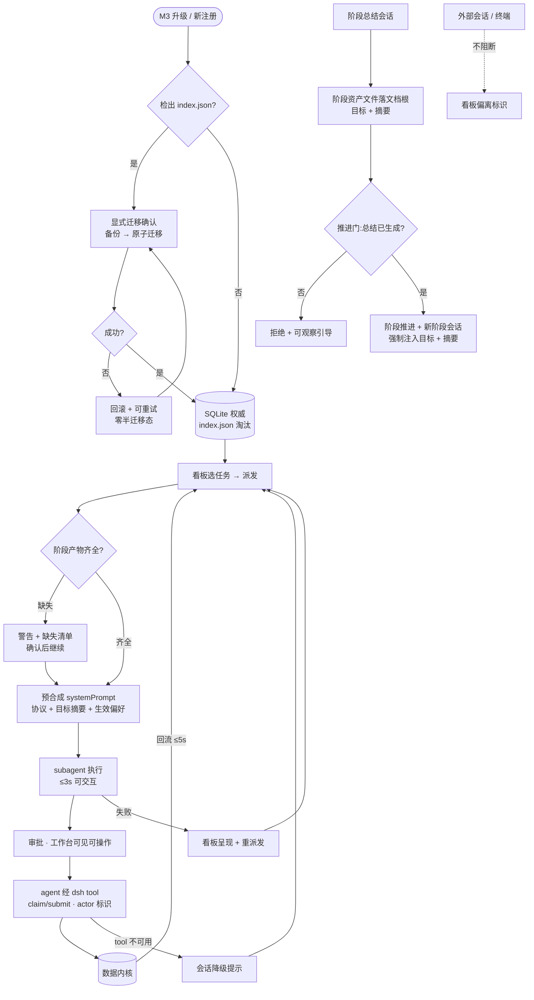

# dsh-forge M3 — 流程即产品:编排原生会话管线与 forge CLI 退役 · PRD Spec

> PRD Spec: defines WHAT the feature is and why it exists.
>
> 来源提案:[docs/proposals/dsh-forge-m3/proposal.md](../../../proposals/dsh-forge-m3/proposal.md)(intent: new-feature,2026-09-22)。本 PRD 承接其决策日志(2026-09-22 九项显式选择)与范围,并落定 PRD 期必答五项:外围命令归宿表 / 各阶段期望产物清单(机器可校验)/ 阶段资产与文档根数据模型 / 技能承载与迁移划分 / 偏好键集(2026-09-23 PRD 对话裁决,见 Background·PRD 期裁决)。

## Background

### Why (Reason)

M1(纯壳)与 M2(需求与会话工作台,24/52 任务在建)之后,forge 的 SDD 流程编排仍住在「冻结的 Claude Code 插件 + 终端 CLI」里,M2 工作台只是这套旧管线的只读观察窗。三条问题线:

- **线一(编排缺位)**:任务执行 = `/run-tasks` 派发 task-executor 子代理,启动后自跑 `forge prompt get-by-task-id` 合成执行策略——专业化上下文(任务类型协议、feature 目标摘要、运行偏好)不进系统提示词,每回合重复付出合成成本;阶段切换(prd→design→tasks→in-progress)无强制门,目标与摘要不跨阶段传递。
- **线二(通道错位)**:查询类 CLI 命令人与 agent 共用、变更类命令主要是 agent 在用,而人真正需要的是看板观察(M2 已具备),agent 真正需要的是会话内原生工具面(bash spawn CLI 是代理通道,非原生);M2 的「主会话直注」是 spike 裁决的降级形态,并行执行与专业化提示词无从谈起。
- **线三(退役悬空)**:CLI 退役演进方向已定(终点 = 应用 API + dsh tool,CLI 不保留,2026-09-21),但无推进切片则永远悬空;`tasks/index.json` 多写者一致性(SC8 spike §4:旧写者重写静默丢未知字段)是退役路径上的已知结构风险。

M2 会话挂接(UF5)落地后,日常管线具备向应用迁移的条件——迁移动力随时间衰减;预合成与阶段化是 M4 一切编排能力(管线工作流 UI、评估器)的地基。

### What (Target)

M3 = **「流程即产品」**:把 SDD 流程的编排权从「CC 插件指令流 + CLI」迁入应用,并以 dsh tool 建立 agent 原生操作面,同里程碑完成 forge CLI 在应用侧的退役。七项交付:

1. **任务执行 subagent 化**:任务级 dsh subagent 并行执行;派发时预合成专业化系统提示词(任务类型协议 + feature 目标摘要 + 生效运行偏好);编排与审批在看板可见可操作;
2. **任务 CRUD 应用 API + SoT 分治迁移**:状态机(7 态)/依赖解析/记录渲染入 Electron 数据内核;任务结构化状态以 SQLite 为权威(M2 已落地内核的权威化扩展),`tasks/index.json` 一次性迁移后终态淘汰;任务/记录 md 留文件不入库;agent 写通道 = dsh tool;
3. **CLI 退役收口(M3 一步到位)**:查询面 = 人看板 + agent 只读 dsh tool;变更面 = dsh tool;forge 技能集迁移 dsh 原生形态;外围命令逐项归宿(归宿表见 Functional Specs);M3 末应用出包与执行链零 forge CLI 依赖;
4. **强制阶段化(编排层硬门)**:派发前产物齐全性检查(代码机械性,缺失提示不阻断)+ 阶段总结门(阶段资产文件)+ 只为当前阶段派发 + 新阶段会话系统提示词强制注入目标与摘要 + 看板阶段/偏离标识;外部会话不硬阻断;
5. **运行偏好三级分级**:全局/项目/feature 继承链,消费于预合成与派发链;
6. **提案看板(只读管线视图)**:文档根 `proposals/` 列表 + 详情只读 + eval 报告浏览 + feature 互跳;
7. **过程文档默认仓外**:注册默认值翻转(仓外文档根默认,仓内兼容)。

**硬前置**:dsh-forge-m2 完成(至少 UF2 看板 / UF5 发起链 / 数据内核 / e2e 腿)。**前置 spike×4**(M3 首任务,结论归档 design/,零产品代码,可与 M2 Phase 5/6 收尾并行):①dsh 插件注册 model-facing tool 先例与契约;②subagent 上下文审批面与 FORGE_ACTOR 透传;③`systemPrompt` 注入契约定形;④`forge prompt` 模板到应用侧预合成的移植面盘点。

**操作主体模型(M3 定形)**:任务状态变更 = **agent 域**(经 dsh tool);人 = **观察与编排发起**(派发/审批/迁移/偏好);无任务写 UI;外部会话(终端/冻结 CC 插件)过渡期照旧、不硬阻断。

### PRD 期裁决(2026-09-23,用户显式选择)

| # | 议题 | 裁决 |
|---|------|------|
| D1 | 一次性迁移触发方式 | **显式迁移操作**:M2 已注册项目在工作台发起(确认对话框 + 迁移前自动备份 + 原子执行 + 失败回滚可重试);新注册项目在向导内走同一迁移确认步骤 |
| D2 | 技能承载路径 | **customSkillDirs 配置路径**:应用把插件技能根写入用户层 dsh 配置,零物化、项目仓零新增;应用负责配置写入与版本升级时的路径同步维护(路径漂移 = 应用责任) |
| D3 | 偏好键集范围 | **全量三级化**:auto.\*/worktree.\*/eval.\* 全量入三级继承(feature > 项目 > 全局);surfaces 除外(结构性项目事实,检测得出,不参与继承) |
| D4 | 知识系命令归宿 | **dsh tool 覆盖**:fact/lesson/research/forensic(读 + 必要写)入 dsh tool,兑现已注册项目零 CLI;对应技能(learn/forensic/deep-research)暂缓迁移,数据面先行 |
| D5 | 技能迁移范围 | **必迁 15 项**(核心执行闭环 6 + 管线创作系 6 + 生成系 3),其余 20 项辅助技能暂缓(M4 随管线工作流 UI 逐项归宿),2 项被机制取代——详见 Functional Specs·技能迁移划分表 |

### Who (Users)

- ① 产品线作者本人(forge + dsh 作者):双形态日常使用者,M3 的第一用户与迁移执行者;
- ② 社区 SDD 实践者:使用 forge 方法论 + agent 会话做开发、拥有多个项目的开发者(含 M2 升级用户)。

利益相关:forge 仓(自研可控,配合数据模型与技能资产演进)、dsh 上游(零侵入,仅消费其插件机制与宿主底座)。

## Goals

| Goal | Metric | Notes |
|------|--------|-------|
| G1 零 CLI 执行链 | 干净环境(无 forge CLI)安装应用 → 注册迁移 → 派发 → dsh tool 提交 → 回流,全程 forge CLI 调用数 = **0**(进程/日志级断言);应用出包零 CLI 依赖;**15 项必迁技能扁平名全部解析成功** | SC1;技能承载 = customSkillDirs(D2) |
| G2 SoT 迁移零丢失 | 迁移前后任务全集对拍(ID/状态/依赖/标题)**零差异**;迁移后 `tasks/index.json` 不存在;任务/记录 md 原样留存;中断重试**零半迁移态** | SC2;显式触发(D1) |
| G3 subagent 并行执行 | **≥3** 无依赖任务并行派发互不串扰;派发 → subagent 可交互 **≤3s**;预合成系统提示词含三要素(任务类型协议/feature 目标摘要/生效偏好,注入内容断言);审批在工作台可见可操作 | SC3 |
| G4 阶段硬门 | 产物齐全性检查**确定性**(断言无模型调用);缺失 = 警告 + 缺失清单**不阻断**;阶段总结门拒绝可观察;阶段资产文件可查看;新阶段会话注入断言;偏离标识 | SC4 |
| G5 偏好三级继承 | 全局→项目→feature 逐级覆盖用例全过;预合成产物反映最终生效值(断言);三级编辑面可查看修改 | SC5;键集全量、surfaces 除外(D3) |
| G6 提案看板 | 列表/详情/eval 报告与文件内容一致;外部变更回流 **≤5s**;proposal ↔ feature 互跳正确;只读(零写入口) | SC6 |
| G7 过程文档默认仓外 | 新注册默认文档根在仓外(向导默认值断言);代码仓内零新增过程文档;既有仓内项目读写兼容不破坏 | SC9 |
| G8 过渡双形态 | 未注册项目全程 CLI 照旧;已注册项目日常管线 CC 插件**零 spawn**(脚本断言) | SC7 |

**交付 phase 结构**(每 phase 独立 gate,任务分解期细化):Phase 0 spike×4 → P1 内核 SoT 迁移 → P2 dsh tool 面 → P3 subagent 执行 → P4 阶段化 → P5 偏好/提案看板/技能迁移;M3 末零 CLI 依赖收口 gate(横切)。

## Scope

### In Scope

- [ ] 任务执行 subagent 化:任务级 dsh subagent 并行执行 + 派发时预合成专业化系统提示词 + 看板编排与审批可见可操作
- [ ] 任务 CRUD 应用 API:状态机(7 态)/依赖解析/记录渲染入数据内核;agent 写通道 dsh tool(add/claim/transition/submit/reopen)
- [ ] SoT 分治迁移:任务结构化状态 SQLite 权威化 + `index.json` 一次性迁移并终态淘汰 + 任务/记录 md 留文件不入库(随文档根)
- [ ] 显式迁移操作(D1):M2 已注册项目迁移入口(确认 + 备份 + 原子 + 回滚重试);新注册项目向导内迁移确认步骤;迁移前后对拍
- [ ] CLI 退役收口:只读查询 dsh tool、forge 技能集 15 项迁移 dsh 原生形态(customSkillDirs 承载,D2)、外围命令归宿表落地、M3 末应用出包与执行链零 forge CLI 依赖
- [ ] 强制阶段化:派发前当前阶段产物齐全性检查(代码机械性;警告 + 缺失清单 + 确认继续,不阻断)+ 阶段总结门(阶段资产文件落文档根,工作台只读查看)+ 只为当前阶段派发 + 新阶段会话系统提示词强制注入目标与摘要 + 看板阶段/偏离标识
- [ ] 运行偏好三级分级:全局/项目/feature 继承链(键集全量,surfaces 除外,D3)+ 预合成/派发链消费 + 最简编辑面(对齐 M2 UF6 先例)
- [ ] 提案看板(只读):文档根 proposals 列表 + 详情只读渲染 + eval 报告浏览 + feature 互跳 + ≤5s 回流
- [ ] 过程文档默认仓外:注册默认值翻转 + 文档根管理 + 既有仓内项目读写兼容
- [ ] 前置 spike×4 结论归档(tool 注册 / subagent 审批与 ACTOR / systemPrompt 契约 / prompt 移植面)

### Out of Scope

- 人侧任务写操作 UI(人 = 观察与编排发起;写通道归 agent)
- 阶段知识注入(依赖远期知识库);知识库(远期);测试用例管理(后置里程碑)
- 看板内嵌会话面板(split view)、多窗口并行视图、wiki 对接
- 管线工作流 UI(brainstorm→PRD→设计应用原生工作流)、对抗式评估器、Quality Gate UI(M4 管线原生化残余)
- quality-gate / cleanup 的 GUI 面(M4)
- CC 插件退役最终收口与 forge 仓 CLI 停止发布(M4;M3 验收面 = 应用零依赖)
- 暂缓迁移的 20 项辅助技能(评估系/知识研究系/维护系等,归宿见技能迁移划分表;M4 逐项处置)
- SoT 进一步翻转评估(任务/记录 md 入库、feature manifest 权威化等,按需后议)
- forge CLI 机制通用化重构;状态机载体两难(TS 原生移植 vs Go 引擎嵌入库)归 /tech-design,禁止预支
- 修改 dsh 上游仓库(零侵入约束)

## Flow Description

### Business Flow Description

**迁移线**:M3 升级 → 已注册且检出 `tasks/index.json` 的项目在工作台呈现迁移入口 → 显式确认(提示自动备份)→ 原子迁移 → 对拍 → index.json 淘汰;失败 → 回滚 → 可重试(零半迁移态)。新注册既有项目 → 注册向导检出 index.json → 向导内同一迁移确认步骤。未注册项目不涉及(CLI 照旧)。

**执行闭环(主流程)**:看板选任务(单/多选)→ 派发前当前阶段产物齐全性检查(确定性代码;缺失 = 警告 + 缺失清单,确认后可继续)→ 内核预合成系统提示词(任务类型协议 + feature 目标摘要 + 生效偏好)→ subagent 启动(≤3s 可交互)→ 执行(分支/测试/提交)→ 审批请求在工作台可见可操作 → agent 经 dsh tool 提交(claim/submit,actor 标识)→ 状态回流看板 ≤5s。subagent 失败 → 看板呈现 + 重派发;dsh tool 不可用 → 会话内降级提示。

**阶段线**:阶段总结在 agent 会话生成 → 阶段资产文件(目标 + 摘要)落文档根 → 阶段推进请求经门校验(总结未生成 = 拒绝 + 可观察引导)→ 推进 → 新阶段会话系统提示词强制注入目标 + 摘要;外部会话跨阶段操作不阻断,看板呈现偏离标识。

**浏览线**:提案看板(工作台第二 tab)→ 列表(status/created/作者/feature 徽标)→ 详情只读 + eval 报告 → feature 互跳;偏好编辑面三级查看修改;阶段资产面板只读查看。

### Business Flow Diagram

### Data Flow Description

| Data Flow ID | Source System | Target System | Data Content | Transport | Frequency | Format | Notes |
|-----------|--------|----------|----------|----------|------|------|------|
| DF001 | tasks/index.json | 数据内核 | 任务结构化状态全量(ID/状态/依赖/标题) | 一次性迁移(显式触发,D1) | 每项目一次 | JSON → SQLite | 原子 + 自动备份 + 回滚重试;对拍零差异;完成后源文件淘汰 |
| DF002 | 数据内核 | dsh subagent | 预合成系统提示词(任务类型协议 + feature 目标摘要 + 生效偏好) | 宿主会话通道(spike ③ 契约定形) | 每次派发 | systemPrompt | 取代启动后自跑合成;spike ④ 移植面 |
| DF003 | agent 会话 | 数据内核 | 任务 CRUD 写操作(add/claim/transition/submit/reopen) | dsh tool 写集(spike ① 契约) | 按需 | 结构化调用 | actor 标识审计(FORGE_ACTOR 语义延续,spike ②) |
| DF004 | 数据内核 | 工作台看板 | 任务/编排/审批状态 | 内部状态流(M2 DF003 感知机制延续) | ≤5s | 视图数据 | 免手动刷新 |
| DF005 | agent 会话 | 文档根(阶段资产) | 阶段目标 + 摘要 → 工作台面板只读 | 文件写入 + 感知 | 每次阶段推进 | markdown | 内容留文件,元数据入 SQLite 快照;渲染经 M2 MarkdownView 白名单 |
| DF006 | 应用 | dsh 用户层配置 | customSkillDirs(插件技能根) | 配置写入(D2) | 安装/升级时 | dsh 配置 | 应用负责路径同步维护;15 项必迁技能扁平名寻址 |
| DF007 | 文档根 proposals/ | 提案看板 | 提案列表/详情/eval 报告 | 感知(M2 DF003 机制延续) | ≤5s | markdown/json | 只读 |
| DF008 | 三级偏好存储 | 预合成链 / 偏好编辑面 | 生效值解析(feature > 项目 > 全局) | 内核 API | 按需 | 结构化 | 键集全量,surfaces 除外(D3);存储形态留 /tech-design |

## Functional Specs

> UI 功能规格详见 [prd-ui-functions.md](./prd-ui-functions.md)。

### 操作主体模型(业务规则,M3 定形)

| 操作 | 人在应用 | agent 会话(dsh tool) | 外部会话/终端(过渡期) |
|------|---------|----------------------|------------------------|
| 任务写(add/claim/transition/submit/reopen) | ✗(无入口) | ✓ | ✓(未注册项目照旧;已注册项目过渡期兼容) |
| 派发 / 审批 / 重派发 | ✓(编排发起) | — | — |
| 显式迁移 / 偏好修改 / 注册管理 | ✓ | — | — |
| 浏览(看板/提案/文档/阶段资产) | ✓ | ✓(tool 只读) | ✓(CLI,未注册项目) |

- 应用内任务状态变更的唯一通道 = agent 会话经 dsh tool;人保留编排发起与审批;无任务写 UI。
- 每笔变更留 actor 标识(FORGE_ACTOR 语义延续,SC8 spike §4 通道,经 spike ② 定形)。
- 外部会话不硬阻断(零宿主侵入,SC8 spike §5 约束),看板呈现偏离标识。

### 外围命令归宿表(PRD 必答①:forge CLI 命令全量归宿)

| 命令 | M3 归宿 | 说明 |
|------|---------|------|
| task add / claim / transition / submit / reopen | 内核 API + dsh tool 写集 | agent 写通道;actor 标识 |
| task list / status / query | dsh tool 只读 + 看板 GUI | 人看板、agent tool |
| task index / validate / check-deps | 内核内部一致性例程 | SQLite 权威后为内核维护例程,无用户面 |
| prompt(get-by-task-id) | 预合成取代(内核内部) | 淘汰为独立命令;模板进 spike ④ 移植面 |
| quality-gate | 内核 API + dsh tool(agent 触发) | GUI 面 M4 |
| cleanup | 内核 API + dsh tool | GUI 面 M4 |
| config get / set / init | 偏好体系(内核 API)+ dsh tool + 偏好编辑面(UF4) | 三级继承(D3);init 并入注册向导 |
| feature set / complete | 内核 API(编排与 hook 消费) | complete = 阶段推进门内化 |
| feature list / status | 看板 GUI + dsh tool 只读 | |
| proposal list / show | 提案看板 GUI + dsh tool 只读 | |
| surfaces | 内核内部(装配用) | |
| init | 注册向导 + 内核 API | |
| fact / lesson / research | dsh tool(读 + 写) | 知识系数据面先行,技能后迁(D4) |
| forensic | dsh tool 只读 | 同上 |
| worktree | 内核 API + dsh tool | agent 执行域 |
| verify-task-done | 校验逻辑入内核 API + dsh tool 只读校验入口 | git hook 安装面 M4 收口;过渡期既有 hook 不破坏 |
| claude / completion / upgrade | 淘汰 | 应用更新走 M1 更新检测;forge 仓发布收口 M4 |
| justfile / init-justfile | 淘汰(forge 仓自用除外) | M4 发布收口评估 |

> 过渡纪律:未注册项目全程 CLI 照旧;已注册项目切换应用通道后不再依赖 CC 插件日常管线(SC7 断言无 spawn)。

> **归宿分解决议(2026-09-23,breakdown-tasks 期用户裁决)**:quality-gate / cleanup / worktree / verify-task-done 四行按 tech-design Interface 2 封闭动词集收窄——四动词 M3 不落「内核 API + dsh tool」,延至 M4。依据:M2 运行时零依赖(全仓无 spawn 点,退役不断链);不在 SC1-9/G1-G8 验收路径(零 spawn 断言的「日常管线」= 派发→执行→提交);过渡期由双形态承载(CLI 留机器,既有 git hook 不破坏,verify-task-done 行内「hook 安装面 M4 收口」语义不变)。表内行文保留为 PRD 期原始裁决记录;M3 执行权威 = tech-design Interface 2;延后记账 = 任务 6.1 AC4(gate 记录)+ 主提案路线图 M4 段 + todo.md。

### 各阶段期望产物清单(PRD 必答②:机器可校验)

检查时机 = 新会话/任务派发前;检查对象 = feature 当前阶段;执行者 = **确定性代码**(文件存在 + frontmatter/结构解析 + SQLite 状态查询),断言无模型调用;缺失 = 警告 + 缺失清单 + 用户确认后可继续(不阻断)。

| 阶段 | 期望产物 | 机器可校验规则 |
|------|---------|---------------|
| prd | manifest.md;prd/prd-spec.md | 文件存在;manifest frontmatter status 与当前阶段一致 |
| design | + design/ ≥1 设计文档 | 存在性;status 一致 |
| tasks | + tasks/ ≥1 任务 md;结构化状态可解析;依赖引用闭合 | 存在性;SQLite 任务集非空;依赖引用可解析且无悬空 |
| in-progress | + ≥1 任务 in_progress/completed;被派发任务 md 描述非空 | 状态查询;任务 md 内容解析 |
| completed | 全部任务终态(completed/skipped/rejected);各阶段资产齐全 | 聚合查询;阶段资产文件存在 |

> 阶段产物期望清单为 forge 方法论资产,随 forge 仓演进(用户可控);应用侧仅消费机器可校验的定义,不在 PRD/设计期之外新增语义。

### 阶段资产与文档根数据模型(PRD 必答③)

- **文档根**:注册时确定;**默认仓外**(应用管理路径,注册向导默认值翻转,M2「仓内默认」翻转),仓内兼容(既有项目与显式偏好仓内的工作流不破坏)。文档根布局:`features/<slug>/`(manifest/prd/design/ui/tasks)、`proposals/<slug>/`(proposal + eval)、阶段资产;indexer/看板/提案板/阶段资产全部按文档根寻址;具体路径/命名设计期定。
- **阶段资产**:feature 每次阶段推进生成一份资产文件,内容 = **阶段目标 + 摘要**;推进门校验其存在性;工作台只读渲染(经 M2 MarkdownView);元数据(路径/阶段/生成时间)入 SQLite 快照,内容留文件。forge 数据模型新增阶段资产类型(仓侧可控演进)。
- **偏好三级模型**:全局(应用级,跨项目)/ 项目 / feature 三层存储;键集 = 现 config 全量(auto.\*/worktree.\*/eval.\*),**surfaces 除外**(结构性项目事实);生效解析 feature > 项目 > 全局;消费于预合成/派发链与编辑面;存储形态留 /tech-design。

### 技能迁移划分表(PRD 必答④:D2 承载 + D5 范围)

承载路径(D2):**customSkillDirs 配置**——应用把 forge 核心插件技能根写入用户层 dsh 配置(skill-filesystem 消费),项目仓零新增文件;应用负责安装/升级时的配置写入与路径同步。

| 分类 | 成员 | 处置 |
|------|------|------|
| **必迁·核心执行闭环(6)** | submit-task(skill)/ git-commit(command)/ git-checkout(command)/ run-tests(skill)/ fix-bug(command)/ test-guide(skill) | dsh 原生形态迁移,扁平名寻址;SC1 断言 |
| **必迁·管线创作系(6)** | brainstorm / write-prd / tech-design / ui-design / breakdown-tasks / quick-tasks(均 skill) | 同上;支撑阶段化会话(应用只为当前阶段派发) |
| **必迁·生成系(3)** | gen-contracts / gen-journeys / gen-test-scripts(均 skill) | 同上 |
| 被机制取代(2) | execute-task(command)/ run-tasks(command) | 预合成系统提示词 + 看板派发取代;协议内容进 spike ④ 移植面 |
| 暂缓迁移(20) | extract-design-md、gen-web-sitemap、评估系 8(eval + eval-consistency/contract/design/journey/prd/proposal/ui)、知识研究系 4(learn/forensic/deep-research/simplify-skill)、维护系 5(clean-code 双形态、consolidate-specs、quick、init-justfile) | M4 随管线工作流 UI 逐项归宿;外部会话(冻结 CC 插件)继续可用,已注册项目 dsh 会话缺席不阻断;知识系数据面已入 dsh tool(D4),为后续迁移留地基 |

> 计数:15 必迁 + 2 取代 + 20 暂缓 = 37(= forge CC 插件 21 skills + 16 commands,spike §1.1 清单)。

### Related Changes

| # | Project | Module | Change Point | Updated Logic |
|------|----------|----------|------------|----------------|
| 1 | dsh-forge(本仓) | 桌面壳 + forge 核心插件 | 七项交付;看板从只读观察窗升级为编排面(派发/审批);M2 内核/装配/发起链为地基 | 壳内核不因能力增减改动;两级插件模型继承 |
| 2 | forge(Z:\project\ai\forge,自研) | 数据模型 + 技能资产 | 偏好三级模型 / 阶段资产类型 / 文档根模型 / 阶段产物期望清单(机器可校验定义)/ 技能根(customSkillDirs 指向);CC 插件维持冻结(bug-fix only) | 仓侧可控演进;数据格式纪律:结构化状态入 SQLite 后 forge 文件侧仅剩文档资产 |
| 3 | dsh 上游 | 插件机制 | 消费 tool 注册 / subagent / systemPrompt / skill-filesystem 服务面 | 零侵入;契约漂移走 vendored 升级显式适配(继承 M2 纪律) |
| 4 | dsh-forge(本仓) | dsh-forge-m2 feature | 硬前置:UF2 看板 / UF5 发起链 / 数据内核 / e2e 腿 | M3 全部交付建立在 M2 内核、装配、发起链之上;M2 延期则 M3 开工线后移(spike 可并行) |

## Other Notes

### Performance Requirements

- Response time:派发 → subagent 可交互 ≤3s(对齐 M2 发起预算);状态回流 ≤5s;看板首屏 ≤2s(500 任务规模);迁移验原子性与对拍,无时长承诺
- Concurrency:≥3 无依赖任务并行派发互不串扰;桌面单用户;过渡双形态交替操作互不破坏
- Data storage:任务结构化状态 SQLite 权威(单写者 = 内核);文档资产留文件(默认仓外文档根);规模假设继承 M2(≤500 任务/feature、≤50 feature/项目、≤20 注册项目)
- Compatibility:三平台;工作台 UI 中英双语;既有仓内项目与未注册项目零破坏

<!-- Override: Performance Baseline enabled by signal "性能/延迟/回流时效" -->

### Data Requirements

- Data tracking:任务变更 actor 标识;派发/审批/门决策日志;迁移事件(备份/对拍结果)
- Data initialization:显式迁移(D1)或向导内迁移;新注册项目直接 SQLite(无 index.json 摄入)
- Data migration:一次性、原子、自动备份、失败回滚可重试;迁移前后任务全集对拍零差异;`tasks/*.md` 与 `tasks/records/*.md` 不迁移不改动

### Monitoring Requirements

- 本地应用日志可查:迁移 / 派发 / 审批 / dsh tool 调用 / 门决策 / customSkillDirs 配置同步;无服务端监控

### Security Requirements

- Transport encryption:不引入网络监听(继承 M1/M2);凭据沿用 $DSH_HOME 体系
- Storage encryption:不新增凭据存储
- Display masking:不适用
- Rate limiting:不适用(桌面单用户)
- 边界约束:IPC 继承 M2 安全约束(origin-lock、typed、版本化、最小必要面);markdown 防注入(提案/阶段资产/文档渲染经白名单);customSkillDirs 配置仅应用写入 + 路径完整性校验(防任意目录注入技能面);文档根路径授权沿用 M2

<!-- Override: Security Review enabled by signal "权限/配置写入完整性/防注入" -->

### 继承约束(Non-Functional,来自 M1/M2 与提案)

- 离线自足;三平台;零监听端口;dsh 上游零侵入;vendored 对齐基准与升级纪律
- 两级插件模型(forge 核心 = 必备插件)与宿主/协议缝、electron-ipc-security 面继承
- 架构约束新增:**操作主体模型定形**(任务写 = agent 域,人 = 观察与编排发起);**SoT 分治**(结构化状态入 SQLite、文档资产留文件默认仓外)

<!-- Override: API Handbook enabled by signal "应用 API/接口变更"——任务 CRUD 应用 API 与 dsh tool 面的接口契约归 /tech-design 接口面与后续 /gen-contracts,本 PRD 以数据流表(DF001-DF008)承载接口语义 -->

---

## Success Criteria(M3 里程碑验收)

- [ ] SC1 零 CLI 执行链:在无 forge CLI 的干净环境安装应用 → 注册既有项目完成一次性迁移 → 看板派发任务 → subagent 以预合成系统提示词执行 → agent 经 dsh tool 完成 claim/submit → 状态回流看板 ≤5s;全程 forge CLI 调用数 = 0(进程/日志级断言);会话内 **15 项必迁技能**以 dsh 原生形态可寻址调用(扁平名解析全部成功,断言)(e2e)
- [ ] SC2 SoT 迁移零丢失:迁移前后任务全集对拍(ID/状态/依赖/标题)零差异;迁移完成后项目文档树内 `tasks/index.json` 不存在;`tasks/*.md` 与 `tasks/records/*.md` 原样留存于原位置(不迁移不改动);迁移为显式触发(确认 + 自动备份);迁移中断可重试且不产生半迁移态
- [ ] SC3 subagent 并行执行:3 个无依赖任务并行派发互不串扰;每个 subagent 系统提示词可断言包含任务类型协议 + feature 目标摘要 + 生效偏好(e2e 注入内容断言);审批在工作台可见可操作
- [ ] SC4 阶段硬门:当前阶段产物不齐全时,新会话/任务派发不被阻断但呈现警告与缺失清单,用户确认后可继续派发(检查为确定性代码执行,断言无模型调用;e2e);阶段总结未生成时,阶段推进请求被拒绝并给出可观察引导;总结生成后推进成功——项目文档根存在对应阶段资产文件(目标 + 摘要)且工作台面板可查看其只读渲染(e2e 断言),新阶段会话系统提示词包含目标 + 摘要(e2e 断言);外部会话不被硬阻断但看板呈现偏离标识
- [ ] SC5 偏好三级继承:全局→项目→feature 逐级覆盖用例通过(键集全量,surfaces 除外),预合成产物反映最终生效值(断言);最简编辑面可完成三级查看与修改
- [ ] SC6 提案看板:proposals 列表/详情/eval 报告与文件内容一致,外部变更 ≤5s 回流;proposal ↔ feature 互跳正确;只读(无任何状态写入口)
- [ ] SC7 过渡双形态:同一机器上未注册项目全程使用 forge CLI 不受影响;已注册项目切换应用通道后,冻结 CC 插件不再被其日常管线依赖(脚本断言无 spawn)
- [ ] SC8 前置 spike 归档:四项 spike(tool注册 / subagent 审批与 ACTOR / systemPrompt 契约 / prompt 移植面)结论与兜底建议归档于 design/,作为后续任务的开工依据
- [ ] SC9 过程文档默认仓外:新注册项目的过程文档根默认位于代码仓外(应用管理路径,注册向导默认值断言);任务/记录/阶段资产/proposals 读写全部经文档根,代码仓内零新增过程文档;既有仓内项目读写兼容不破坏(e2e)

---

## Quality Checklist

- [x] Is the requirement title accurate and descriptive
- [x] Does the background include all three elements: reason, target, users
- [x] Are the goals quantified
- [x] Is the flow description complete
- [x] Does the business flow diagram exist (Mermaid format)
- [x] Is prd-ui-functions.md referenced and UI specs complete
- [x] Are related changes thoroughly analyzed
- [x] Are non-functional requirements considered (performance / data / monitoring / security)
- [x] Are all tables filled completely
- [x] Is there any ambiguous or vague wording
- [x] Is the spec actionable and verifiable
