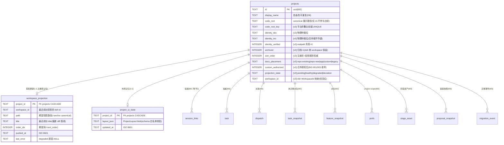

# ER Diagram: dsh-forge M4 数据内核扩展(v3)

> 基底 = M2 v1(projects / app_state / session_links / task_snapshot / feature_snapshot / sync_state)+ M3 v2(task / dispatch / approval_request / prefs / stage_asset / proposal_snapshot / migration_event)**全保留,只增不删**。
> M4 = **v3 增量**:projects 身份/生命周期/投影增列(D11)+ 布局记忆 + 投影期望快照。血缘推断**不落库**(PRD 必答⑥;client 半身运行时推导,可随时重算)。单写者 = Electron 主进程内核(SQLite,WAL)。

## Entity Relationships

## Entity Details

### projects [MODIFIED]

| Column | Type | Constraints | Description |
|--------|------|-------------|-------------|
| code_root_key | TEXT | UNIQUE(v3 索引),NULL 容忍(迁移回填) | 平台折叠比较键(win32 大写折叠;应用层单源,不用 NOCASE) |
| identity_dev / identity_ino | TEXT | — | (dev,ino) 物理仲裁位;命中即「同一项目」并回写自愈 |
| identity_verified | INTEGER | NOT NULL DEFAULT 1 | realpath 失败(网络盘离线)字符串回退 = 0 |
| archived | INTEGER | NOT NULL DEFAULT 0 | 归档 = forge 侧分区;dsh workspace 保留(归档≠删除) |
| sort_order | INTEGER | NOT NULL DEFAULT 0 | 注册序;投影「同名同序」的 forge 侧权威 |
| docs_placement | TEXT | CHECK 5 值,DEFAULT 'legacy' | 证据三档(repo-existing/repo-new/app)+ custom;legacy = 迁移前值冻结 |
| custom_authorized | INTEGER | NOT NULL DEFAULT 0 | 仓外授权仅高级自定义(BIZ-001/003 收窄) |
| projection_state | TEXT | CHECK 4 值,DEFAULT 'pending' | 投影状态机;偏差明细不落表(对账重算物化) |
| workspace_id | TEXT | — | dsh WorkspaceId 信息位;dsh 侧删除重建后由 ensure 更新 |

### workspace_projection [NEW]

| Column | Type | Constraints | Description |
|--------|------|-------------|-------------|
| project_id | TEXT | PK, FK projects ON DELETE CASCADE | 1:1 期望快照,注册即占位 |
| workspace_id | TEXT | NOT NULL | 最近一次成功投影的 dsh WorkspaceId |
| path | TEXT | NOT NULL | 期望投影路径 = anchor canonical(ensure 定位键,dsh 侧重建后按 path 复连) |
| title | TEXT | NOT NULL | 最近成功 title(改名偏差 diff 基线) |
| order_idx | INTEGER | NOT NULL | 期望序 = projects.sort_order |
| pushed_at | TEXT | NOT NULL | 最近成功 push 时间(审计) |
| last_error | TEXT | — | degraded 原因(上游错误码映射) |

### project_ui_state [NEW]

| Column | Type | Constraints | Description |
|--------|------|-------------|-------------|
| project_id | TEXT | PK, FK projects ON DELETE CASCADE | 项目删除即清除(PRD 布局记忆语义) |
| layout_json | TEXT | NOT NULL DEFAULT '{}' | ProjectLayout v1(应用层 schema 白名单校验,失败重置默认) |
| updated_at | TEXT | NOT NULL | 客户端 debounce 写入 |

## Index Design

| Table | Index Name | Columns | Type | Description |
|-------|------------|---------|------|-------------|
| projects | idx_projects_code_root_key | code_root_key | UNIQUE | D11 唯一性落点(折叠比较) |
| projects | idx_projects_sort_order | sort_order | B-tree | 投影排序/列表序 |

## Relationships

| From | To | Cardinality | Business Meaning |
|------|----|-------------|------------------|
| projects | workspace_projection | one-to-zero-or-one | 每项目一条投影期望快照(注册即占位) |
| projects | project_ui_state | one-to-zero-or-one | 每项目一条布局记忆(删除级联清除) |
| forge projects(注册表) | dsh workspaces(宿主 JSON) | 逻辑 1:1(经 canonical path) | 单向投影:权威→投影;dsh 侧实况不入库(client 上报对账) |

## Change Impact Analysis

| Changed Table | Change Type | Affected Columns | Data Migration Needed | Backward Compatible |
|---------------|-------------|------------------|-----------------------|---------------------|
| projects | ADD COLUMN ×10 + UNIQUE 索引 | 身份/归档/顺序/落位/投影 | 是(TS 回填:归一化 best-effort + docs_placement 映射 + sort_order=created_at 序;折叠键碰撞 = 迁移失败显式暴露,≤20 项目规模可接受) | 是(全部带默认值;旧读写面不动) |
| project_ui_state | NEW TABLE | — | 否(无行 = 默认布局) | 是 |
| workspace_projection | NEW TABLE | — | 否(注册/对账时占位) | 是 |
