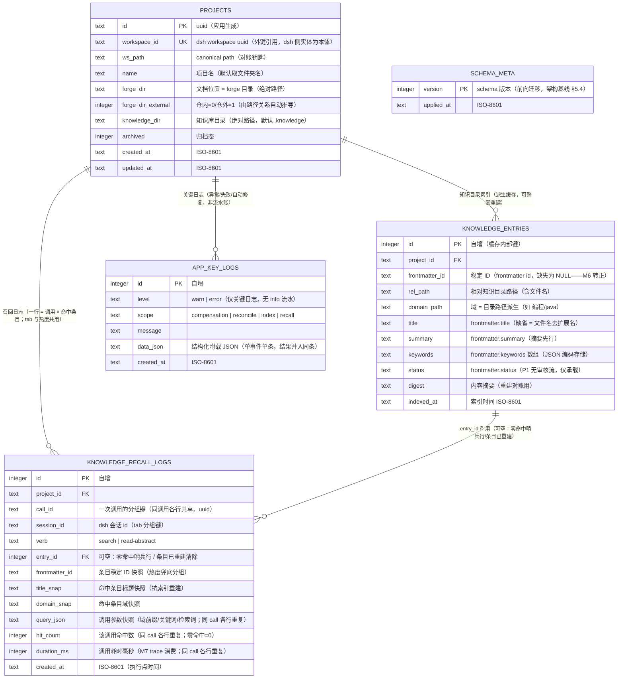

# ER Diagram: dsh-forge P1（MVP）

> 引擎 = SQLite（架构基线 §3 既定；better-sqlite3，Electron main 进程内）。库文件位于应用 profile（`{app-data}/dsh-forge/state.db`）。知识条目表为**可重建派生缓存**（SC2 豁免口径），其余为唯一 SoT。

## Entity Relationships

## Entity Details

### PROJECTS [NEW]

**职责**：项目记录唯一 SoT——应用自有字段 + dsh workspace 外键引用（账本本体在 dsh，应用零副本）。

| Column | Type | Constraints | Description |
|--------|------|-------------|-------------|
| id | TEXT | PK, NOT NULL | 应用生成 uuid |
| workspace_id | TEXT | NOT NULL, UNIQUE | dsh workspace uuid——外键引用（实体本体在 dsh registry，应用只持引用） |
| ws_path | TEXT | NOT NULL | canonical path 对账钥匙（启动对账按此找回） |
| name | TEXT | NOT NULL | 展示名（注册时自动取文件夹名，可改） |
| forge_dir | TEXT | NOT NULL | 文档位置（forge 目录；默认 `<工作区>/.forge`） |
| forge_dir_external | INTEGER | NOT NULL DEFAULT 0 | 仓内/仓外由 forge 目录是否位于工作区内自动推导（缓存推导结果；0=仓内 1=仓外） |
| knowledge_dir | TEXT | NOT NULL | 知识库目录（默认 `<工作区>/.knowledge`） |
| archived | INTEGER | NOT NULL DEFAULT 0 | 归档态（P1 仅承载字段） |
| created_at | TEXT | NOT NULL | 创建时间 ISO-8601 |
| updated_at | TEXT | NOT NULL | 最后更新时间 ISO-8601 |

### KNOWLEDGE_ENTRIES [NEW]（派生缓存）

**职责**：知识目录的索引缓存——按 project 可整表删除重建（启动/进面板按需一次性），非 SoT（SoT = 知识文件 + 应用状态层），总纲 SC2 明文豁免。

| Column | Type | Constraints | Description |
|--------|------|-------------|-------------|
| id | INTEGER | PK AUTOINCREMENT | 缓存内部键 |
| project_id | TEXT | NOT NULL, FK→projects(id) ON DELETE CASCADE | 所属项目 |
| frontmatter_id | TEXT | NULL | 稳定 ID（M6 转正为移动不变锚点） |
| rel_path | TEXT | NOT NULL, UNIQUE(project_id, rel_path) | 相对知识目录路径（含文件名；规范化 + 前缀校验） |
| domain_path | TEXT | NOT NULL | 域 = 目录路径派生（≤3 层约束在解析器校验） |
| title | TEXT | NOT NULL | frontmatter.title（缺省 = 文件名去扩展名） |
| summary | TEXT | NOT NULL | frontmatter.summary（摘要先行的返回体） |
| keywords | TEXT | NOT NULL DEFAULT '[]' | frontmatter.keywords 数组（JSON 编码存储） |
| status | TEXT | NOT NULL DEFAULT 'draft' | frontmatter.status（P1 无审核流，仅承载） |
| digest | TEXT | NOT NULL | 文件内容摘要（外部修改对账的变更检测） |
| indexed_at | TEXT | NOT NULL | 本次索引时间 ISO-8601 |

> 整表（按 project_id）可随时删除重建，不违反无投影纪律（总纲明文豁免）。

### KNOWLEDGE_RECALL_LOGS [NEW]

**职责**：知识召回日志——**一行 = 一次调用 × 一个命中条目**（`search` 命中 N 条 = N 行 + 零命中写一条 `entry_id=NULL` 哨兵行；`read-abstract` = 1 行；同一 `call_id` 各行共享调用级字段）。**双消费面单表单写**：① 会话知识召回 tab 专属数据源（统计头 = `COUNT(DISTINCT call_id)` / 覆盖条数 = 去重命中；分组行 = 条目快照展开 + 动词明细 + 最近时间）；② 热度与 M5 置信度使用信号（按条目 `COUNT(*)`，次数 + 近期性）；③ M7 召回可观测性（trace 流按 call_id 聚合）前置形态。快照字段（title_snap / domain_snap / frontmatter_id）抗索引重建。业务数据（SoT 组成部分），append-only。

| Column | Type | Constraints | Description |
|--------|------|-------------|-------------|
| id | INTEGER | PK AUTOINCREMENT | 自增主键 |
| project_id | TEXT | NOT NULL, FK→projects(id) ON DELETE CASCADE | 所属项目 |
| call_id | TEXT | NOT NULL | 一次调用的分组键（uuid，同调用各行共享） |
| session_id | TEXT | NOT NULL | dsh 会话 id（tab 分组键） |
| verb | TEXT | NOT NULL CHECK(verb IN ('search','read-abstract')) | 召回动词 |
| entry_id | INTEGER | NULL, FK→knowledge_entries(id) | 命中条目引用；NULL = 零命中哨兵行或条目已重建清除（行保留） |
| frontmatter_id | TEXT | NULL | 稳定 ID 快照（条目不在索引时热度兜底分组键） |
| title_snap | TEXT | NULL | 命中条目标题快照（tab 展示抗重建失真） |
| domain_snap | TEXT | NULL | 命中条目域快照 |
| query_json | TEXT | NULL | 调用参数快照（域前缀 / 关键词 / 检索词；同 call 各行重复） |
| hit_count | INTEGER | NOT NULL | 该调用命中数（同 call 各行重复；零命中哨兵行 = 0） |
| duration_ms | INTEGER | NULL | 调用耗时毫秒（M7 trace 消费；同 call 各行重复） |
| created_at | TEXT | NOT NULL | 召回执行点时间 ISO-8601 |

> 热度口径：按条目 `COUNT(*)`（`search` 命中与 `read-abstract` 各计一次——总纲「每次召回即记一次使用事件」；哨兵行不计入热度）。

### APP_KEY_LOGS [NEW]（append-only）

**职责**：应用**关键日志**（非流水账）——仅记异常、失败、自动修复与孤儿发现等关键一致性事件；**单事件单条**（处置结果并入同条 `data_json`，不记过程流水）；常规成功路径一律不记。记名域：① 补偿（`compensation`：registry.delete 补偿失败——SC12 记账 + 启动对账提示孤儿不自动删）；② 对账（`reconcile`：ws_path 失配找回、「dsh 有、应用无」孤儿发现）；③ 索引（`index`：重建失败）；④ 召回（`recall`：检索失败、索引过期触发重建、条目未命中异常——**只记关键异常，正常召回轨迹在 knowledge_recall_logs**）。对账提示与故障追溯的数据源。

| Column | Type | Constraints | Description |
|--------|------|-------------|-------------|
| id | INTEGER | PK AUTOINCREMENT | 自增主键 |
| level | TEXT | NOT NULL CHECK(level IN ('warn','error')) | 仅关键级别（无 info 流水） |
| scope | TEXT | NOT NULL CHECK(scope IN ('compensation','reconcile','index','recall')) | 关键日志记名域 |
| message | TEXT | NOT NULL | 关键事件消息 |
| data_json | TEXT | NULL | 结构化附载（workspaceId / projectId / 失败原因 / 处置结果——单事件单条） |
| created_at | TEXT | NOT NULL | 记录时间 ISO-8601 |

### SCHEMA_META [NEW]

**职责**：schema 版本表——前向迁移唯一机制；应用启动校验 version ≤ 支持上限，超出明确拒绝（旧应用打开新 schema 不支持，架构基线 §5.4）。

| Column | Type | Constraints | Description |
|--------|------|-------------|-------------|
| version | INTEGER | PK | 当前 schema 版本 |
| applied_at | TEXT | NOT NULL | 迁移应用时间 ISO-8601 |

## Index Design

| Table | Index Name | Columns | Type | Description |
|-------|------------|---------|------|-------------|
| projects | idx_projects_ws_path | ws_path | UNIQUE 索引 | 启动对账按 path 找回 |
| knowledge_entries | idx_ke_project_domain | project_id, domain_path | 复合 | 域前缀过滤（浏览/召回主查询） |
| knowledge_entries | idx_ke_frontmatter_id | frontmatter_id | 普通索引 | 热度 join 与兜底分组 |
| knowledge_recall_logs | idx_krl_project_session | project_id, session_id, created_at | 复合 | 召回 tab 按会话时序聚合 |
| knowledge_recall_logs | idx_krl_call | call_id | 普通索引 | 调用维度聚合（统计头 / M7 trace） |
| knowledge_recall_logs | idx_krl_entry | entry_id, frontmatter_id | 复合 | 热度按条目计数 |
| app_key_logs | idx_akl_scope_time | scope, created_at | 复合 | 对账提示查询 |

## Relationships

| From | To | Cardinality | Business Meaning |
|------|----|-------------|------------------|
| projects | knowledge_entries | one-to-many | 项目知识索引缓存（可整表重建，非 SoT） |
| projects | knowledge_recall_logs | one-to-many | 项目召回日志（tab + 热度共用，append-only） |
| knowledge_entries | knowledge_recall_logs | one-to-many（可空引用） | 命中条目引用（零命中哨兵行/条目重建后 NULL，行保留） |
| projects | app_key_logs | one-to-many（弱关联） | 项目域关键日志（scope 内承载 project id） |

## Change Impact Analysis

全部 [NEW]——零代码新分支绿地，无存量表迁移（P1 不迁移旧线数据，宪法）。
