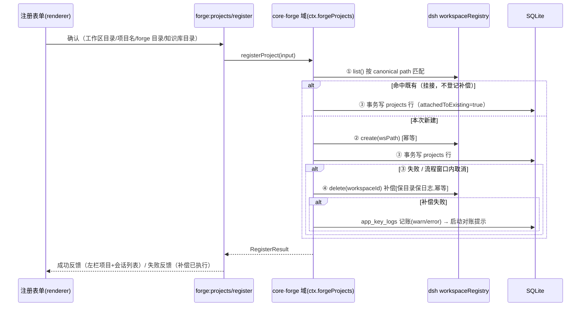
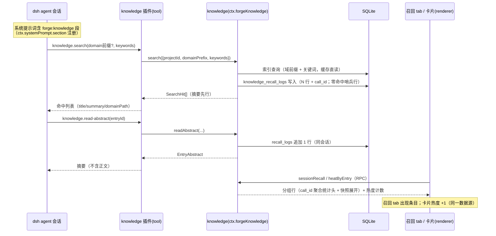
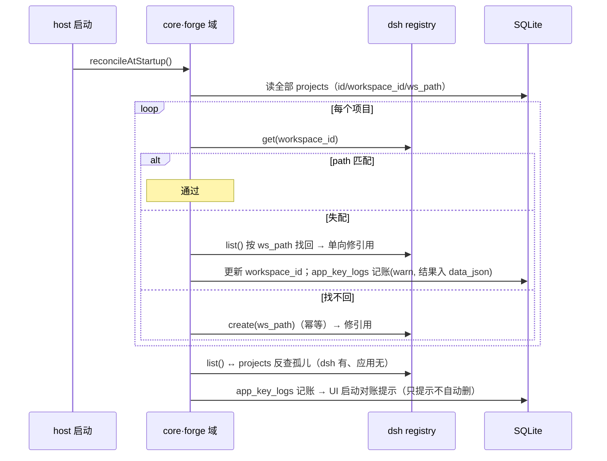

# Technical Design: dsh-forge P1（MVP）—— 走线架 + 知识飞轮第一圈

> 输入：PRD（`prd/prd-spec.md` + user stories + ui-functions）｜宪法：总纲 + 架构基线｜预研：《技术预研笔记》S1–S4/S7。UX 基线 = 用户重构原型（`/ui-design` 经用户裁决跳过——原型即 UI 基线，本文 UI 实现细节以原型 + prd-ui-functions 为准）。

## Overview

五工件 monorepo（pnpm + TS project references）承载单机 Electron 应用：**薄宿主**（~100 行 main，dsh 公开 npm 栈直跑）加载产品 profile，dsh 宿主进程内运行**单一数据内核插件 core**（双域模块：forge 域 = projects + 四步补偿链，知识域 = 索引缓存 + 召回能力面；对外双服务 `ctx.forgeProjects` / `ctx.forgeKnowledge`，单 SQLite 句柄）；前端为**自有 vite 入口 + `dsh-client-web` 壳内核**，boot manifest 由产品掌舵选入官方 ui-\* 与产品 client 插件；**knowledge 插件**（`@dsh-forge/knowledge`）以 dsh 插件形态向 agent 暴露召回 tool 与系统提示词知识段。M0 立骨架与项目/会话主链路，M1 装知识飞轮第一圈。

**本设计已验证的两条关键缝**（此前唯二未验证依赖，上游源码核实 2026-10-02）：

1. **插件 ↔ 能力面** = Cordis 进程内服务模式：core（知识域）在 `ctx` 上定义服务属性（`ctx.forgeKnowledge`，同 `ctx.workspaceRegistry` / `ctx.agentPresets` 先例），knowledge 插件以 `inject: ['forgeKnowledge']` 消费——无跨进程 RPC，同进程函数调用。
2. **系统提示词知识段** = `ctx.systemPrompt.section({ name, order, text })`（`@deepseek-ai/dsh-system-prompt`，上游 core 服务）：knowledge 插件注册 `forge:knowledge` 段（升序拼接、agent 域可遮蔽全局），产品以契约内容源供文本。

## Architecture

### Layer Placement

| 工件（目录） | 层 | 职责（P1 范围） |
|---|---|---|
| `apps/host` | 宿主进程 | Electron main ~100 行：profile 组装（`loadProfileDirectory` + `runProfile`）、boot manifest 掌舵、`{url, injections}` IPC、窗口生命周期；无业务 |
| `apps/web` | 前端 | 自有 vite 入口 + `dsh-client-web` 壳内核；三区工作台（7 个 UI Function）；只调 RPC 不含写逻辑 |
| `packages/core` | 数据内核（**唯一 SQLite 句柄持有者**；总纲概念「应用状态层」的物化) | **双域模块**——forge 域：projects 服务 + 四步补偿链 + 启动对账 + app_key_logs；知识域：目录解析（frontmatter 契约）+ 索引缓存（可重建）+ 召回能力面（search / read-abstract + knowledge_recall_logs）+ 热度聚合；schema 版本迁移；对外双服务 `ctx.forgeProjects` / `ctx.forgeKnowledge` |
| `packages/knowledge` | dsh 插件 | dsh tool：`knowledge.search` / `knowledge.read-abstract`（消费 `ctx.forgeKnowledge`）；`ctx.systemPrompt.section('forge:knowledge')` 知识段 |
| `packages/contracts` | 共享 | 跨工件类型（RPC DTO、frontmatter 契约常量、错误码）；零运行时依赖 |

依赖方向（架构基线 §1 落实）：`web →(RPC)→ core`（双服务同门）；`knowledge 插件 → core` 仅依赖 `forgeKnowledge` **服务类型**（运行期 Cordis 注入，不 import 实现——插件可独立发版）；**core 模块级禁令：知识域不 import forge 域**（lint 机械执行，为未来沉淀抽包保留边界——触发提炼判据时机械拆分）。**单一写入路径**：SQLite 写只经 core 服务（UI 与 plugin 同门）。

### Component Diagram

```
+------------------------------------------------------- Electron (apps/host main) ----+
|  薄宿主: profile 组装 → runProfile(dsh 公开栈)                                        |
|                                                                                      |
|  |  +-- dsh host 侧进程内插件 (Cordis ctx) ------------------------------------------+  |
|  |  [dsh 官方] workspaceRegistry · systemPrompt · ui-chat/webserver · …            |  |
|  |  [产品] core —— 单 SQLite 句柄 · 双域双服务                                       |  |
|  |     · forge 域 (ctx.forgeProjects): ①预检②create④delete(补偿)→workspaceRegistry |  |
|  |     · 知识域 (ctx.forgeKnowledge): 索引重建/检索/recall_logs ──→ SQLite(state.db)|
|  |                                                        ↑                         |  |
|  |  [产品] knowledge 插件: inject forgeKnowledge (仅服务类型)                      |  |
|  |     · tool knowledge.search / read-abstract (agent 面)                         |  |
|  |     · ctx.systemPrompt.section('forge:knowledge')                              |  |
|  +-------------------------------------------------------------------------------+  |
|         ↑ IPC RPC (forge:*/ 通道, allowlist)        ↑ dsh 自有面 (__DSH_TRANSPORT__)  |
+---------|--------------------------------------------------------------------------- ---+
          |  boot manifest: 官方 ui-* + 产品 client 插件 (apps/web vite 入口消费壳内核)
   +------v-------- renderer (apps/web) --------+
   |  左栏 rail | 中区 会话⇄知识 | 右栏 dock     |
   |  产品 client 插件: sidebar.workspaces 替换  |
   |  (槽位路线 A) · 知识浏览 · 召回 tab · 向导  |
   +--------------------------------------------+
```

### Dependencies

- **上游 npm（全部精确 pin，0.2.0-rc.2）**：`@deepseek-ai/dsh-app-boot` / `dsh-client-web` / `dsh-workspace` / `dsh-host-webserver` / `dsh-system-prompt`（经 profile 间接）/ 官方 `ui-*`（sidebar / chat / conversation / dockkit / theme / primitives）+ Cordis 运行时。lockfile 入库，P1 期不开升级窗口。
- **产品依赖**：`better-sqlite3`（SQLite，Electron prebuilds）、`electron` 44（**S1 实测精确 `44.0.0`——`node-addon-require-builtin` 指纹门仅接受 43.0.0/44.0.0/45.0.0-alpha.6，见 G1 第 8 项 pin**）+ `electron-builder` 26（NSIS，继承旧线 M1 资产模式）、`gray-matter`（frontmatter 解析）。
- **开发依赖**：TypeScript、vitest、Playwright（`_electron`）、oxlint、vite。

### Monorepo 工程规范与协作机制

**布局与命名**（pnpm workspace，包名 `@dsh-forge/*`）：

```
/  ├─ apps/
│    ├─ host/        @dsh-forge/host          Electron 薄宿主（main）
│    └─ web/         @dsh-forge/web           vite 入口 + 三区工作台 + 产品 client 插件
   ├─ packages/
│    ├─ contracts/   @dsh-forge/contracts     跨工件类型/常量（零运行时依赖、零依赖）
│    ├─ core/        @dsh-forge/core          host 侧 Cordis 插件（单 SQLite 句柄；forge 域 + 知识域双模块双服务）
│    └─ knowledge/   @dsh-forge/knowledge     dsh 插件（tool + 知识段）
   ├─ pnpm-workspace.yaml / tsconfig.base.json（project references）/ oxlint.config.*
```

**包内子模块划分与定位**（目录级子模块 + barrel 导出；每个子模块标注定位——**基础**＝不含 forge/知识业务语义的可复用机制，**业务**＝领域语义载体，**装配**＝无逻辑的组装点）：

| 包 | 子模块 | 定位 | 职责与边界 |
|---|---|---|---|
| `apps/host/src` | `main` | 装配 | 入口（~100 行纪律），仅编排下列子模块 |
| | `profile/` | 基础 | profile 模板组装与首启落地 |
| | `boot/` | 基础 | boot manifest 与 injections 组装 |
| | `ipc/` | 基础 | `{url,injections}` + `forge:*` 通道注册与 allowlist |
| | `window/` | 基础 | 窗口生命周期 |
| `apps/web/src` | `shell/` | 基础 | 壳接入：boot 消费、carrier、视图态机 |
| | `zones/` | 基础 | 三区结构骨架：容器、视图互换机制、页签跟随（布局机制，无域内容） |
| | `views/session/` | 业务 | 会话面板三 tab 组装 |
| | `views/knowledge/` | 业务 | 知识浏览（域树/卡片/抽屉/工具栏） |
| | `flows/add-project/` | 业务 | 添加项目两段式 |
| | `components/` | 基础 | 领域无关组件（MarkdownDoc/StateChip/HeatBadge/EmptyState——吃令牌无业务逻辑） |
| | `rpc/` | 基础 | IPC client 封装（通道契约消费方） |
| | `styles/` | 基础 | 令牌引入与全局样式（仅 `--dsw-*`） |
| `packages/core/src` | `db/` | 基础 | SQLite 句柄唯一落点、schema 迁移、事务助手——**无域语义** |
| | `forge/` | 业务 | projects 服务、四步补偿链、启动对账、app_key_logs——**禁 import knowledge/** |
| | `knowledge/` | 业务 | frontmatter 解析、索引重建、search/readAbstract、recall_logs、热度——**禁 import forge/** |
| | `service.ts` | 装配 | 插件定义，注册双服务 |
| `packages/knowledge/src` | `tools/` | 业务 | search / read-abstract tool 定义与参数 schema |
| | `prompt/` | 业务 | `forge:knowledge` 知识段渲染 |
| | `index.ts` | 装配 | 插件定义（`inject: forgeKnowledge`） |
| `packages/contracts/src` | `dto/` · `errors.ts` · `frontmatter.ts` · `channels.ts` | 基础（契约层） | 纯类型与常量——**描述业务形状但不实现业务**，零逻辑零依赖 |

**依赖铁律（基础/业务二分的机械执行）**：

1. **基础 ↛ 业务**：基础子模块禁止 import 任何业务子模块（含类型 re-export 转发）——lint no-restricted-paths 编码，越界即 G0 红。
2. **业务 → 基础**：单向允许（如 `core/forge → core/db`、`web/views → web/{zones,components,rpc}`）。
3. **同级业务互禁**：`core` 内 forge ↔ knowledge 互禁（已有）；`web` 内 `views/session ↔ views/knowledge` 互禁（跨视图经 `zones/` 槽位与 `rpc/` 解耦，不互相 import）。
4. **改动判据（防业务混入基础）**：实现功能时若发现「必须改基础子模块才能完成」→ 几乎必然是业务代码放错了层——把该逻辑移入业务子模块，而非扩基础面。基础子模块只接受三类改动：缺陷修复、性能、有 ≥2 消费方证据的新基础能力（沉淀判据精神）；此类改动在执行记录中显式标注「基础变更」。

**修改落点速查（防改错地方）**：

| 改动类型 | 唯一落点 |
|---|---|
| 注册流程 / 补偿链 / 对账 | `core/src/forge` |
| 知识解析 / 索引 / 召回 / 热度 | `core/src/knowledge` |
| schema 变更 | `core/src/db`（迁移）+ `contracts/dto`（类型同步） |
| 新 RPC 通道 | `contracts/{channels,dto}` → `web/src/rpc` → `core` 对应域（三处一体，禁单侧私改） |
| 新视图 / 新流程 | `web/src/views|flows`（渲染进 `zones/` 槽位） |
| 三区机制 / 视图互换 / 页签跟随 | `web/src/zones` |
| 领域组件 / 官方组件封装 | `web/src/components` |
| profile / boot / 窗口 / IPC 注册 | `apps/host` 对应子模块 |
| agent tool / 知识段文本 | `packages/knowledge` 对应子模块 |

**包间协作规则**（依赖方向的机械落实）：

1. **编译期边界**：TS project references——`contracts` 被全部引用；`web` / `host` 不 import 彼此源码；**core 包内知识域 ↛ forge 域**（目录边界 + oxlint no-restricted-imports 机械执行）。
2. **运行期边界**：`web`（renderer）与数据内核**只经 IPC RPC 通信**（Interface 4 通道），绝不 import 服务端代码；`knowledge` 插件对 core 只依赖 `forgeKnowledge` **服务接口类型**，运行期经 Cordis `inject: ['forgeKnowledge']` 解析实例——无实现级 import，插件可独立发版。
3. **宿主插件装配**：`core` / `knowledge` 均不出现在任何 import 图中给 web——它们经 **profile 装配**进入运行时（见下）。
4. **共享类型唯一源**：RPC DTO / frontmatter 契约常量 / 错误码 / IPC 通道名全部定义于 `contracts`，两侧各自引包——防 schema 漂移（L2）。

**构建机制**（`tsc -b` 拓扑序 + vite）：

```
contracts → core（forge 域 + 知识域）→ knowledge（仅类型依赖）→ bundle（dsh 插件格式）
apps/web：vite build（产出壳 dist + 产品 client 插件 bundle）
apps/host：tsc -b + electron-builder 打包
```

**profile 组装与插件分发**：产品 profile 模板（`cordis.patch.yml`：官方行 + `@dsh-forge/core` / `@dsh-forge/knowledge` 行）随应用资源分发；首启时 host 将 profile 模板 + 插件 bundle 落地 `{app-data}/dsh-forge/profile/`，此后每次启动 `loadProfileDirectory` 加载——**插件升级 = 随应用发版更新资源目录**（P1 无独立插件市场，迭代节奏 = 应用节奏）。boot manifest（官方 ui-\* client bundle + 产品 web 插件）由 host 组装后经 `{url, injections}` IPC 注入 renderer。

**开发工作流**：`pnpm dev` = 并行（vite dev server + tsc -b --watch）+ electron 指向 dev profile（环境变量切换：开发 profile 直接链 workspace 构建产物，免整包组装）；`pnpm build` = 全量拓扑构建；`pnpm test` / `test:e2e` / `lint` 即 G0–G2。

**打包管线（Windows NSIS）**：web dist + profile 资产 + host main → electron-builder `extraResources`；better-sqlite3 用 Electron prebuilds（缺席则 electron-rebuild 兜底）；产物 = 安装包 + 启动冒烟脚本（MVP 门第二步）。

### 样式风格纪律（第一版严格遵循 dsh 官方）

第一版**严格**遵循 dsh 官方样式风格——原型是布局结构基准，视觉实现一律官方语言，六条硬规则：

1. **令牌唯一**：样式零裸值——色/字/距/圆角/阴影全部取 `--dsw-*` 令牌（`--dsw-static/alias/specific` + `radius/font/elevation`），令牌 lint（G0）机械执行。
2. **组件优先级**：官方现成件（ui-primitives 原子 + ui-\* 组件）＞ 领域组件自绘——**官方已有的件（按钮/输入/弹层骨架/页签/列表行）一律复用，禁止重造**；自绘仅限官方无对应的领域组件（知识卡片/域树行/召回分组行等）且必须吃令牌。
3. **形态对齐**：交互形态不发明平行模式——抽屉对齐官方 dockkit 形态、列表行对齐官方 sidebar 行语言、弹层/菜单对齐官方 popover 模式。
4. **排版基线**：间距与刻度不自创（令牌取值），布局尺寸以原型结构为准、视觉细节以官方为准（冲突时**布局结构不变、视觉让官方**）。
5. **主题联动**：深浅主题与字号偏好随官方令牌自动联动（不自维护主题态）。
6. **机械验证**：令牌 lint 入 G0；L3 起步对照断言——关键面（左栏行 / 知识卡片 / 详情抽屉）与官方组件 computed style 抽样比对（M0 建池逐步扩），防「原型好看落地走样」（教训①）。

## Interfaces

### Interface 1: ProjectService（core · forge 域 → `ctx.forgeProjects`）

```ts
registerProject(input: {
  workspaceDir: string;          // 文件浏览器选定（canonical 化后）
  name: string;                  // 默认取文件夹名
  forgeDir: string;              // 文档位置（绝对路径；external 自动推导）
  knowledgeDir: string;
}): Promise<RegisterResult>
// 四步补偿链内聚：① registry.list() 预检（命中=挂接，attachedToExisting=true，不登记补偿）
// ② registry.create(wsPath) ③ 事务写 projects 行 ④ 失败→registry.delete 补偿（幂等）
// RegisterResult = { projectId, workspaceId, attachedToExisting, compensated?: CompensatedInfo }

listProjects(): Promise<ProjectSummary[]>          // 含 archived 过滤口径
getProject(id: string): Promise<Project | null>
updateProject(id: string, patch: Partial<Pick<Project,'name'|'archived'>>): Promise<Project>
reconcileAtStartup(): Promise<ReconcileReport>     // ws_path 失配找回 / 孤儿工作区提示数据
```

### Interface 2: KnowledgeService（core · 知识域 → `ctx.forgeKnowledge`）

```ts
rebuildIndex(projectId: string): Promise<IndexReport>          // 按需一次性重建（启动/进面板）
search(q: { projectId: string; domainPrefix?: string;          // 域前缀可选，省略=全域
            keywords?: string[]; text?: string; limit?: number }): Promise<SearchHit[]>
// SearchHit = { entryId, frontmatterId, title, summary, domainPath, score }   // 摘要先行
readAbstract(q: { projectId: string; entryId: string }): Promise<EntryAbstract>
// EntryAbstract = { entryId, title, summary, keywords, status, domainPath }   // 不含正文
// search 与 readAbstract 均于执行点写 knowledge_recall_logs（一行 = 调用 × 命中条目，call_id 分组；
// 零命中写哨兵行）——tab 数据源与热度信号单表同源，并返回 heat 供参考

listEntries(q: { projectId: string; domainPrefix?: string; keyword?: string }): Promise<KnowledgeCard[]>
getEntryDetail(q: { projectId: string; entryId: string }): Promise<EntryDetail>  // 含 Markdown 正文按需读取
heatByEntry(projectId: string): Promise<Map<entryId, number>>                    // = 使用事件计数
sessionRecall(q: { projectId: string; sessionId: string }): Promise<RecallGroup[]>  // 召回 tab 数据源 = knowledge_recall_logs（统计头 = call_id 聚合；分组行 = 命中快照展开 + 热度徽章按条目计数）
```

### Interface 3: dsh tool（knowledge 插件 → agent 面）

```ts
// tool: knowledge.search — 参数/返回与 KnowledgeService.search 同构（projectId 由会话上下文解析）
// tool: knowledge.read-abstract — 同构 readAbstract
// 系统提示词: ctx.systemPrompt.section({ name: 'forge:knowledge', order: 500,
//   text: 知识段（契约内容源渲染：知识库存在声明 + agentic search 流程指引 + 两 tool 用法） })
```

### Interface 4: Web RPC 面（renderer ↔ main，IPC allowlist 通道）

`forge:projects/*`（register/list/get/update/reconcile）｜`forge:knowledge/*`（browse/listEntries/entryDetail/heat/sessionRecall）｜dsh 自有面经 `__DSH_TRANSPORT__` carrier（会话/工作区）。通道名常量归 `packages/contracts`，main 侧 allowlist 校验（继承旧线 electron-ipc-security 约定）。

### frontmatter 最小契约（P1，contracts 常量 + 解析器执行）

| 字段 | 必填 | 类型 | 说明 |
|---|---|---|---|
| `title` | ✗ | string | **缺省 = 文档名称去掉扩展名**（如 `安全编码规范.md` → `安全编码规范`） |
| `summary` | ✓ | string | 摘要先行（卡片与 read-abstract 返回体） |
| `keywords` | ✓ | string[] | 域内细分（检索维度） |
| `status` | ✗ | string（默认 `draft`） | P1 仅承载（审核流 M4） |
| `id` | ✗ | string | 稳定 ID（P1 存而不强求，M6 转正） |
| `authors` / `updated` | ✗ | string | 展示用（updated 缺省取文件 mtime） |

域 = 目录路径派生（无 frontmatter 字段，单一事实源）；层级 ≤3（解析器校验，超层标 invalid）。**P1 解析容错**：summary/keywords 缺失或层级超限的条目不入索引（rebuild 报告计数，UI 空态提示），title 缺省取文件名去扩展名，硬拒收归 M4 写入面。正文与元数据分离渲染（`MarkdownDoc` 包装，variant=body）。

## Data Models

> Full database design in separate files.

**ER Diagram**: design/er-diagram.md
**SQL Schema**: design/schema.sql

### Field Quick Reference

| Model | Key Fields | Notes |
|-------|------------|-------|
| projects | workspace_id(UK), ws_path, forge_dir, forge_dir_external, knowledge_dir, archived | 外键引用 dsh 实体；对账钥匙 = ws_path |
| knowledge_entries | rel_path(UK w/ project), domain_path, title, summary, keywords, digest | 派生缓存，可整表重建（SC2 豁免） |
| knowledge_recall_logs | call_id, session_id, verb, entry_id?, frontmatter_id, title_snap, domain_snap, query_json, hit_count, duration_ms | 一行 = 调用 × 命中条目；单表双消费面（tab + 热度），append-only；零命中哨兵行 |
| app_key_logs | level, scope, data_json | 关键日志（warn/error；补偿失败/对账/索引/召回异常，单事件单条） |
| schema_meta | version | 前向迁移；旧应用打开新 schema 拒绝 |

## Error Handling

### Error Types & Codes

| Error Code | Name | Description | HTTP Status 等价 |
|------------|------|-------------|------------------|
| ERR_WORKSPACE_CREATE | WorkspaceCreateError | dsh create 失败（注册中止，无补偿需要） | 502 |
| ERR_PROJECT_WRITE | ProjectWriteError | ③ 应用库写入失败（触发 ④ 补偿） | 500 |
| ERR_COMPENSATION | CompensationError | 补偿调用失败——app_key_logs 记账 + 启动对账提示（不自动删） | 500 |
| ERR_ENTRY_NOT_FOUND | EntryNotFoundError | entryId 未命中（索引重建后 ID 漂移） | 404 |
| ERR_INDEX_STALE | IndexStaleError | 索引缺失/过期提示（触发静默重建） | 409 |
| ERR_INVALID_KNOWLEDGE_DIR | InvalidKnowledgeDirError | 知识目录不可达/非法 | 400 |

### Propagation Strategy

能力面/服务层抛 typed error（contracts 定义）→ RPC 边界序列化为 `{ code, message, data }` → UI 按 code 映射状态（空态/错误条/横幅）；补偿、对账与召回的关键异常**永不抛断用户流程**——降级为 app_key_logs 关键日志（warn/error，单事件单条）+ 对账提示。dsh 面异常原样透传（dsh 域归 dsh）。

## Cross-Layer Data Map

| Field Name | Storage Layer | Backend Model | API/DTO | Frontend Type | Validation Rule |
|------------|---------------|---------------|---------|---------------|-----------------|
| workspace_id | TEXT UK | Project.workspaceId | registerResult.workspaceId | string | dsh uuid |
| ws_path | TEXT | Project.wsPath | reconcile DTO | string | canonical path |
| domain_path | TEXT | KnowledgeEntry.domainPath | SearchHit.domainPath | string | 目录派生 ≤3 层 |
| entry_id | INTEGER PK | KnowledgeEntry.id | SearchHit.entryId | number | 索引内稳定 |
| frontmatter_id | TEXT? | KnowledgeEntry.frontmatterId | hit/事件快照 | string? | M6 转正锚点 |
| verb | TEXT CHECK | KnowledgeRecallLog.verb | 'search'\|'read-abstract' | union | 两动词 |
| session_id | TEXT | KnowledgeRecallLog.sessionId | sessionRecall DTO | string | dsh 会话 id |
| heat | COUNT 派生 | heatByEntry 聚合 | heat DTO | number | = 按条目召回日志计数（断言一致；哨兵行不计） |

## 核心交互时序

### 交互一：项目注册（四步补偿链）



### 交互二：召回飞轮（agentic search + 日志 + tab 联动）



### 交互三：启动对账（每次启动）



## Integration Specs

无既有页面集成（绿地 new-page）。**平台级集成两处**：

### Integration: 产品 sidebar 替换 → 官方 ui-sidebar 壳（槽位路线 A）

- **Target**: boot manifest 注入产品 client 插件 `forge-sidebar`；`ctx.slots.inject('sidebar.workspaces', ..., ForgeWorkspacePanel)` 替换占用者
- **Insertion Point**: 官方 sidebar 壳的 workspaces 洞位（折叠/导航/快捷键白拿）
- **Data Source**: `forge:projects/list` + dsh 会话账本实时读；契约 = 洞名 `sidebar.workspaces` 与 injected props（G1 pin 测试）

### Integration: boot manifest 掌舵 → dsh-client-web 壳内核

- **Target**: `apps/web` vite 入口按 `apps/web` 母本模式产出壳；宿主 `{url, injections}` IPC 注入官方 ui-\* client bundle + 产品插件
- **Data Source**: 官方 ui-\*（chat/conversation/dockkit/theme…）版本 = 精确 pin；`__DSH_TRANSPORT__` carrier 承载 dsh 面 RPC

## Testing Strategy

### Per-Layer Test Plan

| Layer | Test Type | Tool | What to Test | Coverage Target |
|-------|-----------|------|--------------|-----------------|
| core | 单测 + 集成 | vitest（临时 SQLite） | 四步补偿链全路径（预检/挂接/失败补偿/补偿幂等/补偿失败记账）、对账找回、schema 迁移 | 80% |
| knowledge | 单测 + 集成 | vitest | frontmatter 契约解析（合法/缺字段/超层）、域前缀过滤、关键词细分、事件写入、热度一致、索引重建幂等 | 80% |
| 契约面 | pin 回归（G1） | vitest | boot manifest 形状、slot 洞名、registry API 幂等/删除语义、`ctx.systemPrompt.section` 注册、`forgeKnowledge` 服务注入 | 常驻池 |
| apps/web | e2e | Playwright `_electron` | smoke-ui 196 骨架组迁移（三区/互换/页签跟随/向导/浏览/召回 tab）+ SC13/SC12 e2e + MVP 门走查 | 骨架组 100% |
| 会话链路 | dogfood 冒烟 | Playwright + 真实模型（低成本） | SC6①② 往返/恢复；SC10 agent 真实调起多步检索链 | 每门必跑 |
| G0 | lint + tsc | oxlint + tsc --noEmit + project references | 令牌 lint（零裸色值/字号）、import 边界 | 全绿 |

### Key Test Scenarios

① 注册③失败→补偿删除（dsh 无孤儿，S7 同型）；② 幂等命中→任何失败不删既有；③ 确认后中断→补偿；④ 域过滤前端域不返后端域；⑤ read-abstract 不含正文；⑥ 事件表↔召回 tab↔热度三方一致；⑦ 外部改文件→进面板静默重建；⑧ 知识模式右栏隐藏/恢复/页签跟随项目。

### Overall Coverage Target

core（双域）单测覆盖率 80%；G0–G2 全绿为里程碑门（架构基线 §5.2）；e2e 断言零删改台账（继承旧线纪律）。

## Security Considerations

### Threat Model

本机单用户：恶意知识文件（frontmatter/Markdown 注入面）、路径穿越（rel_path/domain 构造）、IPC 面滥用、远程内容加载。

### Mitigations

- Markdown 渲染经 `MarkdownText` 族（不可信 GFM 沙淀）+ `MarkdownDoc` 单一包装——产品不自建渲染器。
- rel_path 规范化 + 前缀校验（禁 `..`/绝对路径/符号链接逃逸）；SQL 一律 prepared statements。
- IPC 通道 allowlist（contracts 常量）+ electron-ipc-security 约定（contextIsolation、无 remote content）；宿主服务仅本机回环。
- 应用自身离线自足断言（SC-NFR）：无远程脚本/字体/样式请求。

## PRD Coverage Map

| PRD Requirement / AC | Design Component | Interface / Model |
|----------------------|------------------|-------------------|
| SC1 三区/互换/页签跟随 | apps/web + forge-sidebar 槽位替换 + smoke 迁移 | Integration §两处平台集成 |
| SC2 无投影 | core 双域直读 + 代码审计（禁 watch/回流模块） | ProjectService / KnowledgeService |
| SC5 浏览子集 | knowledge 浏览面 + `MarkdownDoc` | listEntries / getEntryDetail / heatByEntry |
| SC6①② 会话链路 | 官方 ui-chat/conversation 复用 + dogfood e2e | boot manifest 集成 |
| SC8 零代码分支 | 分支卫生（新分支删旧代码，白名单基建） | Local Dev（Open Questions ③ 分支策略执行细节） |
| SC10 召回核心 | KnowledgeService + knowledge 插件 + systemPrompt.section | Interface 2/3 |
| SC12 创建一致性 | ProjectService 四步补偿链 + app_key_logs | Interface 1 |
| SC13 创建流程走查 | 两段式向导（UF-3）+ e2e | Interface 1/4 |
| SC-MVP 飞轮演示 + 安装包 | e2e 走查 + electron-builder NSIS | Testing / Dependencies |
| SC-NFR 离线 + 只读 + 令牌 | G0 令牌 lint + 远程资源断言 + 文件监控验证 | Testing / Security |

## Open Questions

- [ ] ① ui-chat / ui-conversation 的 mount props 与转录面（轨迹 tab 数据源）契约细节——S2 spike 清点后回填 G1 清单。
- [ ] ② e2e 会话往返的模型策略：dogfood 低成本模型为主，录制回放仅在 flake 时评估（不预建）。
- [ ] ③ 零代码分支落地形态：自 main 切 `redesign` 分支，首提交移除旧 `apps/` 与 `packages/plugins` 旧线代码（docs 与可复用基建脚本白名单保留）——执行时按 SC8 白名单逐项判定。

## Appendix

### 关键技术决策（本设计新增裁决）

| 决策 | 选择 | 理由 | 备选与否决因 |
|---|---|---|---|
| SQLite 驱动 | better-sqlite3 | 同步 API 契合单写者服务；Electron prebuilds 成熟 | node:sqlite（Electron 44 的 Node 22 下仍实验态） |
| 索引缓存载体 | SQLite 表（knowledge_entries） | 首屏直读（SC2 运行验证）+ 重启可用；整表可重建 | 纯内存（重启全量重建，首屏退化为扫描） |
| 知识段通道 | `ctx.systemPrompt.section` | 一等 API（升序拼接/域遮蔽），源码核实 | AGENTS.md 链（面向用户指令文件，非插件贡献面；总纲定位为延后锚点的默认加载承载） |
| 能力面缝 | Cordis 服务属性（进程内） | `workspaceRegistry`/`agentPresets` 同型先例，零 RPC | 跨进程 RPC（同进程本无必要） |
| frontmatter 解析 | gray-matter | 上游生态同源、零 schema 强绑定 | 自写解析（无收益） |
| 宿主/打包 | Electron 44 + electron-builder NSIS | 用户裁决；旧线 M1 资产模式继承 | Tauri（重写集成层，S1 结论不可复用） |
| 样式策略 | **第一版严格遵循 dsh 官方风格**（六条硬规则：令牌唯一 / 官方件复用优先 / 形态对齐 / 官方刻度 / 主题联动 / L3 对照断言） | 用户裁决；视觉一致性是「原生感」的根基，教训①防复发 | 平行设计体系（嫁接感与走样根源）；宽松「尽量一致」（无机械验证必腐化） |
| 工程布局 | **五工件 monorepo**（core 单包双域双服务）+ TS project references | 用户裁决（初审六工件，复审合并数据内核 + 定名：`core` / `knowledge`——业界常规命名、通俗；总纲「应用状态层」保留为概念术语）；物理边界 = L1 enforcement 载体 | 单包分目录（物理分色推迟）；knowledge 实现独立成包（与 L1「句柄仅 core」矛盾，提炼判据未触发）；包名 state-layer（行话不通俗）/ plugin-knowledge（冗长） |

### 契约面清单（G1 pin 池，P1 起步版——架构基线 §6 的落实）

1. boot manifest 注入格式（`{url, injections}` + `applyIndexInjections`）；2. `__DSH_TRANSPORT__` carrier；3. slot 洞名（`sidebar` / `sidebar.workspaces` / 子洞）与 injected props；4. `ctx.workspaceRegistry` API（create 幂等 / delete 保目录保日志 / get / list 语义）；5. 官方 ui-\* props（chat/conversation/dockkit/theme——S2 清点后逐项入池）；6. `ctx.systemPrompt.section` 注册与 order 约定；7. Cordis 服务定义/注入模式（`forgeProjects` / `forgeKnowledge`）；8. dsh profile 目录形状（`loadProfileDirectory` / `runProfile` 签名）——**S1 已 pin（2026-10-02，spike `spikes/s1-thin-host/` 实测，裁决=直跑可行不触发 fallback）**：`loadProfileDirectory(binName, dir, installAnchor, {userLayer?}) → Profile`（`@deepseek-ai/dsh-app-boot`）；`runProfile({environment, profile, resolvedProfile?, patchFiles, args, packageManager?}) → Promise<{ctx, shutdown}>`（`@deepseek-ai/dsh/profile-boot`，就绪后 `ctx.connection.authenticatedUrl()` + `ctx.webServer.collectIndexInjections()`）；profile 目录 = `package.json`（`dsh.profile.bundles`）+ `cordis.patch.yml` 用户层 + `pnpm-workspace.yaml`（hoisted）+ `node_modules`，`cordis.yml` 空根每启重写；硬约束：Electron 精确 `44.0.0`（addon 指纹门）、运行时包集合须补 peer 闭包（19 包清单见 spike）、DSH_HOME 重定向隔离、ESM main 禁顶层 await `whenReady()`——完整 pin 与证据见 `spikes/s1-thin-host/README.md`。agent-preset 行格式随 M3 入池。

### References

- 总纲 `docs/proposals/dsh-forge-redesign/proposal.md`｜架构基线 `.../architecture.md`（§1 工件版图 / §2 L1–L5 / §5 演进纪律）｜技术预研 `.../tech-research.md`（§1.5–1.7、S1–S4/S7）
- 上游源码（唯一权威）：`apps/web`（vite 入口母本）、`packages/client/web`（壳内核）、`packages/core/system-prompt`（README：section API）、`packages/workspace/workspace`（registry 语义）、`packages/client/ui-sidebar`（槽位契约）
- UI 基线：`docs/proposals/dsh-forge-redesign/prototype/`（README 场景走查 + smoke-data/ui 断言）
