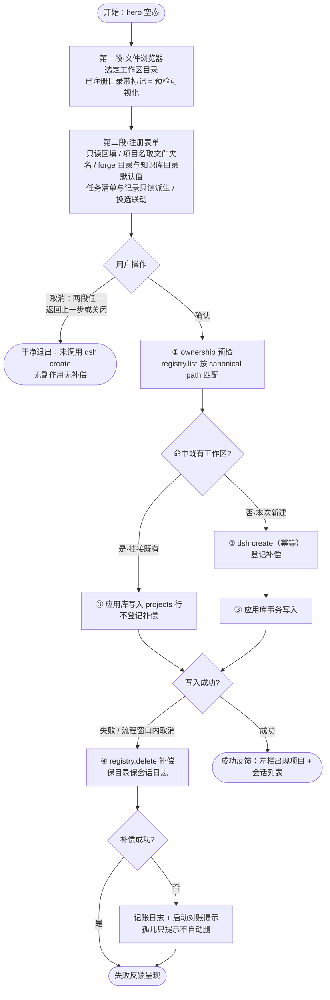
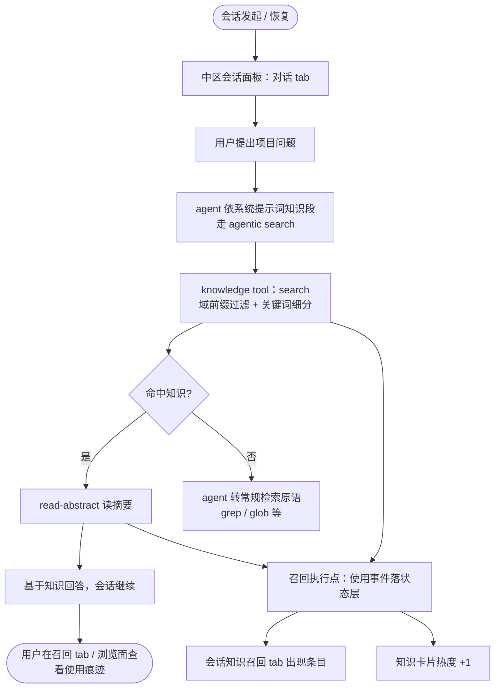

# dsh-forge P1（MVP）：走线架 + 知识飞轮第一圈 — PRD Spec

> PRD Spec：定义该特性**是什么、为什么**。业务上下文与阶段裁决继承自已批准的阶段提案 [`docs/proposals/dsh-forge-p1-mvp/proposal.md`](../../../proposals/dsh-forge-p1-mvp/proposal.md)（宪法级约束见总纲 `dsh-forge-redesign/proposal.md` 与架构基线 `architecture.md`）；本文件不重复提案全文，只落实 PRD 层要求。

## Background

### Why (Reason)

重构总纲（dsh-forge-redesign）已 Accepted，但产品不存在：旧线 M1–M4 的「上游 home 增强层」路线把打磨上限结构性封死（教训①·嫁接感），零代码新分支已定向而未动工；核心卖点「知识资产飞轮」（抽取 → 置信 → 召回 → 再沉淀）没有任何运行形态。P1 阶段提案已立项：把总纲设计变成可运行、可演示的最小产品。

### What (Target)

单机桌面工作台的最小可用产品（MVP），两个里程碑：

- **M0 走线架**：薄宿主 + 自有前端入口 + 官方壳内核复用的三区工作台骨架（左栏导航 rail / 中区会话面板 / 右栏 dock），视图互换机制与 dock 页签跟随最简版，项目创建流程（文件浏览器 + 注册表单两段式 + 四步补偿链），质量基建（G0–G2 门 + 冒烟断言迁移起步）。
- **M1 知识飞轮第一圈**：项目级知识目录解析 + frontmatter 最小契约 + 应用侧可重建索引；知识库浏览最小面（域树 / 卡片网格 / 详情抽屉）；召回能力面（`search` + `read-abstract`，agentic search 工具集定位）+ 知识插件召回 tool + 系统提示词最简知识段；使用事件记录 + 会话知识召回 tab 最简列表。
- **MVP 门**：飞轮端到端走查演示 + Windows 安装包启动冒烟。

### Who (Users)

- **单人开发者**（产品唯一人类用户与干系人）：以 AI Coding 为日常工作流的开发者，在工作台中注册项目、发起/恢复 dsh 会话、管理知识资产。
- **dsh agent 会话**（系统协作者，非人类角色）：知识插件召回 tool 的调用方——经 agentic search 流程自主多步检索（与 grep/glob 同位使用检索原语）。

## Goals

| Goal | Metric | Notes |
|------|--------|-------|
| MVP 门通过 | 飞轮端到端走查 6 步链（注册 → 会话 → 召回 → 事件 → tab → 热度）100% 不间断演示成功；安装包冒烟 4 步（安装 → 启动 → 主界面可达 → 会话面板可用）全过 | SC-MVP |
| 原生首屏立起 | SC1 五组断言（左栏 / 中区会话 / 中区知识 / 右栏 dock / 视图切换与页签跟随）各 ≥3 条，合计 ≥15 条全通过 | 布局对照重构原型 |
| 无投影纪律 | 代码审计 0 个 watch/fs 监听驱动的回流模块；状态直读断言（项目 / 索引 / 事件 / 会话列表）100% 通过 | SC2 |
| 项目创建一致性 | 补偿删除 / 防误删 / 补偿幂等 / 对账提示四断言 0 失败；全流程后 dsh 侧孤儿注册 = 0 | SC12 / SC13 |
| 召回链路可用 | 域前缀过滤、关键词细分、摘要默认返回、系统提示词知识段就位、agent 多步检索链（search → read-abstract）、事件落库、召回 tab 一致——断言全过 | SC10 P1 子集 |
| 断言资产迁移 | smoke-ui 196 条中骨架组 100% 迁为 e2e 底稿（骨架组清单设计期清点） | M0 起步口径 |

## Scope

### In Scope

- [ ] M0：零代码新分支与工程骨架；薄宿主（S1 spike 先行，失败 fallback vendor）；自有 vite 入口 + 官方壳内核 + boot manifest 掌舵；slot 路线 A 替换 `sidebar.workspaces`。
- [ ] M0：三区骨架（左栏导航 rail 可收起 / 中区会话面板 / 右栏 dock 默认收起）；视图互换机制 + dock 页签跟随最简版；首用 hero 空态。
- [ ] M0：项目创建流程（两段式 UI 全流程：hero → 文件浏览器（已注册标记）→ 注册表单（回填 / 默认值 / 只读派生 / 联动）→「确认」→ 反馈；四步补偿链 + 启动对账；`projects` 表落地）。
- [ ] M0：质量基建（G0–G2 门机制、契约面 pin 测试、e2e 池、冒烟断言骨架组迁移、令牌 lint）。
- [ ] M1：知识目录解析（项目级）+ frontmatter 最小契约 + 可重建索引（应用侧缓存）。
- [ ] M1：知识库浏览最小面（域树 ≤3 层 / 卡片网格 / 详情抽屉 MarkdownDoc 渲染 / 热度 = 事件计数）。
- [ ] M1：召回能力面（`search` + `read-abstract`，域前缀过滤 + 关键词 + 置信度占位排序 + 摘要先行）+ 知识插件召回 tool（agentic search 工具集定位）。
- [ ] M1：系统提示词最简知识段（召回流程指引 + 工具说明，随知识插件交付）。
- [ ] M1：使用事件记录 + 会话知识召回 tab 最简列表。
- [ ] MVP 门：飞轮端到端走查演示 + Windows 安装包启动冒烟。

### Out of Scope

- M2+：任务域整体（应用状态层转正（core · forge 域）/ 任务三视图 / forge tool 对接 / SC6③）、文档归属选择与文档 tab（SC4）、对账卡完整 UI、概览页内容。
- M3+：出厂双预设、plugin-forge 拆包、brainstorm 共享；forge 插件并行轨整体（独立工程）。
- M4+：抽取、契约校验拒收、审核工作台、合并队列、知识写入 tool、知识段续写（写作契约与抽取时机）。
- M5+：置信度四信号、徽章、阈值过滤、时间衰减。
- M6+：稳定 ID 单一 API、移动换域、对账 UI、晋升流、元数据编辑、全局知识库。
- M7+：trace 流、召回日志页签、统计分析、知识 ↔ 会话联动、`browse` / `read-full` 动词、命中理由、召回 tab 完整形态（反馈按钮 / 会话沉淀）。
- M8：三平台分发（单平台冒烟除外）、深度统计分析、空错态打磨。

## Flow Description

### Business Flow Description

**流程一：首用与项目创建（两段式，含补偿异常分支）**

1. 零项目时中区呈现 hero 空态，引导「＋添加项目」。
2. 第一段·文件浏览器：选定工作区目录（单击选中 / 双击进入 / 面包屑跳转；**已注册目录带「已注册」标记 = ownership 预检可视化**）。
3. 第二段·注册表单：工作区目录只读回填（可「重新选择」重开浏览器）、项目名自动取文件夹名；字段自上而下 = 文档位置（forge 目录，默认 `<工作区>/.forge`）→ 知识库目录（默认 `<工作区>/.knowledge`；两者均可直输或「浏览…」经文件浏览器改选）→ 任务清单与记录（`{dsh-forge-home}/{canonical-path 扁平化}`，只读自动派生）；换选工作区时未手改字段随新工作区重构、手改或浏览选定过的字段保留（联动规则）；仓内 / 仓外由 forge 目录是否位于工作区内自动推导；不设「默认召回域」字段。
4. 取消点 = 两段对话框任一（返回上一步或直接关闭，均在 dsh create 之前）→ 干净退出，无任何副作用。
5. 「确认」后进入四步链：① ownership 预检（`registry.list()` 按 canonical path 匹配——命中既有工作区则本次为「挂接」，不登记补偿）；② `registry.create(path)`（幂等）；③ 应用库事务写入 `projects` 行（新建路径已登记补偿）；④ 第 ③ 步失败或流程窗口内取消且属本次新建 → `registry.delete(workspaceId)` 补偿（保目录保会话日志，幂等）。
6. 补偿失败 → 记账日志 + 启动对账提示（孤儿工作区只提示不自动删）。
7. 成功 → 反馈呈现，左栏出现项目与 dsh 会话列表（实时读账本）。
8. 每次启动：对账校验 `workspace_id` 与 canonical path，失配按 path 找回（单向修引用）。

**流程二：日常会话**

1. 左栏选择项目 / 会话（dock 页签集跟随项目切换，面板状态不打断）。
2. 中区会话面板发起真实 dsh 会话往返（对话 tab）；切换「轨迹」tab 看最简台账、「知识召回」tab 看本会话召回记录。
3. 打开既有会话：转录完整呈现（恢复链路）。

**流程三：知识浏览与召回飞轮（核心）**

1. 左栏「知识库」入口 → 中区整体切换为知识库视图（右栏隐藏，状态保留）；P1 仅「浏览」页签。
2. 浏览：工具栏搜索（关键词）+ 左轨域目录树前缀过滤 + auto-fill 卡片网格；点卡片 → 右侧详情抽屉（摘要块 + 两列元数据 + Markdown 正文）。
3. 会话侧：agent 依系统提示词知识段指引走 agentic search——`search`（域前缀为可选参数，agent 依问题自主选域，省略 = 全域；+ 关键词细分）→ `read-abstract`（摘要先行）→ 继续回答；检索原语与 grep/glob 同位，agent 自主编排。
4. 每次召回于执行点记使用事件（状态层）→ 会话知识召回 tab 出现/累积条目 → 知识卡片热度 +1（同源数据）。

### Business Flow Diagram

**创建补偿流**（决策点与异常分支完整）：

**召回飞轮流**：

### Data Flow Description

| Data Flow ID | Source System | Target System | Data Content | Transport | Frequency | Format | Notes |
|-----------|--------|----------|----------|----------|------|------|------|
| DF001 | 应用状态层 | dsh workspace registry | create / delete（注册与补偿） | 宿主能力 RPC | 注册时 / 失败补偿时 | 工作区实体（uuid + canonical path） | create 幂等；delete 保目录保会话日志、幂等 |
| DF002 | 工作台 UI | dsh workspace 账本 | 会话列表与会话头（标题 / 状态 / 相对时间） | 宿主能力 RPC | 左栏渲染时实时读取 | 会话头信息 | 零缓存零副本（SC2） |
| DF003 | dsh agent 会话 | 召回能力面（经知识插件 tool） | `search` / `read-abstract` 请求与结果 | 宿主能力 RPC | agent 检索时（agentic search 多步链） | 结构化结果（默认摘要先行） | 调用缝为设计期定缝项 |
| DF004 | 召回能力面 | 应用状态层 | 使用事件（知识 id / 会话 / 动词 / 时间） | 内部写入 | 每次召回执行点 | 事件记录 | 热度与召回 tab 同源 |
| DF005 | 知识目录（本地文件） | 应用侧索引缓存 | 目录扫描 + frontmatter 解析结果 | 本地文件读取 | 启动 / 进知识面板（按需一次性） | 索引缓存 | 可重建派生缓存，不落知识目录（SC2 豁免口径） |
| DF006 | dsh 会话系统 | 会话系统提示词 | 最简知识段（召回流程 + 工具说明） | 知识插件组装注入（通道设计期定） | 会话建立时 | 提示词文本 | 产品出契约内容源 |

## Functional Specs

> UI 功能规格详见 [prd-ui-functions.md](./prd-ui-functions.md)。

### Related Changes

| # | Project | Module | Change Point | Updated Logic |
|------|----------|----------|------------|----------------|
| 1 | dsh-forge | （无既有系统改动） | 零代码新分支绿地 | 不修改旧分支任何代码；上游 dsh 依赖以契约面清单逐项 pin（boot manifest / slot 洞名 / registry API / ui-\* props），属设计期产物 |

## Other Notes

### Performance Requirements

<!-- Override: Performance Baseline enabled by signal「首屏直读 / 性能」 -->
- 首屏数据直读：项目记录 / 知识索引 / 使用事件全部来自数据库或缓存直读，无文件扫描型加载（SC2 运行断言）。
- 会话列表实时读取不落地副本，左栏渲染无同步等待瓶颈（dsh 账本实时查询）。
- 知识索引按需一次性重建不阻塞面板首显（直读缓存，后台刷新策略设计期定）。

### Data Requirements

- 数据追踪：使用事件（召回执行点）+ 补偿记账日志；无遥测（单机产品）。
- 数据初始化：无种子数据；首用 hero 空态引导注册。
- 数据迁移：**无**——零代码新分支宪法：不迁移旧分支数据，新旧并行直至旧线自然废弃。

### Monitoring Requirements

- 单机产品无服务端监控；质量监控面 = G0–G2 门（lint / 类型 / 契约面 pin / e2e 池）。
- 运行期一致性监控：补偿失败记账日志 + 启动对账提示（SC12）；启动 workspace 对账（canonical path 失配找回）。

### Security Requirements

- 本机运行：宿主服务仅本机回环可达，无远程暴露面。
- 知识目录与状态库为本地数据，v1 无加密需求；模型 API 凭证归 dsh profile 域，产品不经手、不存储、不展示。

---

## Quality Checklist

- [x] 需求标题准确描述特性
- [x] 背景含三要素（原因 / 目标 / 用户）
- [x] 目标量化（≥15 条断言 / 100% / 0 孤儿 / 6 步链 / 4 步冒烟）
- [x] 流程描述完整（三流程 + 异常分支）
- [x] 业务流程图为 Mermaid 且含决策菱形与异常分支（两张）
- [x] 引用 prd-ui-functions.md 且 UI 规格完整
- [x] 相关变更已分析（绿地 + 上游契约 pin 注记）
- [x] 非功能需求已考虑（性能 / 数据 / 监控 / 安全）
- [x] 表格填写完整
- [x] 无模糊措辞（量化或可断言表述）
- [x] 可执行可验证（每项可映射 SC 或 e2e）

> 自检注记：项目注册了 web surface 但无 `docs/sitemap/sitemap.json`（旧仓状态；P1 为零代码新分支绿地）——本特性全部 UI Function 为 new-page，不依赖既有路由校验，无需 /gen-web-sitemap 先行。
