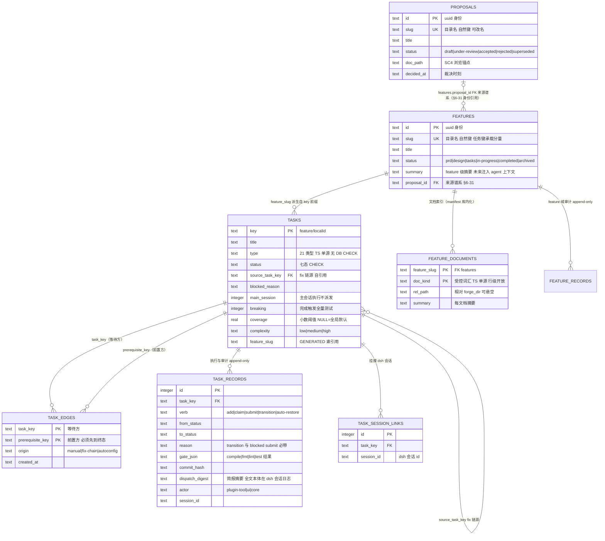
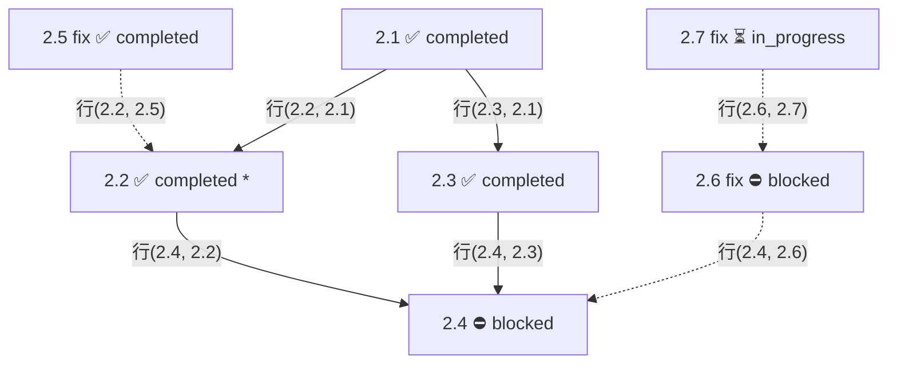
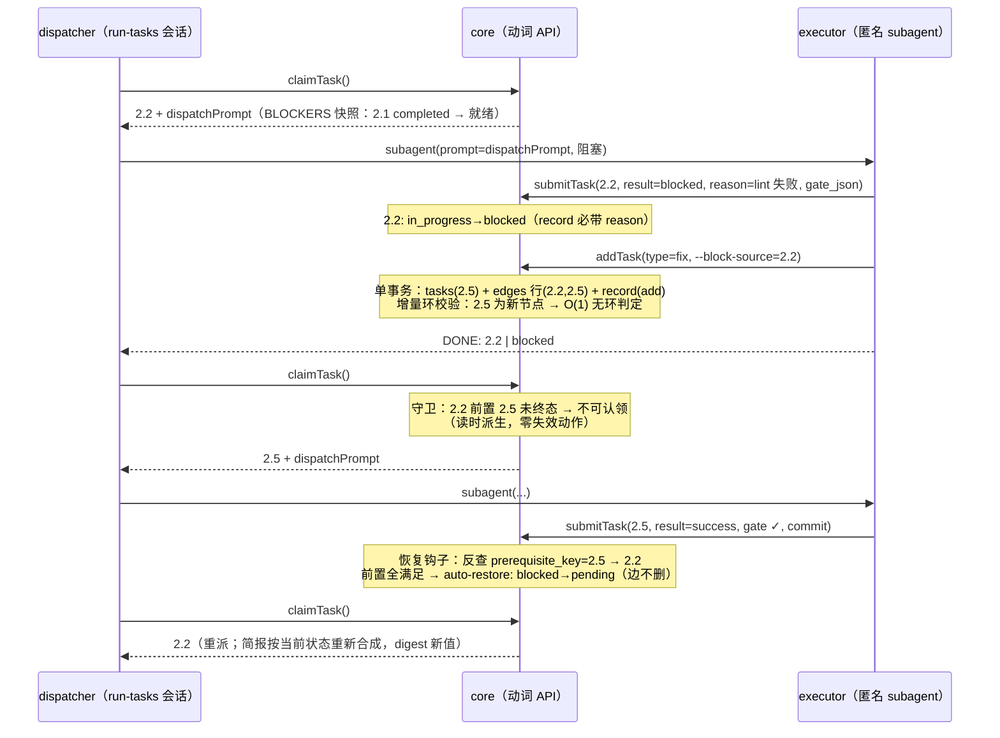
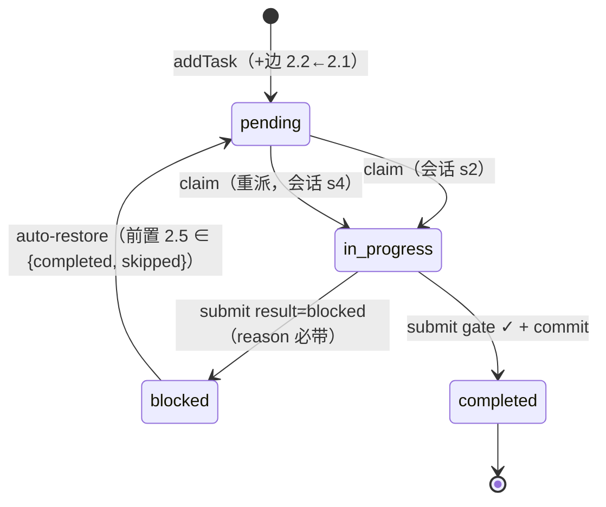

# M2 任务域 Schema 预设计（每工作区 DB）

> 性质：本文件 = M2 提案（[proposal.md](proposal.md)）交付面 ①「core · forge 域转正」的数据面预设计，`/tech-design` 的直接输入（M2 落地后随设计阶段迁入 `docs/features/<slug>/design/`，对应 P1 的 er-diagram.md + schema.sql 双工件）。
>
> 宪法输入：架构基线 §3（表集——原文六表、§6-23 修订后七表；七态 CHECK + blockers 无环 + append-only + 动词 API）；总纲 §数据模型（每工作区独立 DB @扁平化路径+hash8 后缀 = M2 提案裁决③与 §6-34，取代基线「按 workspace_id 外键域」的中央库措辞）。语义依据 = 老 forge（`Z:\project\ai\forge`）源码与文档，逐处标注。**§6 = 已裁决项（不再讨论）；§7 = 设计期开口项（tech-design 必答；2026-10-06 已全数闭合——各条记注）**。
>
> **阶段标注（2026-10-02 范围对齐）**：本文件保持**八域表完整设计定稿**（tech-design 输入）；其中标注「**M3 交付**」的条目不在 M2 落地范围——worktree 项目域（§6-37/§7-16）、task_records 执行上下文两列（§6-38）、会话头部执行上下文（§6-39）、feature_records 表（§6-35④）、移动找回对话框（§7-15①）。**M2 交付 = 七域表 + schema_meta + 中央域零改动**，全部后移项 = 前向软迁移形态（新表/加列/中央加列），明细见 M2 提案「范围对齐」节。
>
> **2026-10-06 tech-design 定稿回写**：权威 M2 落地形态 = [`docs/features/dsh-forge-m2-pipeline/design/schema.sql` + `er-diagram.md`](../../features/dsh-forge-m2-pipeline/design/er-diagram.md)（含 8 项差异清单）。本文件降为**裁决底稿**——DDL 与差异清单冲突处，一律以 design/ 为准。本设计五项修订（2026-10-06 用户裁决）：①列名保留字清剿（key→task_key、type→task_type、status→task_status/feature_status/proposal_status、description→task_desc）；②全表齐备 created_at+updated_at（schema_meta 基建表豁免）；③feature_documents 与 tasks 改 **feature_id 显式 FK** 关联（取代 slug 关联与 GENERATED feature_slug——键前缀 ≡ slug 改由服务不变量 + validateFeatureTasks 逐 feature 断言，守卫更强：连 features 表漂移亦可抓）；④proposals.doc_path → **rel_path**（与 feature_documents 命名统一）；⑤task_records 增 **files_json**（C5 修订：实际改动文件结构化）且 **task_file 列砍除**（M2 无写入者，M3 软迁移可回）；⑥**tasks 身份双轨**——`id`（uuid 代理主键 PK：records/edges/links FK 与前端引用锚）+ `slug`/`local_id`（UNIQUE 自然键：agent 识别），`task_key` 复合键退役、三表改 id 引用、同 feature 边 CHECK 移交服务不变量（slug 修改零级联，2026-10-06 用户裁决）。§7-6/11/12/13 已闭合（各条记注）。

## 0. 库布局与基建表

- **部署**：`{dsh-forge-home}/{flatten(canonical-path)}@{hash8(canonical-path)}/forge.db`（文件名 §7-7 暂定）。扁平化规则（总纲 + §6-34 细化）：`/`、`\` → `-`、盘符冒号去除，**尾接原路径 hash8 消歧后缀**；core 多句柄管理，注册时建库、句柄惰性首开（2026-10-06 tech-design）。
- **schema 版本表随库 + 幂等迁移**；旧应用打开新 schema 明确拒绝（基线 §5.4）。多库并存迁移场景入单测（提案 Key Risks 已记）。（2026-10-06 tech-design：注册时建库+发现面扫描，句柄**惰性首开**——每库每进程首次触达 open+migrate+断言；单库失败 = 工作区隔离态，不瘫痪全局）
- 中央 `state.db` 维持 projects / knowledge 域不动；forge 域表不进中央库。
- 引擎与纪律沿用 P1 [schema.sql](../../features/dsh-forge-p1-mvp/design/schema.sql)：better-sqlite3、`journal_mode=WAL`、`foreign_keys=ON`、ISO-8601 TEXT 时间戳、`ck_*` 约束命名。
- FK 一律不带 ON DELETE（RESTRICT 默认）——**M2 无删除动词**（§6-12），级联行为无意义。

基建表一张（不占域表计数；schema_meta 为提案明文「随库」；db_meta 已裁决不保留，§6-33）：

```sql
-- 基建：schema 版本表（随库，前向迁移唯一机制）
CREATE TABLE schema_meta (
    version    INTEGER PRIMARY KEY,
    applied_at TEXT NOT NULL
);
```

- **注册碰撞检查（§6-33/34 + §7-15①找回）**：三态——①目录不存在且无同主体异 hash 目录 → 正常新建；②目录已存在且 hash 段一致 → 查中央 projects.ws_path 精确确认后幂等复用（防 hash 自身碰撞）；③目录不存在但发现**同 flatten 主体、异 hash8 目录** → 疑似移动 → **M2 = 拒绝注册 + 手工指引**（删孤儿目录或改回原名）；确认对话框认领/新开 = **M3 交付**（F10-①，范围对齐后移）。孤儿目录不清理；数据丢失/损坏不可恢复不考虑（用户裁决；移动 ≠ 损坏，由找回机制覆盖）。
- **worktree 判定（§6-37 裁决的机械细则；注册与对账重解析共用，纯只读文件解析、零 git 命令）**——**M3 交付**（范围对齐后移；M2 = 单工作区管线，不触多 worktree 域）：

```text
  W/.git ──┬─ 不存在 → 非 git 仓库：repo_root = NULL（单工作区项目）
           ├─ 目录   → 主 checkout：repo_root = canonical(W)
           └─ 文件   → 读首行 gitdir 指针，再判形态：
                 ├─ …/.git/worktrees/<name> → worktree：repo_root = 剥去尾部两级
                 └─ …/.git/modules/*        → submodule：独立处理（非 worktree）

  分组（中央域两级模型）
    项目   = repo_root 相同的全部注册工作区（projects.repo_root_path 分组键）
    工作区 = projects 一行 = 一个独立 forge.db（F10-②：每工作区库独立不变）

  动态
    worktree 移动 → gitdir 指向不变 → 判定稳定，分组不动
    main 移动    → 全组 repo_root 失配 → 对账重解析自愈（逐个走 §7-15① 找回）
    兄弟枚举     → 读 main/.git/worktrees/ 目录名 → 「未注册兄弟 worktree」提示
```

## 1. 表清单总览

| 表 | 类别 | 角色 | 老 forge 对应 |
|---|---|---|---|
| `features` | 域 | feature 状态 SoT（manifest 库内化：状态/标题/摘要） | index.json 头部（Feature/Created/Status） |
| `feature_documents` | 域 | feature 文档索引（类型开放 + 每文档摘要） | manifest.md Documents 表 |
| `feature_records` | 域 | feature 域审计（append-only，§6-35④）——**M3 交付**（范围对齐后移） | 无（新增） |
| `tasks` | 域 | 任务实体 + 七态 | Task 结构体（OVERVIEW.md:207） |
| `task_edges` | 域 | 前置依赖边（DAG） | Task.Dependencies 数组 |
| `task_records` | 域 | 执行与审计（append-only） | records/ 目录 + state.json 演化 |
| `proposals` | 域 | 提案状态承载（五态，管线消费归 M3） | 提案 frontmatter（status: Draft/Accepted） |
| `task_session_links` | 域 | 任务↔会话挂接（SC6③） | 无（新增） |
| `schema_meta` | 基建 | 版本表随库（db_meta 已砍，§6-33） | forge-cli 无 |

（ER 图仅列关键列，完整列集以 §2 DDL 为准）



## 2. 域表 DDL 与设计说明

### 2.1 features + feature_documents + feature_records —— feature 状态、文档索引与审计（manifest 库内化；feature_records = M3 交付，范围对齐后移——M2 落地前两表）

```sql
CREATE TABLE features (
    id          TEXT PRIMARY KEY,               -- uuid（应用生成；§6-31 身份与名称分离——P1 projects 先例）
    slug        TEXT NOT NULL UNIQUE,           -- 人类可读名 = 仓内目录名（自然键；任务键承载分量 → 实践不可变，见 §6-31 约束记账）
    title       TEXT NOT NULL,
    status      TEXT NOT NULL DEFAULT 'prd'
                CONSTRAINT ck_features_status CHECK (status IN
                  ('prd', 'design', 'tasks', 'in-progress', 'completed', 'archived')),
    summary     TEXT,                           -- 一句话摘要；§6-22：保留——未来注入 agent 上下文（快速了解工作进度与目标）
    proposal_id TEXT REFERENCES proposals(id),  -- 来源谱系 FK 走 id（§6-31；SQLite 建表不校验引用序，DML 时校验）
    created_at  TEXT NOT NULL,
    updated_at  TEXT NOT NULL
);

-- 第七域表（§6-23：manifest 库内化一次到位；基线 §3 已同步修订）
CREATE TABLE feature_documents (
    feature_slug TEXT NOT NULL REFERENCES features(slug),
    doc_kind     TEXT NOT NULL,                 -- 受控词汇（TS 单源，无 DB CHECK——§5-7 先例）：
                                                --   prd-spec / user-stories / ui-functions / tech-design /
                                                --   er-diagram / sql-schema / page-map / …（行级开放，加类不加列）
    rel_path     TEXT NOT NULL,                 -- 相对 forge_dir，正斜杠规范化；悬空 → 只读缺省渲染（SC-branch）
    summary      TEXT,                          -- 每文档一句话摘要（manifest Documents 原生列回归）
    PRIMARY KEY (feature_slug, doc_kind)
);
```

```sql
-- 第八域表（§6-35④：feature 域审计入工作区库——存储不交叉原则：工作区数据彻底在工作区库）
CREATE TABLE feature_records (
    id          INTEGER PRIMARY KEY AUTOINCREMENT,
    feature_id  TEXT NOT NULL REFERENCES features(id),
    verb        TEXT NOT NULL,                 -- register / transition / doc-upsert（TS 单源无 CHECK，§6-25 判据）
    from_status TEXT,
    to_status   TEXT,
    reason      TEXT,                          -- transition 必带（服务内校验，含弃案归档）
    actor       TEXT NOT NULL
                CONSTRAINT ck_fr_actor CHECK (actor IN ('plugin-tool', 'ui', 'core')),
    session_id  TEXT,
    created_at  TEXT NOT NULL
);

CREATE INDEX idx_fr_feature ON feature_records(feature_id, id);

-- append-only 机械防线（同 task_records，§2.4）
CREATE TRIGGER trg_feature_records_no_update BEFORE UPDATE ON feature_records
BEGIN SELECT RAISE(ABORT, 'feature_records: append-only violation (update)'); END;
CREATE TRIGGER trg_feature_records_no_delete BEFORE DELETE ON feature_records
BEGIN SELECT RAISE(ABORT, 'feature_records: append-only violation (delete)'); END;
```

- 六态线性流（`prd → … → completed → archived`）证据与裁决见 §6-22；转移校验在服务内（§7-5）。
- **manifest 库内化终局（§6-23）**：features 行 + feature_documents 行 = manifest 全部机器可读信息的唯一 SoT；提案锚点归 `proposals.doc_path`（features.proposal_path 冗余消除）；追溯矩阵留 M3 随管线立表。
- **登记即推进（§6-28）**：upsertFeatureDoc 单事务内聚 feature 相位推进——doc_kind→phase 映射（TS 单源）：{prd-spec, user-stories, ui-functions}→prd；{tech-design, er-diagram, sql-schema, page-map}→design；**单调只进不倒退**（后补低阶段文档不回退，status = max(线性序当前位置, 映射 phase)）。技能无需也不得显式推相位（transitionFeature = 人类纠偏面）。
- **相位推导机（§6-29，task-driven 补全）**：feature 相位完整自动化——`status = archived ∨ combine(docPhaseMax, taskDerived)`；taskDerived（两段式）：存在非终态任务 →（存在 in_progress·blocked·suspended → in-progress；否则含终态+pending 混合 → tasks）；全任务终态 → completed；触发器 = **一切写 tasks.status / task_edges / feature_documents 的动词闭包**（addTask / claimTask / submitTask 钩子 / transitionTask / auto-restore / upsertFeatureDoc / removeTaskEdge 若立——审计修订：原清单漏 transitionTask）；**回退边合法**（completed 追加任务 → tasks，快照诚实）；**快照 + 派生不变量断言**（§5-9）：非 archived feature 的 status ≡ derive(feature_documents, tasks)——机械锁死，投影风险由断言消解。
- **manifest.md 文件 = 旧线工件**：M2 期间旧线技能（含 M2 自身开发）仍会生成它——发现面单向吸收、文件不再被运行时依赖，新旧并行直至 M3 自举后自然消亡（零迁移教义的同构应用）。
- 悬空容错：rel_path 值在、文件读不到 → 只读缺省渲染 + 标注，不崩溃不写入（SC-branch）。

**文档索引生命周期（发现面契约骨架，tech-design 定稿）**：

```text
[诞生] 项目注册/首次打开 → core 只读扫描 forge_dir → 发现 feature 目录
       → 建行（可读 manifest frontmatter 的 title/status 作初值，此后不回读）
       → 全类文档索引行入库（按目录约定，七类皆收，不止 SC4 四类）
       → proposals 扫描建行（docs/proposals/<slug>/ → createProposal，§6-36）
[稳定] 行不变；悬空 ≠ 缺行 → SC-branch 容错渲染；无 watch、无自动回流（SC2）
[刷新] 显式动作（对账卡「失配找回」近亲）：覆盖式重建 —— M2 可选项
[演进] M3 规格技能经 registerFeature / upsertFeatureDoc 写库（登记即推进相位，§6-28）
       （技能步骤中 manifest.md 生成移除，文件形态消亡）
```

- 扫描规则骨架：目录约定 = P1 实践布局 `docs/features/<slug>/{prd|design|ui|…}/…`；非标准位置不自动发现（错误索引比缺失索引贵）；扫描只读、零写回。
- 单写路径：文档索引唯一写者 = core（扫描/动词）；文件系统只能制造悬空，不能改写行。

### 2.2 tasks —— 七态 CHECK

```sql
CREATE TABLE tasks (
    key             TEXT PRIMARY KEY,              -- '<feature>/<localId>'（基线 §3 键约定；格式服务内校验）
    title           TEXT NOT NULL,
    type            TEXT NOT NULL,                 -- 21 类型：TS 模板函数族单源，无 DB CHECK（§5-7）
    status          TEXT NOT NULL DEFAULT 'pending'
                    CONSTRAINT ck_tasks_status CHECK (status IN
                      ('pending', 'in_progress', 'completed', 'blocked',
                       'suspended', 'skipped', 'rejected')),
    description     TEXT,
    priority        TEXT CONSTRAINT ck_tasks_priority CHECK (priority IN ('P0', 'P1', 'P2')),
    estimated_time  TEXT,                          -- 如 '1-2h'（autoconfig 产出）
    vars_json       TEXT,                          -- --var 注入变量（fix 任务 SOURCE_FILES 等；JSON 编码）
    task_file       TEXT,                          -- TASK_FILE 执行参照（可悬空容忍——预研 §4）
    source_task_key TEXT REFERENCES tasks(key),    -- fix 链源任务（老 forge SourceTaskID）
    blocked_reason  TEXT,                          -- 进入 blocked 原因（老 forge BlockedReason）
    main_session    INTEGER NOT NULL DEFAULT 0
                    CONSTRAINT ck_tasks_main_session CHECK (main_session IN (0, 1)),
    breaking        INTEGER NOT NULL DEFAULT 0
                    CONSTRAINT ck_tasks_breaking CHECK (breaking IN (0, 1)),
    coverage        REAL,                           -- 覆盖阈值（小数，如 0.85）；NULL = 全局默认（三级优先：任务级入参 > 配置 > 默认）
    complexity      TEXT NOT NULL DEFAULT 'medium'
                    CONSTRAINT ck_tasks_complexity CHECK (complexity IN ('low', 'medium', 'high')),
    surface_key     TEXT,
    surface_type    TEXT,
    feature_slug    TEXT GENERATED ALWAYS AS
                      (substr(key, 1, instr(key, '/') - 1)) STORED,   -- DB 计算，不可漂移（§5-5）
    created_at      TEXT NOT NULL,
    updated_at      TEXT NOT NULL
);

CREATE INDEX idx_tasks_feature_status ON tasks(feature_slug, status);   -- 列表视图：feature 绑定 + 七态 chips
CREATE INDEX idx_tasks_source         ON tasks(source_task_key);        -- fix 链溯源
```

- 老 forge 字段映射：`ID`（feature 内局部）→ `key`（全局 `<feature>/<localId>`，基线键约定）；`File`/`Record` → 去文件化（记录入 task_records，参照留 task_file 可空）；`Dependencies` → task_edges；`Scope` deprecated 不迁移（老 forge 已标注 legacy）。
- `estimated_time`/`vars_json`/`priority` 为语义完整性保留列（21 类型模板与 autoconfig 消费）；M2 列表视图不展示不阻塞。
- generated column 退路：若设计期否决，改显式列 + `CHECK (key = feature_slug || '/' || local_id)`，防漂移等价（择一，§7 不必开口——实现细节）。

### 2.3 task_edges —— 前置依赖边（§6 裁决 1/2/3）

```sql
CREATE TABLE task_edges (
    task_key         TEXT NOT NULL REFERENCES tasks(key),   -- 等待方（主体）
    prerequisite_key TEXT NOT NULL REFERENCES tasks(key),   -- 前置方（必须先到终态）
    origin           TEXT NOT NULL
                     CONSTRAINT ck_edges_origin CHECK (origin IN ('manual', 'fix-chain', 'autoconfig')),
    created_at       TEXT NOT NULL,
    PRIMARY KEY (task_key, prerequisite_key),                -- 行读法：「X 的前置之一是 Y」
    CONSTRAINT ck_edges_same_feature CHECK (                  -- §6-15 已裁决认可（§6-32②）
        substr(task_key, 1, instr(task_key, '/')) =
        substr(prerequisite_key, 1, instr(prerequisite_key, '/')))
);

CREATE INDEX idx_edges_prerequisite ON task_edges(prerequisite_key);   -- 反向查询物理加速（§6-19：纯物理结构非方案分叉，CREATE/DROP 随时可反悔）
```

- 复合主键 = 存储级去重（替代老 forge add.go 的 `slices.Contains` 判重逻辑及其测试）。
- `--block-source` 反向注入映射：写一行 `(task_key=源任务, prerequisite_key=fix任务, origin='fix-chain')`——「源任务的前置新增 fix」，与 flag 宾语方向同读。
- 无 `resolved_at`、无删除路径：边持久，满足是派生（§6-5）；`origin` 仅为可观测性标签，不参与守卫逻辑。
- 无 topo 序 / 深度列（§6-6 零派生）；无 workspace_id 列（每工作区库自然推论，§6-10）。

**动态追加契约**（fix 链 / 多级发现 / 同批多任务——老 forge 场景平移，全部为 schema 级支撑 + 动词语义）：

- **事务原子性**：addTask（含 `--depends-on` / `--block-source`）= **单事务**：先 tasks 行、后 task_edges 行、末 task_records 行（FK 立即检查下的安全插入序；或事务内 `PRAGMA defer_foreign_keys=ON`）。全成全败，无半成品任务。
- **增量环校验**：addTask 的新边记 (S←T)（block-source）与 (T←D)（depends-on）——成环 ⟺ D 经既有出边**可达** S。**双判据**：新节点且未声明 --depends-on（无出边）→ 结构性无环 O(1)（fix/disc 链常态，零图遍历）；携带 --depends-on（含与 --block-source 组合——**M2 动词面唯一环构造入口**，见 B.5-1）→ 从 D 沿出边可达性 DFS 找 S（非全图扫描）。
- **满足判定读时派生的红利**：动态加边后**无需任何失效/重算动作**——下一次 claim 守卫与 BLOCKERS 快照自动看到新边（§6-5 裁决的直接收益；对照投影方案此处需要失效广播）。
- **动态边只随 addTask 发生**（§6-13）：M2 无独立加边动词，老 forge `AddDependency` 不平移——既有任务间不可凭空加边，边诞生于任务追加（前置声明 / block-source 注入）。
- **链式模型**：多级失败 `fix-N --block-source fix-(N-1)` → 边 `(fix-(N-1) ← fix-N)`；每级完成经反向索引恢复上一级，逐级解链（老 forge 链式裁决，root/chain 之争已由其测试史定链式）。纯边组合，schema 天然支持。
- **谱系 flag**：`--source-task-id S` 写 `tasks.source_task_key`（fix→源谱系）；`--block-source S` 隐含之并加边 (S←T)——老 forge 双 flag 语义原样迁移（与提案 ② 的 flag 引用对齐）。
- **去重两级**：边级 = PK 幂等（manual 重复报错；fix-chain 重复视为成功）；任务级 = addTask 动词语义「同源同型且未终态的 fix 复用不新建」（老 forge built-in dedup 平移）。
- **localId 分配**：动态任务的 localId 由服务层分配（数值顺延 vs 语义前缀 disc-/fix-——§7-9 开口）；key 唯一性由 PK 兜底。

### 2.4 task_records —— 执行与审计（append-only + 触发器机械防线）

```sql
CREATE TABLE task_records (
    id              INTEGER PRIMARY KEY AUTOINCREMENT,
    task_key        TEXT NOT NULL REFERENCES tasks(key),
    verb            TEXT NOT NULL,                           -- 事件类型：add/claim/submit/transition/auto-restore
                                                           -- TS 单源无 DB CHECK（§6-32③——可扩展词汇，§6-25 判据）
    from_status     TEXT,
    to_status       TEXT,
    reason          TEXT,                           -- transition / submit 下调 blocked：必带（服务内校验）
    summary         TEXT,                           -- submit 执行摘要
    gate_json       TEXT,                           -- submit 质量门结果 {compile, fmt, lint, test}
    commit_hash     TEXT,                           -- submit 后 git 提交
    branch          TEXT,                           -- 事件时 HEAD 分支（§6-38；.git/HEAD 只读解析；detached/非 git → NULL）——M3 交付
    worktree        TEXT,                           -- 事件时工作区 canonical 路径快照（§6-38；执行来源自证；非 git → NULL）——M3 交付
    dispatch_digest TEXT,                           -- claim 合成简报摘要（§6-11；全文本体 = dsh 子会话日志）
    actor           TEXT NOT NULL
                    CONSTRAINT ck_records_actor CHECK (actor IN ('plugin-tool', 'ui', 'core')),
    session_id      TEXT,                           -- actor 所属 dsh 会话（挂接联查 / dispatcher 追溯）
    created_at      TEXT NOT NULL
);

CREATE INDEX idx_records_task    ON task_records(task_key, id);
CREATE INDEX idx_records_session ON task_records(session_id);

-- append-only 机械防线（防腐 L3 精神：断言级，不靠评审纪律）
CREATE TRIGGER trg_task_records_no_update BEFORE UPDATE ON task_records
BEGIN SELECT RAISE(ABORT, 'task_records: append-only violation (update)'); END;
CREATE TRIGGER trg_task_records_no_delete BEFORE DELETE ON task_records
BEGIN SELECT RAISE(ABORT, 'task_records: append-only violation (delete)'); END;
```

- verb 初集 6 个（TS 单源无 CHECK，§6-32③）：add / claim / submit / transition / auto-restore / **auto-block（C2：addTask --block-source 同置源任务 blocked 的记录行）**；手动转移统一 `transition` + `to_status`；`auto-restore` 独立成 verb——SC-M2「完成自动恢复断言」直接查 `verb='auto-restore'` 行。动词面增长加值零迁移。
- 一行 = 一次动词调用（基线「每次写自动审计」的落点）；动词函数内聚写入，无旁路。
- **执行上下文快照（§6-38；两列 = M3 交付，范围对齐后移——append-only 加列软迁移 §6-24③ 路径，M2 记录不含；⚠️ 2026-10-05 提示：本节 DDL 为八表完整定稿形态，M2 落地 forge.db 迁移语句时须**剥离 branch / worktree 两列**——照抄即提前携带 M3 列）**：`branch` / `worktree` 由服务层在**每次记录写入时**只读解析当前 `.git`（HEAD 分支 = `.git/HEAD` 的 `ref: refs/heads/<name>`；worktree = canonical 工作区路径）——与 §0 worktree 判定器同族同边界（零 git 命令）。claim 与 submit 各自快照：任务中途换支 → 两行异值 = 诚实审计，服务层不做任何合并解释。与 §6-33「库不含自身路径」不矛盾：db_meta 路径是**身份**（找回/碰撞承重 → 砍除换认领零库修改），本两列是**历史事实**（描述事件发生在哪；身份逻辑永不读取；移动认领后旧行保留旧路径、新行写新路径 = 诚实轨迹）。
- 老 forge records/ 目录的 per-task 文件形态取消：统一入库，任务详情视图按 `(task_key, id)` 序读。

### 2.5 proposals —— 五态承载（管线消费归 M3）

```sql
CREATE TABLE proposals (
    id          TEXT PRIMARY KEY,               -- uuid（应用生成；§6-31 身份与名称分离）
    slug        TEXT NOT NULL UNIQUE,           -- 人类可读名 = docs/proposals/<slug>/ 目录名（自然键；改名零影响——关联走 id）
    title       TEXT NOT NULL,
    status     TEXT NOT NULL DEFAULT 'draft'
               CONSTRAINT ck_proposals_status CHECK (status IN
                 ('draft', 'under-review', 'accepted', 'rejected', 'superseded')),
    doc_path   TEXT,                            -- proposal.md 相对 forge_dir（SC4 浏览锚点）
    author     TEXT,
    decided_at TEXT,                            -- 裁决时刻（→accepted/rejected 时写；打回修订与 superseded 均不改写——保留首次裁决时刻）
    created_at TEXT NOT NULL,
    updated_at TEXT NOT NULL
);
```

- **五态（§6-30）**：`draft → under-review（提交评审）→ accepted | rejected（用户裁决，写 decided_at）`；`under-review → draft（打回修订）`；`accepted → superseded（被新提案推翻）`；accepted / rejected / superseded = 终态。证据链：模板 `status: Draft` + 总纲/P1 `status: Accepted` + 总纲接管说明（superseded 语义）+ 评审态显式化（挑战 / SC 核对发生于 under-review 期）。
- **裁决不可推导——无相位推导机**（异于 feature 的 docs/tasks 派生状态机）：transitionProposal = agent 面 tool，技能在 brainstorm 会话记录**用户裁决**（决策人类、落笔技能——fix 链协议模式）。
- **sc_check_json 砍（§6-30）**：M2 零消费方（consistency_check 消费 = M3 eval 管线）；M3 加列时形状随 eval 设计定，不预猜。
- **proposal ↔ feature = 身份 FK（§6-31）**：`features.proposal_id → proposals.id`（身份与名称分离，slug 降自然键）——文件系统时代的同名约定退役。

### 2.6 task_session_links —— 挂接元数据（SC6③）

```sql
CREATE TABLE task_session_links (
    id          INTEGER PRIMARY KEY AUTOINCREMENT,
    task_key    TEXT NOT NULL REFERENCES tasks(key),
    session_id  TEXT NOT NULL,                     -- dsh 会话 id（账本本体在 dsh）
    created_at  TEXT NOT NULL,
    CONSTRAINT uq_tsl_task_session UNIQUE (task_key, session_id)
);

CREATE INDEX idx_tsl_session ON task_session_links(session_id);
```

- `UNIQUE(task_key, session_id)`：同任务同会话幂等（dispatcher 外环重派 → upsert-ignore）；跨会话重试自然累积历史。
- SC6③ 双侧可见的查询面：任务行挂接会话 = 正向；会话头部挂接任务 = `idx_tsl_session`。两侧断言与库一致（提案 SC6③ 验收）。
- 写入机制（claim 时 tool 侧会话上下文解析）= 提案已列设计期必答；**不区分挂接类型**（§6-17 审核裁决）——行语义 = 「该会话参与过该任务」的历史事实，M2 唯一写入源 = claim。

## 3. 状态机

### 3.1 任务七态转移矩阵（agent 机器校验面；DB CHECK 只锚终值）

**agent 面**（SC7 单测对象——只含动词与钩子拥有的边）：

| from ↓ / to → | in_progress | completed | blocked | pending |
|---|---|---|---|---|
| pending | ✅ claimTask | — | — | — |
| in_progress | — | ✅ **仅经 submitTask**（gate ✓） | ✅ submitTask result=blocked | — |
| blocked | ✅ claimTask（重派） | ❌（TC-063 证据） | — | ✅ auto-restore（submit 钩子） |
| suspended / completed / skipped / rejected | — | — | — | — |

- 「—」= agent 面不可达；**人类通道不受本表约束**（见下）；「❌」= 老 forge 直接证据（in_progress→{completed 仅经 submit, blocked}、blocked→in_progress = TC-061）。
- **claimTask 幂等重入（C1 裁决）**：对 in_progress 任务**无状态转移**地返回按当前状态重合成的 dispatchPrompt（digest 新值）——外环重派 = dispatcher 检测 record 缺失 → 再 claim 即得新简报；**addTask --block-source 的 auto-block 边（C2 裁决）**：源任务 in_progress→blocked 随 addTask 单事务发生（record verb='auto-block'）。

**人类通道（transitionTask，§6-26）**：from ≠ to **任意转移** + reason 必带（七态 DB CHECK 兜底终值合法）——覆盖 skip / reject / suspend / resume / unblock 等常规人工决策与重开 completed、重置卡死 in_progress 等异常恢复。UI 专属（actor='ui'），不注册 tool。

### 3.2 前置满足集 = {completed, skipped}（§6-4）

- 判定：prerequisite.status ∈ {completed, skipped} ⟺ 满足（老 forge GetUnmetDependencies 原语义）。
- **rejected 不满足** → 前置 rejected = 依赖路径死锁，dispatcher 须重规划（liveness deadlock 判据之一，§6-8）。
- claim 守卫（依赖终态守卫，SC7 单测项）与 BLOCKERS 快照共用此判定。

### 3.3 feature 六态 / proposal 五态

- feature：`prd → design → tasks → in-progress → completed → archived`（§6-22 六态；archived = 终态收纳，UI 默认收起可展开；非终态 → archived 的「中途弃案归档」是否放开 = §7-5 子问）；转移动词面 §7-5。
- proposal（五态，§6-30）：`draft → under-review → accepted | rejected`（裁决写 decided_at）；`under-review → draft`（打回修订）；`accepted → superseded`。M3 管线消费细化。

## 4. 动词 API × 写矩阵（SC7 单测锚点）

| 动词 | tasks | task_edges | task_records | task_session_links | proposals / features | 附注 |
|---|---|---|---|---|---|---|
| addTask | INSERT（+block-source 时**单事务同置源 blocked**，C2） | INSERT（--depends-on / --block-source；--block-source 隐含 --source-task-id 谱系，§2.3） | `add`（+源任务 `auto-block` 行） | — | — | 单事务原子；增量环校验 + 环路径回报（§6-14）；两级去重；**链深 ≤6 校验（C6）**；feature 相位重算（§6-29 闭包） |
| claimTask | UPDATE pending→in_progress；in_progress 幂等重入（C1，不改状态返回重合成简报） | — | `claim`（dispatch_digest） | upsert-ignore | — | 前置满足守卫；返回 dispatchPrompt（不落库）；feature 相位重算（§6-29） |
| submitTask | UPDATE in_progress→completed\|blocked | — | `submit`（gate_json / commit_hash） | — | — | gate：compile→fmt→lint→test + summary 非空校验；`--force` 不迁移（失败即 blocked 走 fix 链，C4）；RecordData 瘦身 = files/keyDecisions 并入 summary、数字摘要入 gate_json（C5）；下调 blocked 必带 reason |
| （submit 钩子） | UPDATE blocked→pending | 不动边 | `auto-restore` | — | — | 反查 idx_edges_prerequisite；前置**全**满足才恢复；feature 相位重算（全终态 → completed，§6-29） |
| transitionTask | UPDATE | 不动边 | `transition`（reason 必带） | — | — | **人类逃生通道：UI 直调能力面（不封装 tool，§6-27）**：from≠to 任意 + reason 必带——常规人工决策（skip/reject/suspend/unblock）与异常强行恢复（重开/重置）；→skipped/completed 挂恢复钩子（C3）；feature 相位重算（§6-29 闭包） |
| queryTask | — 读 — | 水化节点 | 按需 | 按需 | — | include: prerequisites / waitingOnMe / records / sessions |
| validateFeatureTasks（C8） | — 读 — | 读（子图 DFS 复核） | 读（链审计） | — | 读 | 只读校验（**2026-10-06 修订：更名 validateStore → validateFeatureTasks，一次只校验一个 feature 的任务子图**——新入库 feature 由调用方逐个送校）：派生不变量 / 无环复核 / liveness / 记录链完整性 / 拓扑可分层；输出违例清单；**面归属（2026-10-06 定稿）：M2 = RPC（forge:tasks/validateFeatureTasks）+ 发现面送校——tool 封装与 UI 诊断入口归 M3** |
| createProposal / transitionProposal | — | — | — | — | proposals INSERT / UPDATE | 最小动词（五态转移校验服务内）；agent 面 tool 记录用户裁决（决策人类、落笔技能，§6-30） |
| registerFeature / transitionFeature / upsertFeatureDoc（§7-5 已裁：**M2 仅 core API + UI 直调，M3 再封装 tool**） | — | — | — | — | features / feature_documents INSERT·UPDATE + **feature_records 审计行** | 面分治（§6-27）；upsertFeatureDoc 单事务内聚相位推进（§6-28）；registerFeature 单步写 proposal_id 谱系（§6-31） |

- SC7 单测路径对照：from 匹配（矩阵非法格拒）／依赖终态守卫（claim 拒未满足）／record 必带（transition 与 blocked submit）／append-only（触发器 ABORT）／blockers 无环拒绝（DFS + 环路径）。

## 5. 机制不变量与机械防线

1. **无环**：addTask 写边时服务内 DFS（SQLite 无声明式表达）；拒绝并回报完整环路径（老 forge 行为）；单写者（core）保证校验-写入原子。
2. **append-only**：双触发器机械 ABORT（§2.4）+ 服务层无 UPDATE/DELETE 代码路径；SC7 断言 = 直接触发器尝试。
3. **键唯一**：tasks.key PK + 服务内格式校验（`<feature>/<localId>`，含 `/` 且前缀 = 既有 feature）。
4. **单一写入路径**：sqlite 句柄仅 core 持有（基线 L1）；UI 与 plugin tool 同门；SC-NFR 扩展断言「每工作区 DB 写只经 core 服务」。
5. **零派生数据**（SC2 精神）：feature_slug = GENERATED 列（DB 计算，不可漂移）；无 topo/深度/满足标记存储；满足 = 读时 JOIN 终态；DAG 视图（M3）从同一边集现算。
6. **审计完备**：每动词一行 record，动词函数内聚写，无旁路。
7. **type 无 DB CHECK**：21 类型单源 = TS 模板函数族 `satisfies Record<TaskType, …>`（预研 §4）；DB CHECK 即双源漂移。七态例外（基线明文「七态 CHECK」，状态属数据完整性）。
8. **事务边界**：addTask 及一切多表动词 = 单事务全成全败（动态追加原子性，§2.3 动态追加契约）。
9. **feature 相位派生不变量（§6-29）**：∀ 非 archived feature：`features.status ≡ derive(feature_documents, tasks)`——快照锁死断言（单测 + CI 常驻），腐化即红灯；status 存储列 = 性能优化与断言对象，非自由状态（archived 除外 = 人类收纳决策，唯一不可推导态）。

**查询成本画像**（规模校准：单 feature 30–60 任务为日常形态，500 任务 = SC2 压力上界；~750 边的 B-tree 索引深度 2 层，better-sqlite3 进程内同步）：

| 查询 | 路径 | 量级 |
|---|---|---|
| 恢复钩子反查（后继） | idx_edges_prerequisite | ~1–10 µs（k=1–3 行） |
| claim 守卫 / BLOCKERS 快照 | PK 前缀 | 同上 |
| 就绪集（dispatcher） | 二者组合 NOT EXISTS | 最坏 @500 pending ≈ 冷几 ms / 热亚 ms；feature 绑定首屏（几十行）≈ 几十 µs |
| 环校验（既有节点间） | DFS × PK 探测 | 动态追加 O(1)；手动边 O(可达边)，本域链长 <10 |

- 反向索引真实代价在**写**（每边维护两棵 B-tree，µs 级），读与双向边存储**同价**（§6-18 否决依据的量化面）。
- 退化场景记账（本域不成立）：超大入度（k 数百）、超长链（L 数百）——真实前置 1–5、链长个位数。
- **EQP 机械断言**（L3）：单测固定 EXPLAIN QUERY PLAN——守卫 / 反查 / 就绪集三查询必须命中反向索引或 PK 前缀，防查询计划回归为全表扫描；效率结论由断言兜底而非口头承诺。
- WAL 双收益：UI 读与 dispatcher 写无锁竞争（tool 写入即时刷新与派发循环互不阻塞）。

## 6. 已裁决项（预设计定稿，tech-design 直接消费）

1. **边表独立保留**（否决 JSON 列沿袭老 forge）：消费方 = 双端 FK 完整性 / BLOCKERS 快照水化 / 恢复钩子反查（见 §6-19 修正：反查在有无索引下机制统一，差异仅物理加速）；且基线已冻结表集（原文六表，§6-23 修订后七表），砍表成本 > 收益。
2. **边列命名 `task_key` / `prerequisite_key`**：不同词根、方向自语义（dependent/dependency 与 blocker/blocked 同根否决）；行读法「任务 X 的前置是 Y」。
3. **方向锁死**：等待方 → 前置方，与老 forge `Dependencies` 语义同向，`--block-source` 注入逻辑原样映射。
4. **满足集 = {completed, skipped}**，rejected 不满足（死锁信号，进 liveness 诊断）。
5. **边持久不删，满足为派生**：fix 完成后边保留、由前置终态自动满足（老 forge 行为）；「恢复」= 守卫放行 + 钩子转移 blocked→pending；删边仅显式纠错动词（§7-4 开口）。
6. **零派生存储**：无 topo 序 / 深度列；M3 DAG 视图从边集现算布局。
7. **环校验 = 服务内 DFS + 回报环路径**（DB 无声明式表达）。
8. **liveness 诊断（orphaned / stale / deadlock）= 读时查询动词**（queryTask 诊断变体），平移老 forge WORKFLOW.md:918-920 三判据；非存储状态。
9. **砍通配依赖 `1.x`**：相位上下文由 PHASE_SUMMARY 注入承接（预研 §4 跨相位注入）；**偏离须补记预研 §2 映射表**（当前映射表遗漏项）。
10. **无 workspace_id 列**：每工作区库裁决③的自然推论。
11. **dispatchPrompt 不入任务库**：全文本体 = dsh 子会话日志（预研 v3 已定）；record 仅存 digest 供跨查（算法 §7-8）。
12. **M2 无删除动词**：零迁移 + append-only 精神；老 forge `forge cleanup` 语义 = 查询过滤，非物理删除。
13. **动态边只随 addTask 发生**：M2 无独立加边动词；老 forge `AddDependency`（既有任务间加边）不平移。
14. **环校验增量化（2026-10-02 对抗审计修订：组合 flag 下 O(1) 捷径失效）**：新边 (S←T)+(T←D) 成环 ⟺ D 经既有出边可达 S；新节点**且无 --depends-on** → 结构性无环 O(1)；--depends-on 与 --block-source 组合（新节点亦可成环——新节点自带出边）→ 必跑可达性 DFS（M2 动词面唯一环构造入口，B.5-1）。
15. **同 feature 边约束（DB CHECK，已裁决认可 2026-10-02 §6-32②）**：边双端必须同 feature——老 forge 依赖本就 feature 内（per-feature index.json）；M2 三视图 feature 绑定、无全局汇总，跨 feature 边在任何视图中都不可见 = 悬空语义，不如机械拒绝。
16. **coverage = REAL 小数**（审核裁决）：覆盖阈值支持小数（推翻老 forge `*int` 直译的 INTEGER）；NULL = 全局默认，三级优先链不变。
17. **task_session_links 不分类型**（审核裁决）：移除 link_type——行 = 「会话参与过任务」的纯关联事实，M2 唯一写入源 = claim（upsert-ignore）；将来需要区分挂接方式时经 schema 前向迁移加列。
18. **后继边 / 后继指针不加**（评估否决）：后继集 = 反向索引派生（`prerequisite_key = :X` 即「X 的后继」），存储即投影——双写同步不变量、环校验需校验镜像一致、边行 ×2，违反 §6-6 与 SC2 精神（总纲对投影/双 SoT 的否决教训）。单列指针（链表式）另败于 DAG 扇入扇出不可表达。动态追加的两个方向由 addTask 的 `--depends-on` / `--block-source` 分别表达；派发便利的正确入口 = 动词面就绪选择策略（§7-10）。
19. **入度索引 = 物理加速，非方案分叉（2026-10-02 审核二轮修正，裁决：保留）**：连续两轮质询澄清——①恢复钩子在有无索引下**机制统一**（同一 SQL，全表扫 vs B-tree 探测），无 fix 链特判；②「纯出度 + 反向索引」并不互斥：索引是**纯物理结构**，不改变逻辑方案（单向出度边表，与老 forge `Dependencies` 同向同构），由引擎事务性维护、**永不可能与表漂移**、非 SC2 意义上的投影。故 A/B 之辨是伪分叉——真实光谱：老 forge（数组嵌入、无边表无索引、反查靠回指）→ 边表无索引（反查 = ~E 行全表扫）→ 边表 + 索引（反查 = B-tree），**三者逻辑全同**。**裁决：保留 `idx_edges_prerequisite`**——成本一棵 B-tree（写侧 µs 级），收益反向查询对数加速 + EQP 断言可锚「命中索引」；CREATE/DROP INDEX 属软 schema 变更（前向兼容、一行迁移、零数据搬移），去留随时可反悔，不构成架构决策。
20. **出度 vs 入度方向方案对比（2026-10-02 评估闭环）**：两者 = 同一边集的 E vs Eᵀ，信息严格等价；双方向均有索引时查询复杂度镜像对称（PK 方向单树直达 vs 二级索引回表一跳，WITHOUT ROWID 聚簇下差每行一跳、µs 级）。热路径偏前向（守卫/快照/就绪集/环校验 DFS 步 vs 恢复钩子单点，≥1:1 偏 2:1）→ PK 给出度 = 更热侧走主索引的顺带微优。**直观性出度显著胜出**：①域语言「X 的 blockers」从等待者视角读 = X 的出边（入度主语「Y 阻塞了谁」域内无人使用）；②两个写动词（--depends-on / --block-source）均为「某任务出边 +1」的自然式；③老 forge Dependencies 出边数组同构、迁移零翻转。更新操作对称且无关（边不可变无 UPDATE、M2 无删边动词）。现行设计（出度逻辑 + PK 出度方向 + 反向二级索引）两端通吃，入度方案无独立存在价值。
21. **边的传递约简不做存储压缩（2026-10-02 评估否决，视图层采纳）**：约简保持可达性但不保语义——满足判定按**直接边**逐条过滤终态集（§3.2），反例：`A←B, B←C, A←C` 约简删 `A←C` 后，C=rejected 时 A 被静默放行（全边集下为死锁信号）；skip B 亦连带「跳过」A 对 C 的依赖。且压缩三硬伤：①声明事实（origin/created_at）丢失或退化为双存储投影（§6-18 否决形）；②插边从单 INSERT 变闭包重算 + 删既有边，摧毁动态追加 O(1)（§6-14）；③约简不闭于删除，删关键边需加回已删冗余边，无声明集不可重建。收益无关（KB 级存储、µs 级查询、实际冗余率低——fix 链边永不冗余）。**采纳内核**：①约简 = 读时派生视图（M3 DAG 视图按需对 feature 边集现算渲染，O(V·(V+E)) 毫秒级）；②addTask 写入时冗余检测 **advisory**——新边已被传递蕴含则提示不拒绝（复用同一可达性 DFS 原语——方向相反的一次调用，同阶成本），源头少进冗余边，优于事后压缩。
22. **features 表审核裁决（2026-10-02）**：①`summary` 保留——未来注入 agent 上下文（快速了解工作进度与目标），潜在消费者 = dispatchPrompt 动态信息块 / 概览；②**不加 manifest_path，features 行即 manifest 的机器可读形态**——status/title/summary 全在库（「锚点全在库」已被 §6-23 修订：四锚点列移除、feature_documents 立表）；仓内 manifest.md 保留为技能管线工件（应用只读不依赖），建行时初值单向阀门后 DB 为唯一 SoT；③**六态**：+`archived`（completed → archived 终态收纳；UI 默认收起归档 feature、可展开；中途弃案归档是否放开非终态转移 = §7-5 子问）；④锚点四分列维持（**已被 §6-23 修订推翻**——四锚点列移除、feature_documents 立表，原裁决存档）。
23. **manifest 库内化一次到位（2026-10-02 审核裁决，修订 §6-22④）**：①**manifest.md 文件形态判消亡**——DB 为其全部机器可读信息的唯一 SoT：状态/标题/摘要 = features 行；文档索引（类型开放 + 每文档摘要）= **`feature_documents` 第七域表**（基线 §3 已同步修订六表→七表）；提案锚点归 `proposals.doc_path`（features 四锚点列移除，冗余消除）；②**追溯矩阵留 M3** 随管线立表（schema 依赖 M3 技能设计，M2 零消费者，不预猜）；③**过渡现实**：M2 期间旧线技能（含 M2 自身开发）仍生成 manifest.md——文件降格为旧线工件，发现面单向吸收、运行时零依赖，新旧并行直至 M3 自举后自然消亡（零迁移教义同构）；④**技能经 tool 读写**（registerFeature / transitionFeature / upsertFeatureDoc 消费 ctx.forgeProjects——SC7 缝由任务域延伸至 feature/文档域；2026-10-06 注：M2 定稿 = `ctx.forgeFeatures` 等按域四服务）。**存在理由考古（消亡正当性）**：manifest = 「无状态层」时代的补偿物——三方共享介质 / 管线账本 / 导航目录 / 追溯载体 / git 福利五职，前四项由状态层与 tool/UI 各归其位，git 福利被单机单活跃分支（基线 §6）豁免；残留两空隙（追溯矩阵过渡期留旧线工件、裸仓依赖目录约定导航）均在宪法框架内有归宿，不构成保留理由——留着反而是第二事实源。
24. **task_records 审核裁决（2026-10-02）**：①**双触发器 append-only 防线保留**（SC7 断言路径 = 单测直接尝试 UPDATE/DELETE 断言 ABORT）；②**actor 砍 `skill`**——技能永远经 tool 落笔（单写路径），真实落笔者恒为 plugin-tool，「哪个会话」由 session_id 承载（与 link_type='manual' 同罪同删），剩三值 plugin-tool/ui/core；③**payload_json 砍**——M2 已知附载全部有名列（reason/summary/gate_json/commit_hash/dispatch_digest），无约束 JSON 列 = 类型洞（docs_json 同罪），真出现新附载时加列（append-only 表加列 = 软迁移）；④**session_id 语义澄清**：claim 记 dispatcher 会话、submit 记 executor 子会话——追溯链 claim(s_disp) → submit(s_exec)；task_session_links 只挂 dispatcher 会话（唯一写入源 = claim），两表分工 = 挂接事实 vs 全量审计；**SC6③ 双数据源（审计修订）**：links = 派发会话挂接、records.session_id = 执行会话挂接——断言两侧分别一致，任务行展示两类（防 executor 会话隐没）；会话头部展示缝列入设计期必答（§7-13）；⑤**verb 必要性论证（存在理由）**：task_records = 生命周期事件日志，verb = 事件名（from/to 只是事件效应）——审计对象本来就是动词调用（基线「每次写自动审计」）；「(from,to,actor) 组合可推导」是幻觉：推导规则与状态机共演化（未来新动词产生相同状态差即静默错位），且 in_progress→blocked 的 submit/手动两路径仅凭数据存在性启发式不可语义区分；读侧消费者 = SC-M2 断言 / SC7 单测 / 任务行时间线渲染 / M4+ 动词面统计。
25. **动词 API 命名规范：动词+名词（2026-10-02 审核裁决，全文已同步）**：`addTask / claimTask / submitTask / transitionTask / queryTask / registerFeature / transitionFeature / upsertFeatureDoc / createProposal / transitionProposal / removeTaskEdge（§7-4 若立）`。理由：①「动词 API」概念与标识符形态对齐——函数名以动词开头（读作祈使句，JS 函数惯例）；②宿主生态一致（dsh/Cordis 动词面 create_goal / update_goal / pptd_add_asset 均动词+名词）；③老 forge CLI 两级形态 `forge task add`（名词+动词）不随迁——tool 名 = 动词名透传（SC7 契约 pin 对象）。**verb 列值不变**（add/claim/submit/transition/auto-restore——2026-10-06 注：§2.4 现行已扩六值含 auto-block）——恰为 API 名的动词前缀，对齐更自然；auto-restore = 内部钩子路径，无公开名。历史文档引用映射：tech-research §2/§4 的 taskClaim→claimTask、taskSubmit→submitTask、taskAdd→addTask、taskPrompt（已取消）。
26. **transitionTask = 人类逃生通道（2026-10-02 审核裁决）**：定位收窄——**UI 专属**（actor='ui'），状态异常时人工强行恢复；**不进 plugin tool 面**：agent 只用含义明确的 API（addTask / claimTask / submitTask / queryTask）——executor 的受阻出路唯一 = submitTask result=blocked，封死模型在压力下自标 completed 的逃逸路径。**免矩阵、受审计**：from≠to 任意转移 + reason 必带（七态 DB CHECK 兜底终值合法）；§3.1 矩阵语义收窄为 agent 动词与钩子的机器校验面，人类常规决策（skip/reject/suspend/unblock）一并归本通道。**老 forge 偏离记映射**：`forge task transition`（agent 可用，refactor 模板曾指示 agent 用它置 blocked）→ 拆分为 submitTask result=blocked（agent 受阻路径，语义更明确）+ transitionTask（人类）；预研 §2 映射表补记。**SC7 断言扩池**：插件代码审计无 transitionTask tool 注册。
27. **面分治：人类 API 不封装 tool（2026-10-02 审核裁决）**：动词 API 两个消费面严格分治——**agent 面 = plugin tool 封装**（addTask / claimTask / submitTask / queryTask，+ registerFeature / upsertFeatureDoc / createProposal / transitionProposal 按 §7-5 时序）；**人类面 = UI 直调宿主能力面（RPC），零 tool 封装**（transitionTask / transitionFeature）。**单一写入路径的准确表述**：两面上溯到同一 core 动词函数——门 = core，不是同一传输层。机械断言：plugin-forge tool 注册表 ≡ agent 面（代码审计）；UI 侧无 tool 通道调用（RPC face 枚举即人类面）。
28. **登记即推进：文档登记内聚 feature 相位转移（2026-10-02 审核裁决）**：upsertFeatureDoc = **单事务**完成「文档索引行 INSERT + feature.status 推进」——doc_kind→phase 映射（TS 单源，与 doc_kind 词汇同源）：{prd-spec, user-stories, ui-functions}→prd；{tech-design, er-diagram, sql-schema, page-map}→design；无映射的 kind（proposal 等在别处）不触发。**单调只进**：status = max(线性序当前, 映射 phase)，后补低阶段文档不回退。理由：①面分治（§6-27）的自然推论——技能无 transitionFeature（人类面），状态推进必须内聚进登记动词，否则 agent 无合法推相位途径；②封死漂移面：显式两步（登记 + 转移）会漏会错；③与 claimTask（转移 + 简报 + 挂接内聚）同构——动词 = 业务动作的全息单元。
29. **task-driven 相位推进补全：统一相位推导机（2026-10-02 审核裁决，§7-5 子问③ 关闭）**：feature 相位完整自动化——**统一推导规则**：`status = archived（人类收纳）∨ combine(docPhaseMax, taskDerived)`；taskDerived（有任务时，**两段式**）：存在非终态任务 →（存在 in_progress/blocked/suspended → in-progress；否则（含终态+pending 混合）→ tasks）；全部 ∈ 终态 {completed, skipped, rejected} → completed；无任务 → docPhaseMax。触发器 = **一切写 tasks.status / task_edges / feature_documents 的动词闭包**（addTask / claimTask / submitTask 钩子 / transitionTask / auto-restore / upsertFeatureDoc / removeTaskEdge 若立——2026-10-02 对抗审计修订：原清单漏 transitionTask，人类 skip/reject 将使 §5-9 断言红灯）。**combine 精确定义（审计澄清）**：有任务时 taskDerived 覆盖（无视 docPhase）；无任务时 docPhaseMax（§6-28 的 max 单调式仅适用于无任务分支，两式据此调和）。**断言时机（裁决）**：写事务内对受影响 feature 增量断言 + 启动全库断言（idx_tasks_feature_status 支撑），非仅 CI 测试库。（2026-10-06 惰性化重述：库句柄惰性首开——「启动全库」精确为**每库每进程首次触达开库时**断言，判据保留。2026-10-06 二次修订：开库时收窄为**结构健全性检查**（版本门 + foreign_key_check）；派生不变量的批量面 = validateFeatureTasks 逐 feature 子图——大仓全库复检让位，写时增量断言承重）**回退边合法**：completed feature 追加任务 → tasks（朴素单调在任务侧不成立——快照必须诚实反映「有非终态任务 = 未完成」）；quick-tasks 式无文档任务流天然落 tasks 相位（推导不预设管线形态）。**快照 + 派生不变量（§5-9）**：status 保留为存储列（列表过滤直读）+ 机械断言锁死 `∀ 非 archived feature: status ≡ derive(feature_documents, tasks)`（单测 + CI 常驻）——快照 = 性能优化与断言对象，投影风险由断言消解（§6-6 的执行细化：可推导物要么不存，要么存了就被断言锁死）；archived = 唯一不可推导态（人类收纳决策），配得上被存储。
30. **proposals 表审核裁决（2026-10-02，§7-1 关闭）**：①**五态**：+`under-review`（评审期显式化——挑战 / SC 核对发生的阶段成为一等状态）：`draft → under-review → accepted | rejected`（裁决写 decided_at）；`under-review → draft`（打回修订）；`accepted → superseded`（被推翻）；三终态 accepted/rejected/superseded——四态备选的否决理由失效：评审态不是「为不存在的流程预留」，而是把既有流程的隐式阶段显式化；②**sc_check_json 砍**：M2 零消费方（consistency_check 消费 = M3 eval 管线），加列时形状随 eval 设计定，不预猜；③**转移矩阵与面归属认可**：transitionProposal = agent 面 tool 记录用户裁决（决策人类、落笔技能——fix 链协议模式，与面分治不矛盾）；④**CHECK 保留**：五态为封闭裁决分类学（完备、不随动词面增长），异于 verb/type 可扩展词汇（§6-25 判据）。
31. **proposal ↔ feature 关联重设计：同名约定 → 身份 FK（2026-10-02 审核裁决，同日二轮修订：slug FK → id FK）**：文件系统时代以 slug 同名做弱关联 = 无参照完整性介质的代偿。**身份与名称分离**（P1 projects 先例：uuid id + ws_path UNIQUE）：features / proposals 各设 `id TEXT PK`（uuid，应用生成），`slug` 降为自然键（UNIQUE，目录名）。**关联走 id**：`features.proposal_id REFERENCES proposals(id)`——关联稳定性与名称解耦（提案目录改名零影响；feature 侧见下条约束）；方向仍 features 侧（registerFeature 单步原子：提案先行存在，feature 诞生即写谱系）；**不加 UNIQUE**（1:1 惯例留 1:N 空间零成本）；**发现面扫描回填**：建 feature 行时同名提案在库 → 按 slug 查 id 回填（旧约定升格为显式数据，单向阀门同族）。**约束记账**：feature.slug 是任务键 `<feature>/<localId>`（基线 §3 冻结格式）的承载分量 → **实践不可变**（改名波及全部任务键与边表，M2 不提供该重构操作）；proposal.slug 无此承载，可自由改名。M3 受理实例化链 = transitionProposal(accepted) → registerFeature(slug, proposal_id) 单步成链。
32. **挂尾项三项裁决（2026-10-02，七域表全部收官）**：①tasks `priority` 与 `estimated_time` **均保留**——priority = 就绪选择策略（§7-10）候选输入 + breakdown 语义承接；estimated_time = autoconfig 产出语义完整性（M3 展示消费）；②**同 feature 边约束 CHECK 认可**（§6-15 转正）——跨 feature 边在 feature 绑定视图下不可见 = 悬空语义，机械拒绝优于静默；未来若需全局依赖，删 CHECK 一次表重建为真实需求付费；③**task_records.verb 去 DB CHECK**——TS 单源（§6-25 判据：可扩展词汇），初集见 §2.4（六值含 auto-block），动词面增长加值零迁移（§7-4 解绑）。
33. **db_meta 不保留；碰撞 = 注册时检查（2026-10-02 审核裁决，§7-3 关闭）**：库自描述单行表砍——四个候选消费者中三个被用户裁决否决（孤儿目录不识别不清理；失配找回不依赖出生快照；**数据丢失/损坏不可恢复，不考虑**——不可恢复性显式接受，不留补偿机制）。唯一保留价值（flatten 碰撞检测）改由**注册时检查**承担：flatten(候选 ws_path) 目标目录已存在，且中央 projects 无 ws_path == 候选的注册（非同工作区幂等重注册）→ **拒绝注册**——碰撞原像的无损记录 = 中央 projects.ws_path，无需库内自描述。附带暴露的总纲边界（flatten 可碰撞：`C:\a\b` 与 `C:\a-b` 同名 `C-a-b`）——**该拒绝机制已被 §6-34 升级为 hash8 结构性消歧**（碰撞双方各自独立注册，拒绝仅兜底 hash 自身碰撞）。
34. **目录名 hash8 消歧后缀（2026-10-02 审核裁决，细化总纲扁平化规则；升级 §6-33）**：扁平化**之前**对原 canonical path 计算 hash，编入目录名——`{flatten(path)}@{hash8(path)}`（hash8 = sha-256 前 8 个 hex 字符、小写；输入 = canonical path 字符串本机原样，不二次规范化）。三点效果：①**结构性消歧**：flatten 碰撞（`C:\a\b` vs `C:\a-b` → 同 `C-a-b`）的双方 hash 不同 → 目录不同 → **各自独立注册**——§6-33「碰撞即拒绝」的妥协升级为极端兜底（仅 hash 自身碰撞；32bit 单机数百工作区的生日碰撞概率 ≪ 10⁻⁵，中央精确比对兜底拒绝）；②**O(1) 目录名自证**：同工作区判定看目录名尾段即知，无需开库或查表初判；③**可读性保留**：flatten 主体在前、hash 只作尾巴。总纲数据模型行与存储术语约定已同步细化（同名版本历史记账）。
35. **§7 开口批量裁决（2026-10-02）**：①边纠错动词**不进 M2**（错误边由 validateFeatureTasks 诊断[2026-10-06 更名自 validateStore]，后补零迁移）；②registerFeature / upsertFeatureDoc **M2 仅 core API + UI 直调，M3 再封装 tool**；③非终态 → archived **放开**（reason 必带——弃案与完成案同可收纳）；④**feature 域审计入工作区库**——新增 `feature_records` 第八域表（基线 §3 同步修订；append-only 双触发器；verb = register/transition/doc-upsert TS 单源；推导机自动重算**不记**——派生态由 §5-9 断言背书）——依据**存储不交叉原则**（工作区数据彻底在工作区库、中央域数据在中央库，互不越界）；**表落地 = M3**（2026-10-02 范围对齐后移——M2 七表先行，新表 = 前向软迁移；M2 期间 feature 域转移无审计 = M2 提案已记账缺口）；⑤库文件名 = `forge.db`；⑥dispatch_digest = sha-256 前 12 hex；⑦localId **混合分配**：常规任务数值顺延（2.8、2.9…）+ 动态追加语义前缀（fix-N / disc-N）——自动任务一眼可辨；⑧**就绪选择 = 分支延续优先 + priority → 创建序**（用户裁决「沿一条分支执行，遇阻塞换支」）：刚完成任务的就绪直接后继优先认领（保持执行上下文局部性——同一 feature/相位的连续工作不被全局重排打断），无延续时按 priority 降序 → 创建序全局选取。
36. **proposals 发现面 = 扫描建行（2026-10-02 裁决，S9②）**：发现面加扫 `docs/proposals/<slug>/proposal.md` → createProposal 建行（rel_path 锚点[2026-10-06 自 doc_path 更名] + frontmatter title/status 初值，单向阀门同 feature——此后 DB 为 SoT，文件 status 陈旧化可接受）；M3 技能接管后经 tool 写。**消灭 SC4 proposal 浏览锚点的真空隙**（原骨架只扫 feature 目录，proposals 无数据来源）。
37. **worktree 同项目发现：repo_root 分组键（2026-10-02 裁决）**：**项目 = repo，工作区 = checkout，所有 worktree 逻辑归属同一项目**（用户裁决）——发现机制 = 解析 `W/.git` 三态：无 → 非 git（repo_root=NULL 单工作区项目）；目录 → 主 checkout（repo_root=canonical(W)）；文件 → 读 gitdir 再判（`*/.git/worktrees/<name>` → worktree，repo_root = 剥两层；`*/.git/modules/*` → submodule 独立处理）。纯只读文件解析（守代码仓只读边界）。**中央 projects + `repo_root_path` 列**（快照 + 对账重解析校验失配——与文档锚点生命周期同哲学；main 移动 → 全组重解析自愈；兄弟枚举 = main/.git/worktrees/ 只读目录 → 「未注册兄弟」提示）。**M2 动中央域的显式例外**：一列前向软迁移，提案「中央维持不动」条文随本裁决修订。**两级归属只落中央域与 UI 呈现**——F10-② 裁决不变（每工作区库独立照旧）；F10-②A「N 工作区提示」的实现机制 = repo_root 分组查询。UI 呈现形态（项目树两级 vs 平铺徽标）= §7-16。**整族 = M3 交付**（2026-10-02 范围对齐后移——中央 repo_root_path 例外随之移 M3，M2 中央域恢复零改动；单工作区管线不依赖多 worktree 归属，设计定稿不回退）。
38. **task_records 执行上下文：branch / worktree 事件级快照（2026-10-02 裁决）**：每行记录写入时由服务层补 `branch`（事件时 HEAD 分支）与 `worktree`（事件时工作区 canonical 路径）两列。①**取数 = 只读文件解析**（`.git/HEAD` 的 `ref: refs/heads/<name>`；detached → NULL；非 git → 两列 NULL）——与 §0 worktree 判定器同族同边界（守代码仓只读，零 git 命令）；②**worktree 逐行记录的意义**：单库视角近似常量，但 per-row 使**审计行自证执行来源**（离开中央库也能读懂记录发生在哪个 checkout）——与 §6-33「库不含自身路径」的张力裁决消解：db_meta 路径是**身份**（找回/碰撞承重 → 砍除换认领零库修改），本列是**历史事实**（身份逻辑永不读取；F10-① 认领零库修改不变——移动后旧行保留旧路径、新行写新路径 = 诚实轨迹）；③**branch 真时变**：任务中途换支 → claim/submit 两行异值即事实，禁止任何合并解释；④**消费面**：任务详情执行上下文行（UI，M3）+ F10-② 多工作区概览的跨库执行分布聚合（M3+）+ 会话头部**实时**展示 = §6-39（同族解析器第三消费面——事件快照 ≠ 实时现值，非本表回放）；⑤可空无 CHECK（非 git 工作区合法存在）；列而非动词面变化，§4 矩阵不动（全部写 records 的动词统一携带）。**两列落地 = M3**（范围对齐后移——append-only 加列软迁移 §6-24③ 路径，M2 记录不含）。
39. **对话界面执行上下文展示（2026-10-02 裁决）**：对话界面（会话头部）须展示**当前所属分支与 worktree**。①**数据源 = 实时解析，非 records 回放**——会话工作目录过 §0 worktree 判定器 + `.git/HEAD` 现值解析（§6-37/38 解析器族第三消费面：records = 事件时快照、概览 = repo_root 分组聚合、会话头 = 实时现值）；②**断言形态** = UI 显示 ↔ `.git` 实际值一致（e2e 机械可断言：会话内切分支 → 头部更新）；③**刷新**复用 §7-11 通道与判据（分支中途切换必须反映——禁 watch 之下的推送/轮询裁决直接继承）；④**呈现载体** = §7-13 会话头部缝扩为**同缝双内容**（挂接任务 + 执行上下文）；⑤**展示双态**（已注册工作区 = worktree 徽标 + 分支；未注册 git 目录 = 仅分支或不展示；非 git = 不展示）随 §7-13 缝答案一并裁决。**展示 = M3 交付**（范围对齐后移——依赖 §7-11 刷新与 §7-13 缝，M2 缝只答挂接；SC6④ 归属 M3）。

## 7. 设计期开口项（tech-design 必答）

1. （已裁决 §6-30：五态 draft / under-review / accepted / rejected / superseded + CHECK 保留；开口关闭）
2. （已随 §3.1 拆面关闭：agent 面无 pending/suspended 出边——补证需求消失；人类通道不受矩阵约束。）
3. （已裁决 §6-33：db_meta 不保留；碰撞处置经 §6-34 升级为 hash8 结构性消歧；开口关闭）
4. （已裁决 §6-35①：不进 M2——validateFeatureTasks 诊断[2026-10-06 更名自 validateStore]，后补零迁移；关闭）
5. （已裁决 §6-35②③④：M2 仅 core API + UI 直调、M3 再封装 tool；非终态 → archived 放开；feature_records 审计入工作区库（存储不交叉）；关闭）
6. （已裁决 C12：模板族 = TaskType 唯一词汇；余项收窄 = ValidTypes↔模板名映射表 tech-design 定稿（implementation→coding-feature 等）+ eval 模板随 eval-\* 技能裁剪一并裁决）**闭合（2026-10-06 tech-design §Interface 9）**：映射表定稿——TaskType = 20 值（21 模板 − fix-record-missed，后者降级 run-tasks 内置静态文本）；eval-contract/eval-journey 词汇+模板 M2 保留，执行技能裁剪归 M3。
7. （已裁决 §6-35⑤：forge.db；关闭）
8. （已裁决 §6-35⑥：sha-256 前 12 hex；关闭）
9. （已裁决 §6-35⑦：混合分配——常规数值顺延 + 动态 fix-N/disc-N 语义前缀；关闭）
10. （已裁决 §6-35⑧：分支延续优先 + priority → 创建序——沿一条分支执行，遇阻塞换支；关闭）
11. **视图刷新通道与「即时」判据**（审计新增）：SC2 禁 watch 正确，但替代通道（RPC 推送 / 轮询间隔）未设计——「即时刷新」量化为「写入返回后单次重取即见新值 + 通道间隔上限」，e2e 断言机械判据依赖此裁决。**闭合（2026-10-06，用户裁决 = 写推送事件）**：core 写动词闭包 → `process.send`（child IPC，`stdio:'ipc'` 实证在场；direct 形态缺席静默降级）→ main 桥 event 分支 → `webContents.send('forge:events/tasks-changed')` → renderer 订阅重取；即时判据 = 写入返回后单次重取即见新值（直读保证）+ 事件延迟 ≤500ms（e2e 双断言）。
12. **多库 schema 迁移失败策略与编排时点**（审计新增）：某库迁移抛错时启动行为（整仓拒绝 / 跳过并标该工作区不可用）；迁移时点（启动全量 vs 工作区首开惰性）。**闭合（2026-10-06，用户裁决 = 惰性首开 + 失败隔离）**：每库每进程首次触达 open+migrate+结构健全性检查（2026-10-06 二次修订：版本门 + foreign_key_check，不再开库全库复检）；单库失败 = 工作区隔离态（`ERR_WORKSPACE_DB_UNAVAILABLE` + app_key_logs scope=tasks + 概览错误态），应用与其余库照常。
13. **会话头部展示缝**（审计新增）：SC6③ 会话侧展示的 UI 机制（槽位 / 组件定制）——**M2 必答范围 = 挂接展示**；§6-39 执行上下文（当前分支/worktree 展示双态与刷新接线）= **M3 部分**（范围对齐后移，届时随缝机制一并裁决）——必答清单原只有写入侧。**闭合（2026-10-06 tech-design §Integration 2）**：M2 挂接展示缝 = 官方 `conversation.session.header.actions` 槽（list，升序；产品当前零登记，净新增）；查询 = sessionId → sessions/workspaces 账本 → cwd → 单工作区库（会话 cwd 稳定，链接只可能诞生于该库，无需全库扫描）；刷新复用 §7-11 事件通道。
14. **S8 / S9① / S10 spike 已确认排程（2026-10-02，PRD 前执行；**2026-10-05 三者完成，结论见 `spikes/` 同目录三份文档——S8 通过（子会话 ctx 携带裸 UUID 形态 session id，与主会话可区分）、S9① 通过（约定与旧线同构，forge 系仓 100% 命中，SC4 仓外 e2e 可依赖真实发现）、S10 通过（全部路径形态收敛，hash8 稳定，无需新增防线）**）**：S8 = dsh 会话 id 在 tool 上下文可得性（echo tool 插件，主会话 + 子会话各调一次 dump ctx——SC6③ 与 records 追溯链的承重假设；失败回退 = submit 侧 session_id NULL + 记偏离；**2026-10-05 代码核对收窄**：主会话侧已生产验证——knowledge 插件每次 tool 调用从 `exec.agent.session.id` 取会话 id 落 recall_logs、dogfood e2e 事件↔tab↔热度三方一致断言在案，S8 实测面 = 仅子会话（匿名 executor subagent）exec ctx 形状一次 dump）；S9① = 发现面目录约定对仓外项目的发现率（扫 2–3 个真实非 forge 目录——SC4 仓外 e2e 数据来源需真实发现支撑）；S10 = canonical path 字符串稳定性（subst/junction/短名/大小写各形态注册比对 hash8 产物；F10① 对话框兜底）。S9② proposals 诞生路径已裁决 → §6-36。
15. （已裁决 2026-10-02，F10 关闭）：①**移动找回机制采纳**——注册碰撞检查扩三态：目标目录不存在但发现**同 flatten 主体、异 hash8** 目录 → 「疑似移动」确认对话框 → 认领（目录改名 + 中央 ws_path 更新，单事务审计）/ 新开（留孤儿）；移动 ≠ 损坏（§6-33 语境边界），移动 vs 复制机械不可分辨 → 必须用户确认；db_meta 砍除红利 = 库不含自身路径，认领库文件零修改；同时构成 S10（path 不稳）的 UI 兜底（**对话框 = M3 交付**，范围对齐后移——M2 疑似移动 = 拒绝注册 + 手工指引，S10 兜底随之 M3）。②**proposals 留每工作区（A）+ 演进触发器**——概览提示「此仓库 N 个已注册工作区」（实现机制 = repo_root 分组，§6-37；**提示 = M3 交付**，随 §6-37 整族后移——M2 中央域无分组数据）；最终一致性锚 = 提案文档 git 历史（裁决必伴随文档定稿，分歧在 merge 时对齐——文档在 git = 项目事实、库状态 = 工作副本视角）；触发器 = M3+ 多 worktree 管线成日常且裁决分裂致实际困扰 → 轻量提案中央化（B 代价：谱系 FK 降级 + 修宪）。
16. **worktree 分组的 UI 呈现形态（§6-37 机制已定，呈现待 design；M3，随范围对齐后移）**：项目树两级（项目=repo 节点 → 主 checkout + worktree 子节点，worktree 名徽标）vs 平铺列表 + 同项目徽标；「未注册兄弟 worktree」提示的入口与文案。

## 附录 A：21 类型模板清单（老 forge `pkg/prompt/templates/`，2026-10-02 核实）

code-quality-simplify / coding-cleanup / coding-enhancement / coding-feature / coding-fix / coding-refactor / doc / doc-consolidate / doc-drift / doc-review / doc-summary / eval-contract / eval-journey / fix-record-missed（→ 降级 run-tasks 内置静态文本）/ gate / test-gen-contracts / test-gen-journeys / test-gen-scripts / test-run / validation-code / validation-ux —— 共 21；迁移映射表 = 预研 §2（§6-9 通配依赖遗漏待补）。

## 附录 B：综合示例（feat-x 全场景走查）

> 场景：feature `feat-x` 初始批次 4 任务（manual 边）→ 2.2 执行失败引出 fix 链（含一次恢复后重派）→ 2.4 失败引出两级链式 fix。快照时刻 = 2.7 刚被认领（in_progress）。

### B.1 DAG 终态（执行流方向 + 存储行标注）



纯文本版（mermaid 不可用环境）：

```text
执行流边列表（箭头 = 先做 → 后做；行(..) = task_edges 存储行（等待方, 前置），方向相反）

  2.1 ✅ ────────► 2.2 ✅*      行(2.2, 2.1)  manual
  2.1 ✅ ────────► 2.3 ✅       行(2.3, 2.1)  manual
  2.2 ✅ ────────► 2.4 ⛔       行(2.4, 2.2)  manual
  2.3 ✅ ────────► 2.4 ⛔       行(2.4, 2.3)  manual
  2.5 fix ✅ ────► 2.2 ✅*      行(2.2, 2.5)  fix-chain
  2.6 fix ⛔ ────► 2.4 ⛔       行(2.4, 2.6)  fix-chain
  2.7 fix ⏳ ────► 2.6 fix ⛔   行(2.6, 2.7)  fix-chain

拓扑分层（= M3 DAG 视图形态；同层可并行认领）：

  第0层   2.1 ✅      2.5 fix ✅      2.7 fix ⏳（此刻 in_progress）
  第1层   2.2 ✅*     2.3 ✅          2.6 fix ⛔（blocked）
  第2层   2.4 ⛔（blocked）

  * = 2.2 曾 blocked，经 auto-restore 恢复后重派完成
```

图例：**箭头 = 执行流**（先做 → 后做，M3 DAG 视图方向）；**括号 = task_edges 存储行**（等待方, 前置——与箭头方向恰好相反，渲染时翻转）；实线 origin=manual / 虚线 origin=fix-chain；`*` = 2.2 曾 blocked、恢复后重派完成。全部行同 feature（§6-15 CHECK 全程满足）。

**此刻 dispatcher 视角**：pending 任务 = ∅（2.4/2.6 blocked、2.7 in_progress）；若 2.7 完成 → 守卫链式放行 2.6 → 2.4，逐级 auto-restore。

### B.2 fix 链时序（动态追加核心场景）



纯文本版：

```text
 D = dispatcher（run-tasks 会话）   C = core（动词 API）   E = executor（匿名 subagent）

 D                       C                        E
 │──claimTask()─────────►│                        │
 │◄─2.2 + dispatchPrompt─│  BLOCKERS 快照: 2.1 ✅ → 就绪
 │──subagent(简报,阻塞)──────────────────────────►│
 │                       │◄─submitTask(2.2, blocked, reason, gate✗)─│
 │                       │   2.2: in_progress → blocked（record 必带 reason）
 │                       │◄─addTask(fix, --block-source=2.2)────────│
 │                       │   [单事务] tasks(2.5) + edges 行(2.2,2.5) + record(add)
 │                       │   [环校验] 2.5 = 新节点 → O(1) 无环判定
 │◄─DONE: 2.2 | blocked───────────────────────────│
 │──claimTask()─────────►│                        │
 │                       │   ★守卫: 2.2 前置 2.5 未终态 → 不可认领（读时派生，零失效）
 │◄─2.5 + dispatchPrompt─│                        │
 │──subagent(...)────────────────────────────────►│
 │                       │◄─submitTask(2.5, success, gate✓, commit)─│
 │                       │   [恢复钩子] 反查 prerequisite_key=2.5 → 2.2
 │                       │   前置全满足 → auto-restore: blocked→pending（边不删）
 │──claimTask()─────────►│                        │
 │◄─2.2 重派（简报按当前状态重新合成，digest 新值）─│
```

### B.3 任务 2.2 生命周期



纯文本版：

```text
 ●──addTask(+边 2.2←2.1)──► pending
                             │ claim(s2)
                             ▼
                          in_progress ──submit gate✓+commit──► ✅ completed（终态）
                             │
                             │ submit result=blocked
                             │ （reason 必带，gate ✗）
                             ▼
                           blocked
                             │
                             │ auto-restore（前置 2.5 ∈ {completed, skipped}，
                             │  actor=core，边不删）
                             ▼
                          pending
                             │ claim(s4 重派；简报重新合成，digest 新值）
                             ▼
                          in_progress ──submit gate✓+commit──► ✅ completed（终态）
```

### B.4 表快照（快照时刻）

**task_edges（7 行，含 2 条已满足的持久边）**：

| task_key（等待方） | prerequisite_key（前置） | origin | 满足？ |
|---|---|---|---|
| feat-x/2.2 | feat-x/2.1 | manual | ✅（2.1 completed） |
| feat-x/2.3 | feat-x/2.1 | manual | ✅ |
| feat-x/2.4 | feat-x/2.2 | manual | ✅ |
| feat-x/2.4 | feat-x/2.3 | manual | ✅ |
| feat-x/2.2 | feat-x/2.5 | fix-chain | ✅（恢复后仍保留——边持久，§6-5） |
| feat-x/2.4 | feat-x/2.6 | fix-chain | ⛔ |
| feat-x/2.6 | feat-x/2.7 | fix-chain | ⛔（链式：2.7 完成后逐级解链） |

**tasks（关键列）**：

| key | type | status | source_task_key |
|---|---|---|---|
| feat-x/2.1 | coding-feature | completed | — |
| feat-x/2.2 | coding-feature | completed | — |
| feat-x/2.3 | coding-feature | completed | — |
| feat-x/2.4 | coding-feature | blocked | — |
| feat-x/2.5 | coding-fix | completed | feat-x/2.2 |
| feat-x/2.6 | coding-fix | blocked | feat-x/2.4 |
| feat-x/2.7 | coding-fix | in_progress | feat-x/2.6 |

**task_records（节选，全链）**：

| id | verb | task | from→to | 关键附载 |
|---|---|---|---|---|
| 1–4 | add | 2.1–2.4 | — | 各含 manual 边声明 |
| 5 | claim | 2.1 | pending→in_progress | digest=d₁，s1 |
| 6 | submit | 2.1 | in_progress→completed | gate ✓，commit c₁ |
| 7 | claim | 2.2 | pending→in_progress | digest=d₂，s2 |
| 8 | submit | 2.2 | in_progress→**blocked** | reason=lint 失败，gate_json ✗ |
| 9 | add | 2.5 | — | fix；同事务边 (2.2←2.5) |
| 10 | claim | 2.5 | pending→in_progress | s3 |
| 11 | submit | 2.5 | in_progress→completed | gate ✓，c₃ |
| 12 | **auto-restore** | 2.2 | **blocked→pending** | actor=core（反查 2.5） |
| 13 | claim | 2.2 | pending→in_progress | 重派，digest=d₃，s4 |
| 14 | submit | 2.2 | in_progress→completed | gate ✓，c₄ |
| … | … | 2.3 认领完成 / 2.4 失败链 / 2.6 失败链 | | 同构重复，略 |
| 末 | claim | 2.7 | pending→in_progress | s8（快照时刻） |

（各行另含 `branch` / `worktree` 执行上下文快照 §6-38——同库示例中 worktree 恒定、branch 演进省略；跨行恒定正是 per-row 自证的代价面：离开本库仍可读。）

**task_session_links（SC6③ 消费面）**：(2.1,s1) (2.2,**s2**∪**s4**) (2.5,s3) (2.3,s5) (2.4,s6) (2.6,s7) (2.7,s8)——2.2 两行 = 「会话参与过任务」历史事实累积，任务行展示两个挂接会话。

### B.5 断言锚点（本示例直接可写的单测）

1. **环拒绝 + 环路径回报**（M2 动词面唯一环构造 = addTask 双 flag 组合，§6-14）：addTask(T, --depends-on 2.4, --block-source 2.2) → 新边 (T←2.4)+(2.2←T)，既有链 2.4 等待 2.2 → 环 `2.2 → T → 2.4 → 2.2` → 拒绝并回报环路径（可达性 DFS：从 D=2.4 沿出边找 S=2.2，一步命中）。
2. **满足集**：2.2 恢复判据 = 2.5 ∈ {completed, skipped}；若 2.5 被 rejected → 不恢复（死锁信号，liveness 诊断接管）。
3. **两级去重**：2.2 在 2.5 未终态期间再次失败 → addTask 复用 2.5 不新建；2.5 已 completed → 新建 2.8。
4. **同 feature CHECK**：任何跨 feature 边（如 feat-y/1.1 作前置）写入即 ABORT。
5. **append-only**：对 id=8 的 record 执行 UPDATE/DELETE → 触发器 ABORT（SC7 断言路径）。
6. **边持久**：恢复后行 (2.2, 2.5) 仍在（B.4 第一张表第 5 行）——「边持久不删」的可观测证据。

## 附录 C：老 forge 语义处置表（2026-10-02 对抗审计起草；⚠️ = 待用户裁决）

| # | 老 forge 语义 | 出处 | 处置建议 | 状态 |
|---|---|---|---|---|
| C1 | claim 自动 resume in_progress 任务 + get-by-task-id 完整简报重拉 | OVERVIEW:15 / task-executor:33 / run-tasks:54 | ✅ 已裁决①（2026-10-02）：claimTask 对 in_progress **幂等重入**（无状态转移，返回按当前状态重合成简报、digest 新值）——外环重派 mitigation 本体落地 |
| C2 | `--block-source` add 时自动置源 blocked（auto-blocks） | task-executor:63 | ✅ 已裁决：addTask(--block-source) **单事务同置源任务 blocked**（record verb='auto-block'）——真原样映射，崩溃窗口消灭 |
| C3 | auto-restore 由 fix「completed **or skipped**」触发 | OVERVIEW:59 / WORKFLOW:873 | ✅ 已裁决：transitionTask → skipped/completed 时同挂恢复钩子（agent submit 与人类通道全覆盖） |
| C4 | submit 硬校验：零测试证据拒 / AC 未满足拒 / summary 空拒 / `--force` / testsFailed 自动降级不可 overridden | OVERVIEW:32-40 / WORKFLOW:191-227 | ✅ 已裁决：gate 序列承载 compile/fmt/lint/test + summary 非空校验；`--force` **砍**（失败即 blocked 走 fix 链）；AC/测试证据校验 = M3 规格域 |
| C5 | RecordData 字段族（filesCreated/Modified、keyDecisions、testsPassed/Failed、实测 coverage、AC、typeReclassification） | WORKFLOW:191-227 | ✅ 已裁决：记录瘦身（记偏离）——files/keyDecisions 并入 summary 自由文本、数字摘要入 gate_json；AC/实测 coverage = M3；typeReclassification = transition 已覆盖；**2026-10-06 修订（用户裁决）**：files 升格结构化列 `files_json`（submit 入参或 commit 查找回填），keyDecisions 仍留 summary |
| C6 | fix 链深度上限（老 forge Max nesting: 3） | WORKFLOW:863 | ✅ 已裁决：**链深 ≤6**（用户裁决，较老 forge 放宽）——addTask 沿 source_task_key 链计数，超限拒绝并提示人工介入 |
| C7 | in_progress → skipped（老 forge 允许 agent 操作） | 矩阵收紧 | ✅ 已裁决：人类通道可达（from≠to 任意）；agent 面**维持禁止**（executor 受阻唯一出路 = submitTask result=blocked）——skip 是规划判断非执行事实，封死第二逃逸路径；记偏离 |
| C8 | validate-index 12 步（gate integrity / phase order / phase summary / T-test 占位校验） | WORKFLOW §7 | ✅ 已裁决：**迁移校验功能、校验新产物**——新动词 `validateStore`（只读全库校验，见 §4 矩阵）：①派生不变量全量（§5-9 断言的统一入口，含启动全库断言）；②边集无环全图复核（写时增量校验的批量对照）；③liveness 三诊断（§6-8）；④记录链完整性（in_progress 必有 claim record / completed 必有 submit record）；⑤拓扑可分层性（phase order 的新形态）；输出违例清单（可断言可渲染）；agent 面 tool + UI 诊断入口双面；**2026-10-06 修订（用户裁决）**：动词更名 `validateStore` → **`validateFeatureTasks`**，一次只校验**一个 feature 的任务子图**（新入库 feature 由调用方逐个送校）——五类检查限定该子图，不再全库复检；开库断言收窄为结构健全性（版本门 + foreign_key_check）；漂移防护由写时增量断言承重；**面归属（2026-10-06）：M2 = RPC + 发现面送校，tool 封装与 UI 诊断入口归 M3** |
| C9 | quality-gate / verify-task-done / feature complete --if-done / forensic / worktree 命令组 | OVERVIEW:77-106 | ✅ 已裁决（各归其位）：quality-gate → submitTask gate 内置 + gate 任务类型（M3）；verify-task-done → git-commit 纪律 skill 承载（降级标注：dsh tool-use hook 可行性 tech-design 查，可行则升格机械拦截）；feature complete → 相位推导机取代；forensic/worktree → 不迁移 |
| C10 | executor「Max 3 subagent calls」/ run-tasks 铁律（failure counter、3 连败 STOP、不直接跑测试） | task-executor / run-tasks.md | ✅ 已裁决：技能侧迁移——约束块 TS 单源（dispatchPrompt）+ run-tasks skill 文本；不属 schema，本表记账防迁移遗漏 |
| C11 | 任务文件节结构（Hard Rules / Reference Files / Main Session Instructions） | task-executor 约束 7-9 | ✅ 已裁决：去文件化——Hard Rules → description 自由文本；Reference Files → task_file 列 + description 列表；Main Session Instructions → main_session 列（派发路由）+ description |
| C12 | ValidTypes（implementation/fix/gate/doc-generation.\*/test.\*）↔ 21 模板名两套词汇 | OVERVIEW:229-241 | ✅ 已裁决：**模板族 = TaskType 唯一词汇**（TS 单源，§5-7）；ValidTypes↔模板名映射表 tech-design 定稿（implementation→coding-feature、fix→coding-fix 等）；eval-contract/eval-journey 模板随 eval-\* 技能裁剪一并裁决 |
