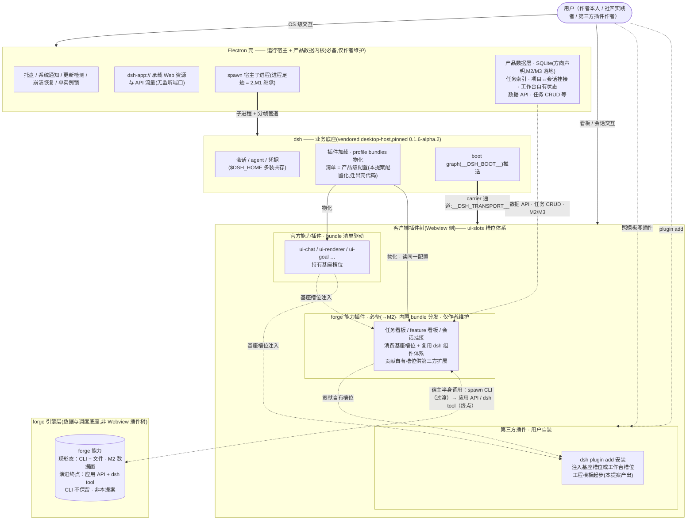

# Proposal: UI 插件工程基座 —— vendor-free 插件路线(硬前置 dsh-forge-m2)

> **定位**:主提案「一切皆插件」约束在 UI 插件工程上的落地基座。技术论证与源码级证据全部继承 `docs/proposals/dsh-forge/ui-plugin-vendor-free.md`(2026-09-21,下称「技术方向文档」),本文不重复论证,只在提案层定范围、验收与风险。**与 M2 关系:硬前置**——本基座(至少 spike + bundle 配置化)完成后,dsh-forge-m2 的 UI 插件任务方可开工;M2 SC8 语义等价性 spike(agent 语义面)留在 M2,与本提案的装配路线 spike 验证面不同,互不替代。

## Problem

核心问题一句话:**M2 的全部 forge 能力 UI 都要以 dsh 客户端插件形态交付,但当前仓库不具备让任何自有插件存在与被装配的工程基座——bundle 清单焊死在壳代码常量里、插件依赖与 vendored 运行时的版本对齐无自动保障、装配路线的三项关键行为未经源码级验证。**

### Evidence

- **bundle 清单焊死**(2026-09-21 本仓核查):`apps/desktop/src/main/host-profile/index.ts` 的 `HOST_PROFILE_BUNDLES` 为壳代码内硬编码常量——任何自有插件进入壳都必须改壳代码,直接违反「一切皆插件」(技术方向文档 §5 已标记为 M2 必做的设计修正)。
- **版本对齐无保障**(npm registry 2026-09-21 实测,技术方向文档 §2):客户端插件契约族 `@deepseek-ai/dsh-client-*` 已发 npm,但 dist-tag `latest` 停在旧版 `0.0.1-rc.1`,现行线在 `alpha` tag(`0.1.6-alpha.2`);裸装或 `^` 范围会静默拿到旧契约。插件依赖版本必须 ≡ `vendor/upstream.lock.json` 的 `desktopHostVersion`(当前 `0.1.6-alpha.2`,本仓核查),该对齐目前纯靠人工。
- **装配路线三项未验证**(技术方向文档 §8,当前为推断/外部证据):① `dsh plugin add` 对壳自有 profile 目录(userData 下)的行为;② profile node_modules 物化对 out-of-tree bundle 的解析细节(dev `link:` 与 prod tarball 两种形态);③ `inject` 依赖边以非官方包(自有插件)为声明方的完整语义。
- **M2 已被阻塞在 PRD 阶段等待此基座**:`docs/features/dsh-forge-m2/`(prd 三件套已就绪)的 G6 要求 forge 能力 100% 以可启停插件交付、禁用回归纯壳——没有本基座,M2 的第一个 UI 插件任务无法起步。

### Urgency

- **M2 关键路径(耦合双门槛)**:M2 任务分解的开工线是两件事**同时**就位——本基座(配置化 + spike 结论)完成,且 M2 PRD 修订完成(G6/SC6 两级插件模型、DF001/DF005 记账);二者可并行推进,任一悬空则 M2 UI 插件任务照旧阻塞——基座每晚一天,耦合关键路径整体长一天;只赶基座而搁置 PRD 修订同样空转(硬时序门槛见 Next Steps)。
- **上游演进窗口**:dsh 处于 0.1.x alpha 周快速演进期,版本对齐纪律必须在**第一个**自有插件诞生前建立——先有插件再补纪律,错配会以静默契约漂移的形式累积(技术方向文档 §7 已列为固有成本)。
- **成本复利**:三项未验证项直接开发任务可视化插件 = 在未验证地基上盖楼;spike 若推翻假设,返工面是 M2 全部 UI 任务;现在验证,返工面收敛为一个 hello-world。

## Proposed Solution

交付**工程基座**而非业务功能:一个双向扩展演示插件 + 壳侧配置化 + 可复用模板 + 版本一致性自动断言,四件套让「自有插件可以存在、可以被装配、第三方可以照做」。

### 架构关系图(分层定位,约束的可视化)

**四条架构约束(效果级,技术选型归 /tech-design)**:

1. **分层定位:运行宿主 + 产品数据内核**:Electron 壳 = OS 级宿主职责(M1 既有面)+ **产品数据内核(方向声明,用户定向 2026-09-21)**——任务索引、项目↔会话挂接、工作台自有状态采用 **SQLite** 存储,置于 Electron 侧,提供数据 API(特别是任务 CRUD);**落地为 M2/M3 任务**,事实源关系(forge 文件 vs SQLite)与 API 形态届时设计。dsh 仍为会话/插件业务底座(会话、agent、插件机制、客户端槽位体系)。诚实声明:数据内核进壳**偏离官方壳极小产品 API 面模式**(`DshDesktopProductApi` protocolVersion 1 仅 `updates`,2026-09-21 源码核查;业务原生能力官方钦点宿主侧插件,`allowBuilds: node-pty/koffi/fs-ext`)——这是 dsh-forge 作为**产品壳**(非兼容壳)的自主选择;纪律:preload IPC 面沿用 M1 electron-ipc-security 约束(origin-lock、typed、版本化、最小必要面)。
2. **UI 复用与槽位保留**:forge 能力插件的 UI 构建在 dsh 客户端组件体系上(沿用 M1 上游 tokens 路线),不自建第二套组件体系;槽位体系保留并向下扩展——工作台 UI(→M2)在既有 ui-slots 体系上组装,并**贡献自有槽位**,第三方插件可扩展工作台。
3. **必备与扩展两级插件模型**:forge 核心能力是 dsh-forge 的**必备能力**——以必备插件形态内置 bundle 分发(消费基座槽位 + 复用 dsh 组件体系 + 贡献自有槽位),**不可禁用、不可被第三方修改,仅作者维护升级**(「不可禁用」的执行点——配置保护分区 vs 壳侧守卫——为 tech-design 待决问题,但决策空间现在即受约束:**任何执行点判定「必备」所依据的插件身份清单必须派生自产品级配置,不得以壳代码常量重新出现**;壳侧守卫仅当其输入 = 产品配置的派生数据时才可行,否则即重新引入本提案要消灭的「清单焊死壳代码」缺陷,直接违背交付件 ③;见 Next Steps);第三方用户可经 `dsh plugin add` 添加扩展插件,注入基座槽位或工作台槽位,与必备插件同机制共存、互不垄断;插件只走标准客户端插件 API(rpc/fetch/stream,carrier 面以内)。原「可启停/禁用回归纯壳」语义收缩至第三方插件(M2 G6/SC6 记账修订,见 Next Steps)。
4. **forge 能力形态演进与调度插件化**:forge 特色能力是本应用的差异化价值核心,以必备能力随产品交付。形态演进:CLI 为过渡形态(插件宿主半身 spawn Go CLI,经标准 rpc 暴露,二进制随包分发)→ 演进终点 = **应用 API(Electron 数据内核)+ dsh tool**,**CLI 不保留**(用户定向 2026-09-21;具体形态由 M2 语义等价性 spike 与 M4 设计定,禁止预判)。**任务调度机制(领取分配、依赖解析、状态机编排)插件化**——可随产品演进替换,不动数据内核。

**交付件行为**:① hello-world 插件以纯 npm 依赖起包(exact `0.1.6-alpha.2`),零 vendored 文件引用,**注入既有稳定槽位 + 贡献一个自有子槽位**(ui-slots 的 `register` 原生支持「组件 + 子槽位 + store 席位」),演示消费与贡献双向扩展——用户可观察内容:消费向 = 一块 hello-world 面板渲染进目标稳定槽位(ui-chat / ui-renderer 核心槽之一,稳定性以 spike 定夺)所在的既有界面区域;贡献向 = 插件登记的自有子槽位渲染默认内容,且撞键复制品 fixture 声明同名键后的表现(合并/覆盖/报错,以实测为准)在同一界面可直接观察——证明子槽位对第三方真实开放;交互 = 点击面板触发 client 半身 store 席位状态更新并刷新渲染,证明是运行链路而非静态注入;两侧环境呈现一致;② 同一插件在官方 `dsh web`(第三方用户视角)与 dsh-forge 壳(经产品级配置装配)双环境跑通;③ `HOST_PROFILE_BUNDLES` 迁出壳代码为产品级配置,配置成为插件树唯一事实源(M2 UF6 启停读写同一配置,产品清单条目对运行时启停只读);④ 插件沉淀为工程模板,第三方用户照模板即可给工作台或官方 dsh 写插件;⑤ 版本一致性自动断言(插件依赖 ≡ `desktopHostVersion`,错配即红灯)。

### Innovation Highlights

诚实声明:模板脚手架、CI 版本门禁、pinned vendor 均为标准工程实践,无技术创新。本提案的增量在于约束设计:

- **双向扩展作为一等验收**:常规插件化只验收「我们消费平台槽位」;本提案把「贡献自有槽位供第三方扩展工作台」同时纳入 spike 与模板——扩展性不是文档承诺,是演示过的链路。
- **双环境 = 可移植性证据**:同一插件跑通官方 `dsh web` 与本壳,直接复现 DSH Studio(euanguo/dsh-studio)验证过的双形态分发(外部证据),为 M2+ 可能的插件独立分发保留自由。
- **针对 dist-tag 陷阱的自动断言**:npm `latest` 停旧版是该生态的实测陷阱,「exact 版本纪律 + 断言门禁」把静默契约漂移变成显式红灯——纪律不靠自觉靠机器。
- **跨域借镜,对准两处真正的难题**:撞键语义借 **CSS 级联(cascade)**——多源声明同一键从不以「静默覆盖」了结,而以显式分层规则(来源/顺序/特异性)解析;spike 落档撞键行为即按「合并共存 / 分层覆盖 / 启动期显式报错」三型归档,拒绝无规则的静默结果。投影对账借 **Kubernetes 声明式调和**——期望态(产品配置)与实际态(userData 投影)分离,以调和差集收敛(清单已删条目的物化被清理)——「配置→存量 profile 对账」的候选机制直接取该业界原型,而非发明一次性脚本。

## Requirements Analysis

### Key Scenarios

- **双环境装配(happy)**:hello-world 插件在官方 `dsh web` 以 profile 自装方式注入槽位;同一插件在 dsh-forge 壳内经产品级配置(内置 bundle)装配,贡献的自有子槽位两侧均可见。
- **配置增删(happy)**:仅修改产品级配置,在壳内增加/移除 hello-world,壳行为随配置变化,壳代码零改动。
- **第三方起步(happy)**:社区用户照工程模板新建插件包 → 官方 `dsh web` 注入成功,全程零 vendored 引用、零壳修改。
- **版本错配(edge)**:插件依赖版本与 `UpstreamLock.desktopHostVersion` 不一致 → 自动断言红灯;一致 → 绿灯。
- **spike 推翻假设(error)**:三项未验证项实测结论与推断不符(如 `dsh plugin add` 对壳 profile 目录不可用、out-of-tree bundle 物化失败)→ spike 报告给出修正路线与**按项独立**的退路(① 内置 bundle 清单路线,独立于 `plugin add`;② npm 发布或 tarball 随包内置——两锚解析属 inject 目标解析锚,不作物化退路),门控 M2 设计而非带病开工。
- **第三方插件共存(edge)**:用户自装其他插件与工作台插件同时在线,槽位注册互不覆盖、互不破坏——由撞键复制品 fixture(第二个自装插件,声明同名槽位键)实证 ui-slots 声明合并的撞键行为。

### Non-Functional Requirements

- 继承 M1 全部 NFR:离线自足、进程足迹 = 2、无监听端口、零侵入 dsh 上游、`$DSH_HOME` 多装共存——本提案不得破坏任何一项。
- 配置化改动不得引入壳启动回归,并以量化预算定义回归:冷启动(主进程拉起到 Webview 首帧)以扩展后的 live-ui-probe 计时口径测量,相对 M1 基线增量 ≤ 5% 且绝对值 ≤ 100ms(基线与改造后各归档一次测量,超预算即视为回归);在此之上,M1 验收面(SC7 UI 对等、SC9 崩溃恢复)保持绿。
- 插件包体积与构建产物面以上游 `ui-goal` 为参照(小包:宿主半身可空、client 半身经 `exports["./client"]`)。
- 模板文档面向第三方用户,不要求读者接触 dsh-forge 仓的 vendored 树。

### Constraints & Dependencies

- **上游锁定**:vendored SHA `c36ba648` / `0.1.6-alpha.2` 为唯一对齐基准;**对齐线依赖**(`@deepseek-ai/dsh-client-*` 宿主契约族)一律 exact 且 ≡ `desktopHostVersion`——借 `alpha` tag 定位须解析并锁定为 exact 结果,可变 tag 不得直接写入依赖;禁裸包名与 `^`;cordis(peer 依赖,实测 `4.0.2`)为独立版本线,单列管理、不与 `desktopHostVersion` 对齐比对(技术方向文档 §2 陷阱)。
- **dsh 插件机制为唯一装配机制**:内置(profile bundle 清单)与运行时(`dsh plugin add`)双形态走同一机制,不发明旁路。
- **npm 发布面依赖**:`@deepseek-ai/dsh-client-*` 族与 cordis 已发 npm(实测),但处于 0.1.x alpha 契约演进期——版本纪律是长期约束,不是一次性动作。
- **顺序依赖**:本提案硬前置 dsh-forge-m2 的 UI 插件任务;M2 SC8(语义等价性 spike)不在本提案内。
- **技术方向文档为论证权威**:源码级事实、npm 实测、装配机制均以其为准(其引用的上游本地 checkout SHA `c36ba648` 为唯一权威源);引用基线钉在该文档的 git 提交版 `6f5b109`(2026-09-21,本仓核查)——其后续修订须留修订记录并触发本提案引用处复核,spike 落档时须将所依赖的源码级事实内联进报告,不传递依赖该文档现状。

## Alternatives & Industry Benchmarking

### Industry Solutions

- **VS Code 插件生态**:官方脚手架模板(yo code)+ 严格引擎版本声明(`engines.vscode`)+ marketplace——「模板起步 + 版本门禁」的平台工程范式,本提案的模板与断言是其在 dsh 生态的对应物(miniature 版)。
- **JetBrains 平台(extension points)**:插件以声明式描述符(plugin.xml)向同一 extension point 贡献,多插件贡献按声明聚合为列表、以 order 属性定序,非法贡献在启动校验期显式报错而非静默覆盖;`since-build/until-build` 构成引擎版本门——「声明合并显式化 + 冲突启动期可见 + 引擎版本声明」是槽位撞键问题在 IDE 平台的成例,撞键 fixture 的落档框架以此对齐。
- **npm 投影对账(node_modules)**:包管理器对「清单 → 物化投影」的写一次安装与 `prune` 差集清理,是「产品配置 → 存量 userData profile 对账」在同构问题上的业界原型——投影可增量调和,不必推倒重建。
- **DSH Studio(euanguo/dsh-studio,外部证据)**:项目树/Git Review/终端全部为插件且可被 `dsh plugin --profile web add` 装进他人 profile——证明双形态分发在本生态已成立,本提案的双环境验收复现该链路。
- **pinned vendor + lock 对齐**(本仓 M1 既有实践):`vendor/upstream.lock.json` 已是事实基准,断言只是把既有纪律自动化。

### Comparison Table

| Approach | Source | Pros | Cons | Verdict |
|----------|--------|------|------|---------|
| Do nothing(基座决策散在 M2 首任务临时做) | — | 零新提案成本 | 工程决策悬空进 M2 关键路径;版本纪律晚于第一个插件建立;三项未验证项带病开工 | Rejected: M2 空转 + 返工面放大(用户 2026-09-21) |
| 仅 spike 验证(hello-world 双环境 + 三项结论) | 技术方向 §8 最小切法 | 提案最小 | bundle 配置化、模板、断言仍悬空,M2 首个插件任务还要补工程决策 | Rejected: 基座不完整,硬前置价值打折(用户 2026-09-21) |
| 并入 dsh-forge-m2 作 phase 0 | M2 内组织 | 无跨 feature 协调 | 与 M2 产品范围混杂;验证面(UI 装配 vs agent 语义)耦合;M2 PRD 需返工 | Rejected: 用户选独立提案(2026-09-21) |
| 基座 + 首个真实插件(只读任务列表) | 激进路线 | 最早见真实价值 | 与 M2 PRD 边界扯皮,范围爆炸 | Rejected: 风险不叠加(用户 2026-09-21) |
| 早期采用 marketplace/registry 式分发基建(类 VS Code marketplace / JetBrains Marketplace:注册中心 + 平台化版本与兼容治理 + 安装通道) | 行业范式(插件生态成例) | 第三方分发通道现成;版本/兼容治理由平台承载;撞键治理有平台归口 | 远超基座量级:上游 0.1.x alpha 契约未稳、本生态无 marketplace 服务可托管,单人产品线建不动;且不解决三项未验证项(装配路线仍未知,marketplace 不治装配) | Rejected: 记账 M2+(Out of Scope 已列);其「版本治理」子集当前由模板 + exact 断言承接 |
| **独立工程基座全套(本提案)** | 技术方向 §8 + 用户三轮裁决 | 工程决策前置收敛;M2 关键路径最短;扩展性(双向槽位)成为一等验收 | 单人产品线多一个 feature 的管线开销;基座无直接用户价值,价值在 M2 兑现 | **Selected: 2026-09-21 用户显式选择(单独提案 / 全套范围 / 硬前置)** |

## Feasibility Assessment

### Technical Feasibility

**高**。全部关键事实已源码级/实测核查(技术方向文档 §2-§7):npm 发布面可用、`ui-goal` 提供最小样例、ui-slots 契约零运行时依赖、壳侧引入缝(`host-profile/index.ts` + `HOST_RUNTIME_DIR` 两锚)清晰、M1 验收基建(`scripts/acceptance/live-ui-{probe,sweep}.mjs`)可扩展为壳内验收。剩余不确定性恰好就是三项未验证项——spike 存在的意义即消灭它们,且每项都有兜底路线(§Key Risks);SC2 删除腿的清理通道为第四处已登记的不确定性,按同纪律处理(候选机制两项 + 风险行 + PRD 定稿前裁决,见 In Scope/Key Risks),不构成可行性评级缺口。

### Resource & Timeline

单人产品线,基座量级约为 M1(21 任务)的三分之一:估算 6–8 个任务——hello-world 插件与双环境验证(含撞键 fixture)约 2、三项未验证项 spike 落档 1–2、配置化(含对账策略裁决)1–2、断言与产物级校验 1、模板沉淀 1;日历时间以周计(单人节奏预计 1–2 周);其中两处待决设计问题(对账策略、不可禁用执行点)已限定于 /tech-design 一次裁决、各 ≤ 半天设计预算(裁决边界见 Next Steps),不构成开放工期。风险不在工作量,在 spike 结论修正路线的返工弹性——范围已收敛到 hello-world,返工面最小。

### Dependency Readiness

- npm registry:`@deepseek-ai/dsh-client-*` + cordis 已发布(2026-09-21 实测),无需上游配合。
- 上游源码:本地 checkout SHA `c36ba648` 为唯一权威,零侵入约束不变。
- 壳侧引入缝:M1 已交付,改造点单一(`HOST_PROFILE_BUNDLES`)。

## Assumptions Challenged

| Assumption | Challenge Tool | Finding |
|------------|---------------|---------|
| 自有 UI 插件开发必须引用本仓 vendored 源码 | Assumption Flip(npm 发布面实测) | Overturned:客户端插件契约族与 cordis 均已发 npm,插件可零文件引用 vendored 树(技术方向文档 §2/§4) |
| spike 与工程决策留在 M2 首任务即可,无需独立提案 | Need Gate(更简替代:并入 M2) | Refined→用户裁定独立提案并硬前置;理由 = 工程决策前置收敛 M2 关键路径(2026-09-21;Challenge Override 记录:用户明确选择单独提案) |
| 版本对齐靠 code review 自觉即可 | Stress Test(dist-tag `latest` 停旧版 `0.0.1-rc.1`,alpha 线周演进) | Refined:必须 exact 版本纪律 + 自动断言门禁,把静默漂移变显式红灯 |
| 扩展性 = 我们消费官方槽位 | 用户定向(双向扩展) | Refined:消费基座槽位 + 贡献自有槽位同为一等验收;第三方可扩展工作台本身 |
| hello-world 只需在壳内验证(官方 web 环境多余) | Assumption Flip(官方 web 是第三方用户的真实环境;双环境 = 可移植性证据) | Confirmed:双环境必要,且是 M2+ 插件独立分发的保留自由 |
| 配置化 = 把常量改成本地文件 | 逻辑一致性(M2 UF6 启停需读写同一清单,否则出现第二事实源) | Refined:配置为插件树唯一事实源,M2 UF6 启停读写同一配置,本提案只做静态产品配置起步 |
| forge 核心 API 应参照官方模式集成进 Electron(基础能力由壳提供) | 源码核查 + 两轮用户定向(2026-09-21) | Refined(两轮):第一轮定「集成点 = 插件宿主半身,壳维持极小 API 面」;第二轮用户重新评估——**数据内核(SQLite 任务索引/项目↔会话挂接 + 任务 CRUD API)进 Electron 为产品必备**,会话运行时/调度/UI 保持 dsh 与插件侧,CLI 退役方向不变 |
| 「一切皆插件」= 全部能力可启停、可禁用 | 用户定向(必备能力,2026-09-21) | Refined:两级插件模型——forge 核心 = 必备插件(内置,仅作者维护);启停语义仅第三方插件;M2 G6/SC6 记账修订 |
| 工作台数据(任务索引/挂接)读写经 forge 文件与 CLI 即可,无需应用侧存储 | Stress Test(M2 G1 首屏 ≤2s @500 任务的文件扫描成本、G3 回流 ≤5s;挂接关系无结构化存储) | Refined:SQLite 数据内核方向声明(Electron 侧 + 数据 API),M2/M3 落地,事实源关系与实现届时设计(用户 2026-09-21:现在只做架构约束) |

## Scope

### In Scope

- **hello-world 插件(双向扩展演示)**:npm 依赖起包(exact `0.1.6-alpha.2`),零 vendored 文件引用;注入既有稳定槽位 + 贡献一个自有子槽位;空宿主半身 + client 半身(形态参照上游 `ui-goal`)。
- **双环境装配验证**:官方 `dsh web`(profile 自装,第三方视角)与 dsh-forge 壳(经产品级配置,内置 bundle)各跑通一次——验证两锚解析 + 版本对齐 + 可移植性;`dsh web` 侧另设撞键复制品 fixture(第二个自装插件,声明同名槽位键),实证 ui-slots 声明合并的撞键行为。
- **三项未验证项结论落档**:`dsh plugin add` 对壳 profile 目录的行为 / profile node_modules 物化对 out-of-tree bundle 的解析 / `inject` 依赖边对非官方包的语义(以最小稳定子集与 ui-goal 全集两组 inject 声明对照,子集合法/等价性随结论落档);源码级或实测,归档 spike 报告——每项强制「结论 + 独立退路」两栏(② 的独立退路 = npm 发布或 tarball 随包内置),并落档 hello-world 到达打包态/离线壳的分发形态结论(候选:npm 物化 / tarball 内置 / 预播种,由 spike 定夺)及与离线自足 NFR 的兼容性声明。
- **HOST_PROFILE_BUNDLES 配置化**:bundle 清单从壳代码常量迁到产品级配置;增删插件 = 改配置,壳代码 diff = 0;配置为插件树唯一事实源(M2 UF6 启停读写同一配置,但产品清单条目对运行时启停只读,防第二写入方破坏产品清单;运行时启停 UI 本身不在本提案)。既有投影为「存在即跳过」的写一次语义,「配置→存量 userData profile 的对账策略(含删除条目后的物化清理/失效)」为本提案级待决设计问题,但候选机制空间已定且**有界**:① 壳侧启动期差集调和(读产品配置与投影差集,清理产品清单已删条目的物化;npm `prune` 同构原型,操作对象为壳自管的 userData 投影、不改上游代码;与「不发明旁路」约束的相容性裁决要点 = 调和只做清理/失效、不新增装配通道;**默认回退项**);② 上游原生移除通道(若上游提供等价移除命令,以源码核查/spike 确认其存在性与语义)——裁决边界:PRD 定稿前于 /tech-design 一次裁决,不设实现期延期(见 Next Steps);本提案不假设配置变更自动传播到存量 profile。
- **插件包工程模板**:hello-world 沉淀为可复用模板,内建槽位消费/贡献标准姿势与 dsh UI 组件复用约定,并补齐第三方两处「第一步」:peer 声明为 npm 形态(禁 `workspace:^` 照抄)与宿主版本兼容性声明(engines 式);第三方用户照模板即可给工作台或官方 dsh 写插件。
- **版本一致性自动断言**:断言显式枚举比对集——对齐线依赖(`@deepseek-ai/dsh-client-*` 宿主契约族)exact ≡ `vendor/upstream.lock.json` 的 `desktopHostVersion`,cordis peer 单列为独立版本线(仅校验 exact 锁定,不与 `desktopHostVersion` 比对),错配即红灯;接入既有 CI/质量门;并以同源机制为工程模板盖版本戳,使模板流出侧的版本同步同样可见、可断言。

### Out of Scope

- 任务可视化插件与一切 forge 能力 UI(→ dsh-forge-m2)。
- SQLite 数据内核与任务 CRUD API 的实现(→ M2/M3;本提案仅落架构约束与方向声明,事实源关系与 API 形态届时设计)。
- 语义等价性 spike(dsh 插件机制 vs forge skill/hook/subagent,→ M2 SC8;验证面不同)。
- 运行时启停 UI(→ M2 UF6;本提案只保证配置为其预留唯一事实源)。
- marketplace 与 `dsh plugin add` 产品化集成(M2+)。
- 修改 dsh 上游仓库(零侵入约束不变)。
- vendored desktop-host 子进程退役(长期演进项,上游发 npm 后另行提案)。

## Key Risks

| Risk | Likelihood | Impact | Mitigation |
|------|-----------|--------|------------|
| spike 推翻装配假设(`plugin add` 对壳 profile 目录不可用 / out-of-tree 物化失败 / inject 语义不完整) | M | M | 兜底**按项独立、不得互相挪用**:① 兜底 = 内置 bundle 清单路线(独立于 `plugin add`);② 兜底 = npm 发布或 tarball 随包内置(注:两锚解析回答的是 inject 目标的解析锚,**不是**自有插件包的物化通道,不构成 ② 的兜底);③ 兜底 = 按 DSH Studio 第三方插件的既有声明形态调整(外部证据:第三方装配已成立);spike 报告每项以「结论 + 独立退路」两栏落档并门控 M2 设计——这正是 spike 的目的|
| 上游 0.1.x alpha 契约演进,断言与模板过期 | M | M | 版本断言与上游 SHA 升级任务同 diff bump(技术方向文档 §4 纪律);断言红灯即升级提醒,不静默 |
| inject 依赖边选到不稳定基座,脆性放大 | M | M | 只选稳定基座(ui-slots / ui-chat / ui-renderer 核心槽,技术方向文档 §7);spike 以最小稳定子集 vs ui-goal 全集(上游实测 7 边)两组 inject 声明对照,子集合法/等价性随结论落档——子集不合法则退回全集,不误读为「非官方声明方不可行」|
| 配置化改动壳启动路径引入回归 | L | M | 改造点单一;M1 验收面(SC7/SC9)回归跑;live-ui-probe/sweep 扩展覆盖 |
| 第三方插件与工作台插件槽位冲突(共存破坏) | L | M | 撞键复制品 fixture(第二个自装插件,声明同名槽位键)实证 ui-slots 声明合并的撞键行为——单只 hello-world 验不了此面;遵循声明合并契约,不垄断槽位;M2 真实工作台时再验真实冲突面|
| 数据内核进壳扩大 preload IPC 安全面(偏离官方极小面模式) | M | M | 沿用 M1 electron-ipc-security 约束(origin-lock、typed、版本化、最小必要面);API 面随 M2/M3 设计逐项评审 |
| 两级插件模型与 M2 PRD 不同步(G6/SC6/DF001/DF005 口径) | M | M | 本提案 Next Steps 记账并设硬时序门槛:M2 PRD 修订完成前不得进入 M2 任务分解|
| dist-tag 陷阱误装旧契约(latest 停 0.0.1-rc.1) | M | H | 对齐线依赖一律 exact(借 `alpha` tag 定位须解析并锁定为 exact 结果);自动断言拦截(cordis 独立版本线单列,防误报);模板文档明示禁裸包名/`^` 并盖版本戳|
| SC2 删除腿在写一次投影上无合法清理通道(上游无移除命令、壳侧差集调和被裁决为旁路违例) | M | M | 候选机制两项(In4:壳侧差集调和(默认)/ 上游原生移除通道),PRD 定稿前裁决并落档其存在性;两项均不可行 = spike 推翻假设同款错误路径——修正路线落档并同步修订 SC2 删除腿口径,不带病开工 |
| 论证权威(技术方向文档,Draft 状态)静默修订,事实基漂移波及本提案与 spike 结论 | L | M | 引用基线钉在其 git 提交版 `6f5b109`(2026-09-21,见 Constraints);该文档修订须留修订记录并触发本提案引用处复核;spike 报告内联所依赖的源码级事实(锚定 checkout SHA `c36ba648`),不传递依赖文档现状 |

## Success Criteria

- [ ] SC1 双环境双向装配 + 打包/闭包验收腿:同一 hello-world 插件(零 vendored 文件引用,以产物级脚本校验:扫描插件构建产物的模块来源,任何模块解析至本仓 `vendor/` 树——路径含 `vendor/` 前缀或 file: 协议指向仓内——即红灯,该校验并入断言门禁)在官方 `dsh web` 与 dsh-forge 壳内均完成装配——注入的基座槽位与贡献的自有子槽位在**两侧环境**均可见渲染(以扩展后的 live-ui-probe 采集 DOM/截图证据归档);壳内装配走产品级配置路径,不引入新的壳内硬编码;第三腿为打包/闭包形态验收(具体分发形态由 spike 结论定),并显式落档该形态与离线自足 NFR 的兼容性结论。
- [ ] SC2 配置化生效(两层语义各验一次):仅修改产品级配置——新增条目在壳内生效为第一腿;删除条目使存量 userData profile 中的既有物化被清理/失效为第二腿(对账策略为 tech-design 待决,本 SC 验行为结果、不绑定实现);两次操作的壳代码 diff = 0(git diff 验证)。
- [ ] SC3 版本断言:断言接入 CI/质量门,比对集显式枚举——人为错配对齐线依赖版本 → 断言失败(红灯复现并归档);当前对齐线依赖 exact `0.1.6-alpha.2` == `UpstreamLock.desktopHostVersion` 且 cordis peer(独立版本线,单列)不误报 → 绿灯;模板侧版本戳经同源机制可见。
- [ ] SC4 未验证项落档:三项(`plugin add` 对壳 profile 目录行为 / out-of-tree bundle 物化解析 / inject 依赖边非官方包语义,后者含最小稳定子集 vs ui-goal 全集对照)各按「结论 + 独立退路」两栏给出源码级或实测结论并归档 spike 报告(② 的独立退路 = npm 发布或 tarball 随包内置);报告同时落档 hello-world 分发形态结论(npm 物化 / tarball 内置 / 预播种)与离线自足兼容性声明。
- [ ] SC5 模板可用:按模板文档从零新建插件包到官方 `dsh web` 注入成功,演示链路覆盖两处「第一步」——依赖安装(peer 声明为 npm 形态,禁 `workspace:^` 照抄)与装进宿主(engines 式版本兼容声明),全程零 vendored 引用、零壳代码修改(演示记录归档)。
- [ ] SC6 撞键行为实证:撞键复制品 fixture(第二个自装插件,声明与 hello-world 贡献子槽位同名的槽位键)在官方 `dsh web` 装配后,实测落档 ui-slots 声明合并的撞键行为——按「合并共存 / 分层覆盖 / 启动期显式报错」三型归档(含复现步骤与观察到的 UI 结果),结论入 spike 报告;无论落哪一型,「静默后者覆盖且不可观察」视为未通过;该结论作为 M2 真实工作台槽位设计的前置输入移交。

> SC 一致性核查(2026-09-21):SC1↔In1/In2(hello-world 装配面)+ In3(打包腿的形态由 spike 分发结论定)、SC2↔In4、SC3↔In6、SC4↔In3、SC5↔In5、SC6↔In2(撞键 fixture 部分)与风险行「第三方插件与工作台插件槽位冲突」,In Scope 六项均有 SC 覆盖,SC 间无冲突(SC2 依赖 SC1 的配置化装配路径,时序为 SC1 ⊂ SC2 的前提,非矛盾;SC2 删除腿与 SC1 打包腿分别依赖对账策略与分发形态的待决结论,均已列入 Next Steps 待决清单并设裁决边界——PRD 定稿前裁决 + 默认回退,不构成开放工期)。

## Next Steps

- Proceed to `/write-prd` to formalize requirements(PRD 覆盖基座六项;技术方向文档 + 本文架构图为源码导航)。
- 技术选型待 `/tech-design`(裁决边界:两处加粗待决项须在 PRD 定稿前一次裁决,各 ≤ 半天设计预算,不延入实现;届时未决即采用默认回退——对账策略默认 = 壳侧启动期差集调和,执行点默认 = 配置保护分区):产品级配置的文件形态与读取时机、**配置→存量 userData profile 的对账策略**(既有投影为「存在即跳过」的写一次语义,配置变更默认不传播;须设计新增条目生效与删除条目后的物化清理/失效;候选机制 = 壳侧差集调和(默认)/ 上游原生移除通道,见 In4)、**必备插件「不可禁用」的执行点**(配置保护分区 vs 壳侧守卫;决策约束:任何执行点的清单输入必须派生自产品级配置,禁止以壳代码常量重现插件身份清单——防重新引入交付件 ③ 已消灭的焊死缺陷)、模板的目录与产出方式(deggit/脚本/文档化参照)、断言的实现载体(CI 步骤 vs 质量门 hook)、hello-world 插件在本仓 workspace 的落位。
- M2 侧记账(**硬时序门槛:M2 PRD 修订完成前不得进入 M2 任务分解**):dsh-forge-m2 的 PRD/manifest 增补对本提案的引用(依赖关系声明);并按两级插件模型修订 G6/SC6(必备能力语义,「禁用回归纯壳」收缩至第三方插件;「不可禁用」执行点见 tech-design 待决)、DF001/DF005(SQLite 数据内核与事实源开放问题)。
